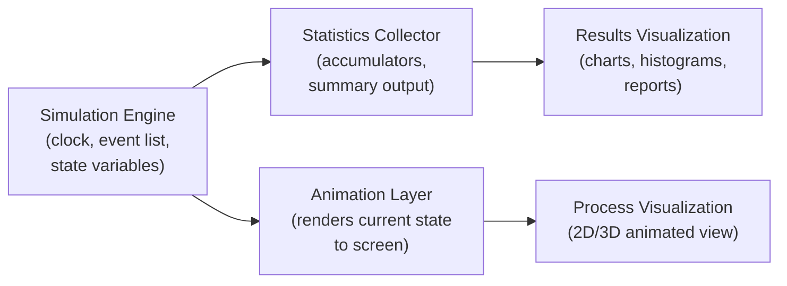

## Visualization and Animation of Simulation Output

### Overview

Visualization and animation of simulation output refer to the methods used to represent a simulation model's behavior and results graphically, ranging from real-time animated depictions of entities moving through a system to static or interactive charts summarizing final statistical results. These techniques serve purposes distinct from the numeric output itself: they support debugging and face validation during model construction, and they communicate results effectively to stakeholders who may not interpret raw statistical tables readily.

**Key Points**
- Visualization serves two largely distinct purposes: **process visualization** (watching the model run, aiding debugging and face validity checks) and **results visualization** (communicating final statistical output after the run completes).
- Animation is not a substitute for statistical rigor — a visually convincing animation can still represent a logically or statistically flawed model, so visualization complements rather than replaces formal verification and validation.
- The appropriate level of visual fidelity depends heavily on audience: technical analysts may need only summary charts, while executive or public-facing stakeholders often require polished, intuitive animation to build confidence in the model.

### Process Visualization (Dynamic Animation)

**Key Points**
- **2D animation** — a top-down or schematic view showing entities (customers, parts, vehicles) as icons moving between stations, queues, and resources as the simulation clock advances. Common in Arena, ProModel, and similar traditional DES packages.
- **3D animation** — a spatially realistic rendering of the physical system, often including scaled facility layouts, equipment models, and realistic entity movement paths. Common in FlexSim, Simio, and AnyLogic, particularly for manufacturing and warehouse applications.
- **Real-time versus accelerated playback** — most packages allow animation speed to be scaled from slower-than-real-time (for detailed inspection) to many times faster than real-time (to observe long-run behavior quickly), with a pause/step function for detailed event-by-event inspection.
- **State-based visual cues** — color coding or icon changes indicating resource status (idle, busy, blocked, down) at a glance, which is often more immediately informative than reading numeric state variables.
- **Purpose in debugging** — as discussed in model debugging practices, watching entities move through a model often reveals routing errors, incorrect resource assignment, or deadlock conditions more quickly and intuitively than inspecting trace logs or numeric output alone.
- **Purpose in stakeholder communication** — animation allows non-technical audiences (plant managers, clinical staff, executives) to visually confirm that the model's represented process matches their understanding of the real system, supporting face validation and building trust in subsequent statistical results.

### Results Visualization (Static and Interactive Output Analysis)

**Key Points**
- **Time-series plots** — showing a state variable (queue length, work-in-process, inventory level) evolving over simulated time, useful for identifying trends, cyclical patterns, transient/warm-up behavior, and steady-state onset.
- **Histograms and distribution plots** — showing the distribution of an output measure (e.g., time in system across all entities, or cycle time across replications), useful for understanding variability and skewness rather than relying on a single summary statistic.
- **Box plots** — compact visual comparison of output distributions across multiple scenarios or replications, showing median, quartiles, and outliers simultaneously.
- **Bar and column charts** — comparing summary statistics (average utilization, throughput, cost) across different resources, scenarios, or model configurations.
- **Confidence interval plots** — visually depicting point estimates alongside their confidence intervals across scenarios, making it easier to judge whether observed differences between scenarios are likely to be statistically meaningful.
- **Gantt charts and resource-utilization timelines** — showing when specific resources were busy, idle, or in a particular state over the simulated period, common in scheduling-oriented simulation studies.
- **Sensitivity/tornado charts** — visualizing how sensitive an output measure is to changes in each input parameter, typically used following a sensitivity analysis study.

### Animation Architecture in Simulation Packages

**Key Points**
- Most DES/ABM packages maintain a separation between the underlying simulation engine (which processes events and advances the clock according to the model logic) and the animation layer (which renders the current state to the screen), meaning the animation is a visual representation *driven by* the simulation state rather than a parallel or independent process.
- This separation allows animation to be disabled entirely for production runs (e.g., running thousands of replications for statistical analysis), since animation rendering imposes computational overhead that is unnecessary once the model has been verified and validated.
- In package environments, the animation layer typically reads directly from the same state variables and event queue that drive statistical collection, which is why an animated inconsistency (e.g., an entity appearing to vanish) reliably indicates an underlying logical error rather than a purely cosmetic rendering issue.



### Building Visualization in General-Purpose Language Implementations

**Key Points**
- Unlike simulation packages, GPL-based models have no built-in animation layer, so any visualization must be built using external plotting or graphics libraries, adding to the development burden discussed in the general-purpose languages topic.
- **Python** — `matplotlib` and `seaborn` are commonly used for static results visualization (histograms, time-series, box plots); libraries such as `pygame` or web-based frameworks (e.g., generating output consumable by a browser-based visualization) are used for building custom process animation, though this requires substantially more development effort than package-based animation.
- **Java** — Swing, JavaFX, or third-party charting libraries (JFreeChart) provide comparable static and dynamic visualization capability.
- **C++** — visualization typically requires a graphics library (SFML, OpenGL, Qt) or exporting simulation state to an external tool for rendering, since C++ itself has no native plotting capability.
- **Common practical approach** — many GPL-based simulation projects export state or event logs to a file (CSV, JSON) at each time step or event, then use a separate analysis/plotting tool (Python with matplotlib/pandas, or a spreadsheet application) for results visualization, decoupling the simulation logic from the rendering logic entirely.

**Example**

```python
import matplotlib.pyplot as plt

# Example: visualizing queue length over simulated time
# (event_log collected during a discrete-event simulation run)
event_log = [
    (0.0, 0), (2.3, 1), (4.1, 2), (5.1, 1),
    (7.8, 2), (9.0, 3), (10.4, 2), (12.1, 1)
]

times = [e[0] for e in event_log]
queue_lengths = [e[1] for e in event_log]

plt.step(times, queue_lengths, where="post")
plt.xlabel("Simulated Time")
plt.ylabel("Queue Length")
plt.title("Queue Length Over Time")
plt.grid(True)
plt.show()
```

**Output**
This produces a step plot showing how the queue length changes at each discrete event, using `where="post"` so the line correctly holds each value constant until the next event occurs rather than interpolating linearly between event points — a common visualization detail specific to discrete-event (as opposed to continuous) output, since the underlying quantity is genuinely piecewise-constant rather than smoothly varying.

### Interactive and Dashboard-Based Visualization

**Key Points**
- **Interactive dashboards** — modern simulation packages (AnyLogic, Simio) and general-purpose visualization frameworks increasingly support interactive controls (sliders, dropdowns) allowing a user to adjust input parameters and immediately observe the effect on animated or statistical output, supporting exploratory "what-if" analysis without rerunning the model from a code/script interface.
- **Linked views** — dashboards that synchronize multiple visualizations (e.g., clicking a bar in a utilization chart highlights the corresponding resource in the animated view), aiding root-cause investigation of specific performance issues.
- **Web-based deployment** — several packages (AnyLogic Cloud, Simio) support exporting or hosting simulation models with interactive visualization accessible through a web browser, extending stakeholder access beyond users with the full software license.
- **Real-time data integration** — in digital twin applications, visualization may be driven partly or wholly by live data feeds from a physical system rather than purely simulated state, blurring the line between simulation animation and real-time monitoring dashboards. [Inference] The specific architecture for combining live data with simulated projections varies considerably by application and vendor implementation.

### Design Considerations for Effective Visualization

**Key Points**
- **Match visual complexity to audience** — overly detailed 3D animation can distract from or obscure the statistical message for a technical audience focused on performance metrics, while an audience unfamiliar with the system may need visual realism to trust the model at all.
- **Avoid misleading scale or axis choices** — as with any data visualization, truncated axes, inconsistent scales across compared charts, or 3D bar charts that distort perceived magnitude can misrepresent simulation results even when the underlying analysis is correct.
- **Show variability, not just averages** — presenting only mean values (e.g., a single bar for "average wait time") without accompanying variability (confidence intervals, distribution, or range) can overstate the precision or reliability of a result, particularly given the inherently stochastic nature of most simulation output.
- **Ensure animation reflects the actual model logic** — a known pitfall is manually "prettifying" an animation model in ways that decouple its visual representation from the true underlying state, which risks presenting a misleading picture of system behavior, particularly in stakeholder-facing settings where audiences may equate visual plausibility with model correctness.
- **Label simulated time clearly** — particularly for accelerated playback, clearly displaying the current simulated time (and playback speed) helps viewers correctly interpret what they are observing rather than confusing simulated duration with real elapsed viewing time.

### Conclusion

Visualization and animation serve complementary but distinct roles across the simulation lifecycle: dynamic process animation supports debugging and face validation during model construction by making entity flow, resource status, and routing logic directly observable, while results visualization — time-series plots, histograms, box plots, and confidence interval charts — communicates statistical findings after the run completes. Simulation packages provide built-in animation tightly coupled to the underlying simulation engine, while general-purpose language implementations require external libraries and typically decouple simulation execution from visualization through exported logs or data files. In all cases, effective visualization requires deliberate design choices — matching complexity to audience, representing variability honestly, and ensuring visual representations remain faithful to the model's actual logic — since a persuasive animation does not by itself establish that a model is correct or valid.

**Related Topics**
- Verification and Validation of Simulation Models
- Model Building and Debugging Practices
- Output Analysis: Confidence Intervals and Replications
- Face Validity and Stakeholder Communication in Simulation
- Digital Twins and Real-Time Data Integration
- Sensitivity Analysis and Tornado Diagrams
- Dashboard Design Principles for Analytical Output
- Discrete-Event versus Continuous Output Representation
- Simulation Software Packages and Environments
- Data Visualization Best Practices and Common Pitfalls