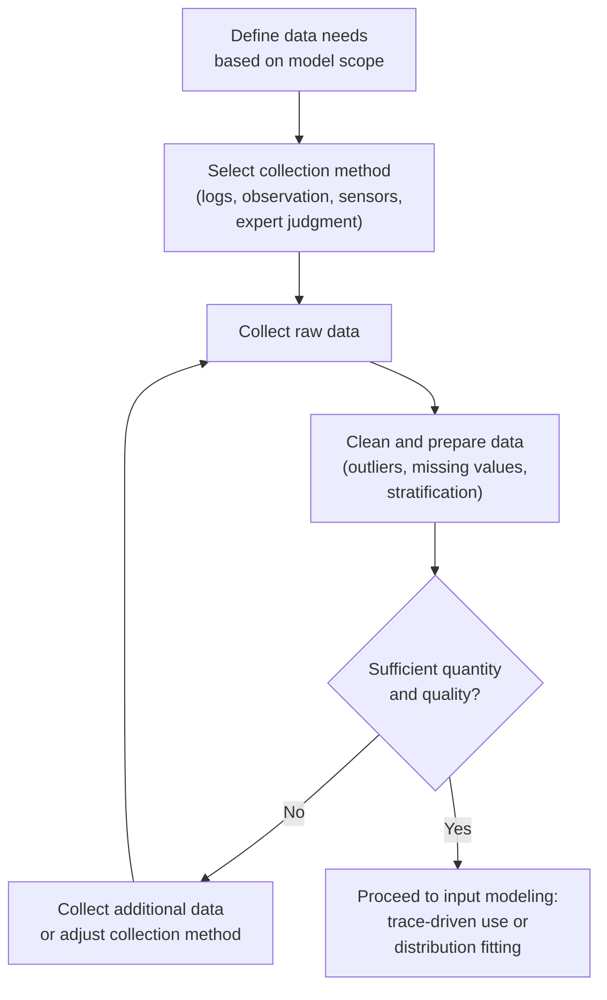

## Data Collection for Simulation Input

### Overview

Data collection for simulation input is the process of gathering, measuring, and preparing real-world data that will drive a simulation model's random variate generation, deterministic parameters, and structural assumptions. The quality of a simulation study's conclusions depends directly on the quality of its input data — a common principle in the field, often summarized as "garbage in, garbage out," meaning even a perfectly implemented and logically correct model will produce misleading results if driven by poor input data.

**Key Points**
- Input data collection typically precedes formal input modeling (distribution fitting), but the two activities are closely linked, since the way data is collected constrains what can later be validly modeled.
- Data collection needs vary by simulation purpose: a model built for rough what-if exploration may tolerate coarser data than one intended to support a high-stakes capital investment decision.
- Effort spent on data collection should be proportional to the sensitivity of model output to that particular input — not all inputs require equally rigorous data collection.

### Types of Data Needed for Simulation Models

**Key Points**
- **Interarrival time data** — timestamps of successive arrivals to a system (customers, orders, parts, patients), from which interarrival time distributions are later fit.
- **Service or processing time data** — duration required to complete an activity (a transaction, a machining operation, a consultation), typically collected per activity type and per resource if service times vary by server.
- **Routing and branching probabilities** — the proportion of entities following each possible path through a system (e.g., the fraction of customers requiring a particular follow-up step).
- **Resource capacity and availability data** — number of available servers/machines/staff, their schedules, and downtime/failure/repair patterns.
- **Batch size and lot size data** — for systems where entities move or are processed in groups rather than individually.
- **Structural/logical data** — process flow sequences, decision rules, and precedence relationships that define the model's logic rather than its stochastic parameters.
- **Cost and resource-consumption data** — where the simulation study includes economic analysis, data on operating costs, resource costs, or penalty costs (e.g., cost per unit of time a customer waits).

### Data Collection Methods

**Key Points**
- **Direct observation and time study** — manually recording event times and durations using a stopwatch, timestamp log, or observation form, historically common in manufacturing and service-process studies before automated data logging became widespread.
- **Automated system logs** — extracting timestamped records directly from existing information systems (ERP systems, point-of-sale systems, electronic health records, manufacturing execution systems, network/server logs), which is generally preferred when available because it avoids observer effects and typically yields much larger sample sizes.
- **Sensor and IoT data** — automated capture from physical sensors (RFID tags, light curtains, proximity sensors) tracking entity movement and dwell times in physical systems such as warehouses or production lines.
- **Sampling from historical records** — extracting a representative subset of historical transactional data rather than collecting new data prospectively, useful when a system has existing operational history.
- **Expert judgment and interviews** — used when quantitative historical data does not exist (e.g., for a new process or facility not yet built), relying on subject-matter experts to estimate parameter ranges or most-likely values, typically combined with distributions suited to expert-elicited data (e.g., the triangular or PERT distribution using minimum, most likely, and maximum estimates).
- **Vendor or industry benchmark data** — using published or vendor-supplied performance figures (e.g., equipment cycle time specifications) when system-specific data collection is impractical, with the caveat that such figures may not reflect actual operating conditions.

### Practical Challenges in Data Collection

**Key Points**
- **Insufficient sample size** — too few observations lead to unreliable distribution fitting and unstable parameter estimates; the appropriate minimum sample size depends on the variability of the underlying process and the required precision of the fitted distribution. [Inference] No single universal minimum sample size applies across all contexts; commonly cited practical guidance suggests at least several dozen observations for basic distribution fitting, but this should be treated as a rough starting heuristic rather than a firm statistical requirement.
- **Non-stationarity** — many real systems exhibit time-varying behavior (e.g., arrival rates that differ by hour of day, day of week, or season), and data collected without accounting for this can produce a misleading single "average" distribution that does not reflect any actual operating period well.
- **Censored or truncated data** — data collection windows or system constraints may cut off observations (e.g., a queue with limited physical capacity truncates the observed wait-time distribution, since customers who would have waited longer may balk or renege before being recorded).
- **Measurement error and observer effects** — manual time studies are subject to human timing error, and the presence of an observer can itself alter the behavior being measured (a general concern in observational data collection, sometimes discussed under the broader label of the Hawthorne effect).
- **Data collected under atypical conditions** — data gathered during an unusual period (a holiday season, a system outage, an unrepresentative sample of days) may not reflect typical operating conditions and can bias the resulting model if not identified and excluded or adjusted for.
- **Confounded or aggregated data** — data recorded only in aggregate form (e.g., daily totals rather than individual timestamps) loses the granularity needed to fit interarrival or service time distributions directly, sometimes requiring disaggregation assumptions or supplementary data collection.
- **Missing correlation structure** — collecting variables independently (e.g., service time and customer type) without preserving their joint relationship can lose important correlations that, if ignored during input modeling, may cause the simulation to understate or misrepresent real system variability.

### Data Cleaning and Preparation

**Key Points**
- **Outlier identification and treatment** — identifying data points that are implausible or resulted from a recording error (versus genuine but rare extreme events), and deciding whether to correct, exclude, or retain them, ideally based on a documented rule rather than ad hoc judgment.
- **Handling missing data** — deciding whether missing observations can be reasonably excluded, must be imputed, or indicate a need for additional data collection, depending on the extent and pattern of missingness.
- **Stratification** — splitting a combined dataset into meaningful subgroups (by time period, entity type, resource, or location) when a single pooled distribution would obscure important differences a model needs to represent separately.
- **Unit and format standardization** — ensuring consistent time units, date formats, and categorical coding across data drawn from multiple sources or systems before further analysis.
- **Independence checks** — for interarrival or service time data intended for distribution fitting, checking that successive observations are not autocorrelated in ways that would violate the independence assumptions typically used in standard input modeling techniques.

### Relationship to Input Modeling (Distribution Fitting)

**Key Points**
- Collected data feeds directly into the subsequent input-modeling step, where empirical data is either used directly (trace-driven or empirical-distribution simulation) or fit to a theoretical probability distribution for use in random variate generation.
- **Trace-driven simulation** — using the actual collected data sequence directly to drive the simulation, rather than fitting it to a theoretical distribution; this preserves the exact empirical characteristics of the data (including any subtle correlations or patterns) but limits the simulation to scenarios resembling the exact conditions under which the trace was collected.
- **Distribution fitting** — summarizing collected data as a theoretical distribution (exponential, gamma, lognormal, triangular, empirical, etc.) with fitted parameters, which allows generating new, statistically similar (but not identical) random variates for arbitrarily long simulation runs — this step is covered in detail under input modeling and distribution fitting topics.
- The rigor of data collection directly bounds the rigor of distribution fitting: no fitting technique can compensate for a data sample that is too small, unrepresentative, or improperly stratified.

### When Data Is Unavailable or Limited

**Key Points**
- **New or not-yet-built systems** — for systems that do not yet exist (a proposed new facility, an untested process redesign), no historical data can be collected, so the modeler typically relies on engineering estimates, vendor specifications, analogous existing systems, or structured expert elicitation.
- **Sensitivity analysis as a mitigation strategy** — when input data is weak or uncertain, running the simulation across a range of plausible parameter values (rather than a single best estimate) helps characterize how much the uncertainty in the input actually matters to the conclusions, which is often more informative than investing further effort narrowing a parameter that turns out not to affect results substantially.
- **Phased data collection** — beginning a study with readily available or roughly estimated data to build and structurally verify the model, then prioritizing further data collection effort specifically for the inputs to which the model's output proves most sensitive.
- **Documenting data provenance and assumptions** — clearly recording the source, collection period, and any assumptions or adjustments applied to each input dataset, which is essential both for future model maintenance and for a credible validation and communication process with stakeholders.

### Conclusion

Data collection for simulation input is a foundational activity that determines the ceiling on a simulation study's credibility, since no amount of sophisticated modeling, distribution fitting, or statistical output analysis can compensate for data that is insufficient, unrepresentative, or improperly collected. Effective practice involves selecting appropriate collection methods (automated logs where available, direct observation or expert elicitation where not), being alert to practical challenges such as non-stationarity, censoring, and observer effects, and applying disciplined cleaning and stratification before the data is used for trace-driven simulation or formal distribution fitting. Because data collection effort is often constrained by time and cost, prioritizing rigor for the inputs most likely to influence model output — informed by sensitivity analysis — is generally a more efficient strategy than attempting uniformly exhaustive data collection across every model parameter.

**Related Topics**
- Input Modeling and Distribution Fitting
- Trace-Driven Simulation versus Theoretical Distributions
- Goodness-of-Fit Testing for Probability Distributions
- Non-Stationary Arrival Processes and Time-Varying Rates
- Sensitivity Analysis in Simulation
- Expert Elicitation and the Triangular/PERT Distribution
- Random Variate Generation Techniques
- Verification and Validation of Simulation Models
- Model Building and Debugging Practices
- Correlation and Dependence Modeling in Simulation Inputs