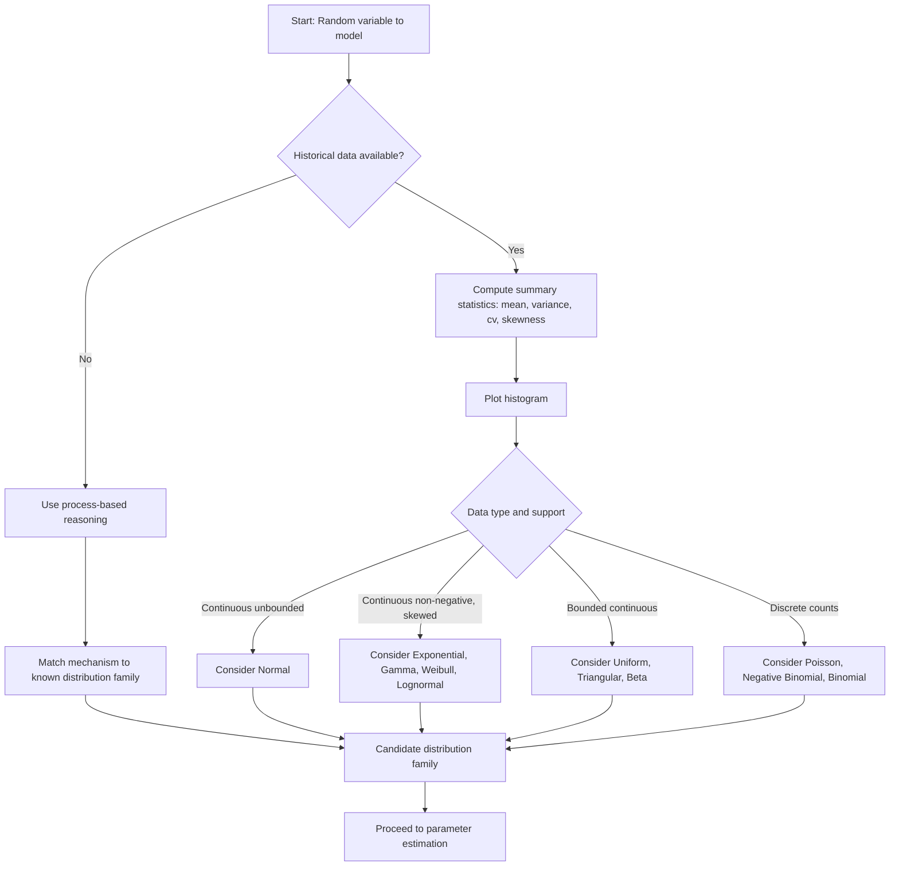

## Identifying Input Distributions

### Overview

Identifying input distributions is the process of selecting a probability distribution that adequately represents a source of randomness in a simulation model, based on collected data, expert judgment, or first-principles reasoning about the underlying physical or logical process. This step converts raw observations — interarrival times, service durations, demand quantities, failure times — into a mathematical form the simulation can sample from repeatedly. Poor distribution choice propagates error through every downstream output statistic, so this step is treated as a rigorous, multi-stage procedure rather than a single fitting call.

### Why Distribution Identification Matters

**Key Points**

- A simulation is only as trustworthy as its inputs; the "garbage in, garbage out" principle applies directly to stochastic inputs.
- Using an empirical distribution (playing back historical data verbatim) limits the simulation to conditions already observed and cannot generate values outside the historical range.
- A correctly fitted theoretical distribution allows extrapolation, smoother random variate generation, and compact parametric representation.
- Distribution choice affects tail behavior, which is often the part of the output distribution decision-makers care about most (e.g., probability of extreme wait times).

### The General Workflow

The identification process is typically broken into four stages, each covered by other topics in this track but summarized here for context:

1. **Data collection** — gathering a representative, sufficiently large sample of the random quantity under study.
2. **Hypothesizing a distribution family** — using data characteristics and domain knowledge to propose one or more candidate distributions.
3. **Parameter estimation** — fitting the parameters of each candidate to the data (commonly via maximum likelihood estimation or method of moments).
4. **Goodness-of-fit evaluation** — statistically and visually testing whether the fitted distribution adequately represents the data.

This article focuses specifically on stage 2: how to hypothesize a candidate distribution family before formal fitting and testing occur.

### Data-Driven Identification Techniques

#### Summary Statistics

Before any visual or formal method, compute basic descriptive statistics of the sample:

- **Mean** ($\bar{x}$) and **variance** ($s^2$)
- **Coefficient of variation**: $cv = \dfrac{s}{\bar{x}}$
- **Skewness**: a measure of asymmetry
- **Minimum and maximum** (to check for natural bounds, e.g., zero-truncation)

The coefficient of variation is particularly diagnostic:

$$cv \approx 1 \implies \text{Exponential distribution is a strong candidate}$$

$$cv < 1 \implies \text{Distributions with thinner tails than Exponential (e.g., Erlang, Weibull with shape} > 1\text{)}$$

$$cv > 1 \implies \text{Distributions with heavier tails than Exponential (e.g., Hyperexponential, Lognormal)}$$

This heuristic is a starting filter, not a final decision — it narrows the candidate set before formal fitting.

#### Histograms

A histogram of the sample data is the most common visual tool. The shape guides distribution family selection:

- **Symmetric, bell-shaped** → Normal distribution
- **Skewed right, bounded at zero** → Exponential, Lognormal, Gamma, or Weibull
- **Uniform-looking, flat** → Uniform distribution
- **Bimodal** → possible signal of a mixture of two underlying processes (may require a mixture model or stratifying the data by an unobserved factor)
- **Discrete counts with a long right tail** → Poisson or Negative Binomial

[Inference] Histogram shape can be visually ambiguous with small samples (fewer than ~30 observations), so this method is more reliable as sample size grows.

Below is a diagram summarizing common histogram shapes and their typical distribution matches.

<svg xmlns="http://www.w3.org/2000/svg" viewBox="0 0 900 460" font-family="Helvetica, Arial, sans-serif">
<text x="450" y="30" text-anchor="middle" font-size="20" font-weight="bold" fill="#1a1a1a">Histogram Shape to Distribution Family Mapping (svg_diagram)</text>

<g transform="translate(30,60)">
<rect x="0" y="0" width="200" height="160" fill="none" stroke="#888" stroke-width="1" />
<text x="100" y="-8" text-anchor="middle" font-size="14" font-weight="bold">Symmetric Bell</text>
<rect x="20" y="130" width="15" height="20" fill="#4C78A8" />
<rect x="40" y="100" width="15" height="50" fill="#4C78A8" />
<rect x="60" y="60" width="15" height="90" fill="#4C78A8" />
<rect x="80" y="30" width="15" height="120" fill="#4C78A8" />
<rect x="100" y="30" width="15" height="120" fill="#4C78A8" />
<rect x="120" y="60" width="15" height="90" fill="#4C78A8" />
<rect x="140" y="100" width="15" height="50" fill="#4C78A8" />
<rect x="160" y="130" width="15" height="20" fill="#4C78A8" />
<text x="100" y="178" text-anchor="middle" font-size="13" fill="#1a1a1a">→ Normal</text>
</g>

<g transform="translate(260,60)">
<rect x="0" y="0" width="200" height="160" fill="none" stroke="#888" stroke-width="1" />
<text x="100" y="-8" text-anchor="middle" font-size="14" font-weight="bold">Right-Skewed</text>
<rect x="20" y="30" width="15" height="120" fill="#F58518" />
<rect x="40" y="55" width="15" height="95" fill="#F58518" />
<rect x="60" y="80" width="15" height="70" fill="#F58518" />
<rect x="80" y="100" width="15" height="50" fill="#F58518" />
<rect x="100" y="118" width="15" height="32" fill="#F58518" />
<rect x="120" y="130" width="15" height="20" fill="#F58518" />
<rect x="140" y="140" width="15" height="10" fill="#F58518" />
<rect x="160" y="146" width="15" height="4" fill="#F58518" />
<text x="100" y="178" text-anchor="middle" font-size="12" fill="#1a1a1a">→ Exponential / Gamma / Weibull / Lognormal</text>
</g>

<g transform="translate(490,60)">
<rect x="0" y="0" width="200" height="160" fill="none" stroke="#888" stroke-width="1" />
<text x="100" y="-8" text-anchor="middle" font-size="14" font-weight="bold">Flat / Uniform</text>
<rect x="20" y="80" width="15" height="70" fill="#54A24B" />
<rect x="40" y="78" width="15" height="72" fill="#54A24B" />
<rect x="60" y="82" width="15" height="68" fill="#54A24B" />
<rect x="80" y="79" width="15" height="71" fill="#54A24B" />
<rect x="100" y="81" width="15" height="69" fill="#54A24B" />
<rect x="120" y="80" width="15" height="70" fill="#54A24B" />
<rect x="140" y="78" width="15" height="72" fill="#54A24B" />
<rect x="160" y="82" width="15" height="68" fill="#54A24B" />
<text x="100" y="178" text-anchor="middle" font-size="13" fill="#1a1a1a">→ Uniform</text>
</g>

<g transform="translate(720,60)">
<rect x="0" y="0" width="150" height="160" fill="none" stroke="#888" stroke-width="1" />
<text x="75" y="-8" text-anchor="middle" font-size="14" font-weight="bold">Bimodal</text>
<rect x="10" y="120" width="12" height="30" fill="#B279A2" />
<rect x="25" y="70" width="12" height="80" fill="#B279A2" />
<rect x="40" y="110" width="12" height="40" fill="#B279A2" />
<rect x="55" y="130" width="12" height="20" fill="#B279A2" />
<rect x="70" y="110" width="12" height="40" fill="#B279A2" />
<rect x="85" y="65" width="12" height="85" fill="#B279A2" />
<rect x="100" y="115" width="12" height="35" fill="#B279A2" />
<text x="75" y="178" text-anchor="middle" font-size="12" fill="#1a1a1a">→ Mixture model</text>
</g>

<g transform="translate(30,260)">
<rect x="0" y="0" width="840" height="170" fill="#F7F7F7" stroke="#ccc" stroke-width="1" />
<text x="20" y="30" font-size="15" font-weight="bold" fill="#1a1a1a">Diagnostic Cross-Check: Coefficient of Variation (cv)</text>
<text x="20" y="60" font-size="14" fill="#1a1a1a">cv ≈ 1 → Exponential is a strong candidate (memoryless interarrival/service processes)</text>
<text x="20" y="90" font-size="14" fill="#1a1a1a">cv &lt; 1 → Thinner-tailed candidates: Erlang, Weibull (shape &gt; 1), truncated Normal</text>
<text x="20" y="120" font-size="14" fill="#1a1a1a">cv &gt; 1 → Heavier-tailed candidates: Hyperexponential, Lognormal, Weibull (shape &lt; 1)</text>
<text x="20" y="150" font-size="13" fill="#555" font-style="italic">Use shape + cv together; neither is sufficient alone to finalize a distribution family.</text>
</g>
</svg>

#### Data Type and Support Constraints

The physical or logical nature of the random variable restricts candidate distributions before any statistical test is run:

- **Continuous, unbounded** (can theoretically be any real number) → Normal
- **Continuous, non-negative only** → Exponential, Gamma, Weibull, Lognormal
- **Continuous, bounded on both ends** → Uniform, Triangular, Beta
- **Discrete counts, unbounded above** → Poisson, Negative Binomial, Geometric
- **Discrete, bounded (finite trials)** → Binomial
- **Time between independent events at a constant rate** → Exponential
- **Sum or count of several Exponential stages** → Erlang

Matching support constraints first prevents wasting effort fitting a distribution that is mathematically incompatible with the data (e.g., fitting a Normal to strictly positive service times can allow negative sampled values, which is nonsensical for a duration).

### Domain Knowledge and Process-Based Reasoning

**Key Points**

- When historical data is scarce, sparse, or unavailable, the underlying physical or logical mechanism of the process can suggest a distribution family directly, independent of any dataset.
- This approach is common during early-stage simulation projects, feasibility studies, or when modeling a system that does not yet exist (e.g., a proposed factory line).

Common process-to-distribution associations used in practice:

| Process Description | Suggested Distribution |
| --- | --- |
| Time between arrivals in a Poisson process (arrivals independent, constant average rate) | Exponential |
| Number of arrivals in a fixed time interval (Poisson process) | Poisson |
| Sum of $k$ independent Exponential stages (e.g., a multi-step service task) | Erlang |
| Time to first failure of a component under wear-out (increasing failure rate) | Weibull (shape > 1) |
| Time to first failure under random shocks (constant failure rate) | Exponential |
| Product of many independent multiplicative factors (e.g., particle size, income) | Lognormal |
| Sum of many independent, small, additive effects (Central Limit Theorem-driven) | Normal |
| Minimum or maximum of many independent variables (extreme values) | Gumbel / Weibull / Frechet (Extreme Value family) |
| Proportion or fraction bounded between 0 and 1 with flexible skew | Beta |
| Expert-elicited "best guess, minimum, maximum" with no historical data | Triangular |
| Complete uncertainty within a known range, no other information | Uniform |

**Example**

Consider modeling the time between customer arrivals at a small retail kiosk. No detailed arrival logs exist yet, but the kiosk manager reports arrivals are "spread out randomly during the day, with no particular pattern of clustering or scheduled gaps." Because arrivals are described as memoryless and independent, the Exponential distribution is the natural first hypothesis, with the rate parameter $\lambda$ estimated from the manager's rough estimate of average arrivals per hour once informal counts become available.

### Using Theoretical Justification vs. Empirical Fitting

| Approach | When to Use | Limitation |
| --- | --- | --- |
| Process-based (theoretical) | No data yet; system doesn't exist; strong domain knowledge of mechanism | Relies on assumptions that may not hold in practice |
| Data-driven (empirical) | Sufficient historical data available (typically 30+ observations recommended for stable estimates) | Data may reflect only historical operating conditions, not future ones |
| Hybrid | Some data exists but domain knowledge suggests a specific family | Requires judgment to reconcile disagreement between the two sources |

[Inference] In practice, the hybrid approach is the most commonly applied in professional simulation studies, since analysts typically have both some data and some mechanistic understanding of the process.

### Common Pitfalls in Distribution Identification

- **Defaulting to Normal without justification** — many real-world simulation inputs (times, counts, sizes) are non-negative and skewed, making the Normal distribution a poor default despite its familiarity.
- **Ignoring natural bounds** — fitting an unbounded distribution to a naturally bounded quantity (e.g., a percentage, a fixed-capacity count) can generate invalid sampled values during simulation runs unless truncated.
- **Overfitting to noise in small samples** — hypothesizing an overly specific or exotic distribution family based on limited data, when a simpler distribution would generalize as well or better.
- **Ignoring independence assumptions** — many candidate distributions (e.g., Exponential-based interarrival models) assume independence between successive observations; unverified autocorrelation in the data can invalidate the choice.
- **Conflating correlation with causation in mixture signals** — a bimodal histogram may indicate two distinct sub-processes (e.g., weekday vs. weekend arrival patterns) that should be modeled separately rather than forced into a single mixture distribution.

### Decision Flow for Hypothesizing a Distribution

### Next Steps

**Related Topics**

- Parameter Estimation for Fitted Distributions (Maximum Likelihood Estimation, Method of Moments)
- Goodness-of-Fit Tests (Chi-Square Test, Kolmogorov-Smirnov Test, Anderson-Darling Test)
- Q-Q Plots and P-P Plots for Visual Distribution Assessment
- Handling Autocorrelated and Non-Stationary Input Data
- Fitting Distributions with No Historical Data (Expert Elicitation Techniques)
- Selecting Distributions for Multivariate and Correlated Inputs