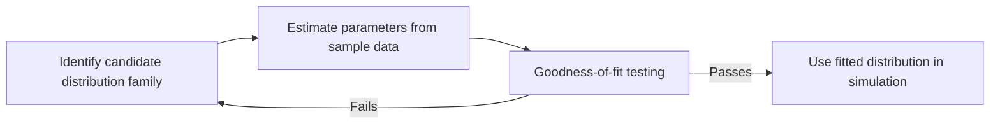

## Parameter Estimation Techniques

### Overview

Parameter estimation is the process of computing numerical values for the parameters of a hypothesized distribution family so that the distribution best matches a collected data sample. Once a candidate family has been identified (e.g., Exponential, Normal, Weibull), the family alone is not usable in a simulation until its parameters — rate, mean, variance, shape, scale, and so on — are assigned specific values derived from data. This article covers the principal estimation methods, their mathematical basis, and their comparative strengths.

### Role in the Input Modeling Pipeline

Parameter estimation sits between distribution identification and goodness-of-fit testing:

If goodness-of-fit testing fails, analysts typically return either to re-estimate parameters with a different method or to reconsider the distribution family entirely.

### Method of Moments

#### Concept

The Method of Moments (MoM) estimates parameters by equating theoretical moments of the distribution (mean, variance, etc.) to the corresponding sample moments computed from the data, then solving the resulting equations for the unknown parameters.

The $k$-th sample moment is:

$$m_k = \frac{1}{n} \sum_{i=1}^{n} x_i^k$$

For a distribution with $p$ parameters, the first $p$ theoretical moments are set equal to the first $p$ sample moments, producing $p$ equations solved simultaneously.

#### Example: Exponential Distribution

The Exponential distribution has one parameter, $\lambda$ (rate), with theoretical mean $\dfrac{1}{\lambda}$. Setting the theoretical mean equal to the sample mean $\bar{x}$:

$$\frac{1}{\lambda} = \bar{x} \implies \hat{\lambda} = \frac{1}{\bar{x}}$$

**Example**

Given interarrival time data with sample mean $\bar{x} = 4.2$ minutes, the Method of Moments estimate is $\hat{\lambda} = \dfrac{1}{4.2} \approx 0.238$ arrivals per minute.

#### Example: Gamma Distribution

The Gamma distribution has two parameters: shape $k$ and scale $\theta$, with theoretical mean $k\theta$ and variance $k\theta^2$. Equating to sample mean $\bar{x}$ and sample variance $s^2$:

$$\hat{\theta} = \frac{s^2}{\bar{x}}, \qquad \hat{k} = \frac{\bar{x}^2}{s^2}$$

#### Strengths and Weaknesses

**Key Points**

- Computationally simple and often solvable in closed form.
- Does not always produce statistically efficient estimates (i.e., estimates with the lowest possible variance among unbiased estimators).
- Can produce invalid parameter values in some cases (e.g., a negative shape parameter) if sample moments behave unusually, particularly with small or skewed samples.
- Serves well as a quick starting estimate, and often as an initial guess supplied to iterative Maximum Likelihood Estimation algorithms.

### Maximum Likelihood Estimation

#### Concept

Maximum Likelihood Estimation (MLE) selects parameter values that maximize the likelihood of having observed the actual sample data, under the assumption that the data are independent and identically distributed (i.i.d.) draws from the hypothesized distribution.

Given a probability density function $f(x; \theta)$ with parameter(s) $\theta$, the likelihood function for a sample $x_1, \dots, x_n$ is:

$$L(\theta) = \prod_{i=1}^{n} f(x_i; \theta)$$

Because products of many small probabilities are numerically unstable and analytically awkward, the log-likelihood is maximized instead, which has the same maximizing $\theta$ since $\log$ is monotonically increasing:

$$\ell(\theta) = \ln L(\theta) = \sum_{i=1}^{n} \ln f(x_i; \theta)$$

The MLE $\hat{\theta}$ is found by solving:

$$\frac{\partial \ell(\theta)}{\partial \theta} = 0$$

#### Example: Exponential Distribution

For the Exponential distribution, $f(x; \lambda) = \lambda e^{-\lambda x}$. The log-likelihood is:

$$\ell(\lambda) = n \ln \lambda - \lambda \sum_{i=1}^{n} x_i$$

Differentiating and setting to zero:

$$\frac{n}{\lambda} - \sum_{i=1}^{n} x_i = 0 \implies \hat{\lambda}_{MLE} = \frac{n}{\sum_{i=1}^{n} x_i} = \frac{1}{\bar{x}}$$

For the Exponential distribution, the MLE and Method of Moments estimators coincide.

#### Example: Normal Distribution

For the Normal distribution, the MLEs are:

$$\hat{\mu}_{MLE} = \bar{x}, \qquad \hat{\sigma}^2_{MLE} = \frac{1}{n}\sum_{i=1}^{n}(x_i - \bar{x})^2$$

The MLE variance estimator divides by $n$ rather than $n-1$, making it biased in finite samples; the unbiased sample variance $s^2$ (dividing by $n-1$, via Bessel's correction) is commonly substituted in practice for reporting, though this substitution does not change the underlying MLE derivation.

#### When No Closed-Form Solution Exists

Many distributions (Gamma, Weibull, Beta, Lognormal with censored data) have log-likelihood equations with no closed-form algebraic solution. In these cases, numerical optimization is required:

- **Newton-Raphson method** — iteratively refines the estimate using first and second derivatives of the log-likelihood.
- **Expectation-Maximization (EM) algorithm** — used particularly for mixture distributions or data with missing/censored values.
- **General-purpose numerical optimizers** (e.g., BFGS, Nelder-Mead) — commonly invoked through statistical software rather than implemented manually.

[Inference] In applied simulation practice, most analysts rely on statistical software packages (such as those in R, Python's SciPy, or dedicated input-modeling tools like Stat::Fit and ExpertFit) to perform the numerical optimization rather than coding the Newton-Raphson iterations directly, since these packages are widely available and well-tested.

#### Strengths and Weaknesses

**Key Points**

- Asymptotically efficient — as sample size grows, MLE achieves the lowest possible variance among consistent estimators (under standard regularity conditions).
- Asymptotically unbiased and normally distributed, which supports constructing confidence intervals around parameter estimates.
- Computationally more demanding than Method of Moments, particularly for multi-parameter distributions without closed-form solutions.
- Sensitive to model misspecification; if the hypothesized distribution family is wrong, MLE will still return a "best fit" for that wrong family without warning.
- Generally the preferred method in professional input modeling software due to its statistical properties.

### Comparison of Method of Moments and Maximum Likelihood Estimation

| Criterion | Method of Moments | Maximum Likelihood Estimation |
| --- | --- | --- |
| Computational complexity | Low; often closed-form | Higher; may require numerical optimization |
| Statistical efficiency | Generally lower | Asymptotically optimal |
| Bias in small samples | Can be biased or produce invalid values | Can be biased but generally well-behaved |
| Common use case | Quick estimate, initial guess for MLE | Primary method in most software packages |
| Handles censored/truncated data | Poorly, without modification | Naturally extensible (via modified likelihood) |

### Other Estimation Approaches

#### Percentile Matching

Percentile matching sets theoretical distribution percentiles (e.g., median, quartiles) equal to sample percentiles and solves for parameters. This is occasionally used for distributions like the Weibull, where certain percentiles yield simpler algebraic relationships than moments.

#### Bayesian Estimation

Bayesian estimation treats parameters as random variables with a prior distribution, updated via observed data to form a posterior distribution using Bayes' theorem:

$$p(\theta \mid x) = \frac{p(x \mid \theta)\, p(\theta)}{p(x)}$$

**Key Points**

- Incorporates prior domain knowledge or expert judgment directly into the estimate, which is valuable when sample sizes are small.
- Produces a full posterior distribution over parameters rather than a single point estimate, naturally supporting uncertainty quantification.
- Requires specifying a prior distribution, which introduces subjectivity that must be justified or tested for sensitivity.
- Computationally more intensive, often requiring Markov Chain Monte Carlo (MCMC) sampling for complex models.

### Handling Censored and Truncated Data

Real-world input data is often incomplete in specific ways that standard estimation formulas do not directly accommodate:

- **Censored data**: The exact value is unknown, but a bound is known (e.g., a machine that had not yet failed when observation ended — right-censored).
- **Truncated data**: Observations below or above a certain threshold are excluded from the dataset entirely (e.g., a queue that only records customers who did not balk).

Standard MLE and Method of Moments formulas assume complete data and will produce biased estimates if applied naively to censored or truncated samples. Modified likelihood functions that account for the censoring or truncation mechanism are required:

$$L(\theta) = \prod_{i \in \text{complete}} f(x_i; \theta) \prod_{j \in \text{censored}} \left[1 - F(x_j; \theta)\right]$$

where $F$ is the cumulative distribution function. This adjustment credits censored observations with the probability of surviving beyond the censoring point, rather than treating them as invalid data to discard.

### Parameter Estimation Workflow Diagram

<svg xmlns="http://www.w3.org/2000/svg" viewBox="0 0 900 380" font-family="Helvetica, Arial, sans-serif">
<text x="450" y="28" text-anchor="middle" font-size="20" font-weight="bold" fill="#1a1a1a">Parameter Estimation Method Selection (svg_diagram)</text>
<rect x="370" y="50" width="160" height="50" rx="8" fill="#4C78A8" />
<text x="450" y="80" text-anchor="middle" font-size="14" fill="white">Sample data collected</text>
<line x1="450" y1="100" x2="450" y2="130" stroke="#333" stroke-width="2" marker-end="url(#arrow)" />
<rect x="330" y="130" width="240" height="55" rx="8" fill="#F0F0F0" stroke="#888" />
<text x="450" y="152" text-anchor="middle" font-size="13" fill="#1a1a1a">Data complete, uncensored,</text>
<text x="450" y="170" text-anchor="middle" font-size="13" fill="#1a1a1a">reasonably sized sample?</text>
<line x1="330" y1="157" x2="150" y2="220" stroke="#333" stroke-width="2" marker-end="url(#arrow)" />
<text x="220" y="195" font-size="12" fill="#1a1a1a">No</text>
<line x1="570" y1="157" x2="720" y2="220" stroke="#333" stroke-width="2" marker-end="url(#arrow)" />
<text x="670" y="195" font-size="12" fill="#1a1a1a">Yes</text>
<rect x="40" y="220" width="220" height="70" rx="8" fill="#F58518" />
<text x="150" y="245" text-anchor="middle" font-size="13" fill="white">Use modified likelihood</text>
<text x="150" y="263" text-anchor="middle" font-size="13" fill="white">for censoring/truncation</text>
<text x="150" y="281" text-anchor="middle" font-size="11" fill="white">(adjusted MLE)</text>
<rect x="610" y="220" width="220" height="70" rx="8" fill="#54A24B" />
<text x="720" y="245" text-anchor="middle" font-size="13" fill="white">Prefer Maximum Likelihood</text>
<text x="720" y="263" text-anchor="middle" font-size="13" fill="white">Estimation (software-assisted</text>
<text x="720" y="281" text-anchor="middle" font-size="13" fill="white">numerical optimization)</text>
<rect x="335" y="220" width="230" height="70" rx="8" fill="#B279A2" />
<text x="450" y="240" text-anchor="middle" font-size="12" fill="white">Small sample or need a quick</text>
<text x="450" y="257" text-anchor="middle" font-size="12" fill="white">initial estimate?</text>
<text x="450" y="274" text-anchor="middle" font-size="12" fill="white">→ Method of Moments first</text>
<line x1="150" y1="290" x2="150" y2="330" stroke="#333" stroke-width="2" marker-end="url(#arrow)" />
<line x1="450" y1="290" x2="450" y2="330" stroke="#333" stroke-width="2" marker-end="url(#arrow)" />
<line x1="720" y1="290" x2="720" y2="330" stroke="#333" stroke-width="2" marker-end="url(#arrow)" />
<rect x="230" y="330" width="440" height="40" rx="8" fill="#333" />
<text x="450" y="355" text-anchor="middle" font-size="13" fill="white">Proceed to Goodness-of-Fit Testing</text>
</svg>

### Common Pitfalls

- **Ignoring censoring/truncation** — applying standard MLE or MoM formulas to incomplete data without adjustment systematically biases parameter estimates.
- **Treating Method of Moments estimates as final** — MoM is best used as a starting point; relying on it exclusively for multi-parameter distributions can yield inefficient or invalid estimates.
- **Not checking parameter validity** — some estimation procedures can mathematically return out-of-domain values (e.g., negative variance, shape parameters ≤ 0); these must be checked before use.
- **Overlooking small-sample bias** — both MoM and MLE can behave poorly with very small samples, where confidence intervals around estimates should be reported and considered rather than treating point estimates as exact.
- **Forgetting standard errors** — a point estimate alone does not convey estimation uncertainty; MLE naturally supports standard error computation via the Fisher Information matrix, which is useful for downstream sensitivity analysis.

### Next Steps

**Related Topics**

- Goodness-of-Fit Tests (Chi-Square, Kolmogorov-Smirnov, Anderson-Darling)
- Confidence Intervals for Estimated Parameters
- Fisher Information and Asymptotic Variance of MLE
- Bayesian Input Modeling with Markov Chain Monte Carlo
- Estimation with Censored and Truncated Data in Reliability Modeling
- Software Tools for Automated Distribution Fitting (Stat::Fit, ExpertFit, SciPy)