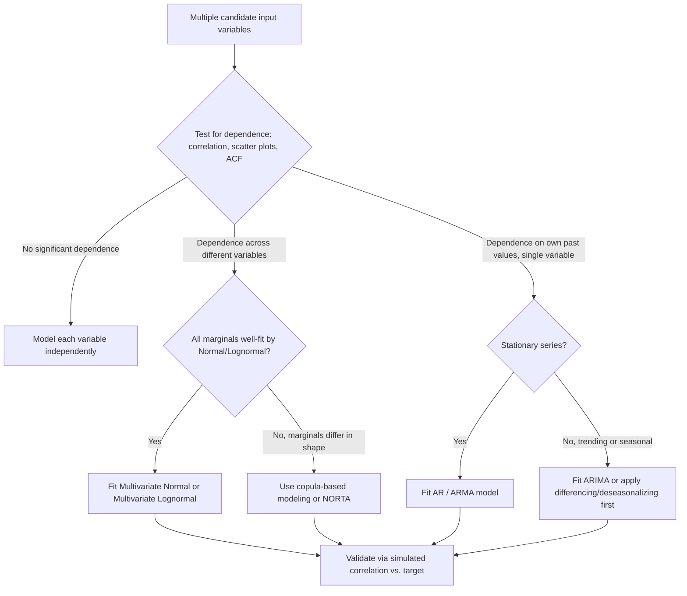

## Handling Multivariate and Correlated Inputs

### Overview

Multivariate and correlated input modeling addresses situations where two or more random variables in a simulation cannot be treated as statistically independent, and must instead be modeled jointly to preserve their real-world dependency structure. Treating correlated inputs as independent — a common simplification in introductory simulation work — can produce systematically biased performance estimates, particularly for congestion measures, extreme-value statistics, and system reliability calculations.

### Why Independence Assumptions Fail

**Key Points**

- Many univariate input modeling techniques (fitting a single distribution per variable) implicitly assume each input is generated independently of all others.
- In real systems, inputs are frequently correlated: service time may depend on transaction size, machine failure times may be correlated across components sharing a power supply, or demand across product lines may move together seasonally.
- Ignoring positive correlation between inputs (e.g., between successive service times or between arrival and service processes) typically understates the variability of simulation outputs, leading to overly optimistic estimates of congestion or delay.
- Ignoring negative correlation can similarly distort results in the opposite direction.

[Inference] The direction and magnitude of bias from ignoring correlation is context-dependent and cannot be assumed a priori; it should be checked empirically for a given system rather than assumed to always inflate or always deflate variability.

### Detecting Dependence in Data

Before selecting a multivariate modeling technique, dependence between candidate input variables should be assessed:

- **Pearson correlation coefficient** ($r$) — measures linear dependence:

$$r = \frac{\sum_{i=1}^{n}(x_i - \bar{x})(y_i - \bar{y})}{\sqrt{\sum_{i=1}^{n}(x_i - \bar{x})^2}\sqrt{\sum_{i=1}^{n}(y_i - \bar{y})^2}}$$

- **Spearman rank correlation** — a nonparametric alternative measuring monotonic (not necessarily linear) dependence, more robust to outliers and skewed data common in simulation inputs (service times, queue lengths).
- **Scatter plots** — visual inspection for linear, nonlinear, or clustered dependence patterns that a single correlation coefficient may not fully capture.
- **Autocorrelation function (ACF)** — used specifically for a single variable observed sequentially over time (e.g., successive interarrival times), to detect whether an observation depends on its own past values.

A Pearson correlation near zero does not guarantee independence; it only rules out linear dependence, so scatter plots remain an important complementary check for nonlinear relationships.

### Modeling Approaches for Correlated Inputs

#### Multivariate Distributions

When all correlated variables can be reasonably assumed to follow a known joint distribution family, a multivariate distribution can be fit directly.

- **Multivariate Normal distribution** — parameterized by a mean vector $\boldsymbol{\mu}$ and covariance matrix $\boldsymbol{\Sigma}$:

$$f(\mathbf{x}) = \frac{1}{(2\pi)^{k/2} |\boldsymbol{\Sigma}|^{1/2}} \exp\left(-\frac{1}{2}(\mathbf{x}-\boldsymbol{\mu})^T \boldsymbol{\Sigma}^{-1} (\mathbf{x}-\boldsymbol{\mu})\right)$$

where $k$ is the number of variables and $\boldsymbol{\Sigma}$ captures both variances (diagonal) and covariances (off-diagonal) between all pairs of variables.

- **Multivariate Lognormal** — used when the underlying variables are strictly positive and right-skewed but their logarithms are approximately jointly Normal.

**Key Points**

- Multivariate Normal is analytically convenient and widely supported in simulation software, but is restricted to symmetric, unbounded marginal distributions, which is often unrealistic for quantities like service times or costs.
- Fitting a full covariance matrix requires estimating $\frac{k(k+1)}{2}$ parameters, which grows quickly with the number of correlated variables and requires proportionally larger sample sizes to estimate reliably.

#### Copula-Based Modeling

Copulas separate the modeling of marginal distributions from the modeling of dependence structure, allowing each input variable to retain its own best-fit marginal distribution (e.g., one Exponential, one Weibull) while a copula function jointly captures how they move together.

By Sklar's theorem, any joint cumulative distribution function $F$ can be expressed as:

$$F(x_1, \dots, x_k) = C\big(F_1(x_1), \dots, F_k(x_k)\big)$$

where $F_1, \dots, F_k$ are the marginal CDFs and $C$ is a copula function capturing dependence on the $[0,1]^k$ scale.

Common copula families:

- **Gaussian copula** — models dependence structure analogous to the Multivariate Normal but permits arbitrary marginals; does not capture tail dependence well.
- **Clayton copula** — captures strong lower-tail dependence, useful when variables tend to be jointly small together (e.g., simultaneous equipment failures during a shared stress event).
- **Gumbel copula** — captures strong upper-tail dependence, useful when variables tend to be jointly large together (e.g., simultaneous demand spikes).
- **t-copula** — similar to Gaussian but with heavier joint tails, capturing simultaneous extreme events more realistically than Gaussian.

**Example**

Consider a simulation of a supply chain where order quantity (best modeled as Gamma-distributed) and delivery delay (best modeled as Weibull-distributed) tend to increase together during peak demand periods. A copula approach would fit the Gamma and Weibull marginals independently using standard univariate techniques, then fit a copula (e.g., Gumbel, if joint extreme values are of particular concern) to the transformed uniform data to capture their co-movement, rather than forcing both variables into a joint Multivariate Normal framework that neither marginal shape would fit well.

#### NORTA (NORmal To Anything)

NORTA is a widely used simulation-specific technique for generating correlated random variates with arbitrary marginal distributions:

1. Generate correlated standard Normal variates using a specified correlation matrix.
2. Transform each Normal variate to a Uniform(0,1) variate via the standard Normal CDF.
3. Transform each Uniform variate to the target marginal distribution via its inverse CDF (the inverse transform method).

$$X_i = F_i^{-1}\big(\Phi(Z_i)\big)$$

where $Z_i$ is a component of a correlated multivariate Normal vector, $\Phi$ is the standard Normal CDF, and $F_i^{-1}$ is the target marginal's inverse CDF.

**Key Points**

- NORTA requires adjusting the input Normal correlation matrix so that the resulting correlation between the transformed (non-Normal) variates matches the target correlation, since the transformation is nonlinear and does not preserve correlation values directly.
- Not every target correlation matrix combined with every set of marginals is achievable via NORTA; feasibility must be checked, and the achievable correlation range can be narrower than $[-1, 1]$ depending on the chosen marginals.
- Widely implemented in commercial and academic simulation input-modeling software due to its relative simplicity compared to full copula estimation.

### Time-Series Dependence (Autocorrelated Inputs)

Some inputs are correlated with their own past values rather than with a different variable — for example, hourly demand levels that trend upward through a shift, or successive processing times on a machine that degrades over a production run.

- **Autoregressive (AR) models** — express a value as a linear function of its own previous values plus noise:

$$X_t = \phi_1 X_{t-1} + \phi_2 X_{t-2} + \dots + \phi_p X_{t-p} + \epsilon_t$$

- **ARMA / ARIMA models** — extend AR models with moving-average terms and, for ARIMA, differencing to handle non-stationary series (trends).
- **Time-series bootstrap methods** (e.g., block bootstrap) — resample contiguous blocks of historical data to preserve local autocorrelation structure without imposing a specific parametric time-series model.

[Inference] Simpler AR(1) models are commonly sufficient for many simulation applications involving mild sequential dependence, though this should be verified against the ACF of the specific dataset rather than assumed.

### Decision Diagram for Correlated Input Modeling

### Validating a Correlated Input Model

**Key Points**

- After fitting, generate a large sample of synthetic data from the fitted joint model and compare its empirical correlation (or copula parameters) against the original data's correlation.
- Compare marginal distributions of the synthetic data against the original marginals to confirm the joint modeling step did not distort individual variable behavior.
- For time-series inputs, compare the ACF of simulated data against the ACF of historical data across multiple lags, not just lag 1.
- Sensitivity analysis — rerun the simulation under the independence assumption and under the fitted dependence structure to quantify how much the correlation actually affects key output metrics; if the difference is negligible for the decisions being supported, the added modeling complexity may not be justified.

### Common Pitfalls

- **Assuming independence by default** — the single most common simplification error in practical input modeling, often made purely for convenience rather than because independence was actually tested.
- **Fitting marginals and dependence structure in the wrong order** — fitting a Multivariate Normal directly to raw, non-Normal marginal data conflates marginal shape and dependence structure, whereas copula methods correctly separate the two.
- **Ignoring tail dependence** — using a Gaussian copula when the real phenomenon exhibits simultaneous extreme events (e.g., simultaneous equipment failures) understates the probability of joint extreme outcomes, since the Gaussian copula has no tail dependence.
- **Insufficient data for the number of parameters** — multivariate and copula models require estimating more parameters than univariate models; small sample sizes can lead to unstable or unreliable dependence parameter estimates.
- **Neglecting NORTA feasibility limits** — assuming any target correlation is achievable after transformation, without checking the achievable correlation range for the chosen marginals.

### Next Steps

**Related Topics**

- Copula Theory and Sklar's Theorem in Depth
- Time-Series Input Modeling: ARIMA and Seasonal Decomposition
- Variance Reduction Techniques in the Presence of Correlated Inputs
- Sensitivity Analysis for Dependence Assumptions in Simulation
- Random Variate Generation for Multivariate Distributions
- Goodness-of-Fit Testing for Joint and Conditional Distributions