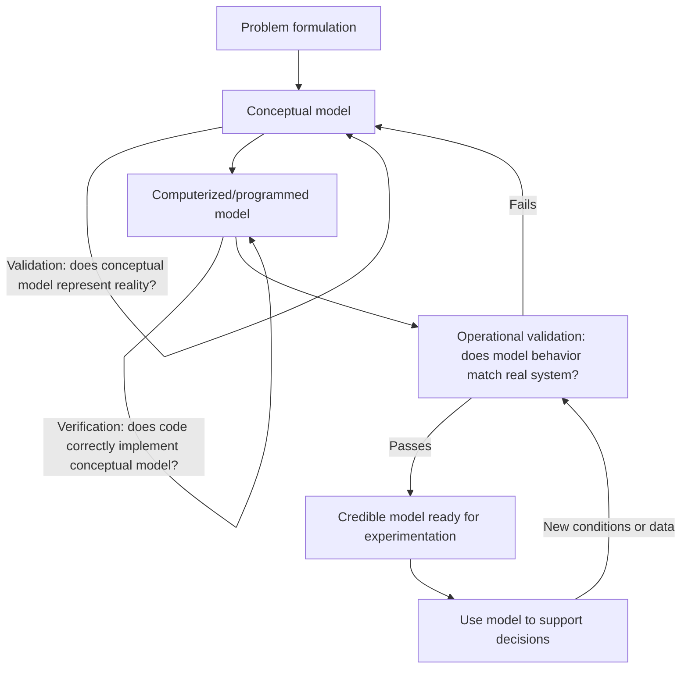

## Verification and Validation

### Overview

Verification and Validation (V&V) are the two complementary processes used to establish confidence that a simulation model is both correctly built and correctly representative of the real system it models. Verification asks "Is the model built right?" — confirming that the computer implementation faithfully executes the conceptual model without programming or logical errors. Validation asks "Is the right model built?" — confirming that the conceptual model, and its computerized implementation, sufficiently represents the real-world system for the intended purpose. These are distinct activities requiring different techniques, and both are necessary; a model can be perfectly verified (bug-free code) yet completely invalid (based on wrong assumptions about the real system), or vice versa.

### Verification vs. Validation: Core Distinction

| Aspect | Verification | Validation |
| --- | --- | --- |
| Core question | Is the model built right? | Is the right model built? |
| Focus | Internal correctness of implementation | External correspondence to reality |
| Compares | Conceptual model vs. computerized model | Computerized model vs. real system |
| Typical techniques | Code review, debugging, structured walkthroughs | Comparison with historical data, expert review, statistical testing |
| Errors caught | Programming bugs, logical errors, algorithm mistakes | Wrong assumptions, missing factors, incorrect abstraction level |
| Analogy | "Did we build the model correctly?" | "Did we build the correct model?" |

### The V&V Process in Context

Verification and validation are not single end-of-project steps but activities interwoven throughout the modeling lifecycle, from initial conceptualization through final operational use.

The diagram illustrates that validation is not a one-time gate; operational validation can trigger revisiting the conceptual model, and models already in use may require re-validation when applied to new conditions or when new real-world data becomes available.

### Verification Techniques

#### Structured Walkthroughs and Code Review

Having colleagues or domain experts review the model's code and logic line-by-line or module-by-module to identify implementation errors that the original developer may overlook due to familiarity with the code.

#### Trace-Driven Debugging

Running the simulation with a small, controlled, deterministic set of inputs and manually tracing through the expected sequence of events, comparing the model's actual behavior against hand-calculated expected behavior at each step.

**Example**

For a simple single-server queueing model, an analyst might fix the random number stream to produce a known sequence of interarrival and service times, hand-calculate the expected queue length and server utilization at each event, and step through the simulation's event log to confirm the model's internal state matches the hand calculation at every point.

#### Structural and Boundary Testing

- **Degenerate/extreme case testing** — running the model under simplified or extreme parameter settings where the correct output is known analytically (e.g., setting arrival rate to zero should produce zero utilization; setting service time to zero should produce no queueing).
- **Unit testing** — testing individual model components or subroutines (e.g., a random variate generator, a specific business-rule function) in isolation against known correct outputs.
- **Continuity testing** — verifying that small changes in input parameters produce correspondingly small (not discontinuous or erratic) changes in output, except where genuine structural discontinuities are expected.

#### Consistency Checks

- **Conservation checks** — verifying quantities that should be conserved actually are (e.g., total units entering a system over a run should equal total units that exited plus units remaining in-system at the end).
- **Reasonableness of output ranges** — checking that outputs fall within physically or logically plausible bounds (e.g., utilization between 0 and 1, non-negative queue lengths).

**Key Points**

- Verification techniques are primarily the responsibility of the model developer but benefit substantially from independent review, since developers are prone to confirmation bias regarding their own code.
- Verification should occur continuously during development, not solely as a final pre-deployment step, since early-stage errors compound and become harder to isolate later.

### Validation Techniques

#### Face Validation

Presenting the model's structure, assumptions, and behavior to subject-matter experts familiar with the real system, and asking whether the model appears reasonable based on their domain experience. This is typically the first validation step and is inexpensive relative to statistical techniques, though it is subjective and depends heavily on the expertise and engagement of the reviewers involved.

#### Historical Data Validation

**Key Points**

- Comparing simulation output against real historical data from the actual system, when such data exists, using the same input conditions that occurred historically.
- A common approach: split historical data into a portion used for input modeling (calibration) and a separate held-out portion used purely for validation comparison, analogous to a train/test split, to avoid validating the model against the same data used to build it.
- Statistical comparison techniques include confidence interval comparison of output means, hypothesis testing (e.g., paired-t test on corresponding real vs. simulated periods), and visual comparison of output distributions.

#### Turing Tests

Presenting domain experts with both real system output reports and simulation output reports, formatted identically and unlabeled, and asking the experts to identify which is which. If experts cannot reliably distinguish real from simulated output, this provides supporting evidence of validity, though inability to distinguish the reports does not by itself prove the model is correct for all purposes the model might later be used for.

#### Sensitivity Analysis as a Validation Tool

Systematically varying model inputs and parameters and checking whether the resulting changes in output are consistent with domain knowledge and expectations about how the real system should respond. Unexpectedly large or small sensitivity to a given parameter can indicate either a genuine and interesting property of the real system or a modeling error, and domain expert review is typically needed to distinguish between the two.

#### Statistical Validation Techniques

- **Confidence interval approach** — construct a confidence interval for the difference between simulated and real system output means; if the interval contains zero, this does not disprove a difference but does not provide evidence against the model at the chosen confidence level.
- **Hypothesis testing approach** — formally test $H_0: \mu_{\text{sim}} = \mu_{\text{real}}$ against real system data, being mindful that failing to reject $H_0$ reflects insufficient evidence of a difference rather than proof of equality.
- **Time-series comparison** — for models producing output over time, comparing simulated and real time-series trajectories (not just summary statistics) can reveal timing or dynamic-pattern discrepancies that aggregate statistics would mask.

[Inference] In practice, the choice between confidence-interval and formal hypothesis-testing approaches to statistical validation often depends more on organizational reporting conventions and stakeholder familiarity with the terminology than on a substantive statistical difference between the two framings, since both are ultimately testing similar underlying questions about output agreement.

### The Challenge of Validation Without Real-System Data

**Key Points**

- For simulations of systems that do not yet exist (e.g., a proposed new facility, a redesigned process), no historical output data exists for direct comparison, and validation must rely more heavily on:
  - Face validation by experts familiar with similar existing systems.
  - Validation of individual submodels or components against data from analogous, currently operating systems.
  - Sensitivity analysis to confirm the model behaves plausibly across the range of plausible future conditions.
  - Cross-validation against independent models or analytical approximations of the same proposed system, where available.
- This situation is common in early-stage capacity planning, feasibility studies, and system design simulations, and represents an inherent limitation rather than a solvable gap; validation confidence in these cases is necessarily lower than for simulations of existing, observable systems.

### Validating Against Intended Use

**Key Points**

- A model is validated relative to a specific intended purpose and range of application, not validated as universally "correct" in an absolute sense.
- A model shown valid for predicting average queue length may not be valid for predicting rare extreme-tail events if it was not specifically calibrated or tested against tail behavior.
- Extrapolating a validated model beyond the range of conditions under which it was validated (e.g., using a model validated at current demand levels to predict behavior at triple the demand) requires additional scrutiny and is a common source of misplaced confidence in simulation results.

### V&V Activity Mapping Across the Modeling Lifecycle

<svg xmlns="http://www.w3.org/2000/svg" viewBox="0 0 900 420" font-family="Helvetica, Arial, sans-serif">
<text x="450" y="28" text-anchor="middle" font-size="20" font-weight="bold" fill="#1a1a1a">V&amp;V Activities Across the Modeling Lifecycle (svg_diagram)</text>

<rect x="30" y="60" width="180" height="50" rx="8" fill="#4C78A8" />
<text x="120" y="90" text-anchor="middle" font-size="13" fill="white">Problem Formulation</text>
<rect x="250" y="60" width="180" height="50" rx="8" fill="#4C78A8" />
<text x="340" y="90" text-anchor="middle" font-size="13" fill="white">Conceptual Model</text>
<rect x="470" y="60" width="180" height="50" rx="8" fill="#4C78A8" />
<text x="560" y="90" text-anchor="middle" font-size="13" fill="white">Computerized Model</text>
<rect x="690" y="60" width="180" height="50" rx="8" fill="#4C78A8" />
<text x="780" y="90" text-anchor="middle" font-size="13" fill="white">Operational Use</text>

<line x1="210" y1="85" x2="250" y2="85" stroke="#333" stroke-width="2" marker-end="url(#arrow2)" />
<line x1="430" y1="85" x2="470" y2="85" stroke="#333" stroke-width="2" marker-end="url(#arrow2)" />
<line x1="650" y1="85" x2="690" y2="85" stroke="#333" stroke-width="2" marker-end="url(#arrow2)" />

<rect x="30" y="150" width="420" height="90" rx="8" fill="#F0F0F0" stroke="#888" />
<text x="240" y="172" text-anchor="middle" font-size="14" font-weight="bold" fill="#1a1a1a">VALIDATION</text>
<text x="240" y="195" text-anchor="middle" font-size="12" fill="#1a1a1a">Face validation, data validation,</text>
<text x="240" y="213" text-anchor="middle" font-size="12" fill="#1a1a1a">conceptual model review by experts</text>
<text x="240" y="230" text-anchor="middle" font-size="11" fill="#555" font-style="italic">Applies to: problem formulation → conceptual model</text>

<rect x="470" y="150" width="200" height="90" rx="8" fill="#F58518" />
<text x="570" y="172" text-anchor="middle" font-size="14" font-weight="bold" fill="white">VERIFICATION</text>
<text x="570" y="195" text-anchor="middle" font-size="12" fill="white">Code review, debugging,</text>
<text x="570" y="213" text-anchor="middle" font-size="12" fill="white">unit/boundary testing</text>
<text x="570" y="230" text-anchor="middle" font-size="11" fill="#fff" font-style="italic">Conceptual → computerized model</text>

<rect x="690" y="150" width="180" height="90" rx="8" fill="#54A24B" />
<text x="780" y="172" text-anchor="middle" font-size="14" font-weight="bold" fill="white">OPERATIONAL</text>
<text x="780" y="188" text-anchor="middle" font-size="13" font-weight="bold" fill="white">VALIDATION</text>
<text x="780" y="208" text-anchor="middle" font-size="12" fill="white">Historical comparison,</text>
<text x="780" y="224" text-anchor="middle" font-size="12" fill="white">Turing tests, sensitivity</text>

<path d="M 780 240 C 780 300 240 300 240 240" fill="none" stroke="#B279A2" stroke-width="2" marker-end="url(#arrow2)" />
<text x="500" y="320" text-anchor="middle" font-size="13" fill="#B279A2">Discrepancies found in operational validation feed back to conceptual model revision</text>

<rect x="30" y="350" width="840" height="50" rx="8" fill="#333" />
<text x="450" y="380" text-anchor="middle" font-size="13" fill="white">V&amp;V is continuous and iterative throughout the lifecycle, not a single terminal gate</text>
</svg>

### Documentation and Credibility

**Key Points**

- Thorough documentation of assumptions, data sources, input models, verification tests performed, and validation results is itself part of establishing model credibility, independent of the technical correctness of the model.
- Stakeholder involvement throughout the V&V process — not only at final presentation — tends to increase confidence in and acceptance of simulation results, since stakeholders who understand how a model was tested are better positioned to judge whether it fits their decision context.
- A model's credibility is ultimately assessed by the intended decision-makers, not solely by the modeling team; technically rigorous V&V does not guarantee stakeholder acceptance if the process was not transparent or was not adequately communicated to non-technical stakeholders.

### Common Pitfalls

- **Conflating verification with validation** — a common misconception is that a bug-free, well-tested program is automatically a valid representation of reality; verification and validation address entirely different failure modes.
- **Validating only once, at project end** — treating V&V as a final checklist item rather than an ongoing activity increases the risk that fundamental conceptual errors are discovered too late to correct economically.
- **Over-relying on face validation alone** — expert opinion is valuable but subjective and can be systematically wrong, particularly for novel systems or when experts share the same blind spots as the modeling team.
- **Validating against the same data used for calibration** — without a held-out comparison dataset, apparent agreement between model and reality may simply reflect overfitting during input modeling rather than genuine predictive validity.
- **Assuming validity generalizes beyond the tested range** — a model validated under current or historical operating conditions is not automatically valid for extrapolated, substantially different future conditions without additional justification.
- **Treating statistical non-rejection as proof** — failing to reject a null hypothesis of no difference between simulated and real output is evidence of insufficient detected difference, not proof that the model is correct.

### Next Steps

**Related Topics**

- Sensitivity Analysis Techniques for Simulation Models
- Statistical Methods for Comparing Simulated and Real System Output
- Conceptual Model Design and Documentation Practices
- Model Credibility and Stakeholder Communication in Simulation Projects
- Validation Strategies for Systems Without Historical Data
- Design of Experiments for Simulation Model Testing