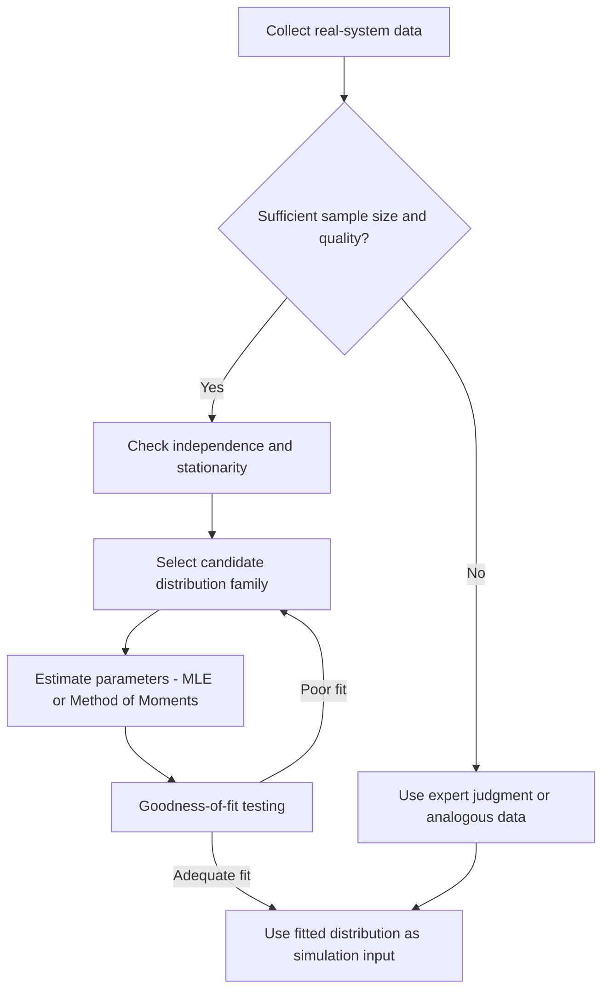

## Input and Output Analysis

### Overview

Input and output analysis forms the statistical backbone of a simulation study, governing how randomness enters a model and how the resulting data is interpreted once the model runs. Input analysis is concerned with characterizing the stochastic processes that drive a simulation — arrival rates, service times, failure intervals — and fitting them to probability distributions that can be sampled during execution. Output analysis is concerned with the reverse problem: given that a simulation's results are themselves random variables, how does an analyst extract statistically defensible conclusions from a finite, correlated set of simulation runs. Both activities sit downstream of model verification and validation but upstream of any decision-making that uses the simulation's results.

### Input Analysis

#### Purpose and Scope

Input analysis answers the question: what probability distribution should be used to generate the random values that drive each stochastic element of the simulation? Poor input modeling — using an inappropriate distribution, ignoring correlation between variables, or relying on insufficient data — propagates error through the entire simulation regardless of how well the logical model itself is verified. This is often summarized by the principle "garbage in, garbage out," which applies to simulation with particular force because a flawed input distribution can produce output that looks plausible while being systematically wrong.

#### Data Collection

The starting point for input analysis is empirical data collected from the real system being modeled, such as interarrival times at a service counter, machine repair durations, or demand quantities. Key considerations during collection include:

- **Sample size** — larger samples support more reliable distribution fitting and parameter estimation, though the marginal benefit diminishes past a few hundred observations for most standard distributions [Inference: the specific point of diminishing returns depends on the underlying distribution's variance and tail behavior].
- **Independence** — observations should be checked for autocorrelation, since many fitting techniques assume independent and identically distributed (i.i.d.) samples.
- **Stationarity** — the underlying process should be checked for time-varying behavior (e.g., a call center's arrival rate changing by hour of day), which if present requires either non-stationary modeling (time-dependent distributions) or stratification into homogeneous sub-periods.
- **Homogeneity** — data should come from a single underlying process; mixing data from distinct sources (e.g., two different machine types) without accounting for the mixture can distort the fitted distribution.

When no historical data exists, analysts fall back on subject-matter expert judgment, engineering specifications, or analogous systems, often using triangular or uniform distributions as a starting approximation.

#### Distribution Selection

Once data is collected, the analyst selects a candidate family of probability distributions that plausibly matches the underlying physical or behavioral process. Common candidates and their typical use cases:

| Distribution | Typical Use Case |
| --- | --- |
| Exponential | Time between independent, memoryless events (e.g., interarrival times in a Poisson process) |
| Normal | Measurement errors, quantities resulting from sums of many small effects |
| Lognormal | Quantities that are products of many small effects (e.g., repair times, task durations) |
| Poisson | Count of events in a fixed interval |
| Weibull | Time-to-failure data, especially with increasing or decreasing hazard rates |
| Gamma | Sums of exponential random variables; flexible skewed positive data |
| Triangular | Subjective estimates when only min, mode, and max are known |
| Uniform | Complete uncertainty within a bounded range |
| Empirical | When no standard distribution fits well; resamples directly from observed data |

A histogram of the data is typically the first visual diagnostic, compared against the shape of density functions of candidate distributions.

#### Parameter Estimation

After a distribution family is selected, its parameters must be estimated from the data. The two dominant approaches are:

- **Method of Moments** — equates sample moments (mean, variance) to the theoretical moments of the distribution, solving for parameters. Simple to compute but generally less statistically efficient than maximum likelihood.
- **Maximum Likelihood Estimation (MLE)** — selects the parameter values that maximize the likelihood of observing the given sample. MLE is the more commonly preferred method in simulation practice due to its favorable asymptotic properties (consistency, efficiency).

For many standard distributions, closed-form MLE formulas exist; for others, numerical optimization is required.

#### Goodness-of-Fit Testing

Once a distribution and its parameters are chosen, formal statistical tests assess whether the fitted distribution adequately represents the data:

- **Chi-Square Test** — bins the data into intervals and compares observed versus expected frequencies under the fitted distribution; suitable for both discrete and continuous data but sensitive to bin choice.
- **Kolmogorov-Smirnov (K-S) Test** — compares the empirical cumulative distribution function (CDF) against the fitted theoretical CDF, using the maximum vertical distance between them as the test statistic. Generally more powerful than chi-square for continuous distributions with fully specified parameters, though its standard critical values assume parameters are not estimated from the same sample [Unverified: modified critical value tables, such as the Lilliefors correction, are required when parameters are estimated from the data, and the exact correction needed depends on the distribution being tested].
- **Anderson-Darling Test** — a variant of K-S that gives more weight to the tails of the distribution, useful when tail behavior matters for the simulation's purpose (e.g., modeling rare failures).
- **Q-Q (Quantile-Quantile) Plot** — a graphical technique plotting sample quantiles against theoretical quantiles; a straight-line relationship indicates good fit. Though informal, it is often more diagnostically useful than a single test statistic because it reveals *where* the fit breaks down (center versus tails).

A failure to reject the null hypothesis (that the data comes from the fitted distribution) is evidence of adequate fit, not proof of correctness — goodness-of-fit tests cannot confirm a distribution is "true," only that it is not contradicted by the available data.

#### Multivariate and Correlated Inputs

When two or more input variables are dependent (e.g., order size and processing time), fitting each marginal distribution independently and sampling them separately will misrepresent the system. Techniques to address this include:

- Fitting a joint distribution directly, when a suitable multivariate family exists.
- Using copulas to separately model marginal distributions and their dependence structure.
- Preserving empirical correlation via resampling techniques rather than parametric fitting.

#### Diagram: Input Analysis Workflow

### Output Analysis

#### Purpose and Scope

Simulation output is inherently random: rerunning a stochastic simulation with a different random number stream produces a different result. Output analysis provides the statistical framework for treating simulation output as sample data from an underlying distribution of possible outcomes, enabling estimation of means, variances, and confidence intervals for performance measures rather than treating a single run's result as a deterministic answer.

#### Terminating vs. Non-Terminating Simulations

The appropriate output analysis technique depends fundamentally on the nature of the simulation:

- **Terminating (transient) simulations** — have a natural, well-defined ending event (e.g., a bank closing at 5 PM, a project completing). The initial conditions and the termination event are part of the system being modeled, so the entire run, including any "warm-up" period, is relevant to the analysis.
- **Non-terminating (steady-state) simulations** — are intended to run indefinitely, and the analyst is interested in long-run, steady-state behavior rather than the transient effects of starting conditions (e.g., a manufacturing line running continuously). These require special handling to remove the influence of initial conditions.

#### Analysis of Terminating Simulations

The standard approach is the **method of independent replications**: run the simulation $n$ independent times, each with a different random number seed and starting from the same initial conditions, then treat each run's output as one independent observation. Given replication outputs $X_1, X_2, \ldots, X_n$, the sample mean and sample variance are:

$$\bar{X} = \frac{1}{n}\sum_{i=1}^{n} X_i$$

$$S^2 = \frac{1}{n-1}\sum_{i=1}^{n} (X_i - \bar{X})^2$$

A confidence interval for the true mean $\mu$ is then constructed using the $t$-distribution:

$$\bar{X} \pm t_{\alpha/2, n-1} \frac{S}{\sqrt{n}}$$

Because replications use independent random number streams, the resulting observations are statistically independent, which is what permits the direct application of standard confidence interval formulas.

#### Analysis of Non-Terminating (Steady-State) Simulations

Steady-state analysis is more involved because a single long run's observations are typically autocorrelated (serially dependent), which violates the independence assumption underlying standard confidence interval methods. Common techniques include:

- **Warm-up period removal (Welch's method)** — discards an initial transient portion of the run before collecting statistics, so that only steady-state behavior contributes to the estimate. The warm-up length is typically determined graphically by plotting a moving average of the output and identifying where it visually stabilizes. [Inference: purely graphical determination of warm-up length is somewhat subjective, which is why several more formal or semi-formal procedures exist as alternatives or supplements.]
- **Batch means** — runs one long simulation, divides the output into contiguous batches, and treats each batch mean as an approximately independent observation, provided batches are long enough that inter-batch autocorrelation is negligible.
- **Independent replications (steady-state variant)** — runs multiple independent long simulations, each with its own warm-up removal, then averages across replications. This trades additional warm-up "waste" (repeated once per replication) for the statistical simplicity of independence.
- **Regenerative method** — identifies statistically independent and identically distributed "regeneration cycles" (points at which the system probabilistically restarts, such as a queue emptying), and computes ratios of cycle-based estimators. Rigorous but often difficult to apply because true regeneration points are rare in complex systems.

#### Diagram: Terminating vs. Steady-State Output Analysis (svg_diagram)

<svg xmlns="http://www.w3.org/2000/svg" viewBox="0 0 900 460">
<text x="450" y="30" font-family="Arial, sans-serif" font-size="20" font-weight="bold" text-anchor="middle" fill="#1a1a1a">Terminating vs. Steady-State Output Analysis (svg_diagram)</text>
<rect x="40" y="60" width="380" height="370" rx="10" fill="#eef4fb" stroke="#5b8fc7" stroke-width="2" />
<text x="230" y="90" font-family="Arial, sans-serif" font-size="16" font-weight="bold" text-anchor="middle" fill="#20496f">Terminating Simulation</text>
<line x1="70" y1="130" x2="390" y2="130" stroke="#333" stroke-width="2" />
<circle cx="70" cy="130" r="5" fill="#2b6cb0" />
<text x="70" y="150" font-family="Arial, sans-serif" font-size="12" text-anchor="middle" fill="#333">Start</text>
<circle cx="390" cy="130" r="5" fill="#c0392b" />
<text x="390" y="150" font-family="Arial, sans-serif" font-size="12" text-anchor="middle" fill="#333">Natural End Event</text>
<path d="M70,130 L390,130" stroke="#2b6cb0" stroke-width="4" />
<text x="230" y="175" font-family="Arial, sans-serif" font-size="12" text-anchor="middle" fill="#333">Entire run is relevant, including initial transient</text>
<rect x="70" y="210" width="320" height="60" rx="6" fill="#ffffff" stroke="#5b8fc7" stroke-width="1.5" />
<text x="230" y="235" font-family="Arial, sans-serif" font-size="13" font-weight="bold" text-anchor="middle" fill="#20496f">Method: Independent Replications</text>
<text x="230" y="255" font-family="Arial, sans-serif" font-size="11" text-anchor="middle" fill="#333">n independent runs, common start state</text>
<rect x="70" y="290" width="320" height="60" rx="6" fill="#ffffff" stroke="#5b8fc7" stroke-width="1.5" />
<text x="230" y="315" font-family="Arial, sans-serif" font-size="13" font-weight="bold" text-anchor="middle" fill="#20496f">Estimator</text>
<text x="230" y="335" font-family="Arial, sans-serif" font-size="11" text-anchor="middle" fill="#333">Sample mean and t-based confidence interval</text>
<rect x="70" y="370" width="320" height="40" rx="6" fill="#dbe9f7" stroke="#5b8fc7" stroke-width="1.5" />
<text x="230" y="394" font-family="Arial, sans-serif" font-size="11" text-anchor="middle" fill="#20496f">Observations are i.i.d. by construction</text>
<rect x="480" y="60" width="380" height="370" rx="10" fill="#fbeeee" stroke="#c0716b" stroke-width="2" />
<text x="670" y="90" font-family="Arial, sans-serif" font-size="16" font-weight="bold" text-anchor="middle" fill="#6f2020">Steady-State Simulation</text>
<line x1="510" y1="130" x2="830" y2="130" stroke="#333" stroke-width="2" />
<circle cx="510" cy="130" r="5" fill="#2b6cb0" />
<text x="510" y="150" font-family="Arial, sans-serif" font-size="12" text-anchor="middle" fill="#333">Start</text>
<path d="M810,130 L840,130" stroke="#333" stroke-width="2" marker-end="url(#arrow)" />
<text x="800" y="150" font-family="Arial, sans-serif" font-size="12" text-anchor="middle" fill="#333">Runs indefinitely</text>
<rect x="510" y="118" width="90" height="24" fill="#f5cccc" opacity="0.8" />
<text x="555" y="167" font-family="Arial, sans-serif" font-size="11" text-anchor="middle" fill="#6f2020">Warm-up (discarded)</text>
<path d="M600,130 L830,130" stroke="#c0392b" stroke-width="4" />
<text x="715" y="185" font-family="Arial, sans-serif" font-size="12" text-anchor="middle" fill="#333">Only post-warm-up data used</text>
<rect x="510" y="210" width="320" height="60" rx="6" fill="#ffffff" stroke="#c0716b" stroke-width="1.5" />
<text x="670" y="230" font-family="Arial, sans-serif" font-size="13" font-weight="bold" text-anchor="middle" fill="#6f2020">Methods</text>
<text x="670" y="248" font-family="Arial, sans-serif" font-size="11" text-anchor="middle" fill="#333">Batch means / Replications / Regenerative</text>
<text x="670" y="263" font-family="Arial, sans-serif" font-size="11" text-anchor="middle" fill="#333">(Welch's method for warm-up length)</text>
<rect x="510" y="290" width="320" height="60" rx="6" fill="#ffffff" stroke="#c0716b" stroke-width="1.5" />
<text x="670" y="315" font-family="Arial, sans-serif" font-size="13" font-weight="bold" text-anchor="middle" fill="#6f2020">Key Challenge</text>
<text x="670" y="335" font-family="Arial, sans-serif" font-size="11" text-anchor="middle" fill="#333">Autocorrelation between observations</text>
<rect x="510" y="370" width="320" height="40" rx="6" fill="#f3dbdb" stroke="#c0716b" stroke-width="1.5" />
<text x="670" y="394" font-family="Arial, sans-serif" font-size="11" text-anchor="middle" fill="#6f2020">Independence must be engineered, not assumed</text>
</svg>

#### Variance Reduction Techniques

Because simulation output is stochastic, reducing the variance of estimators without additional simulation runs is a major practical concern, since it directly reduces the number of replications needed to achieve a target confidence interval width. Common techniques:

- **Common Random Numbers (CRN)** — uses the same random number streams across different system configurations being compared, inducing positive correlation between their outputs and reducing the variance of the *difference* between them. Particularly effective when comparing alternative system designs.
- **Antithetic Variates** — pairs each simulation run with a complementary run using $1-u$ in place of each random number $u$; if the response is monotonic in the random numbers, this induces negative correlation between the pair, reducing the variance of their average.
- **Control Variates** — exploits a known relationship between the output of interest and an auxiliary variable with a known expected value, adjusting the estimator based on the observed deviation of the auxiliary variable.
- **Stratified Sampling** — divides the sampling space into strata and samples from each proportionally, ensuring more even coverage than pure random sampling.
- **Importance Sampling** — reweights sampling toward regions of the input space that disproportionately affect the output (e.g., rare failure events), correcting the bias through likelihood-ratio weighting.

#### Determining the Number of Replications

A common practical procedure is sequential: run an initial pilot set of replications, compute a preliminary confidence interval, and if its half-width exceeds a desired precision $\varepsilon$, use the formula below to estimate the additional replications needed:

$$n \geq \left(\frac{t_{\alpha/2, n_0-1} \, S}{\varepsilon}\right)^2$$

where $n_0$ is the pilot sample size and $S$ is the pilot sample standard deviation. This is typically applied iteratively, since the required $n$ depends on a $t$-value that itself depends on $n$.

#### Comparing Alternative Systems

When simulation is used to compare multiple system designs, output analysis extends to techniques such as:

- **Paired-t confidence intervals** — when common random numbers are used, differences between paired replications of two systems can be analyzed with a standard paired t-test, often yielding tighter intervals than treating the systems as independent.
- **Analysis of Variance (ANOVA)** — used when comparing three or more system configurations simultaneously, testing whether observed differences in mean performance are statistically significant.
- **Ranking and Selection procedures** — statistical procedures designed to identify the best of several alternative system configurations with a specified probability of correct selection, often used in simulation optimization contexts.

### Common Pitfalls

- Treating a single simulation run's output as a definitive answer rather than one sample from a distribution of possible outcomes.
- Applying independence-based confidence interval formulas to autocorrelated steady-state data without batching, replication, or regeneration.
- Fitting an input distribution to data that mixes multiple underlying processes without stratification.
- Ignoring correlation between multiple input variables when independently sampling their marginal distributions.
- Insufficient warm-up removal in steady-state simulations, allowing initial-condition bias to contaminate the output statistics.

### Related Topics

- Random number and random variate generation techniques
- Design of experiments for simulation (factorial designs, response surface methodology)
- Simulation optimization and metamodeling
- Sensitivity analysis for simulation models
- Rare-event simulation and advanced importance sampling
- Discrete-event simulation software implementation of statistical output collectors