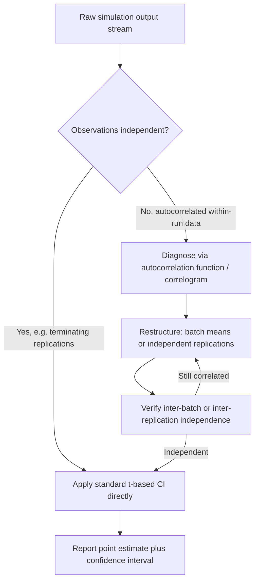

## Statistical Analysis of Simulation Output

### Overview

Statistical analysis of simulation output treats simulation results as sample data drawn from an underlying stochastic process rather than as deterministic facts. Because a stochastic simulation driven by pseudo-random numbers produces different results on every run, a single execution reveals only one realization of the output's underlying probability distribution. This section covers the statistical machinery — point estimation, interval estimation, hypothesis testing, and the special handling required by autocorrelated data — used to draw defensible conclusions from that randomness.

### The Nature of Simulation Output as Random Variables

#### Why a Single Run Is Insufficient

Every output measure produced by a stochastic simulation — average waiting time, throughput, utilization — is itself a random variable, since it is a function of the random numbers consumed during the run. Reporting the value from one run without any measure of variability is analogous to reporting a single sample from a population and treating it as the population mean. The core objective of output analysis is to move from "here is what happened in one run" to "here is a statistically supported estimate of what happens on average, along with a quantified measure of uncertainty around that estimate."

#### Point Estimators and Their Properties

A point estimator is a single value computed from sample data intended to approximate an unknown population parameter, such as using the sample mean $\bar{X}$ to estimate the true expected value $\mu$. Desirable properties of a point estimator include:

- **Unbiasedness** — the expected value of the estimator equals the true parameter, i.e., $E[\hat{\theta}] = \theta$.
- **Consistency** — the estimator converges in probability to the true parameter as sample size increases.
- **Efficiency** — among unbiased estimators, the one with the smallest variance is preferred.

The sample mean is an unbiased and consistent estimator of the population mean under general conditions. The sample variance, when computed with Bessel's correction (dividing by $n-1$ rather than $n$), is an unbiased estimator of the population variance:

$$S^2 = \frac{1}{n-1}\sum_{i=1}^{n} (X_i - \bar{X})^2$$

The $n-1$ divisor corrects for the fact that $\bar{X}$ is itself estimated from the same sample, which would otherwise cause the naive $n$-divisor variance formula to systematically underestimate the true population variance.

### Confidence Intervals

#### Interpretation and Construction

A confidence interval provides a range of plausible values for an unknown parameter along with an associated confidence level, typically expressed as $(1-\alpha)$. A correct interpretation of a 95% confidence interval is that if the interval-construction procedure were repeated across many independent samples, approximately 95% of the resulting intervals would contain the true parameter value — the interval from any single sample either does or does not contain the true value, but the confidence level describes the long-run reliability of the method, not a probability statement about that specific interval.

For independent, approximately normally distributed observations $X_1, \ldots, X_n$ with unknown variance, the standard confidence interval for the mean uses the $t$-distribution:

$$\bar{X} \pm t_{\alpha/2, n-1} \frac{S}{\sqrt{n}}$$

As $n$ grows large, the Central Limit Theorem justifies this construction even when the underlying $X_i$ are not individually normally distributed, since $\bar{X}$ itself approaches normality. For smaller samples from a markedly non-normal or skewed underlying process, this approximation can be unreliable [Inference: the specific sample size at which the approximation becomes acceptable depends on the degree of skewness and kurtosis of the underlying distribution, and no single universal threshold applies].

#### Half-Width and Precision

The half-width of a confidence interval, $h = t_{\alpha/2, n-1} \, S / \sqrt{n}$, quantifies the precision of the estimate. Because $h$ shrinks proportionally to $1/\sqrt{n}, doubling the number of replications does not halve the half-width — it only reduces it by a factor of approximately $1/\sqrt{2}
. Achieving a target half-width $\varepsilon$ typically requires a sequential procedure: run a pilot batch of $n_0$ replications, estimate $S$, then compute a required sample size and add replications iteratively, since the required $t$-value itself depends on the (unknown, growing) final $n$.

#### Relative Precision

Analysts often prefer expressing precision relative to the estimate's magnitude, since an absolute half-width of 2 minutes is very different in meaning for a mean of 5 minutes versus a mean of 500 minutes. The relative precision is defined as:

$$\gamma = \frac{h}{|\bar{X}|}$$

with a common target being $\gamma \leq 0.10$ (i.e., a half-width no more than 10% of the point estimate).

### Independence and Autocorrelation

#### Why Independence Matters

Standard confidence interval formulas assume the underlying observations are statistically independent. When observations are positively autocorrelated — as is typical of consecutive observations within a single long simulation run — treating them as independent causes the sample variance formula to understate the true variance of the estimator, producing confidence intervals that are falsely narrow and overstate the precision of the result. Negative autocorrelation produces the opposite bias, though this is less commonly encountered in raw simulation output.

#### Detecting Autocorrelation

The autocorrelation function (ACF) at lag $k$ measures the correlation between observations separated by $k$ time steps or observations:

$$\rho_k = \frac{\text{Cov}(X_t, X_{t+k})}{\text{Var}(X_t)}$$

A plot of $\rho_k$ against $k$ (a correlogram) is the standard diagnostic tool; a slow decay toward zero indicates substantial serial dependence, while rapid decay toward zero after a small lag suggests observations become effectively independent after that separation.

#### Structural Solutions

Rather than correcting the variance formula analytically, simulation practice generally restructures the data collection to restore independence:

- **Independent replications** — the most straightforward solution; running multiple separate simulation runs, each with a distinct random number stream, guarantees independence between run-level summary statistics by construction.
- **Batching** — within a single long run, grouping consecutive observations into batches large enough that batch means are approximately independent, even though individual observations within a batch are not.

#### Diagram: From Correlated Raw Output to Valid Confidence Interval

### Hypothesis Testing in Simulation Output Analysis

#### Common Test Scenarios

Hypothesis testing formalizes comparisons between simulation results and a benchmark, or between two or more simulated system configurations. Typical scenarios include:

- Testing whether a system's mean performance differs from a target value or historical benchmark (one-sample $t$-test).
- Testing whether two alternative system designs differ in mean performance (two-sample or paired $t$-test).
- Testing whether three or more configurations differ (ANOVA).

#### Paired Comparisons with Common Random Numbers

When two system configurations are simulated using common random numbers (the same underlying random streams applied to both), their outputs become positively correlated, which is desirable in this context because it increases the power of a paired-difference test. Defining $D_i = X_{1i} - X_{2i}$ for each paired replication $i$, a standard paired $t$-test is applied to the differences directly:

$$\bar{D} \pm t_{\alpha/2, n-1} \frac{S_D}{\sqrt{n}}$$

If the resulting confidence interval for $\bar{D}$ excludes zero, this is evidence of a statistically significant difference between the two systems at the chosen confidence level.

#### Type I and Type II Errors in Simulation Context

- **Type I error** — concluding a difference exists between systems (or between the simulation and a benchmark) when none truly does; controlled by the choice of $\alpha$.
- **Type II error** — failing to detect a real difference; its probability, $\beta$, is influenced heavily by the number of replications and the magnitude of the true difference relative to output variability.

Because Type II error risk is often under-addressed in practice, some simulation studies incorporate a power analysis to determine the number of replications needed to detect a practically meaningful difference with adequate probability. [Speculation: the degree to which formal power analysis is routinely performed in applied simulation studies, as opposed to informal replication-count heuristics, likely varies substantially by industry and organizational rigor.]

### Multiple Comparisons and Ranking Procedures

#### The Multiple Comparisons Problem

When comparing more than two system configurations pairwise using individual confidence intervals or hypothesis tests, the overall (family-wise) probability of at least one false positive grows with the number of comparisons performed, even if each individual test uses a nominal $\alpha$ level of 0.05. Correction techniques include:

- **Bonferroni correction** — divides the desired overall $\alpha$ by the number of comparisons, applying a stricter threshold to each individual test.
- **Analysis of Variance (ANOVA)** followed by post-hoc tests (e.g., Tukey's HSD) — tests for any significant difference among all groups first, then localizes which specific pairs differ, controlling the family-wise error rate more efficiently than uncorrected pairwise testing.

#### Ranking and Selection

Ranking and selection procedures are designed specifically for simulation contexts where the goal is to identify the best of $k$ competing system configurations (e.g., the configuration with the lowest mean cost or highest mean throughput), providing a statistical guarantee on the probability of correct selection given a specified indifference-zone parameter. These procedures are particularly relevant in simulation optimization, where dozens or hundreds of candidate configurations may need to be statistically screened down to a smaller competitive set.

### Variance Reduction as a Complement to Output Analysis

Statistical output analysis and variance reduction are closely linked: any technique that reduces the variance of an estimator (common random numbers, antithetic variates, control variates) directly tightens the resulting confidence interval for a fixed number of replications, or equivalently reduces the number of replications needed to hit a target precision. These techniques do not change the validity of the statistical methods described above; they change the underlying variance that those methods are working with.

### Reporting Practices

A statistically complete report of simulation output typically includes, at minimum:

- The point estimate (sample mean or other relevant statistic).
- A confidence interval and its associated confidence level.
- The number of replications or batches used.
- An indication of whether independence assumptions were structurally satisfied (e.g., via replication) or diagnostically checked (e.g., via ACF for batched data).
- For comparative studies, the specific test or procedure used and whether common random numbers were applied.

### Common Pitfalls

- Reporting a single simulation run's result without any confidence interval or variability measure.
- Applying independent-sample confidence interval formulas directly to autocorrelated within-run data.
- Misinterpreting a 95% confidence interval as "a 95% probability the true value lies in this specific interval."
- Performing many pairwise comparisons across several system configurations without correcting for the multiple comparisons problem.
- Confusing statistical significance (a real, detectable difference) with practical significance (a difference large enough to matter for the decision at hand).

### Related Topics

- Input distribution fitting and goodness-of-fit testing
- Variance reduction techniques (common random numbers, antithetic variates, control variates)
- Terminating versus steady-state simulation output analysis
- Simulation optimization and ranking-and-selection procedures
- Design of experiments for simulation studies
- Sequential sampling procedures for target precision