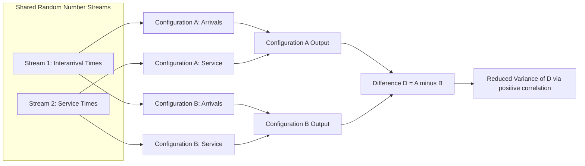

## Variance Reduction Techniques

### Overview

Variance reduction techniques (VRTs) are statistical methods applied during simulation experimentation to reduce the variance of an output estimator without increasing the number of simulation runs. Because the precision of a simulation estimate is governed by the confidence interval half-width $h = t_{\alpha/2, n-1} \, S / \sqrt{n}$, and because $h$ shrinks only proportionally to $1/\sqrt{n}$, brute-force replication is an expensive way to buy precision. VRTs instead exploit structural knowledge of the simulation model — its randomness sources, its relationship to auxiliary variables, or its response shape — to achieve the same precision with fewer replications, or greater precision with the same number.

### Why Variance Reduction Matters

Simulation runs, particularly for complex systems, can be computationally expensive. A technique that reduces estimator variance by a factor of 4 is equivalent, in terms of achieved precision, to running 4 times as many replications without variance reduction. Because computational cost typically scales linearly with the number of replications while precision only improves with the square root of that number, even modest variance reductions can translate into substantial savings in required simulation runtime. This makes VRTs a standard part of the toolkit for large-scale simulation studies, simulation optimization, and rare-event estimation.

### Common Random Numbers (CRN)

#### Mechanism

Common Random Numbers is used when comparing two or more alternative system configurations. Rather than allowing each configuration's simulation to consume independently generated random numbers, CRN synchronizes the random number streams so that corresponding random draws (e.g., the $i$-th customer's service time) are generated using the same underlying uniform random numbers across all configurations being compared.

#### Statistical Rationale

Let $X_1$ and $X_2$ be the output performance measures of two system configurations, and consider the difference $D = X_1 - X_2$. The variance of the difference is:

$$\text{Var}(D) = \text{Var}(X_1) + \text{Var}(X_2) - 2\,\text{Cov}(X_1, X_2)$$

If CRN induces positive correlation between $X_1$ and $X_2$ (which it typically does, since both systems experience similar underlying randomness), the covariance term is positive, directly reducing $\text{Var}(D)$ relative to using independent random streams for each configuration. This makes CRN especially effective for comparative studies where the quantity of interest is the *difference* between systems rather than either system's absolute performance.

#### Synchronization Requirements

CRN is only effective when random numbers are properly synchronized — the same random number stream must be used for the same purpose across configurations (e.g., stream 1 always generates interarrival times, stream 2 always generates service times), and the configurations must consume random numbers in the same order and quantity. When configurations diverge structurally (e.g., one has an additional server that consumes extra random draws), synchronization can break down partway through the run, a phenomenon that can weaken or even reverse the intended variance reduction. [Unverified: the precise conditions under which desynchronization causes the CRN effect to reverse rather than merely diminish depend on the specific structure of the models being compared.]

#### Diagram: CRN Synchronization Across Two System Configurations

### Antithetic Variates

#### Mechanism

Antithetic variates pairs each simulation replication with a complementary "antithetic" replication in which every uniform random number $u$ used in the original run is replaced by $1-u$ in the paired run. Because $1-u$ is also uniformly distributed on $(0,1)$, the antithetic run is an equally valid realization of the simulation, but one that tends to move in the opposite direction from the original whenever the output is a monotonic function of the underlying random numbers.

#### Statistical Rationale

For a pair of runs producing outputs $X$ and $X'$, the averaged estimator $\bar{X} = (X + X')/2$ has variance:

$$\text{Var}(\bar{X}) = \frac{1}{4}\left[\text{Var}(X) + \text{Var}(X') + 2\,\text{Cov}(X, X')\right]$$

If the antithetic pairing induces negative covariance between $X$ and $X'$, the variance of the averaged pair is reduced relative to averaging two independent runs. This effect is strongest when the simulation's output response is monotonic (or close to it) in the driving random numbers; for outputs with more complex, non-monotonic dependence on the random stream, the induced correlation may be weak or even positive, in which case antithetic variates provide little benefit or can occasionally be counterproductive.

#### Practical Considerations

Antithetic variates is comparatively simple to implement, since it requires no auxiliary variable or additional model structure — only a duplicated run with complemented random numbers. It is commonly combined with independent replications, where each "replication" is actually an antithetic pair, and the pair average is treated as a single observation for confidence interval purposes.

### Control Variates

#### Mechanism

Control variates exploits a known relationship between the simulation output of interest, $X$, and an auxiliary variable $Y$ (the "control") whose expected value $E[Y]$ is known analytically. The controlled estimator is constructed as:

$$X_c = X - c(Y - E[Y])$$

where $c$ is a coefficient chosen to minimize variance. Since $E[Y - E[Y]] = 0$, the controlled estimator $X_c$ remains an unbiased estimator of $E[X]$ regardless of the choice of $c$, while its variance depends on $c$ and on the correlation between $X$ and $Y$.

#### Optimal Coefficient

The variance-minimizing choice of $c$ is:

$$c^* = \frac{\text{Cov}(X, Y)}{\text{Var}(Y)}$$

which yields a maximum variance reduction proportional to the squared correlation between $X$ and $Y$:

$$\text{Var}(X_{c^*}) = \text{Var}(X)\left(1 - \rho_{XY}^2\right)$$

This shows that the effectiveness of control variates scales directly with how strongly correlated the auxiliary variable is with the output of interest — a control variate with $\rho_{XY} = 0.9$ can reduce variance by roughly 81%, while a weakly correlated control provides negligible benefit.

#### Selecting a Control Variate

A good control variate is a quantity that is:

- Computable during the same simulation run as the output of interest, at negligible extra cost.
- Strongly correlated with the output of interest.
- Analytically tractable enough that its true expected value $E[Y]$ is known in closed form (e.g., the known mean of an input distribution, when the output is closely tied to that input's realized sample mean).

### Stratified Sampling

#### Mechanism

Stratified sampling divides the sample space of an input random variable into distinct, non-overlapping strata and ensures that samples are drawn from each stratum in proportion to its probability weight, rather than relying on pure random sampling to achieve representative coverage by chance. This reduces variance by eliminating the sampling variability associated with over- or under-representing any particular stratum.

#### Application in Simulation

In a simulation context, stratified sampling is most naturally applied to input variate generation: rather than generating $n$ independent uniform random numbers to drive $n$ replications, the $(0,1)$ interval is divided into $n$ equal sub-intervals, and one random number is drawn from within each sub-interval. This guarantees even coverage of the input space across replications, which can meaningfully reduce output variance when the response function varies smoothly across that space.

### Importance Sampling

#### Mechanism

Importance sampling is primarily used for rare-event simulation, where the event or output of interest occurs with very low probability under the natural, unmodified simulation dynamics (e.g., system failure, extreme queue overflow). Direct simulation of such events requires an impractically large number of replications to observe enough occurrences for reliable estimation. Importance sampling addresses this by simulating under a modified probability distribution that artificially increases the frequency of the rare event, then correcting the resulting estimates using likelihood-ratio weights to remove the bias introduced by the distributional change.

#### Statistical Correction

If the original distribution has density $f(x)$ and the simulation is instead run under an alternative density $g(x)$ (chosen so the rare event occurs more frequently), the estimator for $E_f[h(X)]$ is corrected as:

$$\hat{\theta} = \frac{1}{n}\sum_{i=1}^{n} h(X_i)\frac{f(X_i)}{g(X_i)}$$

where $X_i$ are sampled from $g$ and the ratio $f(X_i)/g(X_i)$ is the likelihood ratio (or Radon-Nikodym derivative) correcting for the change of measure. Choosing $g$ well is critical: a poorly chosen alternative distribution can actually increase estimator variance relative to direct simulation, since the likelihood-ratio weights themselves introduce variability. [Inference: the practical difficulty of selecting a near-optimal alternative distribution is a major reason importance sampling is considered one of the more advanced VRTs, generally requiring problem-specific analysis rather than a generic recipe.]

### Comparing and Combining Techniques

| Technique | Best Suited For | Key Requirement |
| --- | --- | --- |
| Common Random Numbers | Comparing alternative system configurations | Proper synchronization of random streams |
| Antithetic Variates | General-purpose variance reduction, single-system estimation | Monotonic response to random numbers |
| Control Variates | Estimation with a known, correlated auxiliary quantity | An analytically tractable control with known mean |
| Stratified Sampling | Ensuring even input-space coverage | A well-defined, partitionable sample space |
| Importance Sampling | Rare-event probability estimation | A carefully chosen alternative sampling distribution |

These techniques are not mutually exclusive; CRN, for example, is commonly combined with antithetic variates or control variates in the same study, since CRN addresses variance in cross-configuration comparisons while the other techniques address variance in each configuration's individual estimate. [Inference: the combined variance-reduction effect of stacking multiple techniques is not generally additive and depends on the specific covariance structure induced, so combined effectiveness is typically assessed empirically rather than predicted analytically.]

### Common Pitfalls

- Applying antithetic variates to a simulation whose output is not monotonic in the driving random numbers, yielding negligible or unpredictable variance reduction.
- Failing to properly synchronize random number streams when applying common random numbers, which can weaken or reverse the intended effect.
- Selecting a control variate that is only weakly correlated with the output, providing little practical benefit despite the added implementation complexity.
- Using importance sampling with a poorly chosen alternative distribution, inadvertently increasing rather than decreasing estimator variance.
- Treating variance reduction as a substitute for adequate replication rather than a complement to it — VRTs reduce the *number* of replications needed for a target precision, but do not eliminate the need for a statistically sound number of independent observations.

### Related Topics

- Confidence interval construction and statistical output analysis
- Rare-event simulation and extreme-value estimation
- Simulation optimization and ranking-and-selection procedures
- Random number generation and stream management
- Design of experiments for simulation studies
- Terminating versus steady-state simulation output analysis