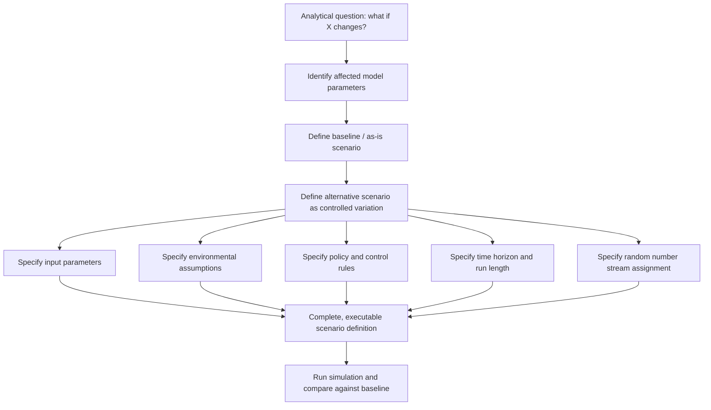

## Scenario Setting

### Overview

Scenario setting is the process of defining the specific set of conditions, assumptions, parameter values, and environmental factors under which a simulation model will be executed to answer a particular question. Where model building establishes the general logical and mathematical structure of a system, scenario setting determines *which version* of the world that structure represents for a given run or set of runs — the demand level, the resource configuration, the policy in effect, the external disturbances present. Well-constructed scenarios are what allow a single simulation model to be reused across many distinct analytical questions rather than rebuilt for each one.

### Purpose of Scenario Setting

#### Bridging the Model and the Question

A simulation model is typically built to be general enough to represent a family of related real-world conditions, but any single run or experiment must instantiate specific values for every parameter the model depends on. Scenario setting is the disciplined process of translating an analytical question — "what happens if demand increases by 20%," "how does the system perform if one server fails," "what if the policy changes from FIFO to priority-based" — into a concrete, executable configuration of the model.

#### Supporting Comparative Analysis

Because simulation is frequently used to compare alternatives rather than to produce a single absolute answer, scenario setting also establishes the baseline against which alternative configurations are measured. A "base case" or "as-is" scenario representing current or expected conditions is typically defined first, with subsequent "what-if" scenarios constructed as controlled variations from that baseline.

### Components of a Scenario

#### Input Parameters

The numeric or categorical values assigned to every stochastic and deterministic input the model consumes, such as arrival rates, service time distribution parameters, resource capacities, and scheduling rule selections. A scenario definition must specify a complete and unambiguous set of these values, since an underspecified scenario leaves room for inconsistent or accidental default behavior.

#### Environmental Assumptions

Conditions external to the core system logic but still relevant to the simulation's behavior, such as operating hours, seasonal demand patterns, regulatory constraints, or external supply availability. These are often held fixed within a scenario but varied *between* scenarios.

#### Policy and Control Rules

The decision logic embedded in the model — dispatch rules, inventory reorder policies, staffing schedules, routing algorithms — which is frequently the primary object of comparison across scenarios in a policy-evaluation study.

#### Time Horizon and Run Length

The simulated time period over which the scenario is evaluated, along with whether the scenario is treated as a terminating simulation (with a defined start and end) or a steady-state simulation (evaluated over a long run after warm-up). Scenario setting must specify this explicitly, since the appropriate output analysis technique depends on it.

#### Random Number Stream Assignment

For controlled comparison across scenarios, particularly when common random numbers are used, scenario setting includes specifying which random number streams are assigned to which stochastic elements, ensuring that cross-scenario comparisons are not confounded by uncontrolled differences in the random numbers consumed.

### Diagram: From Analytical Question to Executable Scenario

### Types of Scenarios

#### Baseline (As-Is) Scenarios

Represents the current or expected operating condition of the real system, used primarily as a reference point and, when a validated model exists, as a check against known historical performance.

#### What-If Scenarios

Explore the consequence of a specific hypothesized change — a demand surge, a capacity reduction, a new policy — while holding other conditions fixed at baseline values, isolating the effect of the changed factor.

#### Stress-Test / Extreme Scenarios

Deliberately push input parameters to boundary or unlikely-but-plausible extremes (e.g., peak demand, multiple simultaneous resource failures) to evaluate system robustness and identify failure modes that would not appear under typical operating conditions.

#### Best-Case / Worst-Case Scenarios

Bound the range of plausible outcomes by setting all uncertain parameters simultaneously to their most favorable or least favorable plausible values, providing a rough envelope of outcome variability, though this approach tends to understate the true range of typical outcomes since it assumes perfect correlation among all uncertain factors moving in the same direction simultaneously.

#### Scenario Sets for Sensitivity Analysis

A structured collection of scenarios in which one or a small number of parameters are varied systematically (e.g., across a grid of values) while others are held fixed, used to characterize how sensitive model output is to each parameter individually.

### Scenario Design Considerations

#### Controlling for Confounding Factors

When comparing scenarios, an analyst must ensure that any observed difference in output is attributable to the intended change and not to an incidental, uncontrolled difference elsewhere in the scenario definition — such as accidentally using a different random seed sequence length, a mismatched warm-up period, or an inconsistent run length between scenarios being compared.

#### Number of Scenarios vs. Depth per Scenario

There is a practical tradeoff between the breadth of scenarios explored and the statistical depth (number of replications) devoted to each one, given finite computational budget. Exploratory studies may favor a larger number of coarsely-replicated scenarios to map the overall response surface, while confirmatory studies supporting a specific decision typically favor fewer scenarios with sufficient replications for statistically defensible conclusions.

#### Realism and Plausibility

Scenarios, particularly stress-test and extreme scenarios, should remain grounded in physically or operationally plausible combinations of conditions; combining multiple independently unlikely extreme values into a single scenario can produce a combined scenario so improbable that its results provide little actionable insight; [Inference: the appropriate threshold of plausibility depends heavily on the decision context — a scenario used for regulatory stress-testing may deliberately include lower-probability combinations than one used for routine operational planning].

#### Documentation and Traceability

Each scenario should be documented with enough detail — the complete parameter set, the rationale for the choices made, and the analytical question it addresses — that the scenario can be reproduced exactly and its results correctly attributed to the intended comparison, particularly in multi-analyst or multi-session studies where scenario definitions might otherwise drift or be inconsistently recorded.

### Relationship to Design of Experiments

For studies involving more than a handful of scenarios or more than one or two varied factors, ad hoc scenario definition becomes inefficient and prone to gaps in coverage. Formal design of experiments (DOE) techniques — factorial designs, fractional factorial designs, response surface methodology — provide structured approaches to selecting which combinations of factor levels to simulate, allowing the analyst to characterize main effects and interactions between factors with fewer total scenario runs than an exhaustive combination of all factor levels would require.

### Common Pitfalls

- Defining a "what-if" scenario that inadvertently changes more than the single intended factor, confounding the comparison with the baseline.
- Omitting explicit specification of run length, warm-up period, or random number stream assignment, leading to inconsistent treatment across scenarios that undermines comparability.
- Constructing best-case or worst-case scenarios by combining every favorable or unfavorable parameter value simultaneously, producing an unrealistically extreme envelope.
- Exploring too many scenarios shallowly, leaving each with too few replications to support statistically valid conclusions about the differences observed.
- Failing to document scenario rationale and parameter sets, making later reproduction or audit of results difficult.

### Related Topics

- Design of experiments for simulation (factorial and fractional factorial designs)
- Sensitivity analysis techniques
- Statistical analysis of simulation output and comparison of alternative systems
- Common random numbers and synchronized comparison across scenarios
- Simulation optimization
- Model validation against baseline/as-is scenario results