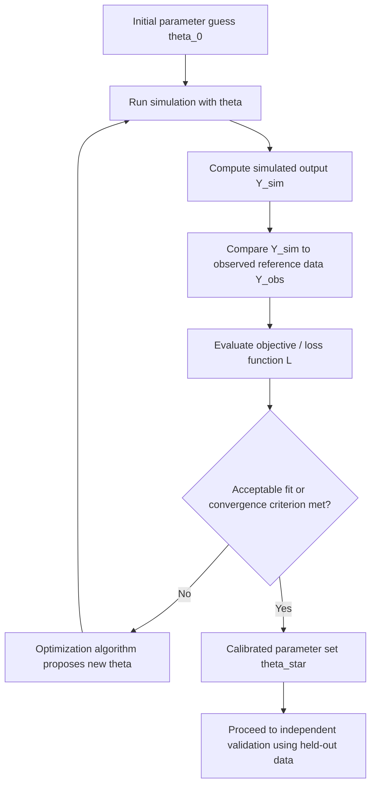

## Model Calibration Methods

### Overview

Model calibration is the process of adjusting a simulation model's unknown or uncertain parameters so that the model's output matches observed real-system behavior as closely as possible. Where model validation asks "does this model adequately represent reality," calibration is the mechanical and statistical process that helps get it there — it is often the practical activity performed in pursuit of validation, tuning parameters that cannot be directly measured or are only approximately known until the model's behavior aligns acceptably with reference data.

### Calibration vs. Validation vs. Verification

Calibration, verification, and validation are related but distinct activities that are frequently confused. Verification checks that the model is built correctly according to its specification (an internal consistency check). Validation checks that the model's specification and behavior adequately represent the real system for its intended purpose (an external correctness check). Calibration is the parameter-tuning process that adjusts a structurally verified model to better match reality — it presumes the model's logical structure is already correct and focuses purely on finding parameter values that minimize the discrepancy between simulated and observed output. A model can be successfully calibrated to match historical data and still fail validation, if its underlying structure is wrong in ways that calibration cannot fix (a phenomenon sometimes discussed under the heading of overfitting).

### When Calibration Is Necessary

Calibration is typically needed when one or more model parameters cannot be directly measured or observed in the real system, cannot be reliably estimated from available data through standard input analysis, or are theoretically defined but only approximately known (e.g., a friction coefficient, a behavioral response elasticity, an unobserved failure rate). In these cases, rather than fitting the parameter directly to isolated measurements, the analyst instead adjusts it so that the *overall model output* matches observed system-level behavior.

### Manual (Trial-and-Error) Calibration

#### Mechanism

The simplest calibration approach involves an analyst iteratively adjusting parameter values by hand, rerunning the simulation, and visually or numerically comparing output against reference data, repeating until an acceptable match is achieved. This approach leverages domain expertise and can incorporate qualitative judgment about which discrepancies matter most, but scales poorly with the number of parameters being calibrated and does not guarantee convergence to an optimal or even a good parameter set.

#### When Appropriate

Manual calibration remains practical for models with a small number of parameters (roughly one to three) where the analyst has strong intuition about the direction and approximate magnitude of each parameter's effect on output, or as an initial exploratory step before applying a more formal method.

### Formal Optimization-Based Calibration

#### General Framework

Formal calibration treats the problem as a mathematical optimization: find the parameter vector $\theta$ that minimizes some objective function $L(\theta)$ measuring the discrepancy between simulated output $Y_{sim}(\theta)$ and observed reference data $Y_{obs}$:

$$\theta^* = \arg\min_{\theta} \, L\big(Y_{sim}(\theta), Y_{obs}\big)$$

#### Objective Function (Loss Function) Choices

The choice of $L$ determines what "good calibration" means numerically. Common choices include:

- **Sum of Squared Errors (SSE)** — $L = \sum_i (Y_{sim,i} - Y_{obs,i})^2$, penalizing larger discrepancies disproportionately and yielding an objective closely related to least-squares estimation.
- **Mean Absolute Error (MAE)** — $L = \frac{1}{n}\sum_i |Y_{sim,i} - Y_{obs,i}|$, more robust to outlier discrepancies than SSE since it does not square the error term.
- **Weighted objectives** — assign different weights to different output measures or time periods when some aspects of the match matter more than others for the model's intended purpose.
- **Likelihood-based objectives** — when the stochastic structure of the discrepancy is well understood, maximum likelihood estimation can be applied to select parameters that make the observed data most probable under the model.

#### Optimization Algorithms

Because simulation output is generally a "black box" function of its parameters — expensive to evaluate and without an analytical gradient — calibration relies on optimization methods suited to this setting:

- **Grid search** — evaluates the objective function at a predefined grid of parameter combinations; simple and embarrassingly parallel, but scales exponentially poorly with the number of parameters (the curse of dimensionality).
- **Response surface methodology** — fits an approximate, computationally cheap statistical model (often a low-order polynomial) to a limited set of simulation runs, then optimizes over the fitted surface rather than the expensive simulation directly.
- **Metamodeling / surrogate-based optimization** — builds a more flexible statistical or machine-learning approximation (e.g., Kriging/Gaussian process models, neural networks) of the simulation's input-output relationship, using it to guide the search toward promising parameter regions with far fewer actual simulation evaluations than direct optimization would require.
- **Gradient-free heuristic methods** — including genetic algorithms, simulated annealing, and particle swarm optimization, which do not require gradient information and can handle non-smooth or multi-modal objective landscapes, at the cost of requiring many simulation evaluations and offering no guarantee of finding the global optimum.
- **Simultaneous Perturbation Stochastic Approximation (SPSA)** — an efficient gradient-approximation technique particularly suited to stochastic simulation objectives, requiring only two simulation evaluations per iteration regardless of the number of parameters being calibrated.

#### Diagram: Optimization-Based Calibration Loop

### Bayesian Calibration

#### Mechanism

Bayesian calibration treats unknown parameters as random variables with a prior probability distribution reflecting initial uncertainty or expert belief, then updates this distribution using observed data via Bayes' theorem to produce a posterior distribution over the parameters:

$$p(\theta \mid Y_{obs}) \propto p(Y_{obs} \mid \theta) \, p(\theta)$$

#### Advantages Over Point-Estimate Calibration

Rather than producing a single "best" parameter value, Bayesian calibration produces a full posterior distribution, which naturally quantifies calibration uncertainty and can be propagated forward into simulation output uncertainty. This is particularly valuable when calibration data is sparse, since the posterior will appropriately remain wide (uncertain) rather than falsely reporting a single confident value derived from insufficient data.

#### Computational Considerations

Because the likelihood $p(Y_{obs} \mid \theta)$ typically requires running the simulation, and because closed-form posteriors are rarely available for complex simulation models, Bayesian calibration generally relies on computational sampling methods such as Markov Chain Monte Carlo (MCMC), which can be computationally intensive when each likelihood evaluation requires a full simulation run. Surrogate models are frequently used to approximate the simulation response and make MCMC sampling computationally feasible.

### Calibration Data Requirements

#### Reference Data Quality

Calibration is only as reliable as the reference data used to drive it; the observed data should be accurate, cover a representative range of operating conditions (not just a single narrow regime), and, where possible, cover conditions similar to those under which the calibrated model will subsequently be used, since extrapolating a calibration fit far beyond the conditions represented in the reference data introduces additional uncertainty. [Inference: the degree of risk from extrapolation depends on how nonlinear the model's parameter-to-output relationship is in the extrapolated region, which is generally not known with confidence prior to independent validation testing.]

#### Data Splitting: Calibration vs. Validation Sets

To avoid the overfitting problem described above, it is standard practice to reserve a portion of available reference data exclusively for validation, withheld entirely from the calibration process, so that the final validation check provides an assessment of the model's genuine predictive adequacy rather than merely confirming that calibration succeeded on the same data used to perform it.

### Identifiability and Parameter Interaction

#### The Identifiability Problem

A parameter is said to be non-identifiable, or weakly identifiable, if multiple different combinations of parameter values produce nearly indistinguishable simulation output given the available reference data — in such cases, calibration may converge to a numerically acceptable fit while the individual parameter estimates within it remain highly uncertain or arbitrary, since the optimization or Bayesian procedure cannot statistically distinguish between the competing combinations. Identifiability issues are common when calibrating multiple correlated parameters simultaneously against a limited set of aggregate output measures.

#### Sensitivity Analysis as a Precursor

Performing a sensitivity analysis prior to calibration — determining which parameters actually have a meaningful effect on the output measures being matched — helps focus calibration effort on identifiable, influential parameters and avoid wasting computational effort attempting to precisely calibrate parameters the model output is largely insensitive to.

### Common Pitfalls

- Calibrating a model with a structural flaw and mistaking a good numerical fit for evidence that the model's underlying logic is correct.
- Using the same data for both calibration and validation, producing an overly optimistic assessment of model adequacy.
- Attempting to calibrate too many parameters simultaneously against too few output measures, resulting in non-identifiable or unstable parameter estimates.
- Relying on manual trial-and-error calibration for high-dimensional parameter spaces where formal optimization would be far more efficient and reliable.
- Applying a calibrated model to operating conditions well outside the range represented in the calibration data without additional validation.

### Related Topics

- Model verification and validation techniques
- Sensitivity analysis for simulation models
- Metamodeling and surrogate-based optimization
- Design of experiments for simulation
- Statistical analysis of simulation output
- Uncertainty quantification in simulation