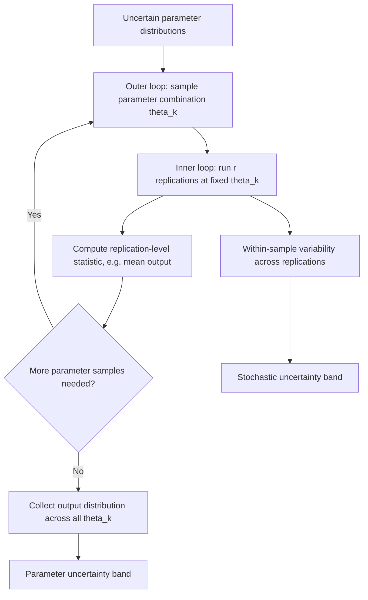
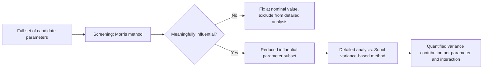

## Sensitivity and Uncertainty Analysis

### Overview

Sensitivity analysis and uncertainty analysis are complementary techniques used to characterize how variability or imprecision in a simulation model's inputs and parameters translates into variability in its outputs. Uncertainty analysis asks "how much does the output vary given what we don't know about the inputs," producing a quantified range or distribution of plausible outcomes. Sensitivity analysis asks "which inputs matter most in driving that output variability," identifying where modeling effort, data collection, or calibration attention would be most productively spent. The two are frequently performed together, since characterizing output uncertainty and attributing its sources are naturally sequential steps in the same investigation.

### Sources of Uncertainty in Simulation Models

#### Parameter Uncertainty

Arises when model parameters — distribution parameters, rates, capacities, coefficients — are estimated from limited data, expert judgment, or calibration, and therefore carry their own estimation uncertainty rather than being known exactly.

#### Structural (Model) Uncertainty

Arises from simplifications, assumptions, or approximations embedded in the model's logical structure itself, independent of any specific parameter value — for instance, assuming a queueing discipline is strictly FIFO when the real system has occasional deviations, or omitting a secondary effect judged negligible during model scoping.

#### Stochastic (Aleatory) Uncertainty

The inherent randomness in the system being modeled, represented in the simulation through random number generation and captured by the statistical output analysis techniques (replication, confidence intervals) used to characterize simulation output variability. This form of uncertainty is irreducible in principle — it does not shrink no matter how well parameters are estimated, only the *precision of the estimate of the output distribution* improves with more replications.

#### Scenario / Assumption Uncertainty

Arises from uncertainty about future conditions or exogenous factors outside the direct control of the model — future demand levels, regulatory changes, external market conditions — often addressed through scenario setting and structured "what-if" exploration rather than through statistical uncertainty quantification alone.

### Uncertainty Analysis

#### Purpose

Uncertainty analysis propagates the uncertainty in model inputs and parameters through to the model's output, producing a distribution, range, or interval that characterizes how much the output could plausibly vary given everything that is uncertain about the inputs. This differs from stochastic output variability captured by replication alone, since it specifically addresses variability in *parameter values themselves*, not just the randomness generated by a fixed set of parameters.

#### Monte Carlo Uncertainty Propagation

The most common approach treats each uncertain input parameter as a random variable with an assigned probability distribution (often derived from the parameter estimation's own confidence interval or from expert-elicited ranges), then repeatedly samples parameter combinations from these distributions, running the full simulation once per sampled combination. The resulting collection of output values approximates the output's uncertainty distribution.

$$\hat{F}_Y(y) = \frac{1}{N}\sum_{k=1}^{N} \mathbb{1}\{Y_k \leq y\}$$

where $Y_k$ is the simulation output from the $k$-th sampled parameter combination, and $\hat{F}_Y$ is the empirical estimate of the output's cumulative distribution function.

#### Nested (Two-Level) Simulation

Because each sampled parameter combination itself drives a stochastic simulation, a fully rigorous propagation nests stochastic replication *within* each parameter sample — running multiple replications at each sampled parameter set to separate parameter uncertainty (variability across the outer loop of parameter samples) from stochastic uncertainty (variability across the inner loop of replications at fixed parameters). This nested approach is computationally expensive, since the total number of simulation runs required is the product of the number of parameter samples and the number of replications per sample.

#### Diagram: Nested Uncertainty Propagation Structure

#### Presenting Uncertainty Results

Common ways of summarizing uncertainty analysis output include empirical percentile ranges (e.g., a 90% uncertainty interval spanning the 5th to 95th percentile of the sampled output distribution), tornado-style summaries of output range attributable to each parameter, and full histogram or density visualizations of the output distribution.

### Sensitivity Analysis

#### Purpose

Sensitivity analysis identifies which input parameters exert the most influence on output variability, informing where calibration effort, data collection investment, or model refinement would most effectively reduce output uncertainty, and separately helping validate that the model's behavior aligns with domain-expert expectations about which factors ought to matter.

#### Local (One-at-a-Time) Sensitivity Analysis

The simplest approach varies one parameter at a time, holding all others fixed at a baseline (nominal) value, and observes the resulting change in output. This can be summarized as a partial derivative or finite-difference sensitivity coefficient:

$$S_i \approx \frac{\partial Y}{\partial \theta_i} \approx \frac{Y(\theta_i + \Delta\theta_i) - Y(\theta_i)}{\Delta\theta_i}$$

Local sensitivity analysis is computationally cheap and easy to interpret, but only characterizes sensitivity in the immediate neighborhood of the chosen baseline point, and does not capture interaction effects between parameters or reveal how sensitivity might change across the broader plausible parameter space.

#### Global Sensitivity Analysis

Global methods vary all uncertain parameters simultaneously across their full plausible ranges, characterizing sensitivity across the entire parameter space rather than a single local point, and are capable of detecting interaction effects between parameters that one-at-a-time methods miss entirely. Common global techniques include:

- **Variance-based (Sobol) methods** — decompose the total output variance into contributions attributable to each individual parameter (first-order effects) and to interactions between parameters (higher-order effects), providing a rigorous, additive attribution of output variance to its sources.
- **Morris screening method** — an efficient, elementary-effects-based screening technique designed to rank parameters by importance using relatively few simulation runs, well suited as a preliminary screening step before committing to more computationally expensive variance-based analysis on a reduced parameter set.
- **Regression-based methods** — fit a statistical (often linear) model relating sampled parameter values to output, using standardized regression coefficients as a sensitivity measure; simple but can be misleading if the true input-output relationship is strongly nonlinear.

#### Screening vs. Detailed Sensitivity Analysis

Given that global sensitivity methods can require a large number of simulation runs, particularly variance-based Sobol analysis, a common practical strategy is a two-stage approach: apply a cheap screening method (such as Morris) first across a large set of candidate parameters to identify the small subset with meaningful influence, then apply a more computationally expensive and statistically rigorous method (such as Sobol) only to that reduced, influential subset.

#### Diagram: Screening-to-Detailed Sensitivity Workflow

### Relationship Between Sensitivity and Uncertainty Analysis

Sensitivity analysis and uncertainty analysis are complementary rather than interchangeable: uncertainty analysis quantifies the *magnitude* of output uncertainty given the assumed input uncertainty, while sensitivity analysis attributes that output uncertainty to its *sources*. In practice, a variance-based sensitivity analysis performed on the same Monte Carlo samples used for uncertainty propagation can serve both purposes simultaneously, since the same sampled runs used to build the output distribution can also be decomposed to attribute variance contributions to individual parameters.

### Applications

#### Guiding Data Collection and Calibration Priorities

Parameters identified as highly influential through sensitivity analysis are natural priorities for further data collection, more careful input analysis, or focused calibration effort, since reducing uncertainty in an influential parameter yields a larger reduction in output uncertainty than doing the same for a parameter the model is relatively insensitive to.

#### Model Simplification

Parameters found to have negligible influence on output, particularly if confirmed across a broad plausible range via global sensitivity analysis, are candidates for being fixed at a nominal value or removed from the model entirely, simplifying the model without materially affecting its fidelity for its intended purpose.

#### Risk Assessment and Robust Decision-Making

Uncertainty analysis output — particularly the width and shape of the output distribution — supports risk-aware decision-making by revealing not just an expected outcome but the range of plausible outcomes and their relative likelihoods, which is often more decision-relevant than a single point estimate, especially when tail outcomes carry disproportionate consequences.

### Common Pitfalls

- Relying solely on local (one-at-a-time) sensitivity analysis when the model exhibits meaningful parameter interactions, missing effects that only appear when multiple parameters vary together.
- Confusing stochastic (aleatory) output variability, addressed through replication, with parameter uncertainty, which requires separate propagation across the range of plausible parameter values.
- Assigning input uncertainty distributions arbitrarily or without justification, producing an output uncertainty characterization that is only as credible as the (often under-scrutinized) input assumptions feeding it.
- Applying computationally expensive variance-based global sensitivity methods to the full, unscreened parameter set when a cheaper screening method would have efficiently narrowed the analysis first.
- Treating a narrow uncertainty interval as evidence of a well-validated model, when it may instead reflect an underestimated range of input uncertainty rather than genuine output precision.

### Related Topics

- Model calibration methods
- Statistical analysis of simulation output
- Design of experiments for simulation
- Metamodeling and surrogate-based optimization
- Risk analysis and decision-making under uncertainty
- Scenario setting for simulation studies