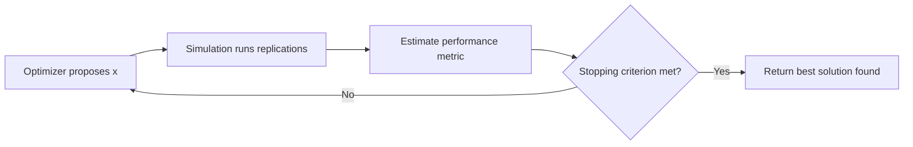

## Optimization

### Definition and Role in Simulation

Optimization is the process of systematically selecting input values for a system — decision variables — to minimize or maximize an objective function, subject to a set of constraints. In modelling and simulation, optimization is the layer that turns a simulation from a passive "what happens if" tool into an active "what should we do" tool: the simulation evaluates the consequences of a candidate decision, and the optimizer searches the decision space for the candidate that performs best.

Formally, a general optimization problem is written as:

$$\min_{x \in \mathcal{X}} \ f(x) \quad \text{subject to} \quad g_i(x) \leq 0, \ h_j(x) = 0$$

where $x$ is the vector of decision variables, $f(x)$ is the objective function, $g_i(x)$ are inequality constraints, and $h_j(x)$ are equality constraints. In simulation-based optimization, $f(x)$ is not a closed-form expression — it is the output of running a simulation model with $x$ as input.

### Why Optimization and Simulation Are Paired

Simulation models are often too complex for closed-form analytical solutions: queuing networks, agent-based systems, discrete-event manufacturing lines, and stochastic financial models rarely reduce to tractable equations. Optimization supplies the search mechanism; simulation supplies the evaluation mechanism. This pairing is necessary whenever:

- The objective function has no closed algebraic form (it can only be *observed* by running the model).
- The system involves stochastic elements, so a single simulation run gives a noisy estimate of performance rather than an exact value.
- The decision space is large, discrete, combinatorial, or nonlinear enough that direct calculus (setting derivatives to zero) does not apply.

### Types of Optimization Problems in Simulation Contexts

**Deterministic vs. Stochastic Optimization**

- *Deterministic optimization* assumes the objective function returns the same value every time for a given input. This holds when the underlying simulation has no randomness, or when randomness is controlled via fixed random number seeds.
- *Stochastic optimization* accounts for the fact that most simulations (especially discrete-event and agent-based ones) are stochastic: running the same input twice yields different outputs due to random number generation. Here, the objective is typically the *expected value* of a performance measure:

$$\min_{x \in \mathcal{X}} \ \mathbb{E}[f(x, \omega)]$$

where $\omega$ represents the random elements of the simulation (arrival processes, service times, demand shocks, etc.).

**Continuous vs. Discrete/Combinatorial Optimization**

- *Continuous optimization* deals with real-valued decision variables (e.g., a reorder threshold, a control gain, a service rate).
- *Discrete/combinatorial optimization* deals with variables from a finite or countable set (e.g., scheduling sequences, facility-location choices, network topology). Combinatorial problems in simulation (like job-shop scheduling) frequently belong to the class of NP-hard problems, meaning exhaustive search is computationally infeasible beyond small instance sizes. [Inference — the specific NP-hardness classification depends on the particular combinatorial formulation; not every discrete simulation-optimization problem is provably NP-hard.]

**Single-Objective vs. Multi-Objective Optimization**

- *Single-objective* optimization has one scalar objective (e.g., minimize cost).
- *Multi-objective* optimization involves several, often conflicting, objectives (e.g., minimize cost while maximizing service level). Since no single solution typically dominates on all objectives simultaneously, the goal shifts to finding the **Pareto frontier** — the set of non-dominated solutions where improving one objective necessarily worsens another.

### The Simulation-Optimization Loop

The general workflow linking an optimizer to a simulation model follows an iterative loop: the optimizer proposes a candidate solution, the simulation evaluates it (possibly across multiple stochastic replications), the resulting performance metric is returned to the optimizer, and the optimizer uses that feedback to propose the next candidate. This continues until a stopping criterion is met (budget exhausted, convergence detected, or target performance achieved).

<svg xmlns="http://www.w3.org/2000/svg" viewBox="0 0 780 340">
<title>Simulation-Optimization Loop (svg_diagram)</title>
\<style\>
.box { fill: #eef3fb; stroke: #33547a; stroke-width: 2; }
.lbl { font-family: sans-serif; font-size: 15px; fill: #17233b; }
.sub { font-family: sans-serif; font-size: 11px; fill: #45566e; }
.edge { stroke: #333; stroke-width: 2; fill: none; marker-end: url(#arrow); }
.etxt { font-family: sans-serif; font-size: 11px; fill: #333; }
\</style\>

<text x="390" y="26" text-anchor="middle" font-family="sans-serif" font-size="17" font-weight="bold" fill="`#17233b`">Simulation-Optimization Loop (svg_diagram)</text>

<rect x="60" y="70" width="200" height="80" rx="10" class="box" />
<text x="160" y="102" text-anchor="middle" class="lbl">Optimizer</text>
<text x="160" y="122" text-anchor="middle" class="sub">proposes candidate x</text>
<rect x="500" y="70" width="200" height="80" rx="10" class="box" />
<text x="600" y="102" text-anchor="middle" class="lbl">Simulation Model</text>
<text x="600" y="122" text-anchor="middle" class="sub">evaluates f(x, ω)</text>
<rect x="280" y="220" width="220" height="80" rx="10" class="box" />
<text x="390" y="252" text-anchor="middle" class="lbl">Performance Metric</text>
<text x="390" y="272" text-anchor="middle" class="sub">e.g. E[f(x)], variance, CI</text>
<path class="edge" d="M260,105 L500,105" />
<text x="380" y="95" text-anchor="middle" class="etxt">candidate x</text>
<path class="edge" d="M600,150 C600,200 500,235 500,240" />
<text x="600" y="185" text-anchor="middle" class="etxt">run replications</text>
<path class="edge" d="M280,255 C150,255 80,200 100,150" />
<text x="140" y="215" text-anchor="middle" class="etxt">feedback to update x</text>
<rect x="60" y="230" width="150" height="50" rx="8" fill="none" stroke="#888" stroke-width="1.5" stroke-dasharray="4,3" />
<text x="135" y="260" text-anchor="middle" class="sub">Stop? converged /</text>
<text x="135" y="272" text-anchor="middle" class="sub">budget exhausted</text>
</svg>

### Core Optimization Methods Used with Simulation

**Gradient-Based Methods**

Applicable when the objective function is (or can be approximated as) differentiable with respect to decision variables. Techniques include gradient descent and Newton-type methods. In stochastic simulation contexts, the true gradient is unobservable, so **stochastic approximation** methods (such as the Robbins-Monro algorithm) estimate gradients from noisy simulation output and update decision variables incrementally:

$$x_{n+1} = x_n - a_n \hat{\nabla} f(x_n)$$

where $a_n$ is a step-size sequence satisfying convergence conditions and $\hat{\nabla} f(x_n)$ is a noisy gradient estimate. Gradient estimation itself can be performed via finite differences, perturbation analysis, or the likelihood ratio/score function method. [Inference — the choice among these gradient-estimation techniques is problem-dependent and involves bias-variance tradeoffs not universally resolved by one method.]

**Response Surface Methodology (RSM)**

RSM fits a low-order polynomial (typically first- or second-order) regression model to simulation outputs observed at a set of designed input points, then uses that fitted surface to locate promising regions of the decision space. It is well-suited to continuous, low-dimensional problems where simulation runs are expensive, since it minimizes the number of simulation evaluations needed to approximate local behavior.

**Metaheuristics**

Metaheuristics are general-purpose search strategies that do not require gradient information and are effective for combinatorial, discontinuous, or highly noisy objective landscapes. Common families include:

- **Genetic Algorithms (GA)** — maintain a population of candidate solutions, applying selection, crossover, and mutation operators inspired by biological evolution.
- **Simulated Annealing (SA)** — probabilistically accepts worse solutions early in the search (analogous to thermal annealing) to escape local optima, gradually reducing acceptance of worse moves as the "temperature" cools.
- **Tabu Search** — maintains a memory structure ("tabu list") of recently visited solutions to prevent cycling and encourage exploration of new regions.
- **Particle Swarm Optimization (PSO)** — models candidate solutions as particles moving through the decision space, influenced by their own best-found position and the swarm's best-found position.

Metaheuristics generally do not guarantee a global optimum but are valued for their robustness to noisy, non-convex, and combinatorial objective landscapes. [Inference — convergence guarantees vary by specific metaheuristic variant and problem class; some have asymptotic convergence proofs under restrictive assumptions.]

**Ranking and Selection (R&S)**

When the decision space is a small, finite set of alternatives (rather than a continuous or combinatorial space), ranking and selection procedures allocate simulation replications across alternatives to identify the best (or a statistically indifferent near-best) one with a specified confidence level, while minimizing total simulation effort. Techniques include the indifference-zone approach and optimal computing budget allocation (OCBA).

**Sample Average Approximation (SAA)**

SAA replaces the expectation in a stochastic optimization problem with a sample average computed from a fixed set of simulated scenarios:

$$\min_{x \in \mathcal{X}} \ \frac{1}{N} \sum_{i=1}^{N} f(x, \omega_i)$$

The resulting deterministic approximation is then solved using standard optimization techniques, and solution quality is assessed as the sample size $N$ grows.

### Handling Stochastic Noise

Because simulation output is often noisy, optimization procedures must distinguish genuine performance differences from random variation. Key techniques include:

- **Replication** — running the simulation multiple times at the same input and averaging results to reduce variance of the performance estimate.
- **Common Random Numbers (CRN)** — using the same underlying random number streams across different candidate solutions to reduce the variance of *differences* between solutions, improving the optimizer's ability to correctly rank candidates.
- **Variance Reduction Techniques** — methods such as antithetic variates and control variates, borrowed from simulation output analysis, are also applied within the optimization loop to sharpen comparisons between candidate solutions with fewer replications.

### Constraint Handling

Real-world simulation-optimization problems are rarely unconstrained. Constraints may be:

- **Deterministic/hard constraints** — known bounds on decision variables (e.g., budget limits, capacity limits) that can be enforced directly on the search space.
- **Stochastic/chance constraints** — constraints that must hold with a specified probability, since simulation outputs are random (e.g., "service level must exceed 95% with at least 90% confidence"). These are typically formulated as:

$$P(g(x, \omega) \leq 0) \geq 1 - \alpha$$

Common constraint-handling strategies include penalty functions (adding a penalty term to the objective for constraint violation), repair mechanisms (modifying infeasible candidates to become feasible), and feasibility-preserving search operators embedded directly in the metaheuristic.

### Multi-Objective Optimization and the Pareto Frontier

When multiple conflicting objectives exist, simulation-optimization typically produces a **Pareto frontier** rather than a single optimal point. A solution $x^*$ is Pareto-optimal if no other feasible solution improves one objective without worsening at least one other. Common approaches include:

- **Weighted-sum scalarization** — combining objectives into a single weighted scalar objective, though this can fail to capture non-convex regions of the Pareto frontier.
- **Evolutionary multi-objective algorithms** (e.g., NSGA-II) — extend genetic algorithms to explicitly maintain and evolve a diverse set of non-dominated solutions.
- **ε-constraint methods** — optimize one objective while converting the others into constraints bounded by threshold values $\varepsilon$.

### Applications

- **Inventory and supply chain management** — optimizing reorder points, order quantities, and safety stock levels evaluated via discrete-event simulation of demand and lead-time uncertainty.
- **Manufacturing and scheduling** — optimizing job sequencing, machine allocation, and buffer sizes in production-line simulations to minimize makespan or maximize throughput.
- **Healthcare operations** — optimizing staffing levels, appointment scheduling, and bed allocation using simulation models of patient flow.
- **Financial engineering** — optimizing portfolio allocations or trading strategies evaluated via Monte Carlo simulation of asset price paths.
- **Transportation and logistics** — optimizing routing, fleet sizing, and network design using traffic or logistics simulation models.

### Key Points

- Simulation-optimization combines a search procedure (the optimizer) with a simulation model that serves as a noisy, expensive-to-evaluate objective function.
- The stochastic nature of most simulations requires techniques (replication, common random numbers, sample average approximation) specifically designed to manage noise in the objective estimate.
- Method choice depends heavily on problem structure: gradient-based and RSM methods suit smooth, continuous, low-dimensional problems; metaheuristics suit combinatorial, non-convex, or highly noisy landscapes; ranking and selection suits small finite alternative sets.
- Constraints in simulation-optimization are often probabilistic (chance constraints) rather than purely deterministic, reflecting the underlying uncertainty of the simulated system.
- Multi-objective problems generally require producing a Pareto frontier rather than a single optimum, since conflicting objectives rarely share a single best solution.

### Related Topics

- Design of Experiments (DOE) for simulation
- Variance reduction techniques (antithetic variates, control variates, importance sampling)
- Metamodeling / surrogate modeling for expensive simulations
- Sensitivity analysis in simulation models
- Monte Carlo methods and random number generation
- Discrete-event simulation fundamentals
- Robust optimization under uncertainty
- Bayesian optimization for expensive black-box functions