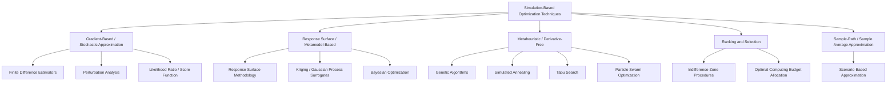

## Simulation-Based Optimization Techniques

### Overview and Distinguishing Characteristics

Simulation-based optimization refers to the family of algorithmic techniques used to find optimal or near-optimal decision variables when the objective function can only be evaluated by running a simulation model, rather than through a closed-form expression. This distinguishes it from classical mathematical programming, where the objective function and constraints are known analytically and derivatives can typically be computed exactly. In simulation-based settings, each function evaluation is:

- **Expensive** — a single simulation run may take seconds to hours of computation.
- **Noisy** — stochastic simulations return different outputs for the same input across replications, so the observed value $\hat{f}(x)$ is an estimate of the true expected performance $\mathbb{E}[f(x,\omega)]$, not the value itself.
- **Opaque** — the internal relationship between input and output is a "black box"; no algebraic gradient is directly available.

These three characteristics — cost, noise, and opacity — are what drive the design choices behind every technique in this category.

### Taxonomy of Techniques

The field can be organized broadly by how much structural information about the objective function each technique assumes or exploits.

### Gradient-Based Techniques for Noisy Objectives

**Stochastic Approximation (SA)**

The foundational technique in this category, originating from the Robbins-Monro algorithm, updates decision variables iteratively using noisy gradient estimates rather than exact ones:

$$x_{n+1} = x_n - a_n \hat{\nabla} f(x_n, \omega_n)$$

Convergence to a local optimum is guaranteed under conditions on the step-size sequence $a_n$, typically requiring $\sum a_n = \infty$ and $\sum a_n^2 < \infty$. A widely used variant, **Simultaneous Perturbation Stochastic Approximation (SPSA)**, estimates the entire gradient vector using only two simulation evaluations per iteration regardless of the dimensionality of $x$, making it attractive for high-dimensional problems where finite-difference gradient estimation would require evaluations proportional to the number of decision variables.

**Gradient Estimation Methods**

When an explicit gradient estimate is needed (rather than a direct stochastic-approximation update), three main families exist:

- **Finite Differences** — perturb each decision variable slightly and re-run the simulation to estimate partial derivatives numerically. Simple to implement but requires $O(d)$ additional simulation runs per iteration for $d$ decision variables, and estimator variance grows as the perturbation size shrinks.
- **Infinitesimal Perturbation Analysis (IPA)** — derives gradient estimates analytically from a single simulation run by tracking how small input perturbations propagate through the system dynamics. Highly efficient when applicable, but requires the simulation's sample path to be sufficiently "smooth" in its dependence on the input parameter; it does not apply cleanly to systems with discontinuous state transitions triggered by the parameter of interest. [Inference — applicability of IPA is model-specific and requires verifying continuity/differentiability conditions on the sample path, which is not automatic for arbitrary discrete-event systems.]
- **Likelihood Ratio / Score Function Method** — reweights simulation outputs by the derivative of the log-likelihood of the sampling distribution, allowing gradient estimation from a single simulation run without requiring smoothness of the sample path. Trades off broader applicability against potentially higher estimator variance.

### Metamodel-Based (Surrogate) Techniques

**Response Surface Methodology (RSM)**

RSM approaches the search sequentially: it runs a small designed experiment (often a factorial or central composite design) in a local region, fits a low-order polynomial regression surface to the simulation outputs, and moves the search region in the direction of steepest ascent/descent indicated by the fitted surface. This process repeats, progressively refining the region until the fitted surface indicates a local optimum (typically confirmed by fitting a second-order model with curvature).

**Kriging and Gaussian Process Surrogates**

For more complex or highly nonlinear response surfaces, Kriging (Gaussian process regression) builds a global surrogate model of the simulation's input-output relationship, providing not only a predicted response value at any untested point but also a quantified prediction uncertainty. This uncertainty estimate is what distinguishes Kriging-based approaches from simple polynomial regression and is the foundation for Bayesian optimization.

**Bayesian Optimization**

Bayesian optimization uses a probabilistic surrogate model (commonly a Gaussian process) together with an **acquisition function** — such as Expected Improvement (EI) or Upper Confidence Bound (UCB) — to decide which point to evaluate next, explicitly balancing exploration (sampling in regions of high uncertainty) against exploitation (sampling near the current best-known point). It is particularly well suited to settings where each simulation run is extremely expensive, since it is designed to find good solutions in relatively few evaluations. [Inference — "few evaluations" is relative to the dimensionality of the decision space; Bayesian optimization's sample efficiency degrades in high-dimensional settings without additional structure such as dimensionality reduction.]

$$\text{EI}(x) = \mathbb{E}\left[\max(f(x^+) - f(x), 0)\right]$$

where $x^+$ denotes the best solution observed so far.

### Metaheuristic (Derivative-Free) Techniques

These techniques treat the simulation strictly as a black box, requiring no gradient or smoothness assumptions, and are the standard choice for combinatorial or highly irregular objective landscapes.

**Genetic Algorithms (GA)**

Maintain a population of candidate solutions encoded as chromosomes. Each generation applies selection (favoring higher-fitness candidates, where fitness is derived from simulated performance), crossover (combining traits of two parent solutions), and mutation (randomly altering traits to preserve diversity). Effective for large, discrete, or mixed combinatorial spaces such as scheduling and layout problems.

**Simulated Annealing (SA)**

Performs a single-point random walk through the solution space, accepting moves that improve the objective unconditionally, and accepting worse moves with a probability that decreases over the search according to a "cooling schedule":

$$P(\text{accept}) = \exp\left(-\frac{\Delta f}{T}\right)$$

where $T$ is the current "temperature" parameter. This mechanism allows the search to escape local optima early on while converging toward a fixed solution as $T \to 0$.

**Tabu Search**

Maintains a short-term memory list of recently visited solutions or moves, forbidding the search from revisiting them for a set number of iterations. This prevents cycling and forces the search into unexplored regions, often combined with aspiration criteria that override the tabu restriction if a forbidden move would yield a new best-known solution.

**Particle Swarm Optimization (PSO)**

Models each candidate solution as a "particle" with a position and velocity in the decision space. Each particle's velocity is updated based on its own historical best position and the swarm's global best position, causing the population to converge collectively toward promising regions:

$$v_{i}^{t+1} = w v_i^t + c_1 r_1 (p_i - x_i^t) + c_2 r_2 (g - x_i^t)$$

where $w$ is inertia weight, $p_i$ is the particle's personal best, and $g$ is the swarm's global best.

### Ranking and Selection Techniques

When the decision space consists of a small, enumerable set of discrete alternatives (rather than a continuous or combinatorial space to search), the problem shifts from "search" to "efficient comparison." Ranking and selection (R&S) techniques allocate a finite simulation budget across alternatives to identify the best one with statistical confidence.

- **Indifference-Zone (IZ) Procedures** — guarantee selection of the true best alternative (or one within a specified indifference-zone tolerance) with at least a pre-specified probability, by sequentially eliminating clearly inferior alternatives as evidence accumulates.
- **Optimal Computing Budget Allocation (OCBA)** — instead of guaranteeing a fixed statistical bound, OCBA allocates a fixed total simulation budget across alternatives to maximize the probability of correctly selecting the best one, concentrating replications on alternatives that are both promising and uncertain.

### Sample-Path Techniques

**Sample Average Approximation (SAA)**

SAA converts the stochastic optimization problem into a deterministic one by fixing a sample of random scenarios $\omega_1, \dots, \omega_N$ (often via common random numbers) and optimizing the resulting sample-average objective:

$$\min_{x} \ \frac{1}{N}\sum_{i=1}^N f(x, \omega_i)$$

Because the resulting problem is deterministic for a fixed sample, it can be solved using standard nonlinear or combinatorial optimization solvers. Solution quality and statistical properties (consistency, convergence rate) are analyzed as $N \to \infty$, and multiple independent SAA replications are often used to construct confidence intervals on the optimality gap.

### Variance Management Techniques (Cross-Cutting)

Because noise directly affects every technique above, several supporting statistical methods are used across all of them:

- **Common Random Numbers (CRN)** — synchronizing the random number streams used across different candidate solutions so that observed performance differences are attributable to the decision variable rather than random noise, sharpening pairwise comparisons.
- **Antithetic Variates** — pairing simulation runs using negatively correlated random number streams to reduce the variance of the averaged output.
- **Control Variates** — adjusting the simulation output estimate using a correlated auxiliary variable with known expected value.

### Comparison of Technique Families

| Technique Family | Assumes Smoothness? | Handles Combinatorial Spaces? | Typical Use Case |
| --- | --- | --- | --- |
| Stochastic Approximation / SPSA | Yes (local) | No | Continuous, differentiable, high-dimensional |
| RSM | Yes (local polynomial) | No | Low-dimensional continuous, expensive runs |
| Kriging / Bayesian Optimization | No (nonparametric) | Limited | Very expensive, few evaluations, moderate dimension |
| Genetic Algorithms | No | Yes | Large discrete/combinatorial |
| Simulated Annealing | No | Yes | Combinatorial, rugged landscape |
| Tabu Search | No | Yes | Combinatorial with cyclic risk |
| Particle Swarm Optimization | No | Limited (continuous-native) | Continuous, multimodal |
| Ranking and Selection | No | N/A (finite set) | Small number of discrete alternatives |
| Sample Average Approximation | Depends on solver used | Yes | Stochastic programs solvable deterministically per sample |

### Selecting a Technique

The choice among these techniques depends on problem structure rather than a universal ranking:

- **Decision space size and type** — a handful of discrete alternatives favors ranking and selection; a large combinatorial space favors metaheuristics; a continuous, moderate-dimension space favors gradient-based or surrogate methods.
- **Simulation cost per run** — very expensive simulations favor Bayesian optimization or RSM, which are designed to minimize the number of evaluations; cheap simulations make metaheuristics and stochastic approximation more practical since they typically require many evaluations.
- **Smoothness of the response surface** — smooth, unimodal responses favor gradient-based and RSM approaches; rugged, multimodal, or discontinuous responses favor metaheuristics.
- **Noise level** — high-variance simulation output generally requires more replications per evaluated point regardless of technique, and increases the value of variance-reduction methods like CRN.

### Key Points

- Simulation-based optimization techniques differ primarily in how much they assume about the smoothness and structure of the underlying (unknown) objective function.
- Gradient-based and stochastic approximation methods are efficient for smooth, continuous, high-dimensional problems but require gradient estimation strategies suited to noisy, black-box evaluations.
- Metamodel-based techniques (RSM, Kriging, Bayesian optimization) are designed to minimize the number of expensive simulation evaluations needed.
- Metaheuristics make no smoothness assumptions and are the standard approach for combinatorial or highly irregular search spaces, at the cost of no global-optimality guarantee.
- Ranking and selection addresses a fundamentally different problem structure: efficiently comparing a small, finite set of alternatives rather than searching a large or continuous space.
- Variance-management techniques such as common random numbers apply across nearly all of these families and materially affect their practical performance.

### Related Topics

- Design of Experiments (DOE) for simulation
- Gaussian process regression and surrogate modeling
- Convergence analysis in stochastic approximation
- Multi-objective simulation optimization and Pareto frontiers
- Discrete-event simulation output analysis
- Robust and chance-constrained optimization under simulation uncertainty
- Parallel and distributed simulation-optimization architectures