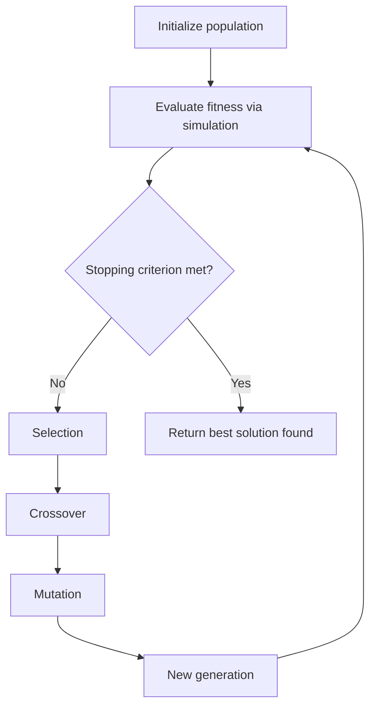

## Metaheuristic Approaches in Simulation Optimization

### Definition and Motivation

Metaheuristics are high-level, general-purpose search strategies designed to find good solutions to optimization problems without requiring gradient information, convexity, or continuity of the objective function. In simulation optimization, where the objective function is the noisy, expensive, black-box output of a simulation model, metaheuristics are often the only practical option when the decision space is combinatorial, discontinuous, or highly multimodal — conditions under which gradient-based and response-surface methods struggle or fail outright.

The defining feature of a metaheuristic is that it guides an underlying heuristic search process using higher-level strategies (memory, population dynamics, probabilistic acceptance rules) to balance two competing goals:

- **Exploration** — sampling broadly across the decision space to avoid premature convergence to a poor local optimum.
- **Exploitation** — concentrating search effort in regions already known to perform well, to refine and improve on good solutions.

No metaheuristic guarantees a global optimum in finite time; the theoretical justification for their use is empirical robustness across a wide range of problem structures rather than formal optimality proofs. [Inference — some metaheuristic variants do have asymptotic convergence proofs under specific, often restrictive, assumptions, but this is not a general property of the class.]

### Why Metaheuristics Suit Simulation Optimization Specifically

Three properties of simulation-based objective functions make metaheuristics particularly well matched to this domain:

1. **Black-box evaluation** — metaheuristics require only the ability to evaluate a candidate solution's objective value (via simulation), not its analytical form or derivatives.
2. **Tolerance for noise** — many metaheuristics (particularly population-based ones) are inherently robust to noisy fitness evaluations because they compare many candidates relative to one another rather than relying on precise absolute values.
3. **Native handling of combinatorial and mixed-variable spaces** — scheduling, routing, and configuration problems common in simulation studies (e.g., job sequencing, facility layout) involve discrete or mixed decision variables that gradient-based methods cannot directly handle.

### Genetic Algorithms (GA)

**Mechanism**

Genetic algorithms maintain a population of candidate solutions, each encoded as a "chromosome" (commonly a bit string, permutation, or real-valued vector). Each generation proceeds through:

- **Evaluation** — each chromosome's fitness is computed by running the simulation with the decoded decision variables.
- **Selection** — chromosomes with higher fitness are more likely to be chosen as parents (common mechanisms include roulette-wheel selection and tournament selection).
- **Crossover** — pairs of parent chromosomes exchange genetic material to produce offspring, combining traits from both.
- **Mutation** — random small changes are applied to offspring to maintain genetic diversity and prevent premature convergence.

**Suitability**

GAs are especially effective for large, discrete, or mixed combinatorial spaces such as scheduling sequences, resource allocation, and network configuration, because the population-based structure naturally explores multiple regions of the search space in parallel, and because fitness comparisons (rather than absolute fitness values) drive selection, which provides some inherent robustness to simulation noise. [Inference — this noise robustness is a general tendency of population-based comparison, not a guarantee; highly noisy fitness evaluations can still mislead selection if replication counts are insufficient.]

### Simulated Annealing (SA)

**Mechanism**

Simulated annealing performs a single-point random walk through the decision space, inspired by the physical process of annealing metals. At each iteration, a neighboring candidate solution is generated and evaluated. If it improves the objective, it is accepted unconditionally. If it worsens the objective, it is accepted probabilistically according to:

$$P(\text{accept}) = \exp\left(-\frac{\Delta f}{T}\right)$$

where $\Delta f$ is the degradation in objective value and $T$ is the current "temperature." The temperature is gradually reduced according to a **cooling schedule** (e.g., geometric cooling $T_{k+1} = \alpha T_k$ with $0 < \alpha < 1), so that the algorithm accepts worse moves more freely early in the search (encouraging exploration) and becomes increasingly greedy as $T \to 0
 (encouraging exploitation and convergence).

**Suitability**

SA is well suited to combinatorial problems with rugged, multimodal landscapes where the risk of premature convergence to a poor local optimum is high, since the probabilistic acceptance of worse moves provides a built-in mechanism for escaping local optima. Its main practical challenge is tuning the cooling schedule: cooling too quickly risks premature convergence, while cooling too slowly wastes simulation budget on excessive exploration. [Inference — the optimal cooling schedule is problem-specific and typically determined empirically rather than analytically for simulation-based applications.]

### Tabu Search

**Mechanism**

Tabu search also performs a single-point (or small neighborhood) search but augments it with an explicit short-term memory structure — the **tabu list** — which records recently visited solutions or recently applied moves and forbids revisiting them for a specified number of iterations (the "tabu tenure"). This prevents the search from cycling back to previously explored regions. An **aspiration criterion** typically allows a tabu move to be accepted anyway if it would produce a new best-known solution overall, overriding the memory restriction.

**Suitability**

Tabu search is particularly effective for combinatorial problems where cycling is a genuine risk — for example, scheduling problems with many structurally similar neighboring solutions. Its performance is sensitive to the size of the tabu list and the definition of the neighborhood structure, both of which are typically problem-specific design choices.

### Particle Swarm Optimization (PSO)

**Mechanism**

PSO models each candidate solution as a "particle" possessing a position and velocity in a continuous decision space. At each iteration, a particle's velocity is updated based on a weighted combination of its own historical best position ($p_i$) and the swarm's global best position ($g$):

$$v_i^{t+1} = w\,v_i^t + c_1 r_1 (p_i - x_i^t) + c_2 r_2 (g - x_i^t)$$

$$x_i^{t+1} = x_i^t + v_i^{t+1}$$

where $w$ is an inertia weight controlling the influence of prior velocity, $c_1$ and $c_2$ are cognitive and social acceleration coefficients, and $r_1, r_2$ are random numbers in $[0,1]$ introducing stochastic variation.

**Suitability**

PSO is native to continuous decision spaces and tends to converge quickly on smooth, moderately multimodal landscapes. It is less naturally suited to purely combinatorial problems, though discrete and binary PSO variants exist to adapt the mechanism to such spaces. [Inference — the effectiveness of discrete/binary PSO variants relative to native combinatorial metaheuristics like GA or tabu search is problem-dependent and not universally superior.]

### Ant Colony Optimization (ACO)

**Mechanism**

ACO is inspired by the foraging behavior of ants depositing pheromone trails. A population of artificial "ants" constructs candidate solutions incrementally (e.g., building a route or schedule step by step), guided probabilistically by pheromone trail strength and problem-specific heuristic information. After each iteration, pheromone trails are updated: trails associated with better solutions are reinforced, while all trails decay over time (evaporation), preventing premature convergence to suboptimal paths.

**Suitability**

ACO is particularly well suited to combinatorial construction problems with a natural graph or path structure, such as routing, network design, and certain scheduling formulations.

### Comparison of Metaheuristic Families

| Metaheuristic | Search Structure | Native Domain | Key Tuning Parameters |
| --- | --- | --- | --- |
| Genetic Algorithm | Population-based | Discrete, combinatorial, mixed | Population size, crossover/mutation rates |
| Simulated Annealing | Single-point | Combinatorial, continuous | Cooling schedule, initial temperature |
| Tabu Search | Single-point with memory | Combinatorial | Tabu tenure, neighborhood definition |
| Particle Swarm Optimization | Population-based | Continuous | Inertia weight, acceleration coefficients |
| Ant Colony Optimization | Population-based, constructive | Combinatorial, graph/path-structured | Pheromone evaporation rate, heuristic weighting |

### Handling Simulation Noise Within Metaheuristics

Because each candidate solution's fitness comes from a stochastic simulation, raw single-run fitness values can misrepresent a solution's true quality. Common adaptations include:

- **Replication-based fitness estimation** — evaluating each candidate across multiple simulation replications and using the sample mean as the fitness estimate, trading additional computational cost for reduced noise.
- **Common Random Numbers (CRN)** — synchronizing random number streams across candidates being compared within a generation (particularly relevant for GA and PSO population comparisons), sharpening relative fitness rankings.
- **Adaptive replication allocation** — allocating more simulation replications to candidates whose fitness estimates are close to the current best (where the risk of misranking is highest), conserving budget on clearly inferior candidates.

### Hybrid and Memetic Approaches

Metaheuristics are frequently hybridized with local search or metamodel-based techniques to combine broad exploration with efficient local refinement:

- **Memetic Algorithms** — combine a population-based metaheuristic (typically GA) with a local search procedure applied to individual candidates, refining solutions within each generation.
- **Surrogate-Assisted Metaheuristics** — use a cheap surrogate model (e.g., Kriging) to pre-screen candidate solutions before committing expensive simulation evaluations, reducing the total number of full simulation runs required.

### Applications in Simulation Optimization

- **Job-shop and flow-shop scheduling** — GA and tabu search applied to minimize makespan or tardiness in discrete-event manufacturing simulations.
- **Vehicle routing and logistics network design** — ACO and GA applied to routing problems evaluated via logistics simulation.
- **Facility layout optimization** — SA and GA applied to minimize material-handling distance in simulated production floor layouts.
- **Parameter tuning of control policies** — PSO applied to continuous control-policy parameters evaluated via simulated system response.
- **Supply chain configuration** — GA and hybrid metaheuristics applied to inventory policy and network design decisions evaluated through supply chain simulation.

### Key Points

- Metaheuristics are the standard choice in simulation optimization when the decision space is combinatorial, discontinuous, or highly multimodal, since they require no gradient or smoothness assumptions.
- Population-based methods (GA, PSO, ACO) explore multiple regions in parallel and offer some inherent robustness to noisy fitness evaluations through relative rather than absolute comparisons.
- Single-point methods (SA, Tabu Search) rely on carefully designed acceptance rules or memory structures to avoid premature convergence or cycling.
- No metaheuristic guarantees global optimality; their justification is empirical robustness across diverse, difficult search landscapes.
- Managing simulation noise (via replication, common random numbers, or adaptive allocation) is a necessary complement to any metaheuristic applied in a simulation context, not an optional add-on.

### Related Topics

- Genetic Algorithm operator design (encoding, crossover, mutation strategies)
- Simulated Annealing cooling schedule design
- Surrogate-assisted and memetic optimization
- Common Random Numbers and variance reduction in simulation comparisons
- Multi-objective metaheuristics (NSGA-II, MOPSO)
- Ranking and selection procedures for finite alternative sets
- Parallel metaheuristic implementations for simulation optimization