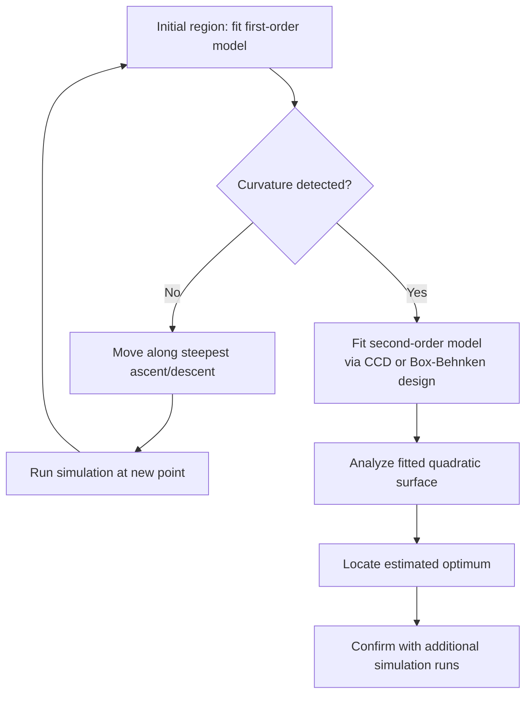

## Response Surface Methodology

### Definition and Purpose

Response Surface Methodology (RSM) is a collection of statistical and mathematical techniques used to model and analyze problems in which a response of interest is influenced by several input variables, with the goal of optimizing that response. In simulation contexts, RSM treats the simulation as an unknown "true" response surface $y = f(x_1, x_2, \ldots, x_k) + \varepsilon$, and uses a sequence of designed experiments and fitted low-order polynomial approximations to locate the region of the input space where the response is optimized, without needing to know the true functional form of $f$.

RSM is fundamentally sequential: rather than attempting to model the entire input space at once, it iteratively explores local regions, fits simple approximating models, and moves the search toward improving regions — a strategy well suited to expensive simulation evaluations where the total number of runs must be kept small.

### The Two-Phase Structure of RSM

RSM classically proceeds through two distinct phases, reflecting the different modeling needs at different distances from the optimum.

**Phase I — First-Order Exploration**

Far from the optimum, the response surface is typically well approximated by a simple linear (first-order) model:

$$\hat{y} = \beta_0 + \sum_{i=1}^k \beta_i x_i$$

This model is fitted using a small, efficient factorial or fractional factorial design (often augmented with center points to test for curvature). If the linear model fits well and no significant curvature is detected, the fitted coefficients indicate a **direction of steepest ascent** (for maximization) or **steepest descent** (for minimization), and the search proceeds by running simulations along that direction until the response stops improving.

**Phase II — Second-Order Refinement**

Once the search reaches a region near the optimum, the response surface typically exhibits curvature that a first-order model cannot capture, and the linear model's lack of fit becomes statistically detectable (commonly via a significant curvature test using center-point replications). At this stage, RSM switches to a second-order (quadratic) model:

$$\hat{y} = \beta_0 + \sum_{i=1}^k \beta_i x_i + \sum_{i=1}^k \beta_{ii} x_i^2 + \sum_{i<j} \beta_{ij} x_i x_j$$

fitted using a design capable of estimating quadratic terms, such as a Central Composite Design (CCD) or Box-Behnken design. This fitted surface is then analyzed directly (via calculus or numerical search on the fitted polynomial, which is cheap to evaluate) to locate the estimated optimum.

### Steepest Ascent/Descent Search

Once Phase I identifies a promising direction from the first-order model's coefficients, the search moves stepwise along that direction, running the simulation at each new point and monitoring the response. Steps continue as long as the response keeps improving; once it stops improving (or begins to degrade), this signals that the linear region has been exited and a new local first-order model should be fitted, or that Phase II second-order modeling should begin. The step size along the steepest ascent direction is typically chosen based on engineering judgment or scaled relative to the design's original factor ranges. [Inference — there is no universally optimal step-size rule; practical implementations often rely on problem-specific tuning or adaptive step-halving when improvement stalls.]

### Design Types Used Within RSM

**First-Order Designs**

- $2^k$ full or fractional factorial designs, often with added center-point replications to test for curvature (a significant difference between the average factorial-point response and the average center-point response indicates the first-order model is inadequate).

**Second-Order Designs**

- **Central Composite Design (CCD)** — combines a factorial (or fractional factorial) design with axial ("star") points extending beyond the factorial region along each factor's axis, plus center points. This structure allows efficient estimation of all quadratic and interaction terms.
- **Box-Behnken Design** — a second-order design that places design points at the midpoints of the edges of the factor space rather than at its corners, avoiding extreme combinations of all factors simultaneously — useful when such combinations are operationally implausible in the simulated system.

### Canonical Analysis of the Fitted Second-Order Model

Once a second-order model is fitted, RSM typically characterizes the nature of the fitted response surface through **canonical analysis**, which transforms the fitted quadratic model into canonical form to classify the stationary point:

$$\hat{y} = \hat{y}_s + \sum_{i=1}^k \lambda_i w_i^2$$

where $\hat{y}_s$ is the predicted response at the stationary point, $w_i$ are transformed (rotated) variables, and $\lambda_i$ are eigenvalues of the matrix of second-order coefficients. The signs and magnitudes of the $\lambda_i$ reveal the nature of the stationary point:

- All $\lambda_i < 0$ — the stationary point is a **maximum**.
- All $\lambda_i > 0$ — the stationary point is a **minimum**.
- Mixed signs — the stationary point is a **saddle point**, and the true optimum (if one exists within the feasible region) lies elsewhere; **ridge analysis** is then used to search along directions of the fitted surface for improving regions.

### Handling Stochastic Noise in Simulation RSM

Because simulation responses are typically stochastic, RSM applied to simulation models requires explicit noise management beyond what is standard in physical-experiment RSM:

- **Replication at each design point** — running multiple independent simulation replications (with different random number seeds) at each design point to obtain a stable estimate of the mean response before fitting the polynomial model.
- **Common Random Numbers (CRN)** — synchronizing random number streams across design points within a single RSM stage, reducing the variance of estimated regression coefficients (particularly effect differences between factorial points) for a given replication budget.
- **Lack-of-fit testing with noise** — the statistical tests used to detect curvature or assess model adequacy (e.g., comparing factorial-point and center-point means) must account for the sampling variance of the simulation output, typically via standard ANOVA-based F-tests adapted to the replicated design.

### Model Adequacy Checking

Before relying on a fitted RSM model to guide the search or report an optimum, its adequacy should be checked using standard regression diagnostics adapted to the simulation context:

- **Coefficient of determination ($R^2$ and adjusted $R^2$)** — indicates how much of the response variability the fitted model explains.
- **Lack-of-fit test** — compares the variability unexplained by the model against the pure error variability estimated from replications, formally testing whether the polynomial model form is adequate.
- **Residual analysis** — checking for patterns in residuals (versus fitted values, versus each factor) that might indicate model misspecification, non-constant variance, or the need for a transformation of the response.

### Relationship to Simulation Optimization More Broadly

RSM occupies a specific niche within the broader landscape of simulation-optimization techniques: it is best suited to problems with a relatively small number of continuous decision variables, a response surface that is reasonably smooth (well-approximated locally by low-order polynomials), and simulation runs expensive enough that minimizing the total number of evaluations is a priority. It is generally less suitable for combinatorial or highly multimodal problems, where metaheuristics are typically preferred, and it can be viewed as a simpler, more interpretable alternative to Kriging-based Bayesian optimization when the underlying response is expected to be well-behaved.

### Practical Considerations and Limitations

- **Locality of validity** — a fitted RSM model, whether first- or second-order, is only a valid local approximation within the region where it was fitted; extrapolation beyond the design region is unreliable.
- **Dimensionality** — as the number of decision variables grows, the number of design points required for second-order designs grows substantially, limiting RSM's practicality to problems with a relatively small number of continuous factors (commonly cited practical guidance suggests effectiveness up to roughly 5–6 factors, though this is not a hard limit). [Inference — the practical dimensionality limit depends on available simulation budget and desired precision, not a fixed universal threshold.]
- **Risk of local optima** — because RSM is a local, sequential search procedure, it can converge to a local rather than global optimum if the true response surface is highly multimodal; multiple starting regions are sometimes used to mitigate this risk.

### Applications in Simulation Studies

- **Queueing system design** — optimizing server counts, buffer sizes, or scheduling parameters to minimize waiting time or maximize throughput.
- **Manufacturing process parameter tuning** — optimizing continuous process settings (speeds, temperatures, timing parameters) evaluated via discrete-event or continuous simulation.
- **Inventory policy optimization** — optimizing continuous reorder-point and order-quantity parameters evaluated through inventory simulation.
- **Control system parameter tuning** — optimizing continuous controller gains evaluated via simulated system response.

### Key Points

- RSM is a sequential, two-phase strategy: first-order models and steepest ascent/descent search locate a promising region, and second-order models characterize and optimize within that region.
- The choice between first- and second-order modeling is driven by statistically detecting curvature, typically via center-point replication comparisons.
- Canonical analysis of the fitted second-order model classifies the stationary point as a maximum, minimum, or saddle point, guiding whether the search is complete or requires ridge analysis.
- Simulation-specific noise management — replication and common random numbers — is essential for obtaining valid RSM model fits from stochastic simulation output.
- RSM is best suited to problems with a small number of continuous decision variables and a reasonably smooth response surface; it is a local method and can converge to local rather than global optima.

### Related Topics

- Design of Experiments for simulation
- Kriging and Bayesian optimization as alternatives to polynomial RSM
- Canonical analysis and ridge analysis of quadratic surfaces
- Common Random Numbers and variance reduction
- Metamodel validation techniques
- Steepest ascent/descent search strategies