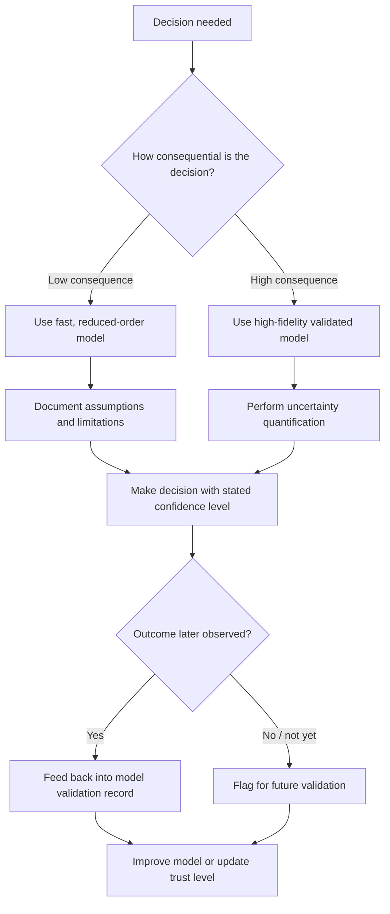

## Implications and Strategies

### Overview

This topic is extremely underspecified as given — "Implications and Strategies" has no stated subject in isolation. Given the established context (continuing from Continuous and System Dynamics Modeling → Simulation of Physical and Engineering Systems), the most reasonable and comprehensive interpretation is: **the implications and strategic considerations that arise from using continuous/system dynamics simulation in physical and engineering system design and decision-making** — i.e., what it means for engineering practice, organizations, and decision-makers once such simulations are adopted, and what strategies follow from those implications. The content below proceeds on that interpretation.

### Why Implications and Strategies Matter

**Key Points**
- A simulation model is not a neutral artifact — its structure, fidelity, and assumptions shape the decisions made from it.
- Adopting simulation-based workflows changes engineering processes, team skill requirements, and risk profiles, not just technical output.
- Strategic missteps (over-trusting a model, under-investing in validation, poor tool selection) can be more costly than technical modeling errors, because they affect many downstream decisions at once.
- Understanding implications early allows organizations to design safeguards (V&V processes, review gates, documentation standards) rather than discovering gaps after failures occur.

### Technical Implications

#### Fidelity vs. Computational Cost Trade-off

Higher-fidelity models (finer meshes, smaller time steps, more coupled physics) generally produce more accurate results but at significantly higher computational cost. This has direct strategic consequences:

- Design-space exploration (many runs, e.g., optimization or Monte Carlo sensitivity studies) favors lower-fidelity, faster models.
- Final design verification favors higher-fidelity models, run fewer times.
- A common strategy is a **fidelity hierarchy**: use cheap reduced-order or lumped models for early screening, then progressively more detailed models (FEM, CFD, multiphysics) for final candidates.

[Inference] The specific point at which added fidelity stops being worth its computational cost is problem-dependent and is typically determined empirically through convergence and sensitivity studies rather than from a fixed rule.

#### Model Risk and Overconfidence

Because simulations produce clean, precise-looking numerical output, there is a persistent risk of **model risk** — treating simulation results as more certain than warranted by the underlying assumptions, simplifications, and unvalidated parameter estimates.

- Strategy: pair every simulation result intended for a design decision with an explicit statement of validated operating range and known limitations.
- Strategy: use uncertainty quantification (parameter sweeps, Monte Carlo, polynomial chaos expansion) rather than single-point deterministic results wherever the decision consequence is significant.

#### Propagation of Errors Across Coupled Systems

In multidomain/co-simulation contexts, errors or unmodeled effects in one subsystem model can propagate and amplify through coupled domains (e.g., an underestimated friction model in a mechanical subsystem skewing a thermal subsystem's heat generation estimate, which then skews a control subsystem's response).

- Strategy: validate subsystem models independently before coupling, and re-validate key coupled behaviors after integration, not just at the subsystem level.

### Organizational and Process Implications

#### Workforce and Skill Requirements

Effective use of simulation shifts required skills from purely analytical/hand-calculation methods toward numerical methods literacy, software tool proficiency, and critical interpretation of computational output.

- Strategy: invest in training on solver behavior (stability, stiffness, convergence) — not just tool operation — so engineers can recognize when a result is a numerical artifact rather than physical behavior.

#### Data and Model Governance

As simulation models become central to design decisions, they become organizational assets requiring lifecycle management: version control, traceability between model versions and design decisions, and reproducibility.

- Strategy: adopt configuration management practices for simulation models similar to those used for source code (versioning, change logs, documented assumptions).
- Strategy: maintain a validation record per model version, so a decision made using "Model v3.2" can later be traced to the validation evidence that justified trusting it at that time.

#### Process Integration

Simulation-driven design implies restructuring the engineering workflow itself — moving verification earlier ("shift-left"), enabling iterative design loops, and supporting virtual commissioning before physical build.

### Strategic Decision Framework

### Strategy Comparison

| Strategy | Primary Benefit | Primary Cost/Risk |
|---|---|---|
| Fidelity hierarchy (screen low-fidelity, verify high-fidelity) | Efficient use of compute resources | Requires maintaining multiple model versions in sync |
| Formal V&V process with documented validation range | Reduces model risk and overconfidence | Adds process overhead and time |
| Uncertainty quantification on all high-consequence decisions | Surfaces confidence bounds, not just point estimates | Computationally expensive; requires statistical expertise |
| Independent subsystem validation before co-simulation | Limits error propagation across coupled domains | Slower integration timeline |
| Model configuration management (versioning, traceability) | Enables auditability and reproducibility | Requires tooling and cultural adoption |
| Early workforce training on numerical methods, not just tools | Improves ability to detect numerical artifacts | Upfront training time/cost |

[Inference] The relative priority among these strategies depends on the domain's risk tolerance (e.g., aerospace/medical devices vs. consumer product design) and organizational maturity; there is no universally optimal ordering.

### Illustration: Fidelity vs. Trust Trade-off

<svg xmlns="http://www.w3.org/2000/svg" viewBox="0 0 800 420">
  <text x="400" y="30" font-size="20" font-weight="bold" text-anchor="middle" fill="#222">Fidelity, Cost, and Decision Confidence (svg_diagram)</text>

  <line x1="80" y1="360" x2="740" y2="360" stroke="#333" stroke-width="2" />
  <line x1="80" y1="360" x2="80" y2="60" stroke="#333" stroke-width="2" />
  <text x="400" y="400" font-size="14" text-anchor="middle" fill="#333">Model Fidelity / Computational Cost →</text>
  <text x="30" y="210" font-size="14" text-anchor="middle" fill="#333" transform="rotate(-90 30 210)">Decision Confidence Needed →</text>

  <path d="M 80 340 C 250 320, 350 200, 740 90" stroke="#2563eb" stroke-width="3" fill="none" />
  <text x="560" y="130" font-size="13" fill="#1e3a8a">Achievable confidence curve</text>

  <rect x="120" y="300" width="150" height="50" rx="8" fill="#dcfce7" stroke="#16a34a" stroke-width="2" />
  <text x="195" y="330" font-size="12" text-anchor="middle" fill="#14532d">Screening /</text>
  <text x="195" y="345" font-size="12" text-anchor="middle" fill="#14532d">exploration</text>

  <rect x="330" y="220" width="150" height="50" rx="8" fill="#fef3c7" stroke="#d97706" stroke-width="2" />
  <text x="405" y="250" font-size="12" text-anchor="middle" fill="#78350f">Design</text>
  <text x="405" y="265" font-size="12" text-anchor="middle" fill="#78350f">refinement</text>

  <rect x="560" y="110" width="160" height="50" rx="8" fill="#fee2e2" stroke="#dc2626" stroke-width="2" />
  <text x="640" y="140" font-size="12" text-anchor="middle" fill="#7f1d1d">Final verification /</text>
  <text x="640" y="155" font-size="12" text-anchor="middle" fill="#7f1d1d">certification</text>
</svg>

### Common Pitfalls in Strategy Execution

- **Applying a single fidelity level to all decisions**, wasting compute on low-stakes questions and under-resourcing high-stakes ones.
- **Treating V&V as a one-time gate** rather than an ongoing process as models evolve and operating conditions change.
- **Siloed subsystem validation** with no re-validation after multidomain coupling, allowing interaction effects to go undetected.
- **No traceability** between the model version used and the decision made, complicating root-cause analysis if a design decision later proves wrong.
- **Underinvesting in interpretive skill**, leaving teams able to run simulations but not to judge when results are numerically suspect.

### Conclusion

The implications of adopting continuous and system dynamics simulation extend well beyond the numerical output of any single run: they reshape how confident an organization can be in a design decision, how errors propagate across coupled subsystems, what skills the workforce needs, and how models must be governed over their lifecycle. The corresponding strategies — fidelity hierarchies, formal V&V with documented validation ranges, uncertainty quantification for high-consequence decisions, independent subsystem validation, model configuration management, and targeted workforce training — are not optional add-ons but the practical mechanisms by which simulation's technical benefits are converted into trustworthy engineering decisions.

### Related Topics

- Model-based systems engineering (MBSE) and simulation governance
- Uncertainty quantification and sensitivity analysis methods
- Verification, Validation, and Accreditation (VV&A) frameworks
- Reduced-order modeling and surrogate modeling
- Digital twin lifecycle management
- Risk-based decision-making in engineering design
- Configuration management for simulation models
- Organizational change management for simulation adoption