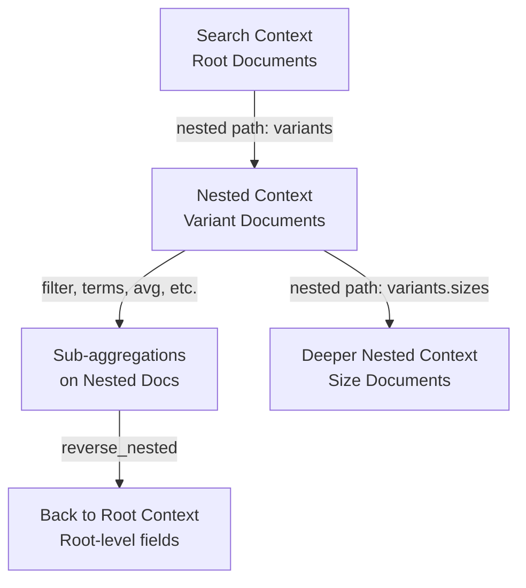

## Nested Aggregation

### Overview

The `nested` aggregation is a special single-bucket aggregation that enables aggregating on fields defined as the `nested` type in the mapping. Without it, aggregations on nested objects produce incorrect results because Elasticsearch flattens nested documents into the root document context by default. The `nested` aggregation corrects this by switching the aggregation context to the nested documents themselves.

---

### Why nested Objects Require Special Handling

In Elasticsearch, a standard `object` field stores its properties in a flat key-value structure at the root document level. When an array of objects is stored this way, relationships between fields within the same object are lost.

**Example — the flattening problem**

Mapping (object type, not nested):

```json
{
  "products": {
    "properties": {
      "variants": {
        "type": "object",
        "properties": {
          "color": { "type": "keyword" },
          "price": { "type": "double" }
        }
      }
    }
  }
}
```

Document:

```json
{
  "name": "Shirt",
  "variants": [
    { "color": "red",  "price": 20.00 },
    { "color": "blue", "price": 35.00 }
  ]
}
```

Internally, Elasticsearch stores this as:

```
variants.color: ["red", "blue"]
variants.price: [20.00, 35.00]
```

The association between `red` and `20.00` is gone. A query for `color=red AND price=35.00` would incorrectly match this document.

**The `nested` type** preserves each array element as a hidden internal document, maintaining field-level relationships. The `nested` aggregation provides the mechanism to aggregate over those internal documents.

---

### Mapping Requirement

The field being aggregated must be mapped as `nested`. This cannot be changed after index creation without reindexing.

```json
PUT /products
{
  "mappings": {
    "properties": {
      "name": { "type": "text" },
      "variants": {
        "type": "nested",
        "properties": {
          "color": { "type": "keyword" },
          "price": { "type": "double" },
          "stock": { "type": "integer" }
        }
      }
    }
  }
}
```

---

### Basic Syntax

```json
GET /products/_search
{
  "size": 0,
  "aggs": {
    "<agg_name>": {
      "nested": {
        "path": "<nested_field_path>"
      },
      "aggs": {
        "<sub_agg_name>": { ... }
      }
    }
  }
}
```

- `path` — the dot-notation path to the nested field. Required.
- Sub-aggregations operate within the nested document context defined by `path`.

---

### Basic Example

Compute the average price across all product variants:

```json
GET /products/_search
{
  "size": 0,
  "aggs": {
    "all_variants": {
      "nested": { "path": "variants" },
      "aggs": {
        "avg_price": { "avg": { "field": "variants.price" } }
      }
    }
  }
}
```

**Output**

```json
{
  "aggregations": {
    "all_variants": {
      "doc_count": 430,
      "avg_price": { "value": 27.85 }
    }
  }
}
```

`doc_count` here reflects the number of nested documents (individual variants), not the number of root documents.

---

### Combining nested with Other Bucket Aggregations

Sub-aggregations inside `nested` can be any valid aggregation type.

**Example — terms aggregation on a nested field**

Count variants by color:

```json
GET /products/_search
{
  "size": 0,
  "aggs": {
    "all_variants": {
      "nested": { "path": "variants" },
      "aggs": {
        "by_color": {
          "terms": { "field": "variants.color" }
        }
      }
    }
  }
}
```

**Output**

```json
{
  "aggregations": {
    "all_variants": {
      "doc_count": 430,
      "by_color": {
        "buckets": [
          { "key": "blue",  "doc_count": 180 },
          { "key": "red",   "doc_count": 145 },
          { "key": "green", "doc_count": 105 }
        ]
      }
    }
  }
}
```

---

### Filtering Within nested Context

To scope the nested aggregation to a subset of nested documents, use a `filter` aggregation inside the `nested` aggregation.

**Example — average price of red variants only**

```json
GET /products/_search
{
  "size": 0,
  "aggs": {
    "all_variants": {
      "nested": { "path": "variants" },
      "aggs": {
        "red_only": {
          "filter": { "term": { "variants.color": "red" } },
          "aggs": {
            "avg_price": { "avg": { "field": "variants.price" } }
          }
        }
      }
    }
  }
}
```

**Output**

```json
{
  "aggregations": {
    "all_variants": {
      "doc_count": 430,
      "red_only": {
        "doc_count": 145,
        "avg_price": { "value": 22.40 }
      }
    }
  }
}
```

---

### reverse_nested Aggregation

After entering the nested context, you may need to aggregate on fields from the **root (parent) document**. The `reverse_nested` aggregation switches the context back to the root level.

**Syntax**

```json
"aggs": {
  "<name>": {
    "reverse_nested": {},
    "aggs": {
      "<root_level_agg>": { ... }
    }
  }
}
```

An empty `reverse_nested: {}` returns to the top-level root. You can optionally specify a `path` to return to an intermediate nested level when dealing with multi-level nesting.

**Example — count distinct root products per color**

```json
GET /products/_search
{
  "size": 0,
  "aggs": {
    "all_variants": {
      "nested": { "path": "variants" },
      "aggs": {
        "by_color": {
          "terms": { "field": "variants.color" },
          "aggs": {
            "root_products": {
              "reverse_nested": {}
            }
          }
        }
      }
    }
  }
}
```

**Output**

```json
{
  "aggregations": {
    "all_variants": {
      "doc_count": 430,
      "by_color": {
        "buckets": [
          {
            "key": "blue",
            "doc_count": 180,
            "root_products": { "doc_count": 95 }
          },
          {
            "key": "red",
            "doc_count": 145,
            "root_products": { "doc_count": 78 }
          }
        ]
      }
    }
  }
}
```

Here, `doc_count` inside `by_color` counts nested variant documents, while `root_products.doc_count` counts distinct root product documents that have at least one variant of that color.

---

### Multi-level Nesting

Nested types can themselves contain nested fields. Each level requires its own `nested` aggregation.

**Mapping example**

```json
"variants": {
  "type": "nested",
  "properties": {
    "color": { "type": "keyword" },
    "sizes": {
      "type": "nested",
      "properties": {
        "label": { "type": "keyword" },
        "qty":   { "type": "integer" }
      }
    }
  }
}
```

**Aggregation across two nested levels**

```json
GET /products/_search
{
  "size": 0,
  "aggs": {
    "all_variants": {
      "nested": { "path": "variants" },
      "aggs": {
        "all_sizes": {
          "nested": { "path": "variants.sizes" },
          "aggs": {
            "total_qty": { "sum": { "field": "variants.sizes.qty" } }
          }
        }
      }
    }
  }
}
```

Each `nested` step descends one level. Sub-aggregations at each level only see documents at that nesting depth.

---

### Context Summary Diagram



---

### Common Mistakes

| Mistake | Effect | Correction |
|---|---|---|
| Aggregating on a nested field without `nested` agg | Results are computed against root document context; counts and values will be incorrect | Wrap sub-aggregations in a `nested` aggregation |
| Using `object` type instead of `nested` in mapping | Field relationships in arrays are lost | Remap as `nested` and reindex |
| Referencing nested field path incorrectly | Aggregation returns 0 or errors | Match `path` exactly to the mapping field name |
| Forgetting `reverse_nested` when accessing root fields | Elasticsearch returns an error or ignores root fields | Use `reverse_nested: {}` to return to root context |

---

### Performance Considerations

- Each nested document is stored as a separate hidden Lucene document. [Inference] Indexes with large arrays of nested objects may have significantly higher document counts at the Lucene level, which can affect memory usage and query performance. Actual impact depends on index configuration, hardware, and data shape.
- [Inference] Deeply nested or high-cardinality nested fields with many sub-aggregation levels may increase query execution time. Testing with representative data volumes is advisable before deploying to production.
- The `nested` aggregation cannot be cached as aggressively as simpler aggregations at the root level, due to the internal document traversal required. Cache behavior may vary by Elasticsearch version and configuration.

---

### nested Aggregation vs. nested Query

| Aspect | `nested` query | `nested` aggregation |
|---|---|---|
| Purpose | Filter root documents based on nested field conditions | Aggregate over nested documents |
| Output | Matched root documents in hits | Bucket(s) with counts and sub-aggregation results |
| Context shift | Temporary, for matching only | Persistent for the aggregation subtree |
| Used with | `query` DSL | `aggs` DSL |

Both can be combined: a `nested` query in the `query` clause narrows the root documents, while a `nested` aggregation in `aggs` then operates on the nested fields of those matched documents.

---

**Conclusion**

The `nested` aggregation is the required mechanism for correctly aggregating over fields mapped as `nested`. Without it, flattening causes inaccurate counts and metric values. Combined with `filter`, `terms`, and other aggregations inside the nested context, and `reverse_nested` to return to the root level, it provides full flexibility for analyzing structured array data in Elasticsearch.

**Next Steps**
- Explore `nested` queries in the query DSL to filter root documents by nested field conditions
- Use `reverse_nested` with metric aggregations to compute root-level statistics per nested bucket
- Review index mapping design to decide when `nested` is appropriate versus `object` or separate indices