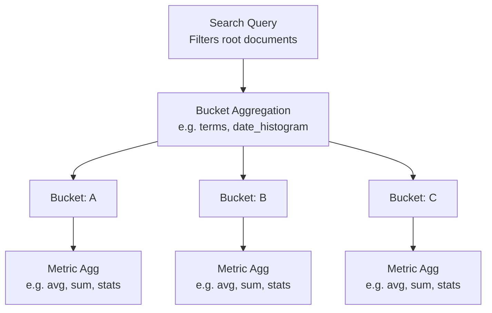

## Metric Aggregations Overview

### What Metric Aggregations Are

Metric aggregations compute **numeric values** from the documents in a bucket or from the full search result set. Unlike bucket aggregations, which group documents, metric aggregations produce a calculated result — a single value or a small set of values — derived from field data.

They are the computational layer in the aggregation framework. They almost always appear as **leaf aggregations**: the last node in an aggregation tree, nested inside a bucket aggregation that defines which documents to compute over.

---

### Single-value vs. Multi-value Metrics

Metric aggregations fall into two categories based on what they return.

| Category | Description | Examples |
|---|---|---|
| **Single-value** | Return exactly one numeric result | `avg`, `sum`, `min`, `max`, `value_count`, `cardinality`, `weighted_avg` |
| **Multi-value** | Return multiple named numeric results | `stats`, `extended_stats`, `percentiles`, `percentile_ranks`, `matrix_stats`, `geo_bounds`, `geo_centroid` |

Single-value metrics can be referenced by pipeline aggregations using their parent aggregation name alone. Multi-value metrics require a dotted path to specify which value to reference (e.g., `stats.avg`).

---

### Where Metric Aggregations Operate

Metric aggregations can appear at two levels:

**1 — Top level (global scope)**

Computes over all documents matching the `query` clause:

```json
GET /orders/_search
{
  "size": 0,
  "aggs": {
    "total_revenue": {
      "sum": { "field": "amount" }
    }
  }
}
```

**2 — Inside a bucket aggregation**

Computes independently within each bucket:

```json
GET /orders/_search
{
  "size": 0,
  "aggs": {
    "by_status": {
      "terms": { "field": "status" },
      "aggs": {
        "avg_amount": {
          "avg": { "field": "amount" }
        }
      }
    }
  }
}
```

Here, `avg_amount` is computed separately for each `status` bucket.

---

### Field Data Sources

Metric aggregations can draw values from several sources.

#### Doc Values (default)

Most numeric and keyword fields store doc values by default. This is the most efficient source for aggregations.

```json
"avg": { "field": "price" }
```

#### Script

A script can compute a value on the fly, either instead of or in addition to a field. [Inference] Scripts are generally slower than doc values because they execute per document. Actual performance depends on script complexity, document count, and cluster resources.

```json
"avg": {
  "script": {
    "source": "doc['price'].value * doc['quantity'].value"
  }
}
```

#### value_script (field + script combined)

Apply a script transformation to an existing field value:

```json
"avg": {
  "field": "price",
  "script": {
    "source": "_value * 1.12"
  }
}
```

`_value` refers to the field value for the current document.

---

### missing Parameter

All metric aggregations support a `missing` parameter. Documents that lack a value for the specified field are normally ignored. Setting `missing` assigns a default value to those documents instead, including them in the computation.

```json
"avg": {
  "field": "rating",
  "missing": 3.0
}
```

Documents with no `rating` field contribute `3.0` to the average rather than being excluded.

---

### Overview of Available Metric Aggregations

The table below summarizes the core metric aggregations. Each will be covered in detail in subsequent topics.

| Aggregation | Type | Description |
|---|---|---|
| `avg` | Single | Arithmetic mean of numeric field values |
| `sum` | Single | Total sum of numeric field values |
| `min` | Single | Minimum value in the field |
| `max` | Single | Maximum value in the field |
| `value_count` | Single | Count of documents with a value for the field |
| `cardinality` | Single | Approximate count of distinct values |
| `weighted_avg` | Single | Mean weighted by a secondary field |
| `stats` | Multi | Computes `min`, `max`, `avg`, `sum`, and `count` in one pass |
| `extended_stats` | Multi | All `stats` values plus variance, std deviation, and bounds |
| `percentiles` | Multi | Values at specified percentile thresholds |
| `percentile_ranks` | Multi | Percentile rank of one or more specified values |
| `median_absolute_deviation` | Single | Robust measure of variability around the median |
| `geo_bounds` | Multi | Bounding box enclosing all geo_point values |
| `geo_centroid` | Multi | Geographic center of all geo_point values |
| `geo_line` | Multi | Ordered line connecting geo_point values |
| `matrix_stats` | Multi | Correlation and covariance across multiple numeric fields |
| `top_hits` | Multi | Returns actual document hits per bucket (hybrid metric) |
| `top_metrics` | Multi | Returns field values from the document with the highest/lowest sort value |
| `scripted_metric` | Multi | Fully custom metric computed via scripts across map/combine/reduce phases |
| `string_stats` | Multi | Statistics on keyword fields: count, entropy, min/max length |
| `boxplot` | Multi | Percentile-based five-number summary for distribution visualization |
| `rate` | Single | Computes a per-interval rate; only valid inside `date_histogram` |
| `inference` | Single | Applies a trained ML model to documents during aggregation |

---

### How Metric Aggregations Compose with Buckets

The typical pattern is a bucket aggregation defining document groups, with one or more metric aggregations computing values per group.



Each metric runs independently per bucket. Results are returned inline within each bucket's response object.

---

### Metric Aggregations and Pipeline Aggregations

Single-value metric aggregations can serve as **input to pipeline aggregations**, which compute over the outputs of other aggregations rather than over raw documents.

**Example — `max_bucket` pipeline reading from `avg` metrics**

```json
GET /orders/_search
{
  "size": 0,
  "aggs": {
    "by_month": {
      "date_histogram": {
        "field": "order_date",
        "calendar_interval": "month"
      },
      "aggs": {
        "monthly_avg": { "avg": { "field": "amount" } }
      }
    },
    "best_month": {
      "max_bucket": {
        "buckets_path": "by_month>monthly_avg"
      }
    }
  }
}
```

`max_bucket` identifies which month had the highest average order amount. The `>` notation traverses from the parent bucket aggregation down to the named metric.

---

### Referencing Multi-value Metrics in Pipelines

When a pipeline aggregation references a multi-value metric, the specific output value must be named explicitly using dot notation.

```json
"buckets_path": "by_month>my_stats.avg"
```

Valid sub-keys depend on the aggregation. For `extended_stats`, examples include `.avg`, `.sum`, `.min`, `.max`, `.std_deviation`.

---

### Null and Empty Bucket Behavior

- If **no documents** in a bucket have a value for the aggregated field, most metric aggregations return `null` for that bucket (except `value_count`, which returns `0`).
- The `missing` parameter can override this behavior by substituting a default.
- [Inference] Pipeline aggregations that reference a bucket with a `null` metric value may skip or produce `null` output for that bucket depending on the pipeline type and its `gap_policy` setting. Behavior may vary by aggregation type and Elasticsearch version.

---

### Accuracy and Approximation

Not all metric aggregations are exact.

| Aggregation | Exact or Approximate |
|---|---|
| `avg`, `sum`, `min`, `max`, `value_count` | Exact |
| `cardinality` | Approximate (HyperLogLog++) |
| `percentiles` (default TDigest) | Approximate |
| `percentile_ranks` | Approximate |
| `median_absolute_deviation` | Approximate |

Where approximation is used, Elasticsearch provides parameters to tune the trade-off between accuracy and memory usage. These are covered in the individual aggregation topics.

---

### General Response Structure

All metric aggregations return their results nested within the aggregation name in the response:

```json
{
  "aggregations": {
    "<agg_name>": {
      "value": 142.5
    }
  }
}
```

Multi-value metrics return named keys instead of a single `value`:

```json
{
  "aggregations": {
    "<agg_name>": {
      "count": 200,
      "min": 5.0,
      "max": 980.0,
      "avg": 142.5,
      "sum": 28500.0
    }
  }
}
```

---

**Conclusion**

Metric aggregations are the computational endpoints of the aggregation framework. They operate on document field values within whatever scope a bucket aggregation defines, and they range from simple arithmetic (`avg`, `sum`) to statistical distributions (`percentiles`, `extended_stats`) and geospatial computations (`geo_bounds`, `geo_centroid`). Understanding their shared behaviors — `missing`, scripting, single vs. multi-value output, and pipeline compatibility — provides the foundation for using each specific aggregation effectively.

**Next Steps**
- Study individual metric aggregations beginning with `avg`, `sum`, `min`, and `max`
- Understand `cardinality` and its approximation trade-offs
- Explore `stats` and `extended_stats` as efficient alternatives to multiple single-value metrics