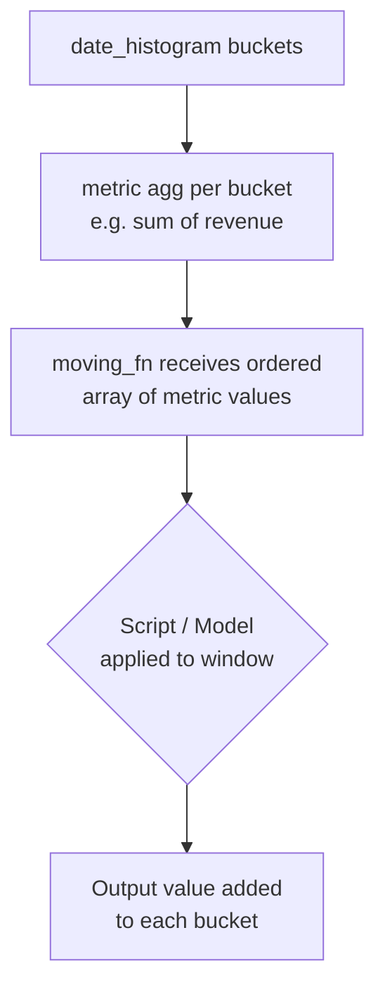

## Aggregations — `moving_avg` and `moving_fn`

---

### Overview

`moving_avg` and `moving_fn` are **pipeline aggregations** in Elasticsearch that operate on the output of other aggregations (typically `date_histogram` buckets) to compute smoothed or custom rolling calculations across a sequence of values.

- `moving_avg` — a legacy aggregation for computing moving averages using predefined models. **Deprecated as of Elasticsearch 6.4.**
- `moving_fn` — the modern replacement, allowing arbitrary rolling window computations via a scripting interface.

---

### `moving_avg` (Deprecated)

#### What It Does

`moving_avg` computes a rolling average over an ordered sequence of buckets. It supports several smoothing models.

> **Note:** This aggregation is deprecated. Elasticsearch documentation recommends migrating to `moving_fn`. Behavior in future versions is not guaranteed.

#### Syntax

```json
"moving_avg": {
  "buckets_path": "<path_to_metric>",
  "window": <int>,
  "model": "<model_name>",
  "settings": { ... },
  "minimize": <bool>,
  "predict": <int>
}
```

#### Parameters

| Parameter | Description | Default |
|---|---|---|
| `buckets_path` | Path to the sibling aggregation value | *(required)* |
| `window` | Number of buckets in the rolling window | `5` |
| `model` | Smoothing model (`simple`, `linear`, `ewma`, `holt`, `holt_winters`) | `simple` |
| `settings` | Model-specific settings (e.g., alpha, beta, gamma) | *(varies)* |
| `minimize` | Whether to minimize model parameters via cost function | `false` |
| `predict` | Number of future buckets to predict | `0` |

#### Models

##### `simple`
Equally weighted average of all values in the window.

$$\text{MA}_t = \frac{1}{n} \sum_{i=0}^{n-1} x_{t-i}$$

##### `linear`
Linearly weighted — more recent values receive higher weight.

##### `ewma` (Exponentially Weighted Moving Average)
Single exponential smoothing. Controlled by `alpha` (0–1). Higher alpha = more weight on recent data.

```json
"model": "ewma",
"settings": { "alpha": 0.3 }
```

##### `holt`
Double exponential smoothing. Adds `beta` for trend tracking.

```json
"model": "holt",
"settings": { "alpha": 0.5, "beta": 0.3 }
```

##### `holt_winters`
Triple exponential smoothing. Adds `gamma` and `period` for seasonality.

```json
"model": "holt_winters",
"settings": {
  "alpha": 0.5,
  "beta": 0.3,
  "gamma": 0.3,
  "period": 7,
  "type": "add"
}
```

`type` can be `add` (additive) or `mult` (multiplicative).

#### Example — `simple` Moving Average

```json
GET /sales/_search
{
  "size": 0,
  "aggs": {
    "sales_over_time": {
      "date_histogram": {
        "field": "date",
        "calendar_interval": "day"
      },
      "aggs": {
        "daily_revenue": {
          "sum": { "field": "revenue" }
        },
        "revenue_moving_avg": {
          "moving_avg": {
            "buckets_path": "daily_revenue",
            "window": 7,
            "model": "simple"
          }
        }
      }
    }
  }
}
```

**Output** *(abbreviated)*:
```json
"buckets": [
  { "key_as_string": "2024-01-01", "daily_revenue": { "value": 1200 }, "revenue_moving_avg": { "value": null } },
  { "key_as_string": "2024-01-07", "daily_revenue": { "value": 1500 }, "revenue_moving_avg": { "value": 1350.0 } }
]
```

> [Inference] Early buckets with insufficient history to fill the window return `null`. Actual behavior may vary depending on Elasticsearch version.

---

### `moving_fn`

#### What It Does

`moving_fn` applies a **custom script** to a sliding window of bucket values. It replaces `moving_avg` with full scripting flexibility using the `MovingFunctions` helper library.

It requires the parent aggregation to be a `date_histogram` (or similar ordered, fixed-interval bucket aggregation).

#### Syntax

```json
"moving_fn": {
  "buckets_path": "<path_to_metric>",
  "window": <int>,
  "script": "<painless_script>",
  "shift": <int>,
  "gap_policy": "skip" | "insert_zeros" | "keep_values"
}
```

#### Parameters

| Parameter | Description | Default |
|---|---|---|
| `buckets_path` | Path to the sibling aggregation value | *(required)* |
| `window` | Number of buckets passed to the script | *(required)* |
| `script` | Painless script applied to the window array | *(required)* |
| `shift` | Shifts the window position relative to current bucket | `0` |
| `gap_policy` | How to handle missing/empty buckets | `skip` |

#### The `MovingFunctions` Library

Elasticsearch provides built-in static methods for use inside `moving_fn` scripts:

| Method | Description |
|---|---|
| `MovingFunctions.unweightedAvg(values)` | Simple moving average |
| `MovingFunctions.linearWeightedAvg(values)` | Linear weighted average |
| `MovingFunctions.ewma(values, alpha)` | Exponentially weighted MA |
| `MovingFunctions.holt(values, alpha, beta)` | Holt double exp smoothing |
| `MovingFunctions.holtWinters(values, alpha, beta, gamma, period, multiplicative)` | Holt-Winters |
| `MovingFunctions.max(values)` | Rolling maximum |
| `MovingFunctions.min(values)` | Rolling minimum |
| `MovingFunctions.sum(values)` | Rolling sum |
| `MovingFunctions.stdDev(values, avg)` | Standard deviation |

> These methods are available in Painless scripts within `moving_fn`. Behavior and availability may vary across Elasticsearch versions — verify against your deployment's documentation.

---

#### Example — Simple Moving Average via `moving_fn`

```json
GET /sales/_search
{
  "size": 0,
  "aggs": {
    "sales_over_time": {
      "date_histogram": {
        "field": "date",
        "calendar_interval": "day"
      },
      "aggs": {
        "daily_revenue": {
          "sum": { "field": "revenue" }
        },
        "revenue_moving_fn": {
          "moving_fn": {
            "buckets_path": "daily_revenue",
            "window": 7,
            "script": "MovingFunctions.unweightedAvg(values)"
          }
        }
      }
    }
  }
}
```

---

#### Example — Rolling Maximum

```json
"rolling_max": {
  "moving_fn": {
    "buckets_path": "daily_revenue",
    "window": 7,
    "script": "MovingFunctions.max(values)"
  }
}
```

---

#### Example — Custom Script (Rolling Sum of Squares)

```json
"sum_of_squares": {
  "moving_fn": {
    "buckets_path": "daily_revenue",
    "window": 5,
    "script": """
      double total = 0;
      for (v in values) { total += v * v; }
      return total;
    """
  }
}
```

> [Inference] Custom scripts execute in Painless and have access to the `values` double array. The script must return a numeric value. Behavior depends on Painless sandbox constraints active in your cluster.

---

#### The `shift` Parameter

By default, the window ends at the bucket **preceding** the current one (exclusive of the current bucket). The `shift` parameter adjusts this.

| `shift` value | Window coverage |
|---|---|
| `0` (default) | Window ends at the bucket before current |
| `1` | Window includes the current bucket |
| `-1` | Window ends two buckets before current |

**Example — include current bucket in window:**

```json
"moving_fn": {
  "buckets_path": "daily_revenue",
  "window": 7,
  "shift": 1,
  "script": "MovingFunctions.unweightedAvg(values)"
}
```

> [Inference] The interaction between `shift` and window boundaries can be non-obvious. Testing with known data is advisable before relying on results in production.

---

#### `gap_policy` Behavior

Missing or empty buckets produce gaps in the value series. `gap_policy` controls how these are handled before the script receives the `values` array.

| Value | Behavior |
|---|---|
| `skip` | Missing values are excluded from the array passed to the script |
| `insert_zeros` | Missing values are replaced with `0` |
| `keep_values` | [Inference] Attempts to use the last known value; behavior may vary |

---

### Pipeline Position Requirement

Both `moving_avg` and `moving_fn` are **sibling pipeline aggregations**. They must be placed at the same level as the metric aggregation they reference, inside a parent bucket aggregation that produces an **ordered, fixed-interval** sequence (e.g., `date_histogram`).

```
date_histogram
├── sum (daily_revenue)        ← metric aggregation
└── moving_fn (buckets_path: "daily_revenue")  ← pipeline agg
```

Using them inside a `terms` aggregation or any unordered bucket aggregation is not supported and [Inference] will likely produce an error or undefined behavior.

---

### Mermaid — Data Flow



---

### Comparison: `moving_avg` vs `moving_fn`

| Feature | `moving_avg` | `moving_fn` |
|---|---|---|
| Status | **Deprecated** (6.4+) | **Current / Recommended** |
| Custom logic | No | Yes (Painless script) |
| Built-in models | Yes (simple, linear, ewma, holt, holt_winters) | Via `MovingFunctions.*` methods |
| Prediction support | Yes (`predict` parameter) | No |
| `shift` parameter | No | Yes |
| `gap_policy` | Yes | Yes |

> [Inference] `moving_avg`'s `predict` parameter has no direct equivalent in `moving_fn`. Implementing forward prediction would require a custom script and external logic.

---

### Migration: `moving_avg` → `moving_fn`

| `moving_avg` model | `moving_fn` equivalent |
|---|---|
| `simple` | `MovingFunctions.unweightedAvg(values)` |
| `linear` | `MovingFunctions.linearWeightedAvg(values)` |
| `ewma` with `alpha: 0.3` | `MovingFunctions.ewma(values, 0.3)` |
| `holt` with `alpha, beta` | `MovingFunctions.holt(values, alpha, beta)` |
| `holt_winters` | `MovingFunctions.holtWinters(values, alpha, beta, gamma, period, multiplicative)` |

---

### Common Pitfalls

- **Parent aggregation must be ordered** — unordered bucket aggregations will [Inference] cause errors or silently produce incorrect results.
- **Window larger than available buckets** — early buckets with fewer preceding values than the window size will receive `null` or a partial computation. [Inference] Exact behavior depends on the script and gap policy.
- **`moving_avg` deprecation** — using it in newer clusters may generate deprecation warnings and is not recommended for new implementations.
- **Null handling in scripts** — the `values` array passed to `moving_fn` scripts may contain `NaN` if gaps exist and `gap_policy` is `skip`. Scripts should handle this defensively.

---

### Key Points

- `moving_avg` is deprecated; use `moving_fn` for all new implementations.
- `moving_fn` exposes a `values` double array to a Painless script, enabling arbitrary rolling window logic.
- The `MovingFunctions` library provides standard smoothing and statistical methods usable inside scripts.
- Both aggregations require an ordered, fixed-interval parent bucket aggregation.
- The `shift` parameter controls the window's position relative to the current bucket.
- The `gap_policy` parameter determines how missing bucket values are treated before the script receives them.