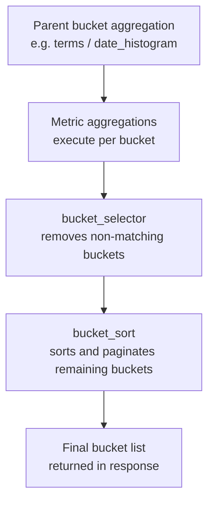

## Aggregations — `bucket_sort` and `bucket_selector`

---

### Overview

`bucket_sort` and `bucket_selector` are **pipeline aggregations** that operate on the buckets produced by a sibling bucket aggregation. Rather than computing new values, they **filter and order** the bucket set itself.

- `bucket_selector` — filters buckets based on a script condition, retaining only those that satisfy it.
- `bucket_sort` — sorts and optionally paginates buckets based on one or more sort criteria.

Both are applied **after** the parent aggregation has produced its buckets, and both are placed as sibling pipeline aggregations within the parent.

---

### `bucket_selector`

#### What It Does

`bucket_selector` evaluates a Painless script against each bucket. Buckets for which the script returns `false` are **removed from the response**. It is the aggregation-equivalent of a `HAVING` clause in SQL.

> [Inference] Filtered buckets are removed from the response only — underlying documents are not affected. Behavior may vary across Elasticsearch versions.

#### Syntax

```json
"<agg_name>": {
  "bucket_selector": {
    "buckets_path": {
      "<var_name>": "<path_to_metric>",
      ...
    },
    "script": "<painless_script>"
  }
}
```

#### Parameters

| Parameter | Description |
|---|---|
| `buckets_path` | Map of variable names to metric aggregation paths |
| `script` | Painless script returning a boolean; buckets where this is `false` are excluded |
| `gap_policy` | How to handle missing values (`skip`, `insert_zeros`, `keep_values`). Default: `skip` |

#### `buckets_path` as a Map

Unlike most pipeline aggregations, `bucket_selector` accepts `buckets_path` as a **key-value map**. Each key becomes a named variable accessible inside the script.

```json
"buckets_path": {
  "totalRevenue": "daily_revenue",
  "orderCount": "order_count"
}
```

Inside the script, these are referenced as `params.totalRevenue` and `params.orderCount`.

---

#### Example — Filter Buckets Below a Threshold

Retain only date buckets where total revenue exceeds 1000:

```json
GET /sales/_search
{
  "size": 0,
  "aggs": {
    "sales_over_time": {
      "date_histogram": {
        "field": "date",
        "calendar_interval": "day"
      },
      "aggs": {
        "daily_revenue": {
          "sum": { "field": "revenue" }
        },
        "high_revenue_only": {
          "bucket_selector": {
            "buckets_path": {
              "totalRevenue": "daily_revenue"
            },
            "script": "params.totalRevenue > 1000"
          }
        }
      }
    }
  }
}
```

**Output** *(abbreviated)*:

```json
"buckets": [
  {
    "key_as_string": "2024-01-03",
    "daily_revenue": { "value": 1450.0 }
  },
  {
    "key_as_string": "2024-01-05",
    "daily_revenue": { "value": 2300.0 }
  }
]
```

Buckets with `daily_revenue <= 1000` are absent from the response.

---

#### Example — Multiple Conditions

```json
"bucket_selector": {
  "buckets_path": {
    "revenue": "daily_revenue",
    "orders": "order_count"
  },
  "script": "params.revenue > 500 && params.orders >= 10"
}
```

> [Inference] Complex scripts with multiple variables are evaluated per bucket independently. Script execution is subject to Painless sandbox restrictions active in your cluster.

---

#### SQL Analogy

```
SELECT date, SUM(revenue) AS total
FROM sales
GROUP BY date
HAVING total > 1000
```

is approximately equivalent to a `date_histogram` + `sum` + `bucket_selector` combination.

> [Inference] The analogy is approximate. SQL `HAVING` operates at query plan level; `bucket_selector` operates post-aggregation on already-computed bucket results. Semantics may differ in edge cases.

---

### `bucket_sort`

#### What It Does

`bucket_sort` **sorts buckets** by one or more metrics (or by their key), and optionally applies `from` / `size` pagination to truncate the result. It does not compute any new values.

> [Inference] `bucket_sort` applies sorting and pagination to the bucket list after all sibling aggregations have executed. It does not affect which documents are aggregated.

#### Syntax

```json
"<agg_name>": {
  "bucket_sort": {
    "sort": [
      { "<metric_or_key>": { "order": "asc" | "desc" } }
    ],
    "from": <int>,
    "size": <int>,
    "gap_policy": "skip" | "insert_zeros" | "keep_values"
  }
}
```

#### Parameters

| Parameter | Description | Default |
|---|---|---|
| `sort` | List of sort criteria; each entry is a field/metric path with `order` | *(none — original order retained)* |
| `from` | Number of buckets to skip (offset) | `0` |
| `size` | Maximum number of buckets to return | All buckets |
| `gap_policy` | How to handle missing bucket values | `skip` |

---

#### Sorting by a Metric

```json
GET /sales/_search
{
  "size": 0,
  "aggs": {
    "sales_by_category": {
      "terms": {
        "field": "category",
        "size": 100
      },
      "aggs": {
        "total_revenue": {
          "sum": { "field": "revenue" }
        },
        "sort_by_revenue": {
          "bucket_sort": {
            "sort": [
              { "total_revenue": { "order": "desc" } }
            ],
            "size": 5
          }
        }
      }
    }
  }
}
```

**Output** *(abbreviated)*: The top 5 categories by descending revenue.

---

#### Sorting by Bucket Key

To sort buckets by their own key (e.g., alphabetically for `terms`, or chronologically for `date_histogram`):

```json
"bucket_sort": {
  "sort": [
    { "_key": { "order": "asc" } }
  ]
}
```

> [Inference] `_key` refers to the bucket's own key value. For `date_histogram` this is the epoch timestamp. Behavior when `_key` is used on non-uniform key types has not been independently verified here.

---

#### Pagination with `from` and `size`

`bucket_sort` enables **bucket-level pagination**, which is not available through standard aggregation parameters alone.

```json
"bucket_sort": {
  "sort": [{ "total_revenue": { "order": "desc" } }],
  "from": 10,
  "size": 5
}
```

This returns buckets ranked 11–15 by revenue — analogous to SQL `LIMIT 5 OFFSET 10`.

> [Inference] Because aggregations execute on all matching documents first and then sort/paginate the bucket list, increasing `from` does not reduce computation cost. It only affects which portion of the sorted result is returned.

---

#### `size`-only Truncation (No Sort)

`bucket_sort` can be used with only `size` and no `sort` to truncate the bucket list to the first N buckets in their natural order:

```json
"bucket_sort": {
  "size": 10
}
```

> [Inference] Without a `sort` clause, the original bucket order is preserved and only the first `size` buckets are returned. This is consistent with documented behavior but should be verified for your Elasticsearch version.

---

### Mermaid — Execution Order Within a Bucket Aggregation



> [Inference] The execution order shown above reflects the logical pipeline sequence. Elasticsearch's internal execution may differ from this representation.

---

### Combining `bucket_selector` and `bucket_sort`

Both can coexist as siblings within the same parent aggregation. The typical pattern is to filter first, then sort.

```json
GET /sales/_search
{
  "size": 0,
  "aggs": {
    "sales_by_category": {
      "terms": {
        "field": "category",
        "size": 100
      },
      "aggs": {
        "total_revenue": {
          "sum": { "field": "revenue" }
        },
        "filter_low_revenue": {
          "bucket_selector": {
            "buckets_path": { "rev": "total_revenue" },
            "script": "params.rev > 500"
          }
        },
        "sort_top": {
          "bucket_sort": {
            "sort": [{ "total_revenue": { "order": "desc" } }],
            "size": 5
          }
        }
      }
    }
  }
}
```

> [Inference] When both aggregations are present, `bucket_selector` removes buckets before `bucket_sort` applies ordering and pagination. Elasticsearch does not guarantee a fixed execution order for sibling aggregations unless the pipeline dependency is explicit — validate combined behavior against your cluster version.

---

### `gap_policy` in Both Aggregations

Both aggregations accept `gap_policy` to handle buckets where the referenced metric has no value (e.g., sparse `date_histogram` buckets with no documents).

| Value | Behavior |
|---|---|
| `skip` | Buckets with missing values are skipped / excluded |
| `insert_zeros` | Missing values treated as `0` |
| `keep_values` | [Inference] Last known value is propagated; behavior may vary |

For `bucket_selector`, a missing value means the script variable may be `NaN` or absent — scripts should handle this case explicitly if `insert_zeros` is not used.

---

### Common Pitfalls

- **`terms` aggregation `size` must be large enough** — `bucket_sort` sorts and paginates the buckets returned by the parent `terms` aggregation. If `terms.size` is set to `10` but there are 1000 categories, only those 10 are candidates for sorting. [Inference] Setting `terms.size` deliberately high (e.g., `10000`) before applying `bucket_sort` is a common pattern to approximate global top-N sorting, but increases memory usage.
- **`bucket_selector` does not reduce computation cost** — all buckets are computed before filtering; exclusion only affects the response.
- **Script variable names must match `buckets_path` keys** — referencing an undeclared variable in a `bucket_selector` script will [Inference] cause a script compilation or runtime error.
- **`from` + `size` in `bucket_sort` vs. `size` in parent `terms`** — these operate at different levels and are not interchangeable.
- **No sort on unordered keys** — sorting by `_key` on aggregations without a meaningful key ordering (e.g., `filters` aggregation) may produce [Inference] unexpected results.

---

### Comparison

| Feature | `bucket_selector` | `bucket_sort` |
|---|---|---|
| Primary purpose | Filter buckets by condition | Sort and paginate buckets |
| Script required | Yes | No |
| Reduces bucket count | Yes (conditional) | Yes (via `size`) |
| Changes bucket order | No | Yes |
| Pagination support | No | Yes (`from` + `size`) |
| SQL equivalent | `HAVING` | `ORDER BY` + `LIMIT`/`OFFSET` |
| `gap_policy` support | Yes | Yes |

---

### Key Points

- `bucket_selector` removes buckets from the response where the Painless script evaluates to `false`; it is the aggregation equivalent of SQL `HAVING`.
- `bucket_sort` reorders and optionally paginates the bucket list; it does not alter bucket values.
- `buckets_path` in `bucket_selector` is a **map**, not a string — each key becomes a named `params.*` variable in the script.
- Neither aggregation affects which documents are aggregated or which buckets are computed internally — they operate only on the output.
- When combining both, filtering before sorting is the standard pattern, though execution order should be verified per cluster version.
- For meaningful `bucket_sort` results across a large keyspace, the parent `terms.size` must be set sufficiently high to expose enough candidates.