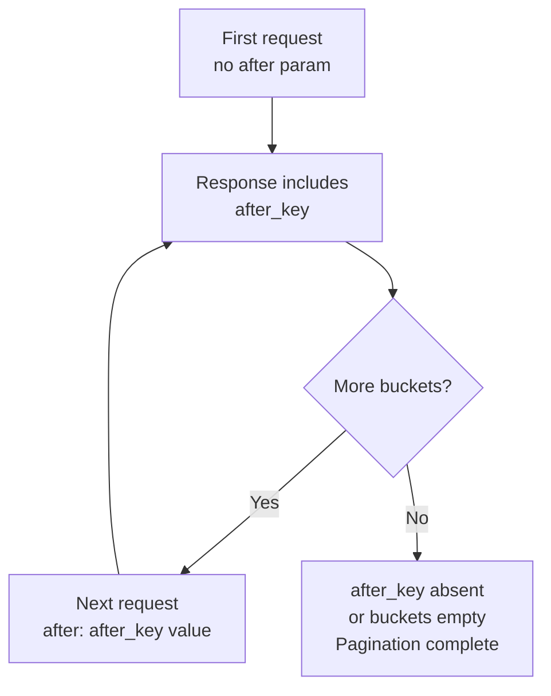

## Aggregations — Composite

---

### Overview

The **composite aggregation** creates buckets from combinations of values drawn from multiple source aggregations. It is designed primarily for two use cases:

- **Paginating over all buckets** of a large aggregation result without the memory constraints of `terms` or `date_histogram`.
- **Multi-field grouping** — producing a Cartesian product of values across multiple fields, similar to SQL `GROUP BY col1, col2, col3`.

Unlike `terms`, which returns only the top-N buckets, composite returns **all buckets** across paginated requests using a cursor mechanism.

---

### Structure

```json
GET /index/_search
{
  "size": 0,
  "aggs": {
    "my_composite": {
      "composite": {
        "size": <int>,
        "after": { ... },
        "sources": [
          { "<name>": { "<source_type>": { ... } } },
          ...
        ]
      },
      "aggs": { ... }
    }
  }
}
```

#### Top-Level Parameters

| Parameter | Description | Default |
|---|---|---|
| `sources` | Ordered list of value sources defining the grouping dimensions | *(required)* |
| `size` | Number of composite buckets to return per page | `10` |
| `after` | Cursor for pagination; value from previous response's `after_key` | *(none — first page)* |

---

### Value Sources

Each entry in `sources` defines one dimension of the composite key. Three source types are available.

#### `terms`

Groups by distinct values of a field, similar to a `terms` aggregation.

```json
"sources": [
  {
    "category": {
      "terms": {
        "field": "category"
      }
    }
  }
]
```

#### `date_histogram`

Groups by fixed time intervals on a date field.

```json
"sources": [
  {
    "sale_date": {
      "date_histogram": {
        "field": "date",
        "calendar_interval": "day"
      }
    }
  }
]
```

#### `histogram`

Groups by numeric intervals on a numeric field.

```json
"sources": [
  {
    "price_range": {
      "histogram": {
        "field": "price",
        "interval": 50
      }
    }
  }
]
```

#### `geotile_grid` *(less common)*

Groups by geotile grid cells. [Inference] Requires a `geo_point` field and a `precision` parameter. Behavior and availability should be verified against your Elasticsearch version.

---

### Source Parameters (Common)

Each source type accepts additional parameters:

| Parameter | Applies To | Description |
|---|---|---|
| `order` | All | `asc` or `desc` sort order for this dimension. Default: `asc` |
| `missing_bucket` | All | If `true`, includes a bucket for documents missing this field's value. Default: `false` |
| `missing_order` | All | Where to place the missing-value bucket: `first`, `last`, or `default` |
| `value_type` | All | Hints the value type when field is from a script (`long`, `double`, `date`, `string`, `ip`, `boolean`) |
| `script` | All | Use a script instead of a field to derive values |

---

### Multi-Field Grouping Example

Group sales by category and day simultaneously:

```json
GET /sales/_search
{
  "size": 0,
  "aggs": {
    "sales_breakdown": {
      "composite": {
        "size": 100,
        "sources": [
          { "category": { "terms":          { "field": "category" } } },
          { "sale_date": { "date_histogram": { "field": "date", "calendar_interval": "day" } } }
        ]
      },
      "aggs": {
        "total_revenue": { "sum": { "field": "revenue" } }
      }
    }
  }
}
```

**Output** *(abbreviated)*:

```json
"aggregations": {
  "sales_breakdown": {
    "after_key": {
      "category": "electronics",
      "sale_date": 1704844800000
    },
    "buckets": [
      {
        "key": { "category": "apparel",     "sale_date": 1704672000000 },
        "doc_count": 42,
        "total_revenue": { "value": 3200.0 }
      },
      {
        "key": { "category": "apparel",     "sale_date": 1704758400000 },
        "doc_count": 38,
        "total_revenue": { "value": 2950.0 }
      },
      {
        "key": { "category": "electronics", "sale_date": 1704844800000 },
        "doc_count": 61,
        "total_revenue": { "value": 8100.0 }
      }
    ]
  }
}
```

Each bucket key is a **composite key** — a combination of one value per source dimension.

---

### Pagination

The composite aggregation is the only standard aggregation with a native pagination mechanism. It uses a **cursor** approach rather than offset-based pagination.



#### First Request

```json
"composite": {
  "size": 100,
  "sources": [ ... ]
}
```

#### Subsequent Requests

Take the `after_key` from the previous response and pass it as `after`:

```json
"composite": {
  "size": 100,
  "after": {
    "category": "electronics",
    "sale_date": 1704844800000
  },
  "sources": [ ... ]
}
```

> The `after` value must match the structure of the composite key exactly — one entry per source, in the same order.

**Pagination is complete when:**
- The response contains fewer buckets than `size`, or
- The `after_key` field is absent from the response.

> [Inference] Relying solely on bucket count to detect the final page is fragile; checking for the absence of `after_key` is more reliable. Verify this behavior against your Elasticsearch version.

---

### Ordering

Each source can independently specify `order: asc` or `order: desc`. The composite aggregation sorts by the **leftmost source first**, then subsequent sources as tiebreakers — analogous to multi-column `ORDER BY` in SQL.

```json
"sources": [
  { "category": { "terms":          { "field": "category",  "order": "asc"  } } },
  { "sale_date": { "date_histogram": { "field": "date", "calendar_interval": "day", "order": "desc" } } }
]
```

> [Inference] Mixing `asc` and `desc` across sources is supported, but the resulting sort interplay should be validated with known data before use in production.

---

### Handling Missing Values

By default, documents missing a source field's value are **excluded** from all buckets. Setting `missing_bucket: true` on a source creates an explicit bucket for those documents.

```json
"sources": [
  {
    "category": {
      "terms": {
        "field": "category",
        "missing_bucket": true,
        "missing_order": "last"
      }
    }
  }
]
```

The missing bucket's key value will be `null` in the response.

---

### Script-Based Sources

Any source can derive its values from a Painless script instead of a direct field reference:

```json
"sources": [
  {
    "revenue_tier": {
      "terms": {
        "script": {
          "source": "doc['revenue'].value > 1000 ? 'high' : 'low'",
          "lang": "painless"
        },
        "value_type": "string"
      }
    }
  }
]
```

> [Inference] Script-based sources are subject to Painless sandbox restrictions and may have performance implications at scale. `value_type` is required when using scripts, as the type cannot be inferred from a field mapping.

---

### Sub-Aggregations

Composite buckets support sub-aggregations exactly as other bucket aggregations do. Any metric, pipeline, or bucket aggregation can be nested:

```json
"aggs": {
  "sales_breakdown": {
    "composite": {
      "sources": [
        { "region": { "terms": { "field": "region" } } }
      ]
    },
    "aggs": {
      "avg_order_value": { "avg":   { "field": "order_value" } },
      "max_order_value": { "max":   { "field": "order_value" } },
      "order_percentiles": {
        "percentiles": {
          "field": "order_value",
          "percents": [50, 95, 99]
        }
      }
    }
  }
}
```

---

### Index Sorting Optimization

When the index is configured with **index sorting** that matches the composite aggregation's source order and direction, Elasticsearch can optimize execution by terminating the aggregation early rather than scanning all shards fully.

Index sort configuration in `index.settings`:

```json
"settings": {
  "index.sort.field": ["category", "date"],
  "index.sort.order": ["asc",      "asc"]
}
```

Composite aggregation matching that sort:

```json
"sources": [
  { "category": { "terms":          { "field": "category", "order": "asc" } } },
  { "sale_date": { "date_histogram": { "field": "date", "calendar_interval": "day", "order": "asc" } } }
]
```

> [Inference] When the composite source order, fields, and directions align with index sort configuration, Elasticsearch may apply an early termination optimization that significantly reduces query time on large indices. This optimization is not guaranteed to activate in all configurations — verify with `profile: true` in your query.

---

### Composite vs. `terms` — When to Use Each

| Concern | `terms` | `composite` |
|---|---|---|
| Returns top-N only | Yes | No — returns all via pagination |
| Multi-field grouping | Requires nested aggs (different semantics) | Native multi-source support |
| Pagination | Not supported natively | Native cursor pagination |
| Memory usage (large keyspace) | High — all buckets held in memory | Lower per page |
| Sub-aggregations | Yes | Yes |
| Index sort optimization | No | Yes |
| `doc_count` accuracy | Approximate (with `shard_size`) | Exact |
| Sorting flexibility | By `_count`, `_key`, or sub-agg | Per-source `asc`/`desc` |
| Use in transforms | Not applicable | Primary mechanism for Elasticsearch Transforms |

---

### Use in Elasticsearch Transforms

Composite aggregation is the **underlying mechanism** used by Elasticsearch Transforms (formerly known as Rollup). Transforms iterate over all composite buckets using the pagination cursor to produce a summarized destination index.

> [Inference] Understanding composite aggregation pagination behavior is directly applicable to understanding how Transforms process data incrementally.

---

### Common Pitfalls

- **`after` key structure must exactly match `sources` order and field names** — any mismatch will [Inference] result in an error or unexpected pagination behavior.
- **Changing `sources` between pages invalidates the cursor** — the `after` value is meaningful only for the exact same `sources` configuration.
- **`size` in composite is per shard before merging** — [Unverified] the exact relationship between per-shard and final bucket counts in composite differs from `terms`; validate result counts against expectations.
- **No global `doc_count` ordering** — composite does not support sorting by `_count` the way `terms` does. [Inference] Workarounds require collecting all pages and sorting client-side, or using a different aggregation strategy.
- **`missing_bucket: false` (default) silently excludes documents** — if documents are unexpectedly absent from results, check whether source fields have missing values.
- **Sub-aggregation pipeline aggregations and composite** — some pipeline aggregations require ordered, fixed-interval parent buckets. [Inference] Not all pipeline aggregations behave predictably inside composite; test combinations explicitly.

---

### Key Points

- Composite aggregation produces multi-dimensional buckets from combinations of value sources: `terms`, `date_histogram`, `histogram`, and `geotile_grid`.
- It is the only standard Elasticsearch aggregation with a native **cursor-based pagination** mechanism via `after` / `after_key`.
- Unlike `terms`, composite can enumerate **all buckets** across a large keyspace without approximation.
- Each source dimension independently supports `order`, `missing_bucket`, and script-based value derivation.
- When index sorting matches composite source configuration, Elasticsearch may apply early termination for improved performance.
- Composite is the foundation of **Elasticsearch Transforms**, which use it to iterate over bucketed data incrementally.