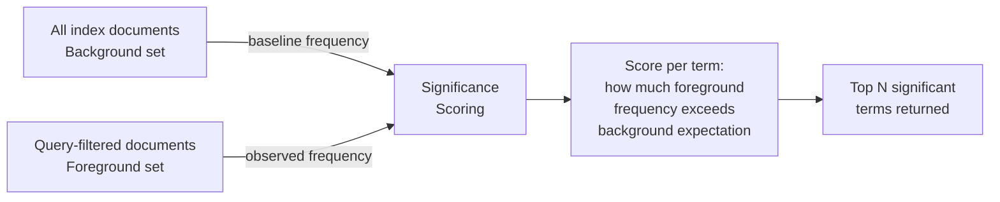

## Aggregations — Significant Terms and Significant Text

---

### Overview

`significant_terms` and `significant_text` are **bucket aggregations** that identify values **statistically unusual** in a filtered subset of documents compared to a background set. Rather than returning the most frequent terms, they return terms that occur **more than expected by chance** relative to the broader corpus.

- `significant_terms` — operates on **indexed fields** (keyword, numeric, IP).
- `significant_text` — operates on **unindexed or analyzed text fields**, re-analyzing values at query time.

The practical use case is **anomaly and pattern detection**: given a filtered set (e.g., failed transactions, complaints, a specific user segment), what terms appear with surprising frequency compared to all documents?

---

### Conceptual Foundation

#### Foreground vs. Background

| Set | Description |
|---|---|
| **Foreground** | Documents matching the current query — the filtered subset under analysis |
| **Background** | The broader document set used as a statistical baseline — by default, all documents in the index |

A term is considered **significant** when its frequency in the foreground is disproportionately high relative to its frequency in the background.

**Example:** If `"refund"` appears in 2% of all documents (background) but 40% of documents tagged `status: failed` (foreground), it is statistically significant within that subset.

---

### Mermaid — Significance Scoring Concept



---

### `significant_terms`

#### What It Does

Operates on **indexed field values** — typically `keyword`, numeric, or IP fields. It reads term frequencies from the inverted index directly, making it efficient for structured fields.

#### Syntax

```json
"<agg_name>": {
  "significant_terms": {
    "field": "<field_name>",
    "size": <int>,
    "min_doc_count": <int>,
    "shard_min_doc_count": <int>,
    "background_filter": { ... },
    "heuristic": { ... },
    "include": { ... },
    "exclude": { ... }
  }
}
```

#### Parameters

| Parameter | Description | Default |
|---|---|---|
| `field` | The indexed field to analyze | *(required)* |
| `size` | Number of significant terms to return | `10` |
| `min_doc_count` | Minimum foreground document count for a term to be a candidate | `3` |
| `shard_min_doc_count` | Minimum count per shard before a term is promoted to the coordinator | `calculated` |
| `background_filter` | Query to restrict the background set | All index documents |
| `heuristic` | Scoring algorithm to use | `jlh` |
| `include` / `exclude` | Regex or value list to restrict candidate terms | *(none)* |

---

#### Basic Example

Find terms significantly associated with failed orders:

```json
GET /orders/_search
{
  "query": {
    "term": { "status": "failed" }
  },
  "aggs": {
    "significant_error_terms": {
      "significant_terms": {
        "field": "product_category",
        "size": 5
      }
    }
  }
}
```

**Output** *(abbreviated)*:

```json
"significant_error_terms": {
  "doc_count": 348,
  "bg_count": 50000,
  "buckets": [
    {
      "key": "electronics",
      "doc_count": 120,
      "score": 4.62,
      "bg_count": 3200
    },
    {
      "key": "appliances",
      "doc_count": 85,
      "score": 3.91,
      "bg_count": 2800
    }
  ]
}
```

#### Response Fields per Bucket

| Field | Description |
|---|---|
| `key` | The term value |
| `doc_count` | Count in the foreground (query-matched) set |
| `score` | Significance score — higher means more significant |
| `bg_count` | Count in the background set |

---

#### Background Filter

By default the background is all documents in the index. A `background_filter` restricts it to a more relevant comparison population:

```json
"significant_terms": {
  "field": "error_code",
  "background_filter": {
    "term": { "region": "APAC" }
  }
}
```

This compares the foreground against only APAC documents rather than the entire index — useful when global base rates would skew significance scoring.

> [Inference] Using a narrower background filter changes significance scores substantially. The choice of background population is a modeling decision that affects which terms surface as significant.

---

### `significant_text`

#### What It Does

`significant_text` applies the same statistical significance approach to **full-text fields**. Because text fields are analyzed at index time and individual tokens are not stored as discrete values, `significant_text` **re-analyzes field values at query time** to extract tokens.

> [Inference] Re-analysis at query time makes `significant_text` more computationally expensive than `significant_terms`. Performance impact increases with corpus size and field length.

#### Key Differences from `significant_terms`

| Aspect | `significant_terms` | `significant_text` |
|---|---|---|
| Field types | `keyword`, numeric, IP | Analyzed `text` fields |
| Value source | Inverted index | Re-analyzed at query time |
| Deduplication | N/A | Supports `filter_duplicate_text` |
| Performance | Lower cost | Higher cost |
| Use case | Structured values | Free text, descriptions, logs |

#### Syntax

```json
"<agg_name>": {
  "significant_text": {
    "field": "<text_field>",
    "size": <int>,
    "min_doc_count": <int>,
    "filter_duplicate_text": <bool>,
    "background_filter": { ... },
    "heuristic": { ... },
    "include": { ... },
    "exclude": { ... }
  }
}
```

#### Additional Parameter: `filter_duplicate_text`

When a corpus contains near-duplicate documents (e.g., syndicated news articles, templated records), repeated text inflates term frequencies and distorts significance scoring. Setting `filter_duplicate_text: true` causes Elasticsearch to sample one representative document from groups of near-duplicates.

```json
"significant_text": {
  "field": "body",
  "filter_duplicate_text": true
}
```

> [Inference] `filter_duplicate_text` uses a hashing approach to detect similarity. It is approximate — not all duplicates may be detected, and some non-duplicates may be grouped. Behavior is not guaranteed to be deterministic across versions.

---

#### Example — Significant Words in Support Tickets

```json
GET /support_tickets/_search
{
  "query": {
    "term": { "priority": "critical" }
  },
  "aggs": {
    "significant_words": {
      "significant_text": {
        "field": "description",
        "filter_duplicate_text": true,
        "size": 10
      }
    }
  }
}
```

This returns tokens from the `description` field that appear with surprising frequency in critical-priority tickets compared to all tickets.

---

### Significance Heuristics

Both aggregations support pluggable scoring algorithms via the `heuristic` parameter.

#### `jlh` (Default)

Named after its authors (Dunning, log-likelihood). Computes a score based on the ratio of foreground frequency to background frequency, normalized for document count differences.

```json
"heuristic": { "jlh": {} }
```

> [Inference] `jlh` tends to favor rare terms with very high foreground concentration. It may surface low-frequency terms if their foreground/background ratio is extreme.

#### `mutual_information`

Measures the mutual information between term occurrence and the foreground/background label.

```json
"heuristic": {
  "mutual_information": {
    "include_negatives": false,
    "background_is_superset": true
  }
}
```

| Option | Description |
|---|---|
| `include_negatives` | If `true`, includes terms *less* frequent in foreground than expected |
| `background_is_superset` | Set `true` if the background includes all foreground documents (default scenario) |

#### `chi_square`

Chi-squared test statistic between term occurrence and foreground/background membership.

```json
"heuristic": {
  "chi_square": {
    "include_negatives": false,
    "background_is_superset": true
  }
}
```

#### `gnd` (Google Normalized Distance)

Scores terms by normalized distance between foreground and background co-occurrence distributions.

```json
"heuristic": { "gnd": { "background_is_superset": true } }
```

#### `percentage`

A simpler, non-statistical heuristic: score = `foreground_freq / background_freq`. Fast but less statistically rigorous.

```json
"heuristic": { "percentage": {} }
```

> [Inference] `percentage` scoring is less robust than likelihood-based heuristics for imbalanced foreground/background sizes. It is documented as useful for small datasets or quick exploration.

---

### Heuristic Comparison

| Heuristic | Statistical basis | Handles imbalanced sets | Notes |
|---|---|---|---|
| `jlh` | Log-likelihood ratio | Yes | Default; general purpose |
| `mutual_information` | Information theory | Yes | Sensitive to very rare terms |
| `chi_square` | Chi-squared test | Yes | Classic NLP significance test |
| `gnd` | Normalized distance | Yes | [Inference] Less commonly used in practice |
| `percentage` | Simple ratio | No | Fast; less rigorous |

---

### `min_doc_count` and `shard_min_doc_count`

These parameters control candidate term filtering:

- **`min_doc_count`** — a term must appear in at least this many foreground documents to be considered. Prevents very rare terms from being surfaced due to statistical noise.
- **`shard_min_doc_count`** — filters candidates at the shard level before results are merged at the coordinator. Reduces network overhead on large clusters.

> [Inference] Setting `min_doc_count` too low may surface statistically noisy results. Setting it too high may suppress genuinely significant but infrequent terms. The appropriate value depends on corpus size and domain.

---

### `include` and `exclude`

Both aggregations support restricting candidate terms:

```json
"significant_terms": {
  "field": "error_code",
  "include": ["E4.*", "E5.*"],
  "exclude": ["E200"]
}
```

Values can be:
- A **regex string** (for `keyword` and `text` fields)
- An **array of exact values**
- A **partition** specification for numeric fields

> [Inference] Regex filtering is applied to term values before significance scoring. Terms excluded here will not appear in results regardless of their significance score.

---

### Nested Inside Other Aggregations

`significant_terms` and `significant_text` are commonly used inside `terms` or `filters` aggregations to compute per-group significance:

```json
GET /logs/_search
{
  "size": 0,
  "aggs": {
    "by_service": {
      "terms": { "field": "service" },
      "aggs": {
        "significant_errors": {
          "significant_terms": {
            "field": "error_type",
            "background_filter": {
              "term": { "service": "payment-service" }
            }
          }
        }
      }
    }
  }
}
```

> [Inference] When nested inside a `terms` aggregation, the foreground for each `significant_terms` bucket is the documents within that terms bucket. The background filter should be set explicitly to avoid the entire index being used as baseline when a per-group baseline is intended.

---

### Common Pitfalls

- **High `size` on large indices is expensive** — both aggregations require computing term statistics across the foreground and background sets. [Inference] Large `size` values increase memory and computation requirements.
- **Default background may be inappropriate** — using the entire index as background is only meaningful if the index represents a coherent population. A multi-tenant index or mixed-domain corpus may require explicit `background_filter`.
- **`significant_text` on long fields is costly** — re-analysis at query time on large documents with large corpora can be slow. [Inference] Consider using `filter_duplicate_text` and `min_doc_count` to reduce candidate volume.
- **Low foreground `doc_count`** — significance scoring is statistically unreliable with very small foreground sets. Results with small `doc_count` values should be interpreted with caution.
- **Stop words and common terms** — without appropriate analyzer configuration, high-frequency function words may surface despite low significance scores. Pre-filtering via `exclude` or analyzer stop-token filters helps.
- **`significant_terms` on `text` fields** — using `significant_terms` (not `significant_text`) on an analyzed `text` field will [Inference] operate on the raw stored values rather than tokens, which is rarely the intended behavior. Use `significant_text` for analyzed text.

---

### Key Points

- Both aggregations surface terms **statistically over-represented** in a filtered foreground set relative to a background population — this is distinct from simply returning the most frequent terms.
- `significant_terms` operates on indexed field values (keyword, numeric, IP); `significant_text` re-analyzes text fields at query time.
- The background defaults to all index documents but can be restricted using `background_filter` for more meaningful comparisons.
- Five scoring heuristics are available (`jlh`, `mutual_information`, `chi_square`, `gnd`, `percentage`); `jlh` is the default.
- `significant_text` provides `filter_duplicate_text` to mitigate distortion from near-duplicate documents in the corpus.
- Statistical reliability degrades with small foreground sets — `min_doc_count` provides a floor to reduce noise.
- These aggregations are well-suited for use cases such as anomaly detection, log analysis, segmentation profiling, and exploratory data analysis.