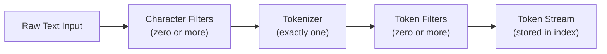
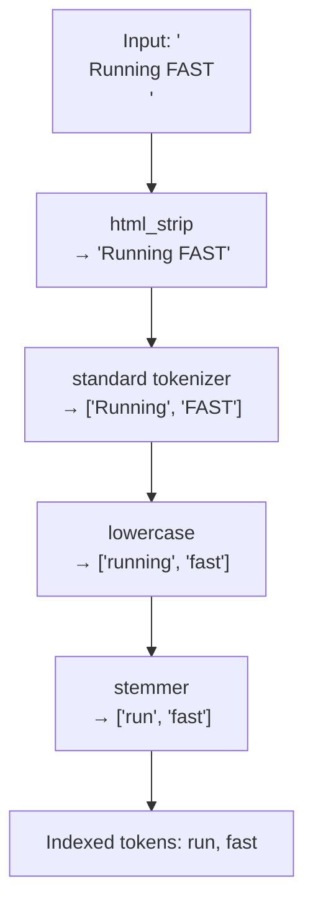
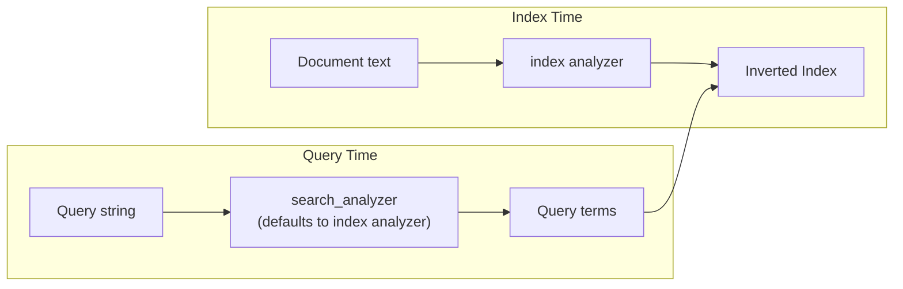

## Analysis Pipeline Overview

The analysis pipeline in Elasticsearch is the process by which raw text is transformed into tokens (terms) stored in the inverted index. Understanding this pipeline is essential for controlling how text is indexed and searched.

---

### What Is Text Analysis?

When Elasticsearch indexes a text field, it does not store the raw string directly in the inverted index. Instead, it passes the text through an **analyzer**, which breaks it down into discrete tokens. The same process applies (by default) at query time, so that the query terms match the indexed terms.

This pipeline is applied exclusively to fields of type `text`. Fields of type `keyword` bypass analysis entirely.

---

### The Three Stages of an Analyzer

An analyzer is composed of exactly three sequential components:



Each component receives the output of the previous one. The order is fixed: character filters → tokenizer → token filters.

---

### Stage 1: Character Filters

Character filters operate on the **raw character stream** before tokenization. They can add, remove, or replace characters.

An analyzer may have zero or more character filters, applied in order.

**Built-in character filters:**

| Filter | What it does |
|---|---|
| `html_strip` | Removes HTML tags; decodes HTML entities (e.g., `&amp;` → `&`) |
| `mapping` | Replaces character sequences based on a user-defined map |
| `pattern_replace` | Replaces character sequences matching a regex |

**Example** — `html_strip` on input `<p>Hello &amp; World</p>`:

```
Output: Hello & World
```

**Example** — `mapping` filter replacing `ñ → n`:

```json
{
  "type": "mapping",
  "mappings": ["ñ => n"]
}
```

Character filters run before the tokenizer sees any text. [Inference] Order matters when multiple character filters are chained, since each one receives the output of the previous.

---

### Stage 2: Tokenizer

The tokenizer receives the (possibly modified) character stream and splits it into an ordered sequence of **tokens**. It also records each token's position and character offsets, which are used for phrase queries and highlighting.

An analyzer has **exactly one** tokenizer — this is a hard constraint in Elasticsearch.

**Commonly used tokenizers:**

| Tokenizer        | Behavior                                                       |
| ---------------- | -------------------------------------------------------------- |
| `standard`       | Splits on whitespace and punctuation; removes most punctuation |
| `whitespace`     | Splits on whitespace only; preserves punctuation               |
| `keyword`        | Emits the entire input as a single token                       |
| `letter`         | Splits on any non-letter character                             |
| `uax_url_email`  | Like `standard`, but keeps URLs and emails intact              |
| `ngram`          | Emits n-gram tokens of configurable min/max length             |
| `edge_ngram`     | Emits n-grams anchored to the start of each token              |
| `pattern`        | Splits on a regex delimiter                                    |
| `path_hierarchy` | Splits filesystem-like paths into hierarchical tokens          |

**Example** — `standard` tokenizer on `"Elasticsearch is fast!"`:

```
Tokens: ["Elasticsearch", "is", "fast"]
```

The exclamation mark is dropped. Each token carries a position (0, 1, 2) and start/end character offsets.

---

### Stage 3: Token Filters

Token filters receive the token stream from the tokenizer and can **add, remove, or transform** tokens. An analyzer may have zero or more token filters, applied in order.

**Commonly used token filters:**

| Filter                      | Behavior                                             |
| --------------------------- | ---------------------------------------------------- |
| `lowercase`                 | Converts all tokens to lowercase                     |
| `stop`                      | Removes stop words (e.g., "the", "is", "a")          |
| `stemmer`                   | Reduces words to their root form (language-specific) |
| `synonym` / `synonym_graph` | Expands or replaces tokens with synonyms             |
| `asciifolding`              | Converts non-ASCII characters to ASCII equivalents   |
| `length`                    | Removes tokens outside a min/max character length    |
| `unique`                    | Removes duplicate tokens                             |
| `shingle`                   | Produces multi-token n-grams (word-level)            |
| `reverse`                   | Reverses each token's characters                     |
| `trim`                      | Strips leading/trailing whitespace from tokens       |

**Example** — `lowercase` + `stop` on `["Elasticsearch", "is", "fast"]`:

```
After lowercase: ["elasticsearch", "is", "fast"]
After stop:      ["elasticsearch", "fast"]
```

[Inference] The order of token filters in the chain affects the result. For example, applying `stop` before `lowercase` may miss stop words that were not already lowercased, depending on how the stop list is defined.

---

### Full Pipeline Illustration

The following diagram traces a single input string through all three stages with concrete transformations:



---

### Built-in Analyzers

Elasticsearch ships with several pre-built analyzers that bundle a fixed combination of character filters, tokenizer, and token filters.

| Analyzer               | Character Filters | Tokenizer    | Token Filters                                      |
| ---------------------- | ----------------- | ------------ | -------------------------------------------------- |
| `standard`             | *(none)*          | `standard`   | `lowercase`, `stop` (disabled by default)          |
| `simple`               | *(none)*          | `letter`     | `lowercase`                                        |
| `whitespace`           | *(none)*          | `whitespace` | *(none)*                                           |
| `stop`                 | *(none)*          | `letter`     | `lowercase`, `stop`                                |
| `keyword`              | *(none)*          | `keyword`    | `lowercase`                                        |
| `fingerprint`          | *(none)*          | `standard`   | `lowercase`, `asciifolding`, `stop`, `fingerprint` |
| `english` *(language)* | *(none)*          | `standard`   | `lowercase`, `stop` (English), `stemmer` (English) |

Language-specific analyzers exist for many languages. [Unverified — exact bundled filters per language analyzer should be confirmed against the official Elasticsearch documentation for your specific version, as they may vary.]

---

### Where Analyzers Are Applied

Analyzers are applied at two distinct moments:

**Index time** — when a document is indexed, the analyzer processes the field value and the resulting tokens are written to the inverted index.

**Query time** — when a full-text query (e.g., `match`, `match_phrase`) runs, the query string is passed through an analyzer before matching against the index.

By default, the same analyzer is used at both times. Elasticsearch allows specifying a separate `search_analyzer` on a field mapping to override this behavior at query time.

[Inference] Mismatch between index-time and search-time analyzers is a common source of unexpected search behavior. This is not a guaranteed outcome, and actual behavior depends on the specific analyzer configurations used.



---

### Specifying an Analyzer in a Mapping

```json
PUT /my-index
{
  "mappings": {
    "properties": {
      "description": {
        "type": "text",
        "analyzer": "english",
        "search_analyzer": "standard"
      }
    }
  }
}
```

In this example, the `english` analyzer is used at index time (with stemming and English stop words), while the `standard` analyzer is used at query time. [Inference] This combination could lead to term mismatches for stemmed forms if not carefully tested. Behavior is not guaranteed and should be validated with the Analyze API.

---

### Defining a Custom Analyzer

Custom analyzers are defined in the index settings under `analysis`:

```json
PUT /my-index
{
  "settings": {
    "analysis": {
      "char_filter": {
        "my_html_strip": {
          "type": "html_strip"
        }
      },
      "tokenizer": {
        "my_tokenizer": {
          "type": "standard"
        }
      },
      "filter": {
        "my_stop": {
          "type": "stop",
          "stopwords": ["the", "a", "is"]
        },
        "my_stemmer": {
          "type": "stemmer",
          "language": "english"
        }
      },
      "analyzer": {
        "my_custom_analyzer": {
          "type": "custom",
          "char_filter": ["my_html_strip"],
          "tokenizer": "my_tokenizer",
          "filter": ["lowercase", "my_stop", "my_stemmer"]
        }
      }
    }
  }
}
```

The `type: "custom"` field is required when composing your own analyzer from components.

---

### Testing the Pipeline with the Analyze API

Elasticsearch provides the `_analyze` API to inspect exactly what tokens an analyzer produces. This is the primary tool for debugging analysis behavior.

**Using a built-in analyzer:**

```json
POST /_analyze
{
  "analyzer": "standard",
  "text": "Running quickly across the fields"
}
```

**Response (abbreviated):**

```json
{
  "tokens": [
    { "token": "running", "start_offset": 0, "end_offset": 7, "position": 0 },
    { "token": "quickly", "start_offset": 8, "end_offset": 15, "position": 1 },
    { "token": "across", "start_offset": 16, "end_offset": 22, "position": 2 },
    { "token": "fields",  "start_offset": 27, "end_offset": 33, "position": 4 }
  ]
}
```

Note that `"the"` (a stop word) is absent and `position` jumps from 2 to 4, reflecting the removed token's slot.

**Testing against a specific index and field:**

```json
POST /my-index/_analyze
{
  "field": "description",
  "text": "<p>Running FAST</p>"
}
```

This uses whatever analyzer is configured for the `description` field in `my-index`.

**Testing a custom inline pipeline without an index:**

```json
POST /_analyze
{
  "char_filter": ["html_strip"],
  "tokenizer": "standard",
  "filter": ["lowercase", "stop"],
  "text": "<p>The Quick Brown Fox</p>"
}
```

---

### Token Position and Offsets

Every token produced by the tokenizer carries metadata:

| Attribute | Meaning |
|---|---|
| `token` | The string value of the token |
| `start_offset` | Character position (inclusive) in the original string where the token begins |
| `end_offset` | Character position (exclusive) where the token ends |
| `position` | Ordinal position of the token in the stream (gaps indicate removed tokens) |
| `type` | Token type assigned by the tokenizer (e.g., `<ALPHANUM>`, `<NUM>`) |

Position information is critical for phrase queries (`match_phrase`) and span queries. When a token filter removes a token, the position counter still increments, which is why position gaps appear in the output above.

---

### Analyzer Resolution Order

When Elasticsearch determines which analyzer to use for a field, it follows a resolution order. [Inference — the following order is based on documented behavior but may differ in edge cases or future versions; behavior is not guaranteed]:

1. Analyzer explicitly set on the query itself (e.g., `analyzer` parameter in a `match` query)
2. `search_analyzer` defined on the field mapping (query time only)
3. `analyzer` defined on the field mapping
4. `default_search` analyzer defined in index settings (query time only)
5. `default` analyzer defined in index settings
6. `standard` analyzer (Elasticsearch built-in fallback)

---

### Performance Considerations

[Inference] The following observations are consistent with how analysis pipelines generally behave, but actual performance impact depends on cluster configuration, hardware, document size, and indexing load. Behavior is not guaranteed.

- More character filters and token filters increase per-document CPU cost at index time.
- Complex regex-based filters (`pattern_replace`, `pattern` tokenizer) may have higher overhead than string-based alternatives.
- `synonym_graph` at index time is more expensive than at query time because it must rewrite the entire token graph per document.
- Token filters that expand tokens (e.g., `synonym`, `shingle`) increase the size of the inverted index, which may affect storage and query performance.

---

### Common Pitfalls

**Using the wrong analyzer at query time** — if `search_analyzer` is set to a different analyzer that does not stem or lowercase, queries may not match indexed tokens.

**Applying `synonym_graph` at index time** — `synonym_graph` is designed for query-time use. At index time, it may not handle multi-word synonyms correctly. [Unverified for all versions — consult release notes for the version in use.]

**Forgetting that `keyword` fields are not analyzed** — applying a `match` query to a `keyword` field still works, but the query string is analyzed (by default with `standard`), which may lowercase a value that was indexed with mixed case.

**Changing analyzers on existing indexes** — analyzer configuration cannot be changed on a live index without reindexing. The index must be closed, settings updated, then reopened — or data must be reindexed into a new index.

---

**Related Topics**

- Standard analyzer internals and configuration options
- Language analyzers (English, Spanish, CJK, etc.)
- Custom tokenizer deep dive: `ngram`, `edge_ngram`, `pattern`
- Synonym filters: `synonym` vs `synonym_graph`, inline vs file-based
- `asciifolding` and Unicode normalization in analysis
- Multifields: indexing the same field with multiple analyzers
- `search_quote_analyzer` for phrase query behavior
- Index settings: `default` and `default_search` analyzer
- Reindexing workflows when changing analysis configuration
- Analysis and highlighting: how offsets affect fragment computation