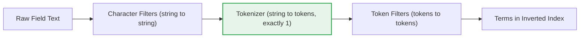

## Tokenizers

A tokenizer is the single mandatory component of an Elasticsearch analyzer. It receives a stream of characters — either the raw field text or the output of any preceding character filters — and breaks it into individual tokens (typically words), while also recording the start and end character offset of each token and its position relative to other tokens. Unlike character filters and token filters, exactly one tokenizer must be present in any analyzer, custom or built-in.

### Role in the Analysis Pipeline

The tokenizer sits between character filters and token filters. It is the only stage that converts a character stream into a token stream; everything before it operates on strings, and everything after it operates on tokens.

<svg xmlns="http://www.w3.org/2000/svg" viewBox="0 0 800 200">
  <text x="400" y="20" font-size="14" font-weight="bold" text-anchor="middle" fill="#333">Tokenizer's Role in the Pipeline (svg_diagram)</text>

  <rect x="20" y="60" width="180" height="60" rx="6" fill="#fef7e0" stroke="#f9ab00" stroke-width="1.5" />
  <text x="110" y="80" font-size="13" text-anchor="middle" fill="#1a1a1a">Character Filters</text>
  <text x="110" y="97" font-size="11" text-anchor="middle" fill="#555">0 or more</text>
  <text x="110" y="112" font-size="10" text-anchor="middle" fill="#777">string → string</text>

  <line x1="200" y1="90" x2="240" y2="90" stroke="#666" stroke-width="1.5" marker-end="url(#arrow2)" />

  <rect x="240" y="55" width="180" height="70" rx="6" fill="#e6f4ea" stroke="#34a853" stroke-width="2.5" />
  <text x="330" y="78" font-size="13" font-weight="bold" text-anchor="middle" fill="#1a1a1a">Tokenizer</text>
  <text x="330" y="95" font-size="11" text-anchor="middle" fill="#555">exactly 1, mandatory</text>
  <text x="330" y="110" font-size="10" text-anchor="middle" fill="#777">string → tokens</text>

  <line x1="420" y1="90" x2="460" y2="90" stroke="#666" stroke-width="1.5" marker-end="url(#arrow2)" />

  <rect x="460" y="60" width="150" height="60" rx="6" fill="#fce8e6" stroke="#ea4335" stroke-width="1.5" />
  <text x="535" y="80" font-size="13" text-anchor="middle" fill="#1a1a1a">Token Filters</text>
  <text x="535" y="97" font-size="11" text-anchor="middle" fill="#555">0 or more</text>
  <text x="535" y="112" font-size="10" text-anchor="middle" fill="#777">tokens → tokens</text>

  <line x1="610" y1="90" x2="650" y2="90" stroke="#666" stroke-width="1.5" marker-end="url(#arrow2)" />

  <rect x="650" y="60" width="130" height="60" rx="6" fill="#e8f0fe" stroke="#4285f4" stroke-width="1.5" />
  <text x="715" y="80" font-size="13" text-anchor="middle" fill="#1a1a1a">Inverted Index</text>
  <text x="715" y="100" font-size="10" text-anchor="middle" fill="#777">terms stored</text>

  <text x="330" y="150" font-size="11" text-anchor="middle" fill="#888">Records: term text, start/end offset,</text>
  <text x="330" y="165" font-size="11" text-anchor="middle" fill="#888">and position for each token produced.</text>
</svg>

### Categories of Built-in Tokenizers

Elasticsearch groups its built-in tokenizers into four functional categories: word-oriented, partial-word, structured-text, and low-level.

**Word Oriented Tokenizers**

These split text into individual words, differing mainly in how they handle punctuation, whitespace, and language-specific boundaries.

| Tokenizer | Behavior |
|---|---|
| `standard` | Splits on Unicode text segmentation rules (UAX #29); removes most punctuation; suitable for most languages |
| `letter` | Splits on any non-letter character; discards digits and symbols |
| `lowercase` | Same as `letter`, but also lowercases all terms — combines tokenization with normalization |
| `whitespace` | Splits only on whitespace; punctuation remains attached to tokens |
| `uax_url_email` | Same as `standard`, but recognizes and preserves URLs and email addresses as single tokens |
| `classic` | Grammar-based, tuned for English; handles acronyms, company names, and email addresses heuristically |
| `thai` | Segments Thai text into words |

```json
POST _analyze
{
  "tokenizer": "standard",
  "text": "The 2 QUICK Brown-Foxes jumped over the lazy dog's bone."
}
```

This produces tokens: `The`, `2`, `QUICK`, `Brown`, `Foxes`, `jumped`, `over`, `the`, `lazy`, `dog's`, `bone`. Note that the `standard` tokenizer splits on the hyphen but keeps `dog's` as a single token per UAX #29 rules.

```json
POST _analyze
{
  "tokenizer": "whitespace",
  "text": "The 2 QUICK Brown-Foxes jumped."
}
```

This instead produces `The`, `2`, `QUICK`, `Brown-Foxes`, `jumped.` — punctuation stays attached because splitting occurs only on whitespace.

**Partial Word Tokenizers**

These break text into fragments smaller than whole words, useful for partial matching, autocomplete, and fuzzy search scenarios.

| Tokenizer | Behavior |
|---|---|
| `ngram` | Splits text into overlapping substrings ("n-grams") of configurable minimum and maximum length |
| `edge_ngram` | Like `ngram`, but only generates substrings anchored to the start of a word |

```json
PUT ngram_example
{
  "settings": {
    "analysis": {
      "analyzer": {
        "my_edge_ngram": {
          "tokenizer": "my_edge_tokenizer"
        }
      },
      "tokenizer": {
        "my_edge_tokenizer": {
          "type": "edge_ngram",
          "min_gram": 2,
          "max_gram": 5,
          "token_chars": ["letter", "digit"]
        }
      }
    }
  }
}

POST ngram_example/_analyze
{
  "analyzer": "my_edge_ngram",
  "text": "Quick"
}
```

This yields `Qu`, `Qui`, `Quic`, `Quick` — progressively longer prefixes up to `max_gram`. This is commonly used to power search-as-you-type functionality, typically paired with the `standard` tokenizer (or a `search_as_you_type`-analyzed match) at query time to avoid generating n-grams on the search side.

**Structured Text Tokenizers**

These target structured or semi-structured values such as identifiers, paths, and postal codes, and are typically paired with `keyword`-style fields where partial structure-aware matching is still desired.

| Tokenizer | Behavior |
|---|---|
| `keyword` | Emits the entire input as a single, unmodified token (a "no-op" tokenizer) |
| `pattern` | Splits using a regular expression; can also use the regex to capture tokens instead of splitting on them |
| `simple_pattern` | Splits using a restricted regular expression subset based on Lucene regex, faster than `pattern` |
| `simple_pattern_split` | Like `simple_pattern`, but splits on matches rather than extracting them |
| `char_group` | Splits on a configurable set of characters, faster than `pattern` for simple delimiter-based splitting |
| `path_hierarchy` | Splits file-system-style paths into tokens representing each hierarchy level |

```json
POST _analyze
{
  "tokenizer": "path_hierarchy",
  "text": "/usr/local/bin/elasticsearch"
}
```

This produces four tokens: `/usr`, `/usr/local`, `/usr/local/bin`, `/usr/local/bin/elasticsearch` — each representing a step deeper into the hierarchy. This is useful for filtering documents by directory or category depth.

```json
POST _analyze
{
  "tokenizer": "keyword",
  "text": "New York"
}
```

This produces a single token, `New York`, unchanged — typically paired with token filters like `lowercase` when exact-value matching with case normalization is needed.

**Low-level Tokenizer**

| Tokenizer | Behavior |
|---|---|
| `char_group` | (also listed above) configurable low-level splitting on a defined character set, without full regex overhead |

### Custom Tokenizer Configuration

Most non-`standard` tokenizers require explicit configuration since their defaults may not fit the use case. Below is a `pattern` tokenizer configured to split on commas.

```json
PUT pattern_tokenizer_example
{
  "settings": {
    "analysis": {
      "analyzer": {
        "csv_analyzer": {
          "tokenizer": "csv_tokenizer"
        }
      },
      "tokenizer": {
        "csv_tokenizer": {
          "type": "pattern",
          "pattern": ","
        }
      }
    }
  }
}

POST pattern_tokenizer_example/_analyze
{
  "analyzer": "csv_analyzer",
  "text": "red,green,blue"
}
```

This produces three tokens: `red`, `green`, `blue`.

### Token Offsets and Positions

Every token a tokenizer emits carries three pieces of metadata beyond its text: the start offset, end offset, and position (an incrementing index). These are visible when requesting detailed analysis output.

```json
POST _analyze
{
  "tokenizer": "standard",
  "text": "quick fox",
  "explain": true
}
```

The response includes, for each token, its `start_offset`, `end_offset`, and `position` values. Offsets map back to the original character stream and are what highlighting relies on; positions are what phrase and proximity queries (e.g. `match_phrase`, `span` queries) use to determine adjacency.

### Choosing a Tokenizer

**Key Points**
- `standard` is the default and a reasonable starting point for general-purpose, multi-language text.
- `keyword` should be used when a field's analyzed value must remain intact as a single token, most often combined with token filters like `lowercase` rather than left fully unanalyzed.
- `edge_ngram` and `ngram` trade index size and indexing time for partial-match query flexibility; [Inference] because n-gram tokenizers generate multiple overlapping tokens per word, they typically increase index size more than word-oriented tokenizers, though the exact growth depends on the configured `min_gram`/`max_gram` range and average term length.
- `path_hierarchy` is purpose-built for hierarchical values and is rarely a fit outside path- or category-like data.
- Only one tokenizer may be specified per analyzer; achieving multiple tokenization strategies for the same field requires multi-fields (`fields` mapping parameter) with different analyzers, not multiple tokenizers in one analyzer.

### Tokenizers vs. Character Filters vs. Token Filters



### Related Topics

- Token Filters (lowercase, stop, synonym, stemmer, ngram)
- Character Filters (html_strip, mapping, pattern_replace)
- Custom Analyzers — assembling full pipelines
- Multi-fields (`fields`) — applying multiple analyzers to one field
- Search-as-you-type field type and edge n-gram strategies
- The `_analyze` API with `explain: true` for offset/position debugging
- Phrase and span queries — how token position affects matching