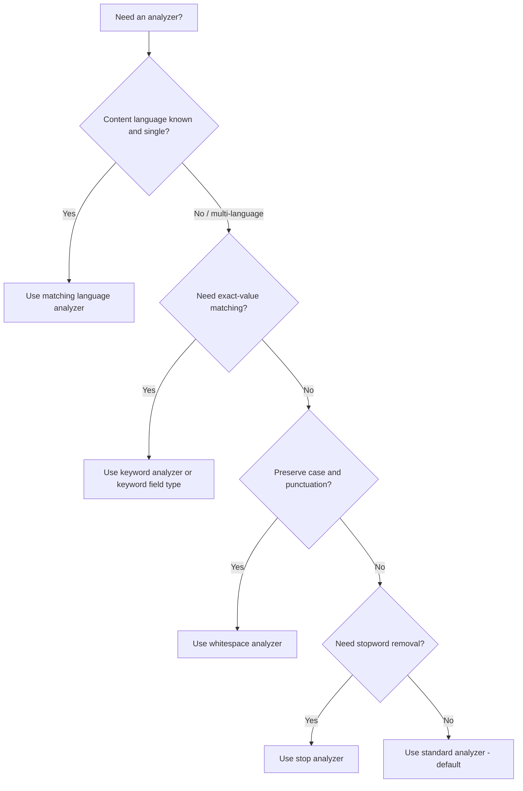

## Built-in Analyzers

Elasticsearch ships a set of pre-configured analyzers that combine a tokenizer, an optional set of token filters, and (in some cases) character filters into a ready-to-use analysis pipeline. These require no custom configuration and cover the majority of common text analysis needs, though each can also be referenced as a starting point for a customized version via the `type` parameter in a custom analyzer definition.

### Overview of Available Built-in Analyzers

| Analyzer | Tokenizer | Filters Applied | Typical Use |
|---|---|---|---|
| `standard` | `standard` | `lowercase` | Default; general-purpose, multi-language |
| `simple` | (built-in, letter-based) | lowercasing built into tokenization | Lightweight, non-letter characters split text |
| `whitespace` | `whitespace` | none | Preserves punctuation and case |
| `stop` | (built-in, letter-based) | lowercasing + `stop` | Like `simple` plus English stopword removal |
| `keyword` | `keyword` | none | No-op; entire input as a single token |
| `pattern` | (regex-based) | `lowercase` | Regex-driven splitting |
| `fingerprint` | `standard`-like | sort, dedupe, concatenate | Deduplication/near-duplicate detection |
| Language analyzers | varies | language-specific stemming, stopwords | e.g. `english`, `french`, `spanish` |

### The Standard Analyzer

The `standard` analyzer is the default analyzer used for `text` fields when no analyzer is explicitly configured in the mapping. It uses the `standard` tokenizer (Unicode text segmentation, UAX #29) and applies the `lowercase` token filter. It does not remove stopwords by default.

```json
POST _analyze
{
  "analyzer": "standard",
  "text": "The 2 Quick Brown-Foxes jumped over the lazy dog's bone."
}
```

This produces: `the`, `2`, `quick`, `brown`, `foxes`, `jumped`, `over`, `the`, `lazy`, `dog's`, `bone` — all lowercased, punctuation removed, but `the` appearing twice since stopword removal is not part of this analyzer.

The `standard` analyzer accepts two configurable parameters when customized: `max_token_length` (default 255, tokens longer than this are split) and `stopwords` (an optional stopword list, empty `_none_` by default).

### The Simple Analyzer

The `simple` analyzer tokenizes on any character that is not a letter, discarding digits, punctuation, and symbols, and lowercases all resulting tokens.

```json
POST _analyze
{
  "analyzer": "simple",
  "text": "The 2 Quick Brown-Foxes"
}
```

This produces: `the`, `quick`, `brown`, `foxes` — note that `2` is dropped entirely, since digits are not letters, and the hyphen causes a split.

### The Whitespace Analyzer

The `whitespace` analyzer tokenizes only on whitespace characters and applies no token filters, preserving original case and attached punctuation.

```json
POST _analyze
{
  "analyzer": "whitespace",
  "text": "The 2 QUICK Brown-Foxes."
}
```

This produces: `The`, `2`, `QUICK`, `Brown-Foxes.` — case and punctuation remain untouched.

### The Stop Analyzer

The `stop` analyzer behaves like `simple` but additionally removes stopwords using the `stop` token filter, defaulting to the `_english_` stopword list.

```json
POST _analyze
{
  "analyzer": "stop",
  "text": "The Quick Brown Fox is fast"
}
```

This produces: `quick`, `brown`, `fox`, `fast` — `the` and `is` are removed. The `stopwords` and `stopwords_path` parameters can override the default list when customized.

### The Keyword Analyzer

The `keyword` analyzer is a no-op analyzer that emits the entire input string as a single, unmodified token.

```json
POST _analyze
{
  "analyzer": "keyword",
  "text": "New York, NY"
}
```

This produces a single token: `New York, NY`, unchanged. This is functionally similar to setting a field's `type` to `keyword` directly in the mapping, though the `keyword` analyzer can still be applied to a `text` field when analysis-pipeline compatibility with other analyzed fields is needed (for example, within a `multi-field` setup).

### The Pattern Analyzer

The `pattern` analyzer splits text using a configurable regular expression (default pattern splits on non-word characters: `\W+`) and lowercases tokens by default.

```json
PUT pattern_analyzer_example
{
  "settings": {
    "analysis": {
      "analyzer": {
        "my_pattern_analyzer": {
          "type": "pattern",
          "pattern": ",\\s*"
        }
      }
    }
  }
}

POST pattern_analyzer_example/_analyze
{
  "analyzer": "my_pattern_analyzer",
  "text": "red, green,  blue"
}
```

This produces: `red`, `green`, `blue` — splitting on commas followed by optional whitespace. The `lowercase` parameter (boolean, default `true`) and `flags` (Java regex flags) can further tune behavior.

### The Fingerprint Analyzer

The `fingerprint` analyzer is designed for deduplication and near-duplicate detection rather than general search. It lowercases text, removes extended (non-ASCII) characters optionally, sorts the resulting tokens alphabetically, deduplicates them, and concatenates them back into a single token separated by spaces.

```json
POST _analyze
{
  "analyzer": "fingerprint",
  "text": "the quick brown fox the lazy fox"
}
```

This produces a single token: `brown fox lazy quick the` — duplicates removed, alphabetically sorted, and joined. Two differently-worded strings containing the same set of unique words produce identical fingerprints, which is the property exploited for clustering near-duplicate values.

### Language Analyzers

Elasticsearch bundles analyzers for numerous languages (e.g. `english`, `french`, `german`, `spanish`, `russian`, `arabic`), each combining a language-appropriate tokenizer setup with stemming, stopword lists, and other language-specific token filters (such as handling for possessives in `english` or elisions in `french`).

```json
POST _analyze
{
  "analyzer": "english",
  "text": "The foxes were jumping quickly"
}
```

This produces stemmed, stopword-filtered tokens such as `fox`, `jump`, `quickli` (exact stems depend on the underlying stemmer configuration). [Unverified] Verifying exact stem output against the live `_analyze` API for the specific language analyzer in use is advisable, since stemming behavior can differ subtly between minor version releases of the underlying Lucene stemmers.

Each language analyzer typically exposes a `stem_exclusion` parameter, allowing specific words to bypass stemming, along with `stopwords` for overriding the default list.

### Choosing Among Built-in Analyzers



**Key Points**
- `standard` is the safe default for general multi-language text and is applied automatically to `text` fields without an explicit `analyzer` mapping.
- Language analyzers generally produce better recall for their target language than `standard` due to stemming, at the cost of losing some precision (e.g. `fishing` and `fish` become equivalent under stemming).
- `fingerprint` is not intended for full-text search relevance; it serves a narrower deduplication/clustering purpose.
- Any built-in analyzer can be used as the `type` in a custom analyzer definition to override individual parameters (e.g. a custom `stopwords` list) without rebuilding the whole pipeline from a tokenizer and filter list.

### Related Topics

- Custom Analyzers — building pipelines from individual components
- Tokenizers (standard, keyword, whitespace, pattern)
- Token Filters (lowercase, stop, stemmer, synonym)
- Character Filters (html_strip, mapping, pattern_replace)
- Language-specific stemming and stopword customization
- Normalizers — analyzer-like processing for `keyword` fields
- The `_analyze` API for testing built-in vs. custom analyzer output