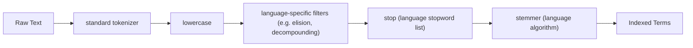

## Language Analyzers

Elasticsearch bundles a set of analyzers pre-configured for specific natural languages, each combining a tokenizer, stopword list, stemmer, and other language-appropriate token filters into a single named analyzer. These exist because generic analysis (as performed by `standard`) does not account for grammatical variation, elision, or compounding rules specific to a given language, all of which affect recall in full-text search.

### Why Language-Specific Analysis Matters

The `standard` analyzer treats all text identically regardless of language: it tokenizes on Unicode boundaries and lowercases, but it does not stem words to their root form or remove language-specific stopwords. A search for `running` against a `standard`-analyzed field will not match a document containing only `run`, whereas a language-aware analyzer normalizes both to the same stem, improving recall at some cost to precision.

```json
POST _analyze
{
  "analyzer": "standard",
  "text": "The runners were running quickly"
}

POST _analyze
{
  "analyzer": "english",
  "text": "The runners were running quickly"
}
```

The `standard` output keeps `runners`, `running` as distinct tokens (plus `the`, `were`, `quickly`). The `english` output reduces `runners` and `running` toward a shared stem and removes stopwords such as `the` and `were`, narrowing the token set and increasing the likelihood that differently-inflected query terms match the same indexed documents.

### Available Language Analyzers

Elasticsearch includes bundled language analyzers for a substantial list of languages, among them: `arabic`, `armenian`, `basque`, `bengali`, `brazilian`, `bulgarian`, `catalan`, `cjk`, `czech`, `danish`, `dutch`, `english`, `estonian`, `finnish`, `french`, `galician`, `german`, `greek`, `hindi`, `hungarian`, `indonesian`, `irish`, `italian`, `latvian`, `lithuanian`, `norwegian`, `persian`, `portuguese`, `romanian`, `russian`, `sorani`, `spanish`, `swedish`, `turkish`, and `thai`. [Unverified] This list can change across major versions as language support is added or Lucene's underlying analysis modules are updated, so the authoritative current list is worth confirming against the target cluster version's documentation rather than assumed from memory.

### Structural Composition of a Language Analyzer

Each language analyzer is internally a `custom`-type analyzer composed of a tokenizer (typically `standard`, though some languages use alternatives), a `stop` filter pre-loaded with that language's default stopword list, a `stemmer` filter configured for that language, and sometimes additional language-specific filters (e.g. elision handling for French, decompounding for German or Dutch, script normalization for CJK).



The `cjk` analyzer, for example, differs structurally from most others: rather than word-based tokenization, it applies bigram-based tokenization suited to Chinese, Japanese, and Korean text, where whitespace does not reliably delimit words.

### The English Analyzer in Detail

```json
POST _analyze
{
  "analyzer": "english",
  "text": "The foxes' possessions were quickly organized"
}
```

The `english` analyzer's internal pipeline includes handling for English possessives (stripping the trailing `'s` or `'` from `foxes'`), lowercasing, English stopword removal (`the`, `were`), and Porter-family stemming (reducing `possessions` and `organized` toward their stems). Exact stem output should be verified via `_analyze` for the target cluster version rather than assumed, since [Unverified] minor Lucene version updates have occasionally adjusted stemmer edge-case behavior across Elasticsearch releases.

### Customizing a Language Analyzer

Rather than building a language pipeline from scratch, a language analyzer can be used as the `type` in a custom analyzer definition, allowing specific parameters to be overridden while keeping the rest of the language-specific behavior intact.

```json
PUT custom_english_analyzer
{
  "settings": {
    "analysis": {
      "filter": {
        "english_stop_custom": {
          "type": "stop",
          "stopwords": ["a", "an", "the"]
        },
        "english_stemmer_custom": {
          "type": "stemmer",
          "language": "light_english"
        },
        "english_keywords": {
          "type": "keyword_marker",
          "keywords": ["Elasticsearch", "Kibana"]
        }
      },
      "analyzer": {
        "my_english_analyzer": {
          "type": "custom",
          "tokenizer": "standard",
          "filter": [
            "english_possessive_stemmer",
            "lowercase",
            "english_stop_custom",
            "english_keywords",
            "english_stemmer_custom"
          ]
        }
      }
    }
  }
}
```

The `keyword_marker` filter (used here as `english_keywords`) protects specific terms from being altered by subsequent filters — in this case, preventing product names like `Elasticsearch` from being stemmed. `light_english` is used here instead of the default `english` stemmer setting, since `light_english` applies less aggressive stemming, useful when precision matters more than maximal recall.

### Available Stemmer Variants Per Language

Several languages, including English, expose more than one stemming aggressiveness level through the `stemmer` filter's `language` parameter — for English, this includes `english` (Porter2/Snowball-based), `light_english`, `minimal_english`, `possessive_english`, `porter2`, and `lovins`. Lighter stemmers reduce fewer word forms together (improving precision, reducing recall); more aggressive stemmers merge more forms together (improving recall, reducing precision).

| Aggressiveness | Behavior tendency |
|---|---|
| Minimal | Only handles simple plural/singular forms; conservative |
| Light | Moderate reduction; balances precision and recall |
| Standard/Porter | Algorithmic, aggressive reduction to word stems |
| Possessive-only | Strips only possessive markers, no other stemming |

[Inference] Because stemming aggressiveness directly trades recall against precision, the appropriate variant likely depends on the search use case — e.g. e-commerce search where exact product-name matching matters may favor lighter stemming, while general document search favoring broad recall may favor standard-aggressiveness stemming — though the correct choice for a specific corpus is best confirmed through relevance testing rather than assumed from the general trade-off alone.

### Multi-Language Content Strategies

**Key Points**
- A single field cannot be correctly analyzed for multiple languages simultaneously with a single language analyzer, since stemming rules and stopword lists are language-specific and can conflict across languages.
- A common pattern for known multi-language corpora is one field per language (e.g. `title_en`, `title_fr`, `title_de`), each mapped with its corresponding language analyzer, combined with a language-detection step (often performed outside Elasticsearch, e.g. at ingestion time) to route content to the correct field.
- When the language of incoming text is unknown or mixed, using `standard` with broad normalization (`lowercase`, `asciifolding`) rather than committing to one language analyzer avoids incorrect stemming being applied to the wrong language's text.
- The `icu_analyzer` (part of the ICU analysis plugin, not built-in by default) offers improved Unicode normalization and word-breaking for languages poorly served by `standard`, such as those without whitespace word boundaries, and is worth considering as a supplement to the built-in language analyzers for such content.

### Related Topics

- Built-in Analyzers — the broader set including non-language-specific options
- Custom Analyzers — building a language-based pipeline with overrides
- Token Filters — `stemmer`, `stop`, `keyword_marker`, `elision`
- ICU Analysis Plugin — extended Unicode-aware analysis
- Multi-field strategies for multi-language document collections
- The `_analyze` API — verifying stemmer output per language and version
- Relevance tuning — precision/recall trade-offs in stemming choice