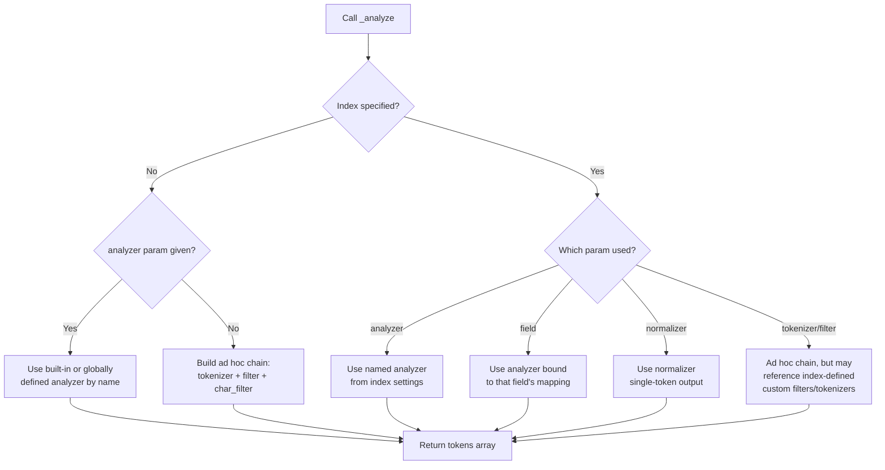

## Analyze API

### Overview

The Analyze API is a diagnostic and testing endpoint in Elasticsearch that exposes the text analysis process directly, letting you see exactly how a piece of text is converted into tokens without needing to index any documents. It is the primary tool for debugging analyzers, testing custom tokenizer/filter combinations, and understanding why search queries do or do not match indexed documents.

The endpoint is `_analyze`, and it can be called in three different scopes: against no index at all (using built-in or fully custom-defined analyzers), against a specific index (using analyzers, normalizers, or mappings already configured on that index), or in a fully ad hoc mode where you assemble a tokenizer and filters on the fly.

### Why It Matters

Text analysis is the process that determines what a `text` field's contents look like once tokenized — and therefore what terms actually get matched during a query. Because this process is invisible during normal indexing (you send a document, and Elasticsearch quietly analyzes it in the background), the Analyze API is the only reliable window into that black box. It is most commonly used to:

- Debug why a search query is not matching documents that "should" match.
- Preview how a custom analyzer (or a proposed one) will tokenize sample text before applying it to a mapping.
- Compare the behavior of different built-in analyzers on the same input.
- Verify token filters (stemming, synonyms, lowercase, stopwords) are behaving as expected.
- Inspect token metadata like position, offsets, and token type, which affect highlighting and phrase matching.

### Basic Syntax — No Index

You can analyze arbitrary text using a built-in analyzer without referencing any index:

```
POST _analyze
{
  "analyzer": "standard",
  "text": "The QUICK Brown-Fox jumps!"
}
```

**Output**

```
{
  "tokens": [
    { "token": "the", "start_offset": 0, "end_offset": 3, "type": "<ALPHANUM>", "position": 0 },
    { "token": "quick", "start_offset": 4, "end_offset": 9, "type": "<ALPHANUM>", "position": 1 },
    { "token": "brown", "start_offset": 10, "end_offset": 15, "type": "<ALPHANUM>", "position": 2 },
    { "token": "fox", "start_offset": 16, "end_offset": 19, "type": "<ALPHANUM>", "position": 3 },
    { "token": "jumps", "start_offset": 20, "end_offset": 25, "type": "<ALPHANUM>", "position": 4 }
  ]
}
```

Each token object reports four things: the resulting term (`token`), its character span in the original string (`start_offset`, `end_offset`), a classification (`type`), and its sequential position in the token stream (`position`), which governs phrase and proximity matching.

### Analyzing Against an Index

When you run `_analyze` against a specific index, you can reference analyzers, mappings, or normalizers that only exist within that index's configuration.

**By analyzer name defined in the index settings:**

```
POST my_index/_analyze
{
  "analyzer": "my_custom_analyzer",
  "text": "Elasticsearch rocks!"
}
```

**By field name (uses that field's configured analyzer from the mapping):**

```
POST my_index/_analyze
{
  "field": "title",
  "text": "Elasticsearch rocks!"
}
```

Using `field` is especially useful because it removes guesswork — it shows you precisely what analyzer chain is actually applied to that field at index time, including any custom filters, rather than requiring you to look up and manually reconstruct the mapping.

### Ad Hoc Analysis — Custom Tokenizer and Filters

The Analyze API also allows you to assemble a tokenizer and filter chain on the fly, without defining it anywhere in an index. This is the fastest way to prototype a custom analyzer before committing it to a mapping.

```
POST _analyze
{
  "tokenizer": "standard",
  "filter": ["lowercase", "stop", "asciifolding"],
  "text": "The CAFÉ is Closed Today"
}
```

**Output**

```
{
  "tokens": [
    { "token": "cafe", "start_offset": 4, "end_offset": 8, "type": "<ALPHANUM>", "position": 1 },
    { "token": "closed", "start_offset": 12, "end_offset": 18, "type": "<ALPHANUM>", "position": 3 },
    { "token": "today", "start_offset": 19, "end_offset": 24, "type": "<ALPHANUM>", "position": 4 }
  ]
}
```

Note how `the` and `is` were removed by the `stop` filter, `CAFÉ` was both lowercased and folded to `cafe` by `asciifolding`, and — critically — the `position` values (1, 3, 4) preserve gaps left by the removed stopwords rather than renumbering sequentially. This gap preservation is what keeps phrase queries accurate even after stopword removal.

You can also add a `char_filter` stage, which runs before tokenization and operates on raw characters (useful for stripping HTML or applying character-level mappings):

```
POST _analyze
{
  "char_filter": ["html_strip"],
  "tokenizer": "standard",
  "filter": ["lowercase"],
  "text": "<p>Hello <b>World</b></p>"
}
```

### Request Parameters Reference

| Parameter | Scope | Description |
|---|---|---|
| `text` | All | The input string (or array of strings) to analyze. |
| `analyzer` | All | Name of a built-in or index-defined analyzer to apply in full. |
| `field` | Index-scoped only | Uses the analyzer configured for the named field in the mapping. |
| `tokenizer` | All | Specifies a tokenizer for ad hoc analysis chains. |
| `filter` | All | Array of token filters applied after tokenization. |
| `char_filter` | All | Array of character filters applied before tokenization. |
| `normalizer` | Index-scoped only | Applies a normalizer (used for `keyword` fields) instead of a full analyzer. |
| `explain` | All | Boolean; when `true`, returns detailed per-filter breakdown (see below). |
| `attributes` | All | Restricts which token attributes are shown when `explain` is `true`. |

**Key Points**

- `analyzer` and (`tokenizer` + `filter`/`char_filter`) are mutually exclusive — you either name a complete analyzer or build one piece by piece, not both.
- `field` can only be used when analyzing against a specific index, since it depends on that index's mapping.
- `text` accepts an array of strings; when given multiple strings, Elasticsearch analyzes them as if they were separate values of a multi-value field, and `position` values increment across the array with a gap inserted between entries (matching real multi-value field indexing behavior).

### The `explain` Parameter

Setting `"explain": true` reveals the intermediate token stream after *each* stage of the analysis chain — not just the final result. This is invaluable when a custom analyzer produces unexpected output and you need to identify which specific filter is responsible.

```
POST _analyze
{
  "tokenizer": "standard",
  "filter": ["lowercase", "stop"],
  "text": "The Cats Are Running",
  "explain": true
}
```

The response includes a `detail` object with a separate section for the tokenizer and for each filter in the chain, each showing its own full token list with additional internal attributes (such as `keyword`, `bytes`, and positional metadata) that are hidden in the default, non-explained output. Reading through these sections in order lets you pinpoint exactly where a token was altered, split, or dropped.

### Normalizers vs. Analyzers in the Analyze API

`keyword` fields use **normalizers** rather than analyzers — they apply char filters and token filters but never a tokenizer, meaning the entire input remains a single token (typically just lowercased or otherwise normalized, not split into words). To test a normalizer:

```
POST my_index/_analyze
{
  "normalizer": "my_lowercase_normalizer",
  "text": "USA-East-1"
}
```

**Output**

```
{
  "tokens": [
    { "token": "usa-east-1", "start_offset": 0, "end_offset": 10, "type": "word", "position": 0 }
  ]
}
```

Only one token is produced, confirming the string was not split — this is the expected, defining behavior of normalization versus analysis.

### Token Type Classifications

The `type` field in the output reflects what the tokenizer identified the token as. Common values include:

| Type | Meaning |
|---|---|
| `<ALPHANUM>` | Sequence of alphanumeric characters (default for `standard` tokenizer). |
| `<NUM>` | Numeric sequence. |
| `<EMAIL>` | Recognized email address pattern. |
| `<URL>` | Recognized URL pattern. |
| `<HANGUL>`, `<IDEOGRAPHIC>`, etc. | Script-specific classifications used by tokenizers with CJK or Unicode-aware logic. |
| `word` | Generic type used by simpler tokenizers (e.g., `whitespace`, `keyword`). |

[Unverified] The exact set of `type` values emitted can differ across tokenizer implementations and Elasticsearch versions, since some tokenizers (e.g., `standard`, `uax_url_email`, `icu_tokenizer` from the ICU plugin) apply more granular Unicode-aware classification than others.

### Common Use Case — Debugging a Non-Matching Query

A frequent troubleshooting workflow: a `match` query fails to return an expected document. Running `_analyze` with `field` against both the indexed content and the query string reveals the mismatch directly.

```
POST my_index/_analyze
{
  "field": "description",
  "text": "running shoes"
}
```

If the field mapping uses an analyzer with stemming (e.g., producing `run` instead of `running`), but the query is compared against a differently-analyzed or unanalyzed value elsewhere (such as a `keyword` sub-field), the token mismatch becomes immediately visible, pointing directly to the mapping or query construction as the root cause rather than requiring speculation.

### Analysis Pipeline Flow

The following diagram shows the order of operations any analyzer follows, whether built-in or custom, and where the Analyze API lets you inspect the stream at each stage when `explain` is enabled.

<svg xmlns="http://www.w3.org/2000/svg" viewBox="0 0 900 260" font-family="Helvetica, Arial, sans-serif">
  <text x="450" y="24" text-anchor="middle" font-size="16" font-weight="bold" fill="#1a1a1a">Analyzer Pipeline (svg_diagram)</text>

  <rect x="20" y="70" width="160" height="70" rx="8" fill="#e8f0fe" stroke="#4285f4" stroke-width="1.5" />
  <text x="100" y="100" text-anchor="middle" font-size="13" fill="#1a1a1a">Raw Text</text>
  <text x="100" y="118" text-anchor="middle" font-size="11" fill="#555">Input string</text>

  <line x1="180" y1="105" x2="230" y2="105" stroke="#888" stroke-width="2" marker-end="url(#arrow)" />

  <rect x="230" y="70" width="160" height="70" rx="8" fill="#fef7e0" stroke="#f9ab00" stroke-width="1.5" />
  <text x="310" y="94" text-anchor="middle" font-size="13" fill="#1a1a1a">Char Filters</text>
  <text x="310" y="112" text-anchor="middle" font-size="11" fill="#555">e.g. html_strip</text>
  <text x="310" y="128" text-anchor="middle" font-size="11" fill="#555">(0 or more)</text>

  <line x1="390" y1="105" x2="440" y2="105" stroke="#888" stroke-width="2" marker-end="url(#arrow)" />

  <rect x="440" y="70" width="160" height="70" rx="8" fill="#fce8e6" stroke="#ea4335" stroke-width="1.5" />
  <text x="520" y="94" text-anchor="middle" font-size="13" fill="#1a1a1a">Tokenizer</text>
  <text x="520" y="112" text-anchor="middle" font-size="11" fill="#555">e.g. standard</text>
  <text x="520" y="128" text-anchor="middle" font-size="11" fill="#555">(exactly 1)</text>

  <line x1="600" y1="105" x2="650" y2="105" stroke="#888" stroke-width="2" marker-end="url(#arrow)" />

  <rect x="650" y="70" width="160" height="70" rx="8" fill="#e6f4ea" stroke="#34a853" stroke-width="1.5" />
  <text x="730" y="94" text-anchor="middle" font-size="13" fill="#1a1a1a">Token Filters</text>
  <text x="730" y="112" text-anchor="middle" font-size="11" fill="#555">lowercase, stop,</text>
  <text x="730" y="128" text-anchor="middle" font-size="11" fill="#555">stemmer... (0+)</text>

  <line x1="100" y1="140" x2="100" y2="190" stroke="#aaa" stroke-width="1.5" stroke-dasharray="4,3" />
  <line x1="310" y1="140" x2="310" y2="190" stroke="#aaa" stroke-width="1.5" stroke-dasharray="4,3" />
  <line x1="520" y1="140" x2="520" y2="190" stroke="#aaa" stroke-width="1.5" stroke-dasharray="4,3" />
  <line x1="730" y1="140" x2="730" y2="190" stroke="#aaa" stroke-width="1.5" stroke-dasharray="4,3" />

  <rect x="20" y="190" width="870" height="50" rx="8" fill="#f3e8fd" stroke="#a142f4" stroke-width="1.5" />
  <text x="455" y="220" text-anchor="middle" font-size="12" fill="#1a1a1a">_analyze with "explain": true exposes the token stream after every stage above</text>

  </svg>

### Request Routing Logic



### Practical Tips

- Always test with `field` rather than `analyzer` when debugging an actual mapping issue — it removes the risk of testing the wrong analyzer by mistake.
- Use `explain: true` sparingly in exploration but liberally when a custom filter chain misbehaves; the verbose output is large but pinpoints the exact failing stage.
- Remember that `_analyze` reflects analysis at query/index time only — it does not simulate scoring, relevance, or how multiple fields interact in a `bool` query.
- When testing multi-value array input via `text`, remember the position gap between array elements defaults to 100 (controlled by `position_increment_gap` on the field mapping), which affects whether phrase queries can accidentally span two separate values.

**Related Topics**

- Built-in Analyzers (standard, simple, whitespace, keyword, pattern, language analyzers)
- Custom Analyzers — combining char filters, tokenizers, and token filters in mappings
- Tokenizers Reference (standard, ngram, edge_ngram, path_hierarchy, uax_url_email)
- Token Filters Reference (stemmer, synonym, stop, shingle, asciifolding)
- Character Filters Reference (html_strip, mapping, pattern_replace)
- Normalizers for Keyword Fields
- Search Analyzer vs. Index Analyzer (why they can differ per field)
- ICU Analysis Plugin for Unicode-aware tokenization