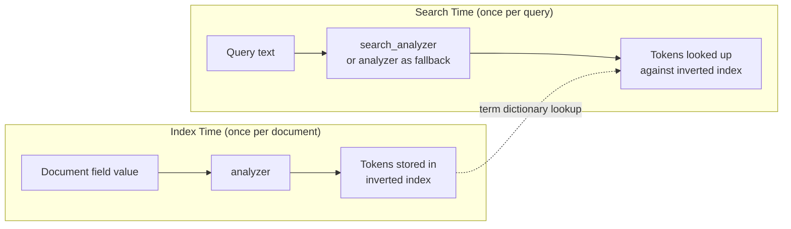

## Index-Time vs. Search-Time Analysis

### Overview

Elasticsearch applies text analysis at two distinct moments: once when a document is indexed, and again when a search query is executed. These two passes can use the same analyzer or two entirely different ones. Understanding this split is fundamental to diagnosing relevance issues, because a mismatch between how content was tokenized at write time and how a query is tokenized at read time is one of the most common causes of "this document should have matched but didn't."

### The Two Analysis Points

**Index-time analysis** runs when a document is indexed (or updated/reindexed). Elasticsearch takes the raw value of a `text` field, runs it through the field's configured `analyzer`, and stores the resulting tokens in the inverted index. This happens once per document, and the output is persisted — it is not recomputed on every query.

**Search-time analysis** runs when a query containing free text (such as `match`, `match_phrase`, `query_string`, or `multi_match`) is executed. Elasticsearch takes the query string and analyzes it using the field's `search_analyzer` (or falls back to the index-time `analyzer` if no `search_analyzer` is set), producing the terms that are then looked up against the already-built inverted index.



### Default Behavior — Same Analyzer for Both

By default, if you only specify `analyzer` on a field mapping and omit `search_analyzer`, Elasticsearch uses that same analyzer for both indexing and searching. This is the correct choice for the overwhelming majority of fields, since consistent tokenization on both sides guarantees that equivalent text produces equivalent tokens.

```
PUT my_index
{
  "mappings": {
    "properties": {
      "description": {
        "type": "text",
        "analyzer": "standard"
      }
    }
  }
}
```

Here, `"Running Shoes"` indexed and `"running"` searched both get lowercased and tokenized by the same `standard` analyzer, so the terms line up correctly.

### When to Diverge — Setting a Separate `search_analyzer`

There are specific, well-established scenarios where using a different analyzer at search time than at index time is intentional and beneficial.

**Key Points**

- **Synonyms at search time only**: Applying a `synonym` filter at index time permanently bakes synonym expansions into stored documents, which bloats the index and makes synonym updates require full reindexing. Applying it at search time instead means only the query expands, and updating the synonym list requires no reindexing.
- **Edge n-gram autocomplete fields**: Index-time analysis uses an `edge_ngram` filter to generate partial-word tokens (`r`, `ru`, `run`, `runn`, `runni`...), but search-time analysis must use a plain analyzer (e.g., `standard`) so the user's typed query is *not* n-grammed — otherwise the query would generate many tokens and match far too loosely.
- **Stemming asymmetry**: In rare cases, teams apply a more aggressive stemmer at index time and a lighter one (or none) at search time, or vice versa, to tune recall versus precision.

**Example — Edge N-Gram Autocomplete**

```
PUT autocomplete_index
{
  "settings": {
    "analysis": {
      "filter": {
        "edge_ngram_filter": {
          "type": "edge_ngram",
          "min_gram": 1,
          "max_gram": 20
        }
      },
      "analyzer": {
        "autocomplete_analyzer": {
          "type": "custom",
          "tokenizer": "standard",
          "filter": ["lowercase", "edge_ngram_filter"]
        },
        "autocomplete_search_analyzer": {
          "type": "custom",
          "tokenizer": "standard",
          "filter": ["lowercase"]
        }
      }
    }
  },
  "mappings": {
    "properties": {
      "product_name": {
        "type": "text",
        "analyzer": "autocomplete_analyzer",
        "search_analyzer": "autocomplete_search_analyzer"
      }
    }
  }
}
```

Indexing `"running shoes"` produces edge n-grams like `r`, `ru`, `run`, ..., `running`, `s`, `sh`, `sho`, ..., `shoes`. A user typing `"run"` at search time is analyzed by the plain `autocomplete_search_analyzer` into the single token `run`, which matches the stored `run` n-gram — without the query itself being needlessly n-grammed.

**Example — Synonyms at Search Time**

```
PUT synonyms_index
{
  "settings": {
    "analysis": {
      "filter": {
        "synonym_filter": {
          "type": "synonym",
          "synonyms": ["quick, fast, speedy"]
        }
      },
      "analyzer": {
        "synonym_search_analyzer": {
          "type": "custom",
          "tokenizer": "standard",
          "filter": ["lowercase", "synonym_filter"]
        }
      }
    }
  },
  "mappings": {
    "properties": {
      "description": {
        "type": "text",
        "analyzer": "standard",
        "search_analyzer": "synonym_search_analyzer"
      }
    }
  }
}
```

A document containing `"fast delivery"` is indexed with the plain `standard` analyzer (just `fast`, `delivery`). A search for `"quick delivery"` is expanded at query time to include `quick`, `fast`, `speedy`, `delivery`, so it matches the stored `fast` token even though `"quick"` never appears in the document.

### Verifying Both Sides with the Analyze API

Because `_analyze` with `field` uses the index-time analyzer by default, you must explicitly pass the search analyzer name to inspect the other side of the pipeline:

```
POST synonyms_index/_analyze
{
  "field": "description",
  "text": "fast delivery"
}
```

```
POST synonyms_index/_analyze
{
  "analyzer": "synonym_search_analyzer",
  "text": "quick delivery"
}
```

Comparing the two token outputs side by side is the standard method for confirming that a search-time divergence is producing the intended overlap.

### Common Pitfall — Accidental Mismatch

A frequent, unintentional error occurs when a custom analyzer is defined and applied only via `analyzer`, but a developer later adds a `search_analyzer` for one purpose (e.g., disabling stemming) without realizing it silently changes matching behavior for all queries on that field. Because `_analyze` output looks correct in isolation for each analyzer individually, this class of bug is often only caught by directly comparing index-time and search-time token streams against each other rather than reviewing either one alone.

**Key Points**

- If `search_analyzer` is set but produces tokens using a different stemmer, casing rule, or synonym set than the index-time analyzer, matches can silently fail even though both analyzers individually "work."
- `match_phrase` queries are especially sensitive to this, since phrase matching also depends on token `position` values lining up, not just the token text.

### Comparison Table

| Aspect | Index-Time Analysis | Search-Time Analysis |
|---|---|---|
| Mapping parameter | `analyzer` | `search_analyzer` (falls back to `analyzer` if unset) |
| Frequency | Once per document (at index/update/reindex) | Once per query execution |
| Output persisted? | Yes — stored in the inverted index | No — computed transiently, discarded after the query |
| Typical divergence use case | Broader tokenization (e.g., n-grams, aggressive stemming) | Narrower/exact tokenization, synonym expansion |
| Changing it retroactively | Requires reindexing existing documents | Takes effect immediately on next query, no reindex needed |

### Analyzer Resolution Flow

<svg xmlns="http://www.w3.org/2000/svg" viewBox="0 0 900 300" font-family="Helvetica, Arial, sans-serif">
  <text x="450" y="24" text-anchor="middle" font-size="16" font-weight="bold" fill="#1a1a1a">Analyzer Resolution at Index Time vs Search Time (svg_diagram)</text>

  <rect x="30" y="55" width="380" height="90" rx="8" fill="#e8f0fe" stroke="#4285f4" stroke-width="1.5" />
  <text x="220" y="80" text-anchor="middle" font-size="14" font-weight="bold" fill="#1a1a1a">Indexing a Document</text>
  <text x="220" y="102" text-anchor="middle" font-size="12" fill="#333">Field value --&gt; field's "analyzer"</text>
  <text x="220" y="122" text-anchor="middle" font-size="12" fill="#333">Result stored in inverted index</text>

  <rect x="490" y="55" width="380" height="90" rx="8" fill="#e6f4ea" stroke="#34a853" stroke-width="1.5" />
  <text x="680" y="80" text-anchor="middle" font-size="14" font-weight="bold" fill="#1a1a1a">Executing a Query</text>
  <text x="680" y="102" text-anchor="middle" font-size="12" fill="#333">Query text --&gt; "search_analyzer"</text>
  <text x="680" y="122" text-anchor="middle" font-size="12" fill="#333">if unset, falls back to "analyzer"</text>

  <line x1="220" y1="145" x2="220" y2="180" stroke="#888" stroke-width="2" marker-end="url(#arrow2)" />
  <line x1="680" y1="145" x2="680" y2="180" stroke="#888" stroke-width="2" marker-end="url(#arrow2)" />

  <rect x="30" y="180" width="380" height="50" rx="8" fill="#fef7e0" stroke="#f9ab00" stroke-width="1.5" />
  <text x="220" y="210" text-anchor="middle" font-size="12" fill="#1a1a1a">Tokens A (persisted, term dictionary)</text>

  <rect x="490" y="180" width="380" height="50" rx="8" fill="#fef7e0" stroke="#f9ab00" stroke-width="1.5" />
  <text x="680" y="210" text-anchor="middle" font-size="12" fill="#1a1a1a">Tokens B (transient, per query)</text>

  <line x1="220" y1="230" x2="450" y2="260" stroke="#a142f4" stroke-width="2" marker-end="url(#arrow2)" />
  <line x1="680" y1="230" x2="450" y2="260" stroke="#a142f4" stroke-width="2" marker-end="url(#arrow2)" />

  <rect x="280" y="260" width="340" height="35" rx="8" fill="#f3e8fd" stroke="#a142f4" stroke-width="1.5" />
  <text x="450" y="283" text-anchor="middle" font-size="12" fill="#1a1a1a">Term-by-term lookup determines match</text>

  </svg>

### `keyword` Fields — No Analysis Split

`keyword` fields do not use `analyzer`/`search_analyzer` at all; they optionally use a single `normalizer` applied identically at both index and search time, and the field value is stored as one unanalyzed (or minimally normalized) token. [Inference] Because there is only one normalization step shared by both paths, the index-time/search-time divergence concept described here does not apply to `keyword` fields in the way it applies to `text` fields.

### Practical Tips

- Only set `search_analyzer` when you have a specific, deliberate reason (autocomplete, synonym expansion, asymmetric stemming). Leaving it unset is the safer default.
- After introducing or changing a `search_analyzer`, always re-verify both index-time and search-time token output with `_analyze` to confirm the intended overlap still occurs.
- Changing the index-time `analyzer` on an existing mapping does not retroactively re-tokenize already-indexed documents — a reindex is required for the change to take effect on existing data.
- For `match_phrase` queries, confirm that token `position` alignment (not just token text) is preserved across both analyzers, since phrase queries depend on sequential positions matching.

**Related Topics**

- Analyze API (inspecting index-time and search-time token streams directly)
- Custom Analyzers — combining char filters, tokenizers, and token filters in mappings
- Synonym Token Filter (`synonym` vs `synonym_graph`)
- Edge N-Gram and N-Gram Tokenizers/Filters for Autocomplete
- Normalizers for Keyword Fields
- `match_phrase` and Position-Sensitive Queries
- Reindexing Strategies After Mapping or Analyzer Changes