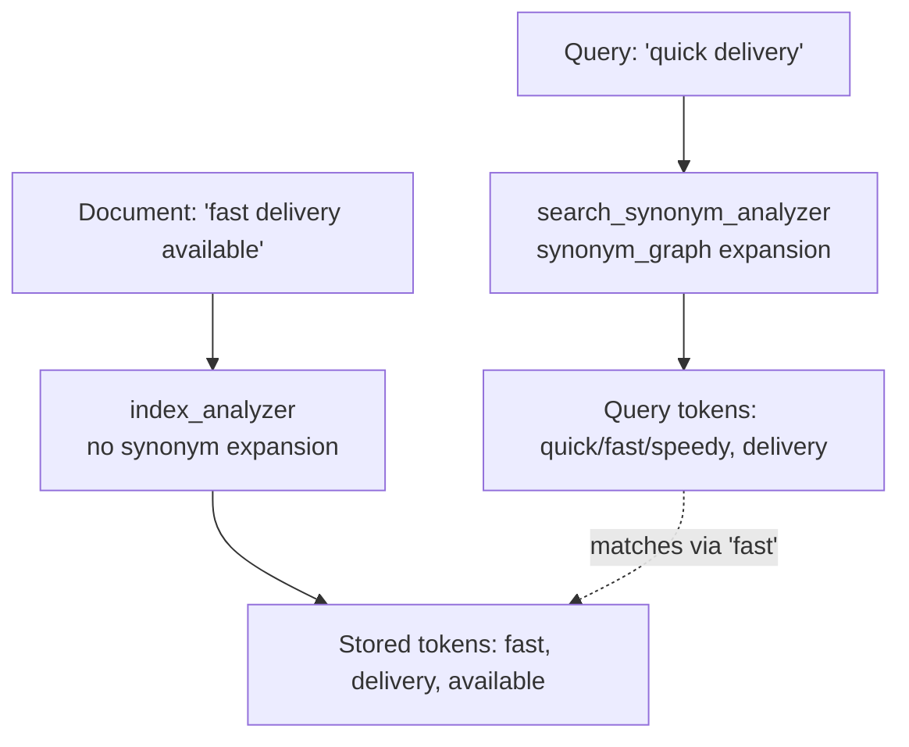

## Synonym Handling

### Overview

Synonym handling lets Elasticsearch treat different words as equivalent during search — matching "quick" against documents containing "fast," or "TV" against "television" — without requiring the indexed content or the query text to use identical vocabulary. This is implemented through the `synonym` and `synonym_graph` token filters, which are inserted into an analyzer's filter chain and either replace or expand tokens according to a defined synonym mapping.

### The Two Synonym Filters

Elasticsearch provides two distinct token filters for synonym handling, and choosing the wrong one is a common source of subtle matching bugs.

**Key Points**

- **`synonym`**: Operates on single tokens only. It works correctly for one-word-to-one-word or one-word-to-multi-word mappings but does not correctly preserve token graph structure for multi-word synonyms, which can distort phrase queries.
- **`synonym_graph`**: Aware of multi-word synonyms and preserves the token graph correctly, making it the safer choice whenever any synonym rule involves multi-word phrases (e.g., `"USA => United States of America"`). It should be used at search time via `search_analyzer` rather than at index time, since graph-aware filters are not designed to be applied during indexing.

[Unverified] The precise internal mechanics of token graph preservation (position_length attributes and multi-token synonym paths) are implementation details that may evolve across Elasticsearch versions, but the general guidance — use `synonym_graph` for multi-word synonyms, and prefer applying it at search time — has been stable official guidance across recent versions.

### Synonym Formats

Synonym rules can be authored in two formats:

**Solr format** (the traditional format, widely supported):

```
# Equivalent synonyms (all terms are interchangeable)
quick, fast, speedy

# Explicit mapping (left side maps to right side only)
usa, united states => united states of america

# Single-direction expansion
laptop => laptop, notebook computer
```

**WordNet format** (less commonly used, based on WordNet prolog format):

```
s(100000001,1,'quick',a,1,0).
s(100000001,2,'fast',a,1,0).
```

[Unverified] WordNet format support and exact syntax requirements are less commonly exercised in typical deployments compared to Solr format, so consult current official documentation before relying on it for a production synonym set.

### Defining Synonyms Inline

Synonyms can be defined directly in the index settings using the `synonyms` array:

```
PUT products_index
{
  "settings": {
    "analysis": {
      "filter": {
        "synonym_filter": {
          "type": "synonym_graph",
          "synonyms": [
            "quick, fast, speedy",
            "usa, united states => united states of america",
            "laptop => laptop, notebook computer"
          ]
        }
      },
      "analyzer": {
        "synonym_analyzer": {
          "type": "custom",
          "tokenizer": "standard",
          "filter": ["lowercase", "synonym_filter"]
        }
      }
    }
  }
}
```

Inline definitions are convenient for small, stable synonym sets, but every change requires closing and reopening the index (or updating settings and reindexing, depending on the change type) since analysis settings are generally not dynamically updatable on an open index without a close/open cycle for static settings changes.

### Defining Synonyms via a File

For larger or more frequently updated synonym sets, storing them in a file is the standard approach:

```
PUT products_index
{
  "settings": {
    "analysis": {
      "filter": {
        "synonym_filter": {
          "type": "synonym_graph",
          "synonyms_path": "analysis/synonyms.txt"
        }
      },
      "analyzer": {
        "synonym_analyzer": {
          "type": "custom",
          "tokenizer": "standard",
          "filter": ["lowercase", "synonym_filter"]
        }
      }
    }
  }
}
```

The `synonyms_path` is relative to the Elasticsearch `config` directory. Each node in the cluster needs access to an identical copy of this file, since analysis runs locally on the node handling the relevant shard operation.

### Index-Time vs. Search-Time Synonym Application

This is the single most important architectural decision in synonym handling, and it follows directly from the general index-time/search-time analysis split.

| Approach | Behavior | Trade-off |
|---|---|---|
| Synonyms at index time | Synonym expansions are baked into the stored tokens for every document | Index grows larger; updating synonyms requires reindexing all documents; but query-time cost is lower |
| Synonyms at search time | Only the query is expanded against synonyms; documents stay tokenized as originally written | Updating synonyms only requires reopening the index/analyzer, no reindex; but every query pays the expansion cost |

**Example — Search-Time Synonym Setup (Recommended Default)**

```
PUT products_index
{
  "settings": {
    "analysis": {
      "filter": {
        "synonym_filter": {
          "type": "synonym_graph",
          "synonyms_path": "analysis/synonyms.txt"
        }
      },
      "analyzer": {
        "index_analyzer": {
          "type": "custom",
          "tokenizer": "standard",
          "filter": ["lowercase"]
        },
        "search_synonym_analyzer": {
          "type": "custom",
          "tokenizer": "standard",
          "filter": ["lowercase", "synonym_filter"]
        }
      }
    }
  },
  "mappings": {
    "properties": {
      "description": {
        "type": "text",
        "analyzer": "index_analyzer",
        "search_analyzer": "search_synonym_analyzer"
      }
    }
  }
}
```

This is the generally recommended pattern: documents are indexed plainly, and only the query benefits from synonym expansion, which keeps the synonym list updatable without a full reindex.



### Verifying Synonym Expansion with the Analyze API

```
POST products_index/_analyze
{
  "analyzer": "search_synonym_analyzer",
  "text": "quick delivery"
}
```

**Output**

```
{
  "tokens": [
    { "token": "quick", "start_offset": 0, "end_offset": 5, "type": "SYNONYM", "position": 0 },
    { "token": "fast", "start_offset": 0, "end_offset": 5, "type": "SYNONYM", "position": 0 },
    { "token": "speedy", "start_offset": 0, "end_offset": 5, "type": "SYNONYM", "position": 0 },
    { "token": "delivery", "start_offset": 6, "end_offset": 14, "type": "<ALPHANUM>", "position": 1 }
  ]
}
```

Notice that `quick`, `fast`, and `speedy` all share `position: 0` — this is the expected behavior for equivalent synonyms, since they occupy the same slot in the token graph rather than being treated as sequential words.

### Multi-Word Synonyms and Phrase Query Interaction

Multi-word synonym expansion interacts with `match_phrase` queries in ways that are easy to get wrong. Expanding `"usa"` to `"united states of america"` at query time changes a single-token query into a four-token phrase requirement, which can unexpectedly narrow or break matching if not tested carefully.

**Key Points**

- Use `synonym_graph` (not `synonym`) whenever multi-word synonym rules exist, specifically because it correctly encodes the multi-token span so phrase and proximity queries interpret it as one semantic unit rather than four sequential, independently-positioned tokens.
- Test multi-word synonym expansions explicitly with `_analyze` and `explain: true` before relying on them in production `match_phrase` queries.
- [Inference] Because multi-word synonym expansion increases the token count of a query, it can also affect relevance scoring in ways that are not always intuitive, so score-sensitive applications should validate results empirically rather than assuming expansion is purely beneficial.

### Explicit vs. Equivalent Synonym Rules

**Equivalent (comma-separated, symmetric):**

```
quick, fast, speedy
```

Any of these three terms in a query or document is treated as matching any of the others — full symmetric substitution.

**Explicit (arrow mapping, asymmetric):**

```
usa, united states => united states of america
```

Only the left-hand terms map to the right-hand term; the reverse is not automatically true. A query for `"united states of america"` will not automatically expand back to `"usa"` unless a separate rule defines that direction. This asymmetry is intentional and commonly used to normalize toward a single canonical term (e.g., mapping variant abbreviations toward one full form).

### Common Pitfalls

**Key Points**

- **Using `synonym` instead of `synonym_graph` with multi-word rules**: silently degrades phrase query accuracy because position information for multi-word synonyms is not preserved correctly.
- **Applying `synonym_graph` at index time**: not the recommended usage pattern; graph-aware filters are designed for search-time application, and applying them at index time can produce inconsistent indexing behavior.
- **Forgetting `lowercase` ordering**: if the synonym filter is placed before a `lowercase` filter in the chain, case mismatches between the synonym file and incoming text can cause rules to silently fail to trigger. Placing `lowercase` before the synonym filter (assuming the synonym file itself is lowercase) avoids this.
- **Stale synonym files**: updates to a `synonyms_path` file require reloading the analyzer (via index close/open, or in some setups a dedicated reload API) — simply editing the file does not automatically propagate to a running analyzer, and behavior here can depend on cluster configuration.

### Practical Tips

- Default to search-time synonym application unless you have a specific, measured reason (such as reducing per-query latency at scale) to apply synonyms at index time.
- Keep synonym files under version control and treat changes to them as you would any other schema/configuration change, since they directly affect search relevance.
- Always validate a new or edited synonym rule set with `_analyze` against representative sample queries before deploying to production.
- For very large synonym sets, monitor query latency, since search-time expansion adds tokens to every analyzed query and can measurably affect performance at scale. [Inference] The magnitude of this effect depends on synonym set size, query volume, and hardware, so it should be benchmarked in your specific environment rather than assumed.

**Related Topics**

- Analyze API (verifying synonym expansion output)
- Index-Time vs. Search-Time Analysis
- Custom Analyzers — combining char filters, tokenizers, and token filters
- `match_phrase` and Position-Sensitive Queries
- Stemming and Stop Word Filters
- Reloading Analyzers / Updating Synonym Files Without Full Reindex