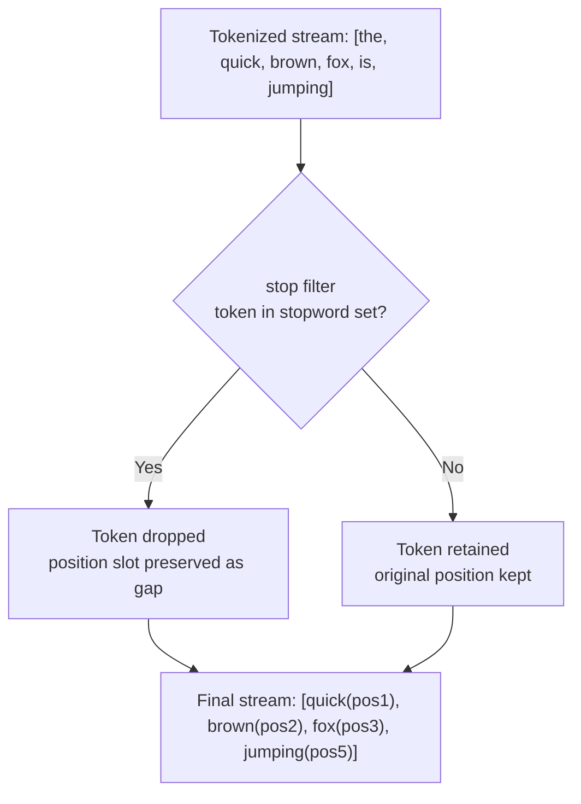

## Stop Words Configuration

### Overview

Stop words are common, typically low-information words — such as "the," "is," "at," "which," and "on" in English — that are frequently removed during text analysis because they occur so often that they add little value to search relevance while inflating index size. Elasticsearch handles this through the `stop` token filter, which can use predefined language-specific stop word lists, a custom list, or a file-based list, and which can be configured differently for index time and search time like any other filter.

### The `stop` Token Filter

The `stop` filter is a token filter, meaning it operates on already-tokenized output and simply removes tokens that match its configured stop word set.

```
POST _analyze
{
  "tokenizer": "standard",
  "filter": ["lowercase", "stop"],
  "text": "The quick brown fox is jumping over the lazy dog"
}
```

**Output**

```
{
  "tokens": [
    { "token": "quick", "start_offset": 4, "end_offset": 9, "type": "<ALPHANUM>", "position": 1 },
    { "token": "brown", "start_offset": 10, "end_offset": 15, "type": "<ALPHANUM>", "position": 2 },
    { "token": "fox", "start_offset": 16, "end_offset": 19, "type": "<ALPHANUM>", "position": 3 },
    { "token": "jumping", "start_offset": 23, "end_offset": 30, "type": "<ALPHANUM>", "position": 5 },
    { "token": "lazy", "start_offset": 35, "end_offset": 39, "type": "<ALPHANUM>", "position": 8 },
    { "token": "dog", "start_offset": 40, "end_offset": 43, "type": "<ALPHANUM>", "position": 9 }
  ]
}
```

Note that `the`, `is`, and `over` were removed, and — critically — the remaining tokens retain their **original position values** (1, 2, 3, 5, 8, 9) rather than being renumbered sequentially. This gap preservation is essential: it keeps `match_phrase` queries and proximity-based scoring accurate even after stop words are stripped out, since the relative distance between surviving terms in the original text is preserved.

### Default Stop Word List

By default, when the `stop` filter is used without configuration, it applies the built-in `_english_` stop word set. Elasticsearch provides predefined stop word sets for numerous languages, referenced by name.

```
POST _analyze
{
  "tokenizer": "standard",
  "filter": ["lowercase", { "type": "stop", "stopwords": "_english_" }],
  "text": "This is a test of the system"
}
```

**Key Points**

- Predefined language stop word sets are referenced using an underscore-wrapped name, e.g., `_english_`, `_french_`, `_spanish_`, `_german_`, `_none_`.
- `_none_` disables stop word filtering entirely — useful as an explicit override in a custom filter definition.
- [Unverified] The exact contents of each built-in language stop word list are maintained internally and can change slightly across Elasticsearch versions; consult current documentation if exact list contents matter for a specific application.

### Custom Stop Word Lists

For most production use cases, relying on the default list is insufficient — domain-specific stop words (e.g., "product," "item," "click" for an e-commerce catalog) often need to be added, or the default list needs to be trimmed.

**Inline custom list:**

```
PUT my_index
{
  "settings": {
    "analysis": {
      "filter": {
        "custom_stop_filter": {
          "type": "stop",
          "stopwords": ["product", "item", "click", "here"]
        }
      },
      "analyzer": {
        "custom_stop_analyzer": {
          "type": "custom",
          "tokenizer": "standard",
          "filter": ["lowercase", "custom_stop_filter"]
        }
      }
    }
  }
}
```

**Combining a predefined list with additional custom terms:**

```
PUT my_index
{
  "settings": {
    "analysis": {
      "filter": {
        "extended_stop_filter": {
          "type": "stop",
          "stopwords": "_english_",
          "stopwords_path": "analysis/custom_stopwords.txt"
        }
      }
    }
  }
}
```

[Unverified] Whether `stopwords` and `stopwords_path` can be combined simultaneously in a single filter definition, versus requiring one or the other, has varied across documentation examples; verify current syntax requirements before relying on combining both in one filter, or use two chained `stop` filters as a safer alternative.

**File-based list:**

```
PUT my_index
{
  "settings": {
    "analysis": {
      "filter": {
        "file_stop_filter": {
          "type": "stop",
          "stopwords_path": "analysis/stopwords.txt"
        }
      }
    }
  }
}
```

The referenced file must be a plain text file with one stop word per line, located relative to the Elasticsearch `config` directory, and available identically on every node in the cluster.

### The `ignore_case` Parameter

By default, stop word matching in a custom `stopwords` array is case-sensitive against the token stream at the point the `stop` filter runs. Since the `stop` filter is typically placed after `lowercase` in a filter chain, tokens are already lowercased by the time they reach it — but if `stop` is placed before `lowercase`, mismatches can silently occur.

```
{
  "type": "stop",
  "stopwords": ["The", "Is", "At"],
  "ignore_case": true
}
```

**Key Points**

- Setting `ignore_case: true` matches stop words regardless of case, removing the dependency on exact filter ordering relative to `lowercase`.
- The safer, more common practice is still to place `lowercase` before `stop` in the filter chain and keep the custom stop word list itself lowercase, rather than relying on `ignore_case` as a substitute for correct ordering.

### Removing Trailing Stop Words in Phrase-Sensitive Contexts

The `remove_trailing` parameter controls whether a stop word at the very end of the analyzed text is removed. This matters specifically for search-as-you-type or autocomplete-style analysis, where a user might still be typing a stop word (e.g., "the") and premature removal could produce unexpected empty or truncated queries.

```
{
  "type": "stop",
  "stopwords": "_english_",
  "remove_trailing": false
}
```

[Unverified] The default value and precise behavioral nuance of `remove_trailing` in edge cases (such as multi-value fields) should be confirmed against the currently installed Elasticsearch version's documentation, since defaults for less commonly tuned parameters are more prone to being misremembered.

### Should You Remove Stop Words at All?

This is a genuine design decision, not a settled default, and depends heavily on the use case.

| Scenario | Recommendation | Reasoning |
|---|---|---|
| General full-text search over large documents | Remove stop words | Reduces index size; stop words rarely carry search intent in long-form content |
| Exact phrase search (e.g., legal, literary text) | Keep stop words | Removing "to be or not to be" down to "be" destroys the phrase's meaning and matchability |
| Song lyrics, quotes, or titles search | Keep stop words | Many titles/phrases are built almost entirely from common words (e.g., "The Who," "To Kill a Mockingbird") |
| Short-text fields (tags, categories) | Often skip the `stop` filter entirely | Short controlled vocabularies rarely contain stop words to begin with |
| Autocomplete / search-as-you-type | Use with caution, consider `remove_trailing: false` | Premature removal of an in-progress stop word can break the in-progress query |

**Key Points**

- Removing stop words is a trade-off between index size/performance and preserving exact-phrase or short-title matchability — it is not universally "better."
- [Inference] For applications where users frequently search using natural, common-word-heavy phrases (e.g., movie/song title search), disabling stop word removal (using `_none_` or omitting the `stop` filter) generally produces more intuitive results, though this should be validated against real user query patterns rather than assumed.

### Stop Words and Multi-Field Strategy

A common pattern is to define two sub-fields on the same underlying field — one with stop words removed for general relevance-ranked search, and one without, for exact-phrase matching.

```
PUT my_index
{
  "mappings": {
    "properties": {
      "title": {
        "type": "text",
        "analyzer": "standard_with_stopwords_removed",
        "fields": {
          "exact": {
            "type": "text",
            "analyzer": "standard_no_stopwords"
          }
        }
      }
    }
  }
}
```

This lets queries choose, per use case, whether to search `title` (broad, stop-word-free) or `title.exact` (precise, stop-word-preserving), often combined in a single `bool` query with different boost weights.

### Stop Word Filtering Pipeline



### Verifying with the Analyze API

```
POST my_index/_analyze
{
  "analyzer": "custom_stop_analyzer",
  "text": "Click here for the product details"
}
```

Running this against a custom stop analyzer confirms exactly which domain-specific terms are being stripped, and combined with `explain: true`, shows the pre-filter and post-filter token streams side by side for direct comparison.

### Practical Tips

- Always verify stop word behavior with `_analyze` before deploying, especially after combining a predefined list with custom additions.
- Consider whether stop word removal should differ between index time and search time — in most implementations, it is kept identical on both sides, since inconsistent removal (present at index time, absent at search time, or vice versa) can cause phrase queries to fail unexpectedly.
- For multi-language content, ensure the correct language-specific stop word list is selected per field or per language-specific index, since an English list applied to non-English content will not filter meaningfully and may even remove unintended tokens that happen to overlap.
- Re-evaluate stop word configuration whenever relevance issues arise around short or common-word-heavy queries, since this is a frequent, easily overlooked root cause.

**Related Topics**

- Analyze API (verifying stop word removal output)
- Index-Time vs. Search-Time Analysis
- Synonym Handling
- Custom Analyzers — combining char filters, tokenizers, and token filters
- `match_phrase` and Position-Sensitive Queries
- Multi-Fields Mapping Strategy (`fields` parameter)
- Language-Specific Analyzers