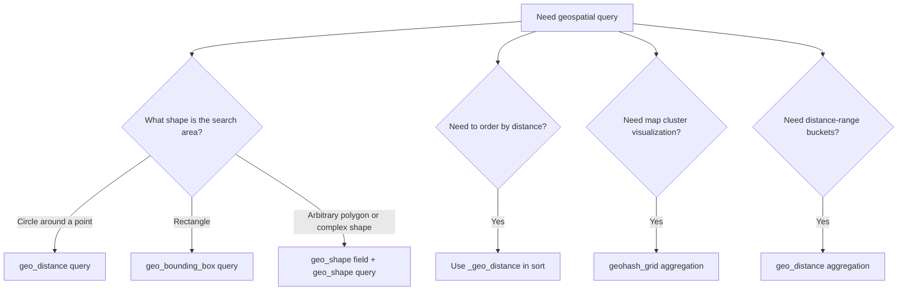

## geo_point Field Type

### Overview

The `geo_point` field type stores latitude/longitude coordinate pairs, enabling geospatial queries, filtering, sorting, and aggregations based on geographic location. It underpins use cases like "find all coffee shops within 2km," "sort restaurants by distance from me," and "show all warehouses within this bounding box." Unlike text analysis fields, `geo_point` is not analyzed — it is a structured, numeric-pair field type with its own indexing structure optimized for spatial operations.

### Defining a `geo_point` Field

```
PUT locations_index
{
  "mappings": {
    "properties": {
      "location": {
        "type": "geo_point"
      }
    }
  }
}
```

### Supported Input Formats

Elasticsearch accepts coordinate input in several formats, all of which are normalized internally to the same representation.

**Object format (explicit, recommended for clarity):**

```
PUT locations_index/_doc/1
{
  "name": "Central Park Cafe",
  "location": {
    "lat": 40.785091,
    "lon": -73.968285
  }
}
```

**String format `"lat,lon"`:**

```
PUT locations_index/_doc/2
{
  "name": "Times Square Diner",
  "location": "40.758896,-73.985130"
}
```

**Geohash string:**

```
PUT locations_index/_doc/3
{
  "name": "Brooklyn Bridge Kiosk",
  "location": "dr5regw3p"
}
```

**Array format `[lon, lat]` — note the reversed order:**

```
PUT locations_index/_doc/4
{
  "name": "Empire State Building Shop",
  "location": [-73.985664, 40.748817]
}
```

**Well-Known Text (WKT) point format:**

```
PUT locations_index/_doc/5
{
  "name": "High Line Entrance",
  "location": "POINT (-74.004811 40.748441)"
}
```

**Key Points**

- The array format `[lon, lat]` follows GeoJSON convention (longitude first), which is the **reverse** of the `"lat,lon"` string format and the object format's field order. This inconsistency is a frequent source of indexing errors, since swapping the two produces a coordinate that is often still numerically valid (just geographically wrong) and may not raise an error.
- All formats are converted to the same internal representation at index time, so query behavior is identical regardless of which input format was used to index a given document.

### Distance Queries — `geo_distance`

The `geo_distance` query filters documents to those within a specified radius of a given point.

```
GET locations_index/_search
{
  "query": {
    "bool": {
      "filter": {
        "geo_distance": {
          "distance": "2km",
          "location": {
            "lat": 40.758896,
            "lon": -73.985130
          }
        }
      }
    }
  }
}
```

Distance units accepted include `km`, `m`, `mi`, `yd`, `ft`, and `nmi` (nautical miles), specified directly in the `distance` string (e.g., `"5mi"`, `"500m"`).

### Bounding Box Queries — `geo_bounding_box`

The `geo_bounding_box` query filters to documents whose location falls within a rectangular area defined by top-left and bottom-right corners.

```
GET locations_index/_search
{
  "query": {
    "bool": {
      "filter": {
        "geo_bounding_box": {
          "location": {
            "top_left": {
              "lat": 40.79,
              "lon": -74.01
            },
            "bottom_right": {
              "lat": 40.70,
              "lon": -73.96
            }
          }
        }
      }
    }
  }
}
```

Bounding box queries are computationally cheaper than `geo_distance` queries and are often used as a coarse pre-filter before a more precise distance calculation.

### Sorting by Distance

Documents can be sorted by their distance from a reference point using `_geo_distance` in the sort clause.

```
GET locations_index/_search
{
  "query": { "match_all": {} },
  "sort": [
    {
      "_geo_distance": {
        "location": {
          "lat": 40.758896,
          "lon": -73.985130
        },
        "order": "asc",
        "unit": "km"
      }
    }
  ]
}
```

Each result includes a `sort` value representing the computed distance in the specified unit, which is useful for displaying "3.2 km away" style output directly from the response.

### Geo Aggregations

**`geo_distance` aggregation** — buckets documents into distance ranges from a point:

```
GET locations_index/_search
{
  "size": 0,
  "aggs": {
    "rings_around_times_square": {
      "geo_distance": {
        "field": "location",
        "origin": "40.758896,-73.985130",
        "unit": "km",
        "ranges": [
          { "to": 1 },
          { "from": 1, "to": 5 },
          { "from": 5 }
        ]
      }
    }
  }
}
```

**`geohash_grid` aggregation** — buckets documents into geohash grid cells, commonly used to power map-based clustering visualizations at varying zoom levels:

```
GET locations_index/_search
{
  "size": 0,
  "aggs": {
    "grid_clusters": {
      "geohash_grid": {
        "field": "location",
        "precision": 5
      }
    }
  }
}
```

Higher `precision` values produce smaller, more numerous grid cells; lower values produce larger, coarser cells — this parameter is typically tied to the map's current zoom level in a front-end integration.

### Geo Query Types at a Glance

| Query Type | Purpose | Relative Cost |
|---|---|---|
| `geo_distance` | Radius search around a point | Moderate |
| `geo_bounding_box` | Rectangular area filter | Low — cheapest geo filter |
| `geo_polygon` | Arbitrary polygon area filter | [Unverified] Deprecated in favor of `geo_shape` in recent versions — verify current status before use | 
| `geo_shape` (requires `geo_shape` field type) | Complex shape intersection, containment, disjoint checks | Higher |
| `_geo_distance` sort | Order results by distance | Moderate |

[Inference] Relative cost ordering is a general guideline based on the computational complexity of each operation (rectangular bounds checks are cheaper than radius/great-circle calculations), but actual performance depends on index size, shard count, and hardware, so it should be benchmarked for specific workloads rather than assumed.

### `geo_point` vs. `geo_shape`

**Key Points**

- `geo_point` stores a single coordinate pair per value — it represents a point, not an area or line.
- `geo_shape` is a separate field type for storing arbitrary geometries (polygons, lines, multi-points, circles) and supports relationship queries like `within`, `contains`, `intersects`, and `disjoint`.
- A field can hold **multiple** `geo_point` values (an array of points) if defined to do so, representing multiple locations for a single document (e.g., all delivery stops for one order).
- Choose `geo_point` when the entity being indexed genuinely has a single (or several discrete) location(s); choose `geo_shape` when it has spatial extent (a delivery zone, a country border, a route).

### Precision and Internal Storage

[Unverified] `geo_point` fields are internally indexed using a combination of a BKD tree (recent Lucene/Elasticsearch versions) for efficient spatial range queries, providing high practical precision. Exact internal precision figures and indexing structures are implementation details that have changed across Elasticsearch versions, so specific numeric precision claims should be verified against current documentation rather than assumed to be constant.

**Key Points**

- `geo_point` does not support fractional-degree precision loss issues in typical usage — precision is generally sufficient for all real-world mapping applications (down to centimeter-level distinctions in most configurations).
- Disabling `doc_values` on a `geo_point` field (rare, and only via explicit mapping configuration) would prevent sorting and aggregations on that field, since those operations depend on `doc_values` being available.

### Geo Query Selection Flow



### Common Pitfalls

**Key Points**

- **Swapping lat/lon in array format**: since GeoJSON-style arrays are `[lon, lat]` while the object and string formats are lat-first, mixing formats across an ingestion pipeline without care is a frequent source of silently wrong coordinates.
- **Using `geo_point` for areas**: attempting to represent a delivery zone, region, or route as a single `geo_point` (e.g., a centroid) loses the actual spatial extent needed for `within`/`intersects` style queries — `geo_shape` is the correct type for that use case.
- **Ignoring the `geo_distance` calculation mode**: [Unverified] the underlying distance calculation approach (e.g., arc-based vs. plane-based approximation) can affect precision at very large distances or near the poles; consult current documentation if sub-meter accuracy at extreme scales matters for the application.

### Practical Tips

- Prefer the object format (`{"lat": ..., "lon": ...}`) for indexing whenever possible, since it is the most explicit and least error-prone against the lat/lon-order pitfall.
- Use `geo_bounding_box` as a cheap pre-filter combined with `geo_distance` for precise radius filtering when working over very large datasets, since bounding box checks are computationally cheaper.
- Validate coordinate ranges during ingestion (latitude between -90 and 90, longitude between -180 and 180) at the application layer, since Elasticsearch will reject clearly invalid values but application-level validation catches issues earlier in the pipeline.
- When building map-based UIs, tie `geohash_grid` `precision` dynamically to the current map zoom level for a smooth clustering experience as users zoom in and out.

**Related Topics**

- `geo_shape` Field Type and Spatial Relationship Queries
- Geo Aggregations (`geohash_grid`, `geotile_grid`, `geo_centroid`)
- Bounding Box and Polygon Query Deep Dive
- Sorting and Scoring with Distance-Based Functions
- Mapping Multi-Value Geo Fields
- Combining Geo Filters with `bool` Queries for Location-Based Search