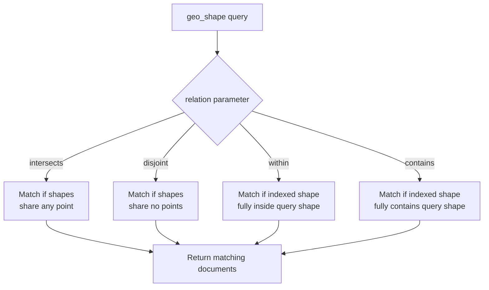

## geo_shape Field Type

### Overview

The `geo_shape` field type stores arbitrary geometric shapes — polygons, lines, multi-points, circles, and collections of these — enabling queries that test spatial relationships like containment, intersection, and disjointness. Where `geo_point` represents a single location, `geo_shape` represents spatial extent: a delivery zone, a country border, a flight path, a building footprint. It is the field type to use whenever the entity being modeled has an actual shape rather than a single coordinate.

### Defining a `geo_shape` Field

```
PUT regions_index
{
  "mappings": {
    "properties": {
      "area": {
        "type": "geo_shape"
      }
    }
  }
}
```

### Supported Geometry Types

`geo_shape` accepts GeoJSON geometry objects (and equivalent Well-Known Text representations) for the following shape types:

| Geometry Type | Description |
|---|---|
| `Point` | A single coordinate pair |
| `LineString` | An ordered sequence of coordinates forming a line |
| `Polygon` | A closed shape defined by an outer boundary and optional inner holes |
| `MultiPoint` | Multiple independent points |
| `MultiLineString` | Multiple independent lines |
| `MultiPolygon` | Multiple independent polygons |
| `GeometryCollection` | A mix of any of the above geometry types |
| `Envelope` | A bounding rectangle, defined by top-left and bottom-right corners (Elasticsearch-specific extension, not standard GeoJSON) |
| `Circle` | [Unverified] Circle support and its exact query behavior has varied across Elasticsearch versions — verify current support before relying on it, as it has historically had limitations compared to other shape types |

### Indexing Shapes — GeoJSON Format

**Polygon (e.g., a delivery zone):**

```
PUT regions_index/_doc/1
{
  "name": "Downtown Delivery Zone",
  "area": {
    "type": "Polygon",
    "coordinates": [
      [
        [-74.0060, 40.7128],
        [-73.9950, 40.7128],
        [-73.9950, 40.7050],
        [-74.0060, 40.7050],
        [-74.0060, 40.7128]
      ]
    ]
  }
}
```

**LineString (e.g., a route):**

```
PUT regions_index/_doc/2
{
  "name": "Delivery Route A",
  "area": {
    "type": "LineString",
    "coordinates": [
      [-74.0060, 40.7128],
      [-74.0020, 40.7100],
      [-73.9980, 40.7080]
    ]
  }
}
```

**Envelope (bounding rectangle):**

```
PUT regions_index/_doc/3
{
  "name": "Coarse Service Area",
  "area": {
    "type": "envelope",
    "coordinates": [
      [-74.02, 40.75],
      [-73.96, 40.70]
    ]
  }
}
```

**Key Points**

- GeoJSON coordinates are always in `[longitude, latitude]` order — the same convention used by the `geo_point` array format, and again the reverse of the intuitive "lat, lon" spoken order.
- A `Polygon`'s coordinate array is an array of linear rings: the first ring is the outer boundary, and any subsequent rings define holes cut out of that boundary.
- A polygon's first and last coordinate pair must be identical to close the ring, as shown in the example above where the first and last points both equal `[-74.0060, 40.7128]`.

### Indexing Shapes — Well-Known Text (WKT) Format

```
PUT regions_index/_doc/4
{
  "name": "Service Boundary",
  "area": "POLYGON ((-74.0060 40.7128, -73.9950 40.7128, -73.9950 40.7050, -74.0060 40.7050, -74.0060 40.7128))"
}
```

WKT format is convenient when data originates from GIS systems or databases (such as PostGIS) that natively export WKT strings, avoiding a manual conversion step to GeoJSON.

### Spatial Relationship Queries

The `geo_shape` query supports several relationship types, specified via the `relation` parameter, that determine how the query shape must relate to indexed shapes for a document to match.

```
GET regions_index/_search
{
  "query": {
    "bool": {
      "filter": {
        "geo_shape": {
          "area": {
            "shape": {
              "type": "point",
              "coordinates": [-74.0000, 40.7100]
            },
            "relation": "within"
          }
        }
      }
    }
  }
}
```

| Relation | Meaning |
|---|---|
| `intersects` (default) | Indexed shape and query shape share at least one point |
| `disjoint` | Indexed shape and query shape share no points at all |
| `within` | Indexed shape is entirely contained within the query shape |
| `contains` | Indexed shape entirely contains the query shape |

**Example — "Is this delivery address inside any known zone?"**

```
GET regions_index/_search
{
  "query": {
    "bool": {
      "filter": {
        "geo_shape": {
          "area": {
            "shape": {
              "type": "point",
              "coordinates": [-74.0000, 40.7090]
            },
            "relation": "contains"
          }
        }
      }
    }
  }
}
```

Here, `"relation": "contains"` asks: does the indexed polygon contain this point? This is the standard pattern for "which zone is this address in" lookups.

### Referencing a Pre-Indexed Shape

Instead of embedding the query shape's coordinates directly in the request, a shape already stored in another document can be referenced, which avoids re-sending potentially large coordinate arrays and keeps queries in sync with a canonical shape definition.

```
GET regions_index/_search
{
  "query": {
    "bool": {
      "filter": {
        "geo_shape": {
          "area": {
            "indexed_shape": {
              "index": "boundaries_index",
              "id": "manhattan_boundary",
              "path": "boundary"
            },
            "relation": "within"
          }
        }
      }
    }
  }
}
```

### `geo_shape` vs. `geo_point`: Decision Comparison

| Aspect | `geo_point` | `geo_shape` |
|---|---|---|
| Represents | A single coordinate (or array of discrete coordinates) | Arbitrary geometry — lines, polygons, collections |
| Typical use case | Store locations, POIs, device positions | Store boundaries, zones, routes, footprints |
| Distance queries | Yes (`geo_distance`) | [Unverified] Distance-based queries against `geo_shape` are more limited/less direct than against `geo_point`; verify current capability if distance-from-shape is a core requirement |
| Relationship queries | No (points cannot "contain" or "intersect" in a meaningful multi-point sense) | Yes (`intersects`, `within`, `contains`, `disjoint`) |
| Aggregation support | Rich (`geohash_grid`, `geo_distance`, `geo_centroid`) | [Unverified] More limited aggregation support compared to `geo_point`; verify current version capabilities |
| Relative indexing cost | Lower | Higher, especially for complex polygons with many vertices |

### Shape Complexity and Performance

**Key Points**

- Polygons with a very large number of vertices (highly detailed boundaries, such as precise coastlines) increase both indexing cost and query cost. [Inference] Simplifying overly detailed geometries before indexing — using a GIS tool to reduce vertex count while preserving acceptable boundary accuracy — is a common practical optimization, though the acceptable trade-off point depends on the application's precision requirements.
- `GeometryCollection` and `MultiPolygon` types, by combining multiple shapes into a single field value, can further increase per-document indexing cost proportional to the total combined complexity of all included shapes.

### Query Relationship Flow



### Visualizing the Relation Types

<svg xmlns="http://www.w3.org/2000/svg" viewBox="0 0 900 260" font-family="Helvetica, Arial, sans-serif">
  <text x="450" y="24" text-anchor="middle" font-size="16" font-weight="bold" fill="#1a1a1a">geo_shape Relation Types (svg_diagram)</text>

  <rect x="20" y="50" width="200" height="170" rx="8" fill="#f8f9fa" stroke="#ccc" stroke-width="1" />
  <text x="120" y="72" text-anchor="middle" font-size="13" font-weight="bold" fill="#1a1a1a">intersects</text>
  <rect x="50" y="90" width="80" height="80" fill="#e8f0fe" stroke="#4285f4" stroke-width="1.5" />
  <rect x="100" y="120" width="80" height="80" fill="#fce8e6" stroke="#ea4335" stroke-width="1.5" fill-opacity="0.7" />

  <rect x="240" y="50" width="200" height="170" rx="8" fill="#f8f9fa" stroke="#ccc" stroke-width="1" />
  <text x="340" y="72" text-anchor="middle" font-size="13" font-weight="bold" fill="#1a1a1a">disjoint</text>
  <rect x="255" y="90" width="60" height="60" fill="#e8f0fe" stroke="#4285f4" stroke-width="1.5" />
  <rect x="360" y="150" width="60" height="60" fill="#fce8e6" stroke="#ea4335" stroke-width="1.5" />

  <rect x="460" y="50" width="200" height="170" rx="8" fill="#f8f9fa" stroke="#ccc" stroke-width="1" />
  <text x="560" y="72" text-anchor="middle" font-size="13" font-weight="bold" fill="#1a1a1a">within</text>
  <rect x="480" y="90" width="140" height="120" fill="#e8f0fe" stroke="#4285f4" stroke-width="1.5" />
  <rect x="510" y="120" width="60" height="60" fill="#fce8e6" stroke="#ea4335" stroke-width="1.5" />
  <text x="550" y="200" text-anchor="middle" font-size="10" fill="#555">(red within blue)</text>

  <rect x="680" y="50" width="200" height="170" rx="8" fill="#f8f9fa" stroke="#ccc" stroke-width="1" />
  <text x="780" y="72" text-anchor="middle" font-size="13" font-weight="bold" fill="#1a1a1a">contains</text>
  <rect x="700" y="90" width="60" height="60" fill="#e8f0fe" stroke="#4285f4" stroke-width="1.5" />
  <rect x="730" y="120" width="140" height="90" fill="#fce8e6" stroke="#ea4335" stroke-width="1.5" fill-opacity="0.6" />
  <text x="800" y="200" text-anchor="middle" font-size="10" fill="#555">(red contains blue)</text>
</svg>

### Common Pitfalls

**Key Points**

- **Coordinate order confusion**: mixing up `[lat, lon]` and `[lon, lat]` when hand-constructing GeoJSON is one of the most common `geo_shape` mistakes, since it is silently accepted as valid coordinates that simply describe the wrong location on Earth.
- **Unclosed polygon rings**: forgetting to repeat the first coordinate as the last coordinate in a `Polygon` ring will typically cause a mapping/parsing error rather than a silent misinterpretation, since GeoJSON polygon validity requires closed rings.
- **Assuming `geo_shape` supports distance sorting like `geo_point`**: [Unverified] direct distance-based sort against `geo_shape` fields is not equivalent to `_geo_distance` sort on `geo_point`; confirm current capability before designing a feature around it.
- **Overly complex shapes for simple use cases**: using `geo_shape` with a highly detailed polygon when a simple `geo_distance` radius check against a `geo_point` would suffice adds unnecessary indexing and query overhead.

### Practical Tips

- Use `geo_point` for anything that is conceptually a location, and reserve `geo_shape` for anything that is conceptually an area, boundary, or path — the field type choice should follow directly from what the real-world entity actually is.
- Validate and, where necessary, simplify complex polygon geometries (e.g., using a GIS tool to reduce vertex count) before indexing, particularly for boundaries sourced from detailed cartographic data.
- Use `indexed_shape` references rather than inlining large coordinate arrays in every query when repeatedly querying against the same canonical boundary (e.g., "all documents within Manhattan").
- Test relationship queries (`within`, `contains`, `intersects`, `disjoint`) against known sample points and shapes during development, since the visual/spatial correctness of a relation query is not always self-evident from reading the JSON alone.

**Related Topics**

- `geo_point` Field Type and Distance-Based Queries
- Combining `geo_shape` with `bool` Queries for Complex Location Logic
- GeoJSON and WKT Format Deep Dive
- Spatial Indexing Internals (BKD Trees for Geo Data)
- Mapping Multi-Value and Nested Geo Fields
- Geo Aggregations Beyond `geo_point` (`geo_centroid`, `geo_bounds`)