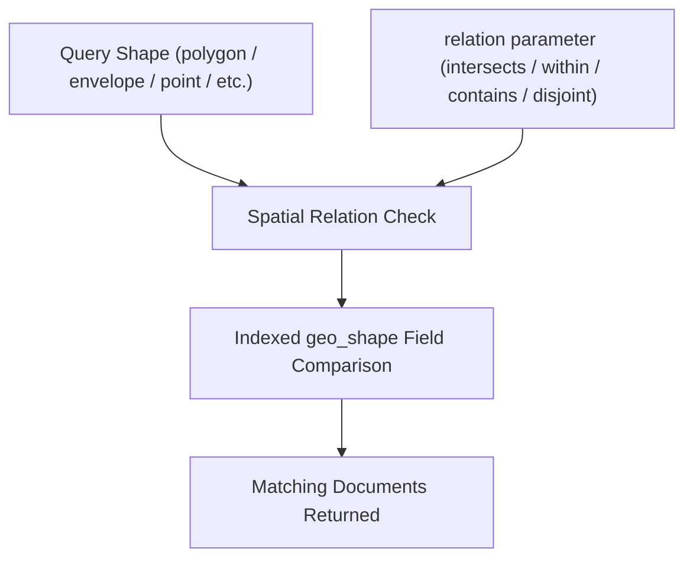

## Geo Shape Query

### Overview

The `geo_shape` query enables searching for documents based on complex spatial relationships between geometric shapes, rather than simple point-radius or bounding-box containment. It supports rich geometry types (points, lines, polygons, multipolygons, envelopes, circles) and multiple spatial relations (intersects, within, contains, disjoint), making it suitable for advanced GIS-style queries such as finding all regions that overlap a given area, or all points contained within a custom-drawn boundary.

### Prerequisites

The target field must be mapped as `geo_shape` (or, for some relation types, `geo_point` can participate as well, though with more limited relation support).

```json
PUT /regions
{
  "mappings": {
    "properties": {
      "name": { "type": "text" },
      "area": { "type": "geo_shape" }
    }
  }
}
```

Sample documents using GeoJSON-style geometry:

```json
POST /regions/_bulk
{ "index": { "_id": "1" } }
{ "name": "Downtown Zone", "area": { "type": "polygon", "coordinates": [[[-74.02, 40.70], [-73.96, 40.70], [-73.96, 40.75], [-74.02, 40.75], [-74.02, 40.70]]] } }
{ "index": { "_id": "2" } }
{ "name": "Riverfront Line", "area": { "type": "linestring", "coordinates": [[-73.99, 40.72], [-73.97, 40.74]] } }
{ "index": { "_id": "3" } }
{ "name": "Station Point", "area": { "type": "point", "coordinates": [-73.985, 40.735] } }
```

### Supported Geometry Types

`geo_shape` fields accept GeoJSON-compatible geometry types:

- `point`
- `linestring`
- `polygon`
- `multipoint`
- `multilinestring`
- `multipolygon`
- `geometrycollection`
- `envelope` (an Elasticsearch-specific extension representing a bounding rectangle via two corner points)
- `circle` [Unverified — support for the `circle` type has varied across Elasticsearch versions and may require specific configuration or may be deprecated depending on version; confirm against current documentation before use.]

Coordinates follow GeoJSON convention: `[longitude, latitude]` order, which is the reverse of the `lat, lon` convention used by `geo_point` object notation.

### Basic Syntax

```json
GET /regions/_search
{
  "query": {
    "geo_shape": {
      "area": {
        "shape": {
          "type": "envelope",
          "coordinates": [[-74.05, 40.78], [-73.90, 40.68]]
        },
        "relation": "intersects"
      }
    }
  }
}
```

This returns documents whose `area` shape intersects the given envelope (a rectangle defined by its top-left and bottom-right corners).

### Spatial Relations

The `relation` parameter determines how the query shape and the indexed shape must relate:

- `intersects` (default) — matches if the query shape and indexed shape share any point.
- `disjoint` — matches if the query shape and indexed shape share no points at all.
- `within` — matches if the indexed shape is entirely within the query shape.
- `contains` — matches if the indexed shape entirely contains the query shape.

```json
GET /regions/_search
{
  "query": {
    "geo_shape": {
      "area": {
        "shape": {
          "type": "polygon",
          "coordinates": [[[-74.03, 40.69], [-73.95, 40.69], [-73.95, 40.76], [-74.03, 40.76], [-74.03, 40.69]]]
        },
        "relation": "within"
      }
    }
  }
}
```

### Querying by Indexed Shape (Pre-Indexed Shape Reference)

Instead of specifying the query geometry inline, `geo_shape` supports referencing a shape already stored in another document — useful when the comparison shape is itself a maintained entity (e.g., a country boundary stored in a reference index).

```json
GET /regions/_search
{
  "query": {
    "geo_shape": {
      "area": {
        "indexed_shape": {
          "index": "boundaries",
          "id": "region_42",
          "path": "boundary"
        },
        "relation": "intersects"
      }
    }
  }
}
```

### The `ignore_unmapped` Parameter

When querying across multiple indices where some may not have the `geo_shape` field mapped, `ignore_unmapped: true` prevents the query from throwing an error on indices lacking the field, treating it as no match instead.

```json
GET /regions/_search
{
  "query": {
    "geo_shape": {
      "area": {
        "shape": {
          "type": "envelope",
          "coordinates": [[-74.05, 40.78], [-73.90, 40.68]]
        },
        "relation": "intersects"
      },
      "ignore_unmapped": true
    }
  }
}
```

### Combining with Other Queries

`geo_shape` queries are typically placed within a `filter` clause of a `bool` query when the spatial relation should not affect relevance scoring.

```json
GET /regions/_search
{
  "query": {
    "bool": {
      "must": {
        "match": { "name": "zone" }
      },
      "filter": {
        "geo_shape": {
          "area": {
            "shape": {
              "type": "envelope",
              "coordinates": [[-74.05, 40.78], [-73.90, 40.68]]
            },
            "relation": "intersects"
          }
        }
      }
    }
  }
}
```

### geo_shape vs Other Geo Queries

- `geo_distance` and `geo_bounding_box` operate only on `geo_point` fields and express simple circular or rectangular containment around a single point.
- `geo_polygon` operates on `geo_point` fields with a single containment relation (point-in-polygon).
- `geo_shape` operates on `geo_shape` fields (indexed shapes, not just points) and supports multiple geometry types and relation operators, making it the most expressive and general-purpose geo query.
- The tradeoff is computational cost: shape-to-shape relationship evaluation is generally more expensive than point-based containment checks. [Inference — this follows from the general complexity difference between point-based and shape-based geometric operations; actual overhead depends on shape complexity and indexing strategy.]

### Query Flow Diagram



### Performance Considerations

- `geo_shape` queries are generally more computationally intensive than `geo_point`-based queries due to the complexity of shape-to-shape geometric comparisons. [Inference — this is a general geospatial computing principle; the specific overhead depends on geometry complexity, indexing strategy, and Elasticsearch version.]
- Simplifying complex polygons (reducing vertex count) where high precision is not required can improve query performance. [Inference — this is a standard geospatial optimization technique rather than an Elasticsearch-specific guarantee.]
- Using `filter` context allows caching of frequently repeated shape queries.
- Indexed shape strategy and precision settings on the `geo_shape` mapping (such as tree/grid precision) can materially affect both indexing size and query performance; tuning these should be validated against actual data density and query patterns. [Inference — exact mapping parameters and their defaults have changed across Elasticsearch versions, so current documentation should be consulted for version-specific tuning options.]

### Common Pitfalls

- Confusing GeoJSON's `[longitude, latitude]` coordinate order with the `lat, lon` order used elsewhere in `geo_point` object notation.
- Assuming `geo_shape` relations behave identically to `geo_polygon`'s single containment check — the `relation` parameter must be set deliberately based on intended semantics.
- Applying `geo_shape` queries to `geo_point`-mapped fields without confirming version-specific support and relation limitations.
- Neglecting to account for the higher computational cost of shape-based queries at scale, especially with `within` and `contains` relations on complex geometries.
- Omitting `ignore_unmapped` when querying across indices with inconsistent mappings, causing unexpected query failures.

### Related Topics

- `geo_polygon` query (deprecated point-in-polygon alternative)
- `geo_distance` and `geo_bounding_box` queries
- `geo_point` vs `geo_shape` field types and mapping options
- GeoJSON geometry specification
- Spatial relation semantics (`intersects`, `within`, `contains`, `disjoint`)
- Indexed shape references and reference-index design patterns
- Geo aggregations (geohash grid, geotile grid, geo-centroid)