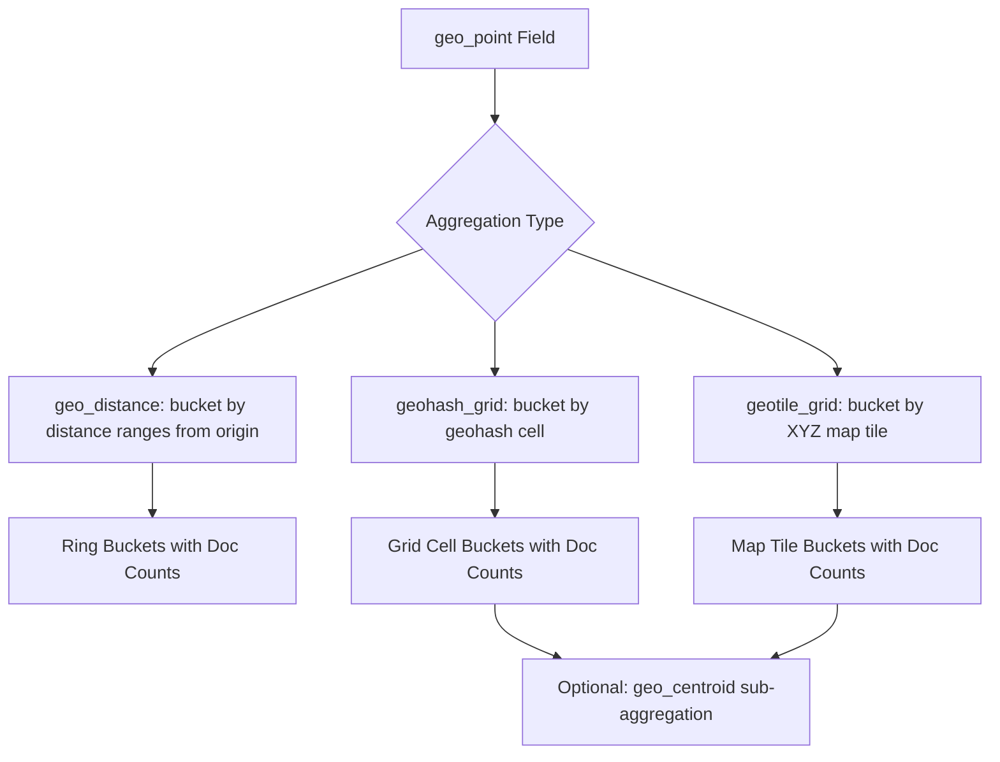

## Geo Aggregations

### Overview

Geo aggregations group and analyze documents based on their geographic location, enabling use cases like clustering map markers at different zoom levels, bucketing results into concentric distance rings, or computing spatial statistics such as centroids and bounding extents. The three most commonly used bucketing aggregations are `geo_distance`, `geohash_grid`, and `geotile_grid`.

### Prerequisites

These aggregations operate on fields mapped as `geo_point` (some also support `geo_shape`, with varying levels of support depending on the aggregation and Elasticsearch version).

```json
PUT /places
{
  "mappings": {
    "properties": {
      "name": { "type": "text" },
      "location": { "type": "geo_point" }
    }
  }
}
```

Sample documents:

```json
POST /places/_bulk
{ "index": { "_id": "1" } }
{ "name": "Cafe Aurora", "location": { "lat": 40.7128, "lon": -74.0060 } }
{ "index": { "_id": "2" } }
{ "name": "Riverside Diner", "location": { "lat": 40.7306, "lon": -73.9352 } }
{ "index": { "_id": "3" } }
{ "name": "Mountain Lodge", "location": { "lat": 39.7392, "lon": -104.9903 } }
{ "index": { "_id": "4" } }
{ "name": "Harbor Bistro", "location": { "lat": 40.7061, "lon": -74.0089 } }
```

### geo_distance Aggregation

Buckets documents into concentric rings (distance ranges) from a specified origin point, similar in spirit to a `range` aggregation but based on distance rather than numeric value.

```json
GET /places/_search
{
  "size": 0,
  "aggs": {
    "rings_around_nyc": {
      "geo_distance": {
        "field": "location",
        "origin": { "lat": 40.7128, "lon": -74.0060 },
        "unit": "km",
        "ranges": [
          { "to": 1 },
          { "from": 1, "to": 10 },
          { "from": 10, "to": 50 },
          { "from": 50 }
        ]
      }
    }
  }
}
```

This produces buckets such as "0–1km", "1–10km", "10–50km", and "50km+" from the origin, each containing a document count. The `origin` field accepts the same coordinate formats as `geo_distance` queries (object, string, geohash, array).

**Parameters:**

- `field` — the `geo_point` field to measure distance from.
- `origin` — the reference point for distance calculation.
- `unit` — distance unit for the range boundaries (default `m`, meters).
- `distance_type` — `arc` (default) or `plane`, same semantics as the `geo_distance` query.
- `ranges` — a list of `from`/`to` distance boundaries; omitting `from` implies negative infinity (from zero in practice), and omitting `to` implies infinity.

```json
GET /places/_search
{
  "size": 0,
  "aggs": {
    "rings_around_nyc": {
      "geo_distance": {
        "field": "location",
        "origin": "40.7128,-74.0060",
        "distance_type": "plane",
        "unit": "mi",
        "ranges": [
          { "key": "walkable", "to": 1 },
          { "key": "nearby", "from": 1, "to": 5 },
          { "key": "far", "from": 5 }
        ]
      }
    }
  }
}
```

Custom `key` values can be assigned to each range for more readable bucket labels in the response.

### geohash_grid Aggregation

Groups documents into buckets corresponding to geohash cells — a hierarchical spatial encoding that divides the world into a grid of rectangular cells, with each additional character of precision subdividing cells further. Commonly used for map marker clustering at different zoom levels.

```json
GET /places/_search
{
  "size": 0,
  "aggs": {
    "grid_clusters": {
      "geohash_grid": {
        "field": "location",
        "precision": 5
      }
    }
  }
}
```

**Precision Levels**

The `precision` parameter ranges from 1 (very coarse, continent-scale cells) to 12 (extremely fine, sub-meter-scale cells). Lower values group more documents into fewer, larger cells; higher values produce more numerous, smaller cells.

| Precision | Approximate Cell Width |
|---|---|
| 1 | ≈ 5,000 km |
| 3 | ≈ 156 km |
| 5 | ≈ 4.9 km |
| 7 | ≈ 153 m |
| 9 | ≈ 4.8 m |
| 12 | ≈ 3.7 cm |

[Unverified — these figures are commonly cited approximations for geohash cell dimensions and vary depending on latitude, since geohash cells are not perfectly uniform in size across the globe; treat as order-of-magnitude guidance rather than exact values.]

**Bounding the Aggregation Area**

A `bounds` parameter can restrict the aggregation to a specific geographic region, reducing the number of cells considered:

```json
GET /places/_search
{
  "size": 0,
  "aggs": {
    "grid_clusters": {
      "geohash_grid": {
        "field": "location",
        "precision": 6,
        "bounds": {
          "top_left": { "lat": 41.0, "lon": -74.5 },
          "bottom_right": { "lat": 40.5, "lon": -73.5 }
        }
      }
    }
  }
}
```

**Controlling Bucket Count**

- `size` — maximum number of buckets to return, ordered by document count descending (default 10,000). [Unverified — default bucket count limits have varied across Elasticsearch versions; confirm against current documentation.]
- `shard_size` — number of buckets each shard returns to the coordinating node before final merging, which can improve result accuracy for high-cardinality aggregations.

```json
GET /places/_search
{
  "size": 0,
  "aggs": {
    "grid_clusters": {
      "geohash_grid": {
        "field": "location",
        "precision": 6,
        "size": 100,
        "shard_size": 300
      }
    }
  }
}
```

### geotile_grid Aggregation

Similar to `geohash_grid`, but buckets documents into map tiles following the standard Slippy Map / Web Mercator tiling scheme used by common web mapping libraries (such as Leaflet or Mapbox). This makes `geotile_grid` a more natural fit when aggregation results need to align directly with map tile boundaries rendered in a front-end mapping UI.

```json
GET /places/_search
{
  "size": 0,
  "aggs": {
    "tile_clusters": {
      "geotile_grid": {
        "field": "location",
        "precision": 8
      }
    }
  }
}
```

**Precision Levels**

`precision` corresponds to the standard web map zoom level, typically ranging from 0 (whole world in one tile) to 29. [Unverified — the maximum supported precision value has varied across Elasticsearch versions; confirm against current documentation for the version in use.] Each increment roughly doubles the resolution along each axis, consistent with standard web mercator tile zoom conventions.

**Bounding and Size Control**

Supports the same `bounds`, `size`, and `shard_size` parameters as `geohash_grid`:

```json
GET /places/_search
{
  "size": 0,
  "aggs": {
    "tile_clusters": {
      "geotile_grid": {
        "field": "location",
        "precision": 10,
        "size": 500,
        "bounds": {
          "top_left": { "lat": 41.0, "lon": -74.5 },
          "bottom_right": { "lat": 40.5, "lon": -73.5 }
        }
      }
    }
  }
}
```

### geohash_grid vs geotile_grid

- `geohash_grid` cells follow the geohash encoding scheme, producing roughly rectangular cells whose dimensions vary with the specific geohash algorithm.
- `geotile_grid` cells align precisely with standard XYZ/Slippy Map tiles used by most web mapping libraries, making it more convenient when aggregation output must overlay directly onto map tiles in a browser-based map.
- `geotile_grid` is generally preferred for front-end map clustering integrations due to this tile alignment; `geohash_grid` remains useful for general-purpose spatial bucketing unrelated to map tile rendering. [Inference — this preference reflects common practice for web-mapping integrations rather than a strict technical requirement, since both aggregations can serve general clustering needs.]

### Nesting Sub-Aggregations

Both grid aggregations commonly nest a `geo_centroid` sub-aggregation to compute the actual center point of documents within each cell, useful for placing a marker at a representative location rather than the geometric cell center.

```json
GET /places/_search
{
  "size": 0,
  "aggs": {
    "grid_clusters": {
      "geotile_grid": {
        "field": "location",
        "precision": 8
      },
      "aggs": {
        "cell_center": {
          "geo_centroid": {
            "field": "location"
          }
        }
      }
    }
  }
}
```

### Aggregation Flow Diagram



### Performance Considerations

- High `precision` values on `geohash_grid` or `geotile_grid` over large datasets can generate a very large number of buckets, increasing memory usage on coordinating and data nodes. Restricting the aggregation with `bounds` when only a specific map viewport is relevant helps control this. [Inference — this reflects general aggregation cardinality behavior in Elasticsearch rather than a geo-specific guarantee, but is a widely recommended practice for grid aggregations.]
- `shard_size` larger than `size` improves accuracy of top-N bucket selection in distributed setups, at the cost of additional inter-node data transfer. [Behavior may vary depending on shard count, data distribution, and cluster configuration.]
- For map-based UIs, matching aggregation `precision` to the current map zoom level (rather than always using a fixed high precision) reduces unnecessary bucket computation. [Inference — this is a standard client-driven optimization pattern for map clustering rather than an Elasticsearch-enforced behavior.]

### Common Pitfalls

- Using `geohash_grid` when the front-end mapping library expects tile-aligned clusters — `geotile_grid` is typically the better match in that scenario.
- Choosing an excessively high `precision` for the zoom level in use, resulting in an unwieldy number of near-empty buckets.
- Forgetting `size: 0` at the top level of the search request when only aggregation results (not individual documents) are needed, which wastes response payload and processing.
- Assuming `geo_distance` aggregation ranges behave identically to a numeric `range` aggregation without accounting for the `unit` and `distance_type` parameters, which directly affect bucket boundaries.
- Omitting `bounds` on large global datasets, causing the grid aggregation to compute cells across irrelevant regions.

### Related Topics

- `geo_distance` and `geo_bounding_box` queries
- `geo_shape` query and spatial relations
- `geo_centroid` aggregation
- `geo_bounds` aggregation (computes the bounding box of a set of points)
- Map tile rendering with Leaflet/Mapbox and Elasticsearch integration
- Combining grid aggregations with metric sub-aggregations for spatial analytics