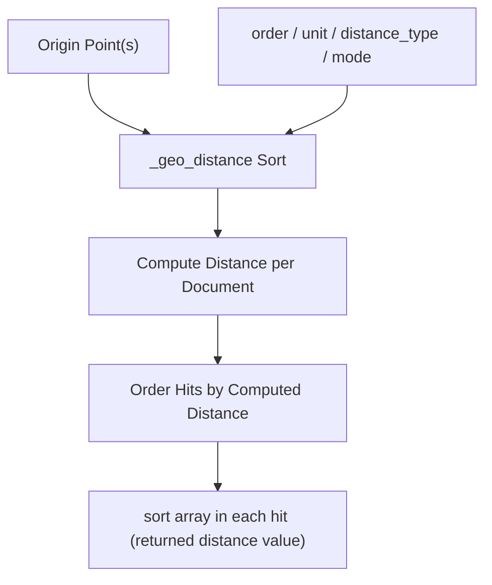

## Sorting by Geo Distance

### Overview

Sorting by geo distance orders search results according to how close each document's `geo_point` field is to a specified origin coordinate, rather than by relevance score or a standard field value. This is the mechanism that powers "nearest first" result ordering in location-based search features, distinct from `geo_distance` queries or aggregations, which filter or bucket rather than order results.

### Prerequisites

The sorted field must be mapped as `geo_point`.

```json
PUT /places
{
  "mappings": {
    "properties": {
      "name": { "type": "text" },
      "location": { "type": "geo_point" }
    }
  }
}
```

Sample documents:

```json
POST /places/_bulk
{ "index": { "_id": "1" } }
{ "name": "Cafe Aurora", "location": { "lat": 40.7128, "lon": -74.0060 } }
{ "index": { "_id": "2" } }
{ "name": "Riverside Diner", "location": { "lat": 40.7306, "lon": -73.9352 } }
{ "index": { "_id": "3" } }
{ "name": "Harbor Bistro", "location": { "lat": 40.7061, "lon": -74.0089 } }
```

### Basic Syntax

Geo distance sorting uses the special `_geo_distance` sort key rather than a plain field name.

```json
GET /places/_search
{
  "query": {
    "match_all": {}
  },
  "sort": [
    {
      "_geo_distance": {
        "location": {
          "lat": 40.7128,
          "lon": -74.0060
        },
        "order": "asc",
        "unit": "km"
      }
    }
  ]
}
```

This returns all documents ordered from nearest to farthest relative to the given origin point, with distances measured in kilometers.

### Parameters

- `order` — `asc` (nearest first) or `desc` (farthest first). `asc` is the typical choice for "near me" style results.
- `unit` — the distance unit used both for internal calculation and in the `sort` value returned alongside each hit (e.g. `km`, `mi`, `m`). Defaults to `m` (meters) if omitted. [Inference — defaulting to meters when unit is omitted follows the same convention as the `geo_distance` query, but explicitly specifying the unit is recommended to avoid ambiguity.]
- `distance_type` — `arc` (default, more accurate over long distances) or `plane` (faster, less accurate), same semantics as in the `geo_distance` query.
- `mode` — determines how distance is calculated when a document has multiple values for the sorted `geo_point` field (e.g., `min`, `max`, `avg`, `median`). Relevant only for fields storing multiple points per document.

```json
GET /places/_search
{
  "query": {
    "match_all": {}
  },
  "sort": [
    {
      "_geo_distance": {
        "location": { "lat": 40.7128, "lon": -74.0060 },
        "order": "asc",
        "unit": "mi",
        "distance_type": "plane",
        "mode": "min"
      }
    }
  ]
}
```

### Accepted Point Formats

The origin coordinate accepts the same formats supported elsewhere in geo queries:

**Object format**

```json
"location": { "lat": 40.7128, "lon": -74.0060 }
```

**String "lat,lon" format**

```json
"location": "40.7128,-74.0060"
```

**Geohash format**

```json
"location": "dr5regw3p"
```

**Array format `[lon, lat]`**

```json
"location": [-74.0060, 40.7128]
```

As with other geo functionality, the array format uses `[lon, lat]` order, the reverse of the object/string convention — a frequent source of subtle bugs.

### Sorting from Multiple Origin Points

`_geo_distance` sort accepts an array of points rather than a single point. When multiple points are supplied, the effective sort distance for each document is computed using the shortest distance to any of the provided points, combined with the `mode` parameter if the field itself is multi-valued. [Inference — the exact combination semantics when multiple origin points and multi-valued fields interact can be version-dependent; verify against current documentation if relying on this specific combination.]

```json
GET /places/_search
{
  "query": {
    "match_all": {}
  },
  "sort": [
    {
      "_geo_distance": {
        "location": [
          { "lat": 40.7128, "lon": -74.0060 },
          { "lat": 40.7306, "lon": -73.9352 }
        ],
        "order": "asc",
        "unit": "km"
      }
    }
  ]
}
```

### Combining with a Filtering Query

`_geo_distance` sort is commonly combined with a `geo_distance` query in `filter` context, so that results are both restricted to a radius and ordered by proximity within that radius.

```json
GET /places/_search
{
  "query": {
    "bool": {
      "filter": {
        "geo_distance": {
          "distance": "20km",
          "location": { "lat": 40.7128, "lon": -74.0060 }
        }
      }
    }
  },
  "sort": [
    {
      "_geo_distance": {
        "location": { "lat": 40.7128, "lon": -74.0060 },
        "order": "asc",
        "unit": "km"
      }
    }
  ]
}
```

### Combining with Multiple Sort Criteria

`_geo_distance` can be used alongside other sort fields, such as sorting first by proximity and then by a secondary field like rating for ties, or vice versa.

```json
GET /places/_search
{
  "query": { "match_all": {} },
  "sort": [
    {
      "_geo_distance": {
        "location": { "lat": 40.7128, "lon": -74.0060 },
        "order": "asc",
        "unit": "km"
      }
    },
    { "rating": { "order": "desc" } }
  ]
}
```

### Retrieving the Computed Distance Value

Each hit's response includes a `sort` array containing the computed distance value (in the specified `unit`) that was used for ordering, which can be surfaced directly in application UIs (e.g., "2.3 km away").

```json
{
  "hits": {
    "hits": [
      {
        "_id": "3",
        "_source": { "name": "Harbor Bistro" },
        "sort": [0.62]
      }
    ]
  }
}
```

### Sort Flow Diagram



### Performance Considerations

- Sorting by geo distance requires computing a distance value for every matching document, which is more expensive than sorting by a simple indexed field value; narrowing the candidate set first with a `geo_distance` or `geo_bounding_box` filter reduces the number of documents requiring distance computation. [Inference — this follows from general query cost principles around sort computation over large result sets, and the degree of benefit depends on how selective the filter is relative to the full dataset.]
- `distance_type: plane` computes faster than `arc` at the cost of accuracy, which may be an acceptable tradeoff for large result sets over smaller geographic areas. [Inference — the accuracy tradeoff becomes more significant over long distances or near the poles; behavior may vary by specific coordinates involved.]
- Multi-valued `geo_point` fields with `mode` settings add extra computation compared to single-valued fields, since the aggregation across values happens per document before the sort comparison.

### Common Pitfalls

- Omitting `unit`, leading to distances being calculated and returned in meters when kilometers or miles were expected.
- Confusing `[lon, lat]` array order with `lat, lon` object/string order for the origin point.
- Expecting `geo_distance` sort alone to restrict results to a radius — sorting only orders results, it does not filter them; a separate `geo_distance` query is required for radius restriction.
- Forgetting `mode` when the sorted field is multi-valued, resulting in unexpected or inconsistent distance calculations across documents with multiple location values.
- Assuming sort order alone reflects relevance — geo distance sort explicitly overrides `_score`-based ordering unless combined intentionally with other sort criteria.

### Related Topics

- `geo_distance` query
- `geo_bounding_box` query
- `geo_point` field type and multi-value handling
- Distance feature queries for incorporating proximity into relevance scoring
- `geo_centroid` and `geo_bounds` aggregations
- Combining filters, sorting, and pagination for location-based search UIs