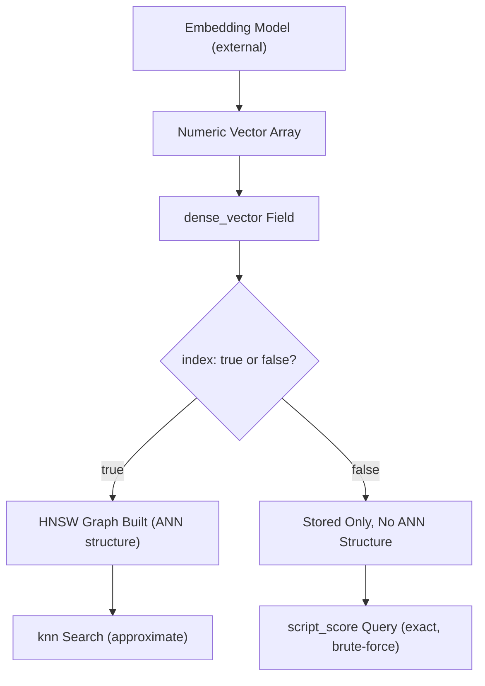

## Dense Vector Field Type

### Overview

The `dense_vector` field type stores arrays of numeric floating-point values used primarily for vector search: similarity search based on semantic meaning, image embeddings, or other machine-learning-derived numeric representations, rather than exact term matching. It underpins k-nearest-neighbor (kNN) search and semantic search use cases in Elasticsearch, often generated by embedding models (e.g., from NLP or computer vision pipelines) outside of Elasticsearch and then indexed for similarity comparison.

### Basic Mapping

```json
PUT /articles
{
  "mappings": {
    "properties": {
      "title": { "type": "text" },
      "title_vector": {
        "type": "dense_vector",
        "dims": 384
      }
    }
  }
}
```

The `dims` parameter specifies the exact number of dimensions each vector must have, which must match the output dimensionality of the embedding model used to generate the vectors (e.g., 384, 768, 1536 depending on the model).

### Indexing Documents with Vectors

```json
POST /articles/_doc/1
{
  "title": "Introduction to Neural Networks",
  "title_vector": [0.021, -0.045, 0.198, 0.334, "...additional values..."]
}
```

The vector array must contain exactly `dims` numeric values; mismatched lengths result in an indexing error.

### Key Mapping Parameters

**`dims`**

Required in most cases — the fixed dimensionality of all vectors stored in the field. [Unverified — some Elasticsearch versions support automatic dimension inference from the first indexed document if `dims` is omitted; confirm this behavior against the documentation for the specific version in use, since relying on inference rather than explicit declaration is riskier for schema clarity.]

**`index`**

Boolean controlling whether the field is indexed for approximate kNN search (`true`) or stored only for exact/script-based access (`false`). When `true`, additional parameters like `similarity` become relevant.

```json
PUT /articles
{
  "mappings": {
    "properties": {
      "title_vector": {
        "type": "dense_vector",
        "dims": 384,
        "index": true,
        "similarity": "cosine"
      }
    }
  }
}
```

**`similarity`**

Defines the distance/similarity function used for kNN search when `index: true`:

- `cosine` — measures the cosine of the angle between vectors, commonly used for normalized embeddings where magnitude is not meaningful.
- `dot_product` — computes the dot product between vectors; typically used with pre-normalized vectors for efficiency, since it avoids the normalization step cosine similarity requires internally.
- `l2_norm` — Euclidean distance between vectors; smaller values indicate greater similarity.
- `max_inner_product` — similar to dot product but does not require vectors to be unit-normalized. [Unverified — exact availability and naming of similarity functions has evolved across Elasticsearch versions; verify current options against documentation for the version in use.]

**`element_type`**

Specifies the numeric type of vector elements:

- `float` (default) — standard 32-bit floating point.
- `byte` — 8-bit integer values, reducing storage size at the cost of precision, useful for large-scale deployments where memory footprint matters. [Unverified — support for `byte` element type and any additional types has been introduced and refined across versions; confirm compatibility with the specific Elasticsearch version and embedding model output range.]

```json
PUT /articles
{
  "mappings": {
    "properties": {
      "title_vector": {
        "type": "dense_vector",
        "dims": 384,
        "element_type": "byte",
        "index": true,
        "similarity": "cosine"
      }
    }
  }
}
```

### Indexing Strategy: HNSW

When `index: true`, Elasticsearch builds an approximate nearest neighbor search structure using the HNSW (Hierarchical Navigable Small World) algorithm, enabling efficient approximate kNN search over large vector datasets rather than requiring a brute-force scan of every vector. [Inference — HNSW is the documented default indexing algorithm for dense_vector kNN search, but internal implementation details and any additional algorithm options may vary by version.]

**Tuning HNSW Parameters**

```json
PUT /articles
{
  "mappings": {
    "properties": {
      "title_vector": {
        "type": "dense_vector",
        "dims": 384,
        "index": true,
        "similarity": "cosine",
        "index_options": {
          "type": "hnsw",
          "m": 16,
          "ef_construction": 100
        }
      }
    }
  }
}
```

- `m` — the number of bidirectional links created per node during graph construction; higher values improve recall at the cost of memory and indexing time.
- `ef_construction` — the size of the candidate list considered during index construction; higher values improve index quality (and thus search recall) at the cost of slower indexing.

[Inference — the specific default values and permissible ranges for `m` and `ef_construction` have varied across Elasticsearch releases, and optimal settings depend heavily on dataset size, dimensionality, and recall/performance requirements; benchmarking against actual data is recommended rather than relying on fixed defaults.]

### Non-Indexed (Script-Score) Usage

When `index: false`, vectors are stored but not built into an ANN search structure. Similarity must then be computed manually via script scoring, typically using functions like `cosineSimilarity`, `dotProduct`, or `l1norm`/`l2norm` within a `script_score` query.

```json
GET /articles/_search
{
  "query": {
    "script_score": {
      "query": { "match_all": {} },
      "script": {
        "source": "cosineSimilarity(params.query_vector, 'title_vector') + 1.0",
        "params": {
          "query_vector": [0.021, -0.045, 0.198, 0.334]
        }
      }
    }
  }
}
```

This approach performs an exact, brute-force comparison against every matching document and is therefore significantly slower at scale than indexed kNN search, but guarantees exact rather than approximate results. [Inference — the accuracy/performance tradeoff between script-score brute-force search and indexed approximate kNN search is a well-established general pattern in vector search systems.]

### Relationship to kNN Search

`dense_vector` fields with `index: true` are the foundation for the dedicated `knn` search clause (or `knn` query, depending on version), which performs approximate nearest neighbor retrieval directly rather than through manual script scoring. [Unverified — the exact API surface for kNN search (top-level `knn` search parameter vs. `knn` query clause) has changed across Elasticsearch versions; verify the correct syntax against documentation for the version in use.]

```json
GET /articles/_search
{
  "knn": {
    "field": "title_vector",
    "query_vector": [0.021, -0.045, 0.198, 0.334],
    "k": 10,
    "num_candidates": 100
  }
}
```

### Field Type Flow Diagram



### Performance Considerations

- Higher `dims` values increase both storage footprint and per-query computation cost; using the smallest embedding dimensionality that meets accuracy requirements for the use case is generally advisable. [Inference — this is a general vector search principle rather than an Elasticsearch-specific guarantee, and the acceptable tradeoff depends on the embedding model and application requirements.]
- `element_type: byte` substantially reduces storage compared to `float`, at some cost to precision; suitability depends on whether the embedding model's output range and precision needs tolerate quantization. [Unverified — actual precision impact depends on the specific embedding model and similarity function in use.]
- Increasing `m` and `ef_construction` improves recall but increases indexing time and memory usage; these should be tuned based on benchmarking against representative data rather than assumed defaults. [Inference — this reflects general HNSW tuning tradeoffs documented in approximate nearest neighbor search literature, not an Elasticsearch-specific claim.]
- Non-indexed (`index: false`) script-score search does not scale well to large document counts because it performs an exact comparison against every candidate document; it is best suited to smaller datasets or pre-filtered candidate sets.

### Common Pitfalls

- Indexing vectors with a length that does not match the declared `dims`, causing indexing failures.
- Mismatching `similarity` function choice with how the embedding model's vectors were generated or normalized (e.g., using `dot_product` with non-normalized vectors, which can produce misleading similarity scores).
- Assuming `index: true` guarantees exact nearest-neighbor results — HNSW-based kNN search is approximate by design, trading a small amount of recall for significant performance gains.
- Using `element_type: byte` without verifying the embedding model's output values fit meaningfully into the reduced precision range.
- Confusing script-score vector similarity queries (exact, slow at scale) with dedicated `knn` search (approximate, fast at scale) and choosing the wrong approach for the dataset size.

### Related Topics

- kNN search (approximate nearest neighbor retrieval)
- HNSW algorithm fundamentals
- Semantic search and embedding-based retrieval pipelines
- `script_score` query and vector similarity functions
- Hybrid search combining lexical (`match`) and vector (`knn`) queries
- `semantic_text` field type and integrated inference pipelines