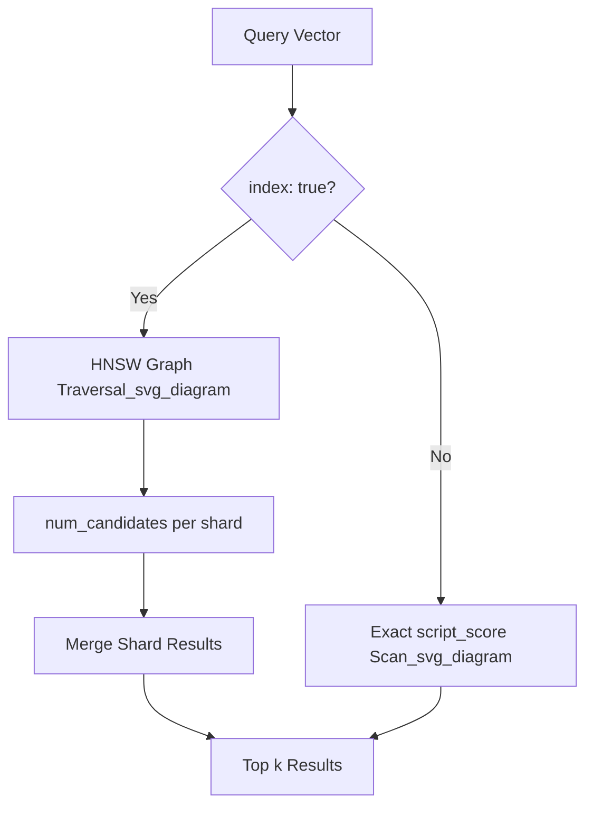

## kNN Search API

### Overview

The kNN (k-Nearest Neighbor) search API retrieves the `k` documents whose vector fields are closest to a given query vector, using a distance or similarity metric defined on the `dense_vector` field. Elasticsearch supports two execution modes: approximate kNN, which uses the HNSW (Hierarchical Navigable Small World) algorithm for fast retrieval over large datasets, and exact kNN, which performs brute-force comparison and guarantees exact results at higher computational cost.

kNN search is the primary mechanism for dense vector similarity search in Elasticsearch and underpins most dense retrieval and hybrid search use cases.

### Prerequisites

The target field must be mapped as `dense_vector` with indexing enabled:

```json
PUT my-index
{
  "mappings": {
    "properties": {
      "image_vector": {
        "type": "dense_vector",
        "dims": 384,
        "index": true,
        "similarity": "cosine"
      }
    }
  }
}
```

`index: true` (the default since 8.0 for most configurations) is required for approximate kNN via HNSW. If `index: false`, only exact kNN via script scoring is possible.

### Approximate kNN via the Top-Level `knn` Parameter

The most common usage is the top-level `knn` search parameter:

```json
GET my-index/_search
{
  "knn": {
    "field": "image_vector",
    "query_vector": [0.12, -0.34, 0.98, ...],
    "k": 10,
    "num_candidates": 100
  },
  "size": 10
}
```

**Key Points**

- `field` — the `dense_vector` field to search.
- `query_vector` — the vector to compare against; must match the field's configured `dims`.
- `k` — number of nearest neighbors to return.
- `num_candidates` — number of candidates each shard considers before returning top `k`; higher values improve recall at the cost of latency. Typically set to several times `k`.
- `size` — caps the final number of hits returned in the response, applied after merging shard-level results.

### Filtered kNN

A `filter` clause can be applied so the nearest-neighbor search only considers documents matching additional criteria:

```json
GET my-index/_search
{
  "knn": {
    "field": "image_vector",
    "query_vector": [0.12, -0.34, 0.98, ...],
    "k": 10,
    "num_candidates": 100,
    "filter": {
      "term": {
        "category": "electronics"
      }
    }
  }
}
```

The filter is applied during graph traversal rather than as a post-filter on results, so the HNSW search adapts to find `k` matches that satisfy the filter, rather than returning fewer than `k` results due to post-hoc exclusion. [Inference] Exact filter-application mechanics (pre-filter vs. integrated-filter during traversal) have evolved across Elasticsearch versions and Lucene's HNSW filtering support, so behavior should be verified against the specific version deployed.

### Combining kNN with Standard Queries

`knn` can be combined with a standard `query` clause; Elasticsearch computes both and combines scores:

```json
GET my-index/_search
{
  "query": {
    "match": {
      "description": "wireless headphones"
    }
  },
  "knn": {
    "field": "image_vector",
    "query_vector": [0.12, -0.34, 0.98, ...],
    "k": 10,
    "num_candidates": 100,
    "boost": 0.6
  },
  "size": 10
}
```

Scores from the `query` and `knn` sections are summed (subject to each clause's `boost`), enabling hybrid lexical-plus-vector ranking within a single request.

### Multiple kNN Clauses

The `knn` parameter accepts an array, allowing multiple vector searches (e.g., across different fields or with different query vectors) to be combined in one request:

```json
GET my-index/_search
{
  "knn": [
    {
      "field": "image_vector",
      "query_vector": [0.12, -0.34, ...],
      "k": 10,
      "num_candidates": 50
    },
    {
      "field": "text_vector",
      "query_vector": [0.55, 0.21, ...],
      "k": 10,
      "num_candidates": 50
    }
  ]
}
```

Each clause contributes its own score, and results are merged.

### Exact kNN via `script_score`

For smaller datasets or when exact results are required, exact kNN can be performed using a `script_score` query with vector functions:

```json
GET my-index/_search
{
  "query": {
    "script_score": {
      "query": {
        "match_all": {}
      },
      "script": {
        "source": "cosineSimilarity(params.query_vector, 'image_vector') + 1.0",
        "params": {
          "query_vector": [0.12, -0.34, 0.98, ...]
        }
      }
    }
  }
}
```

This scans every matching document and computes the similarity function directly, avoiding the approximation error of HNSW but scaling linearly with the number of candidate documents, making it impractical for very large indices.

### num_candidates and Recall Tuning

**Key Points**

- Increasing `num_candidates` relative to `k` generally improves recall (the fraction of true nearest neighbors actually returned) at the cost of query latency.
- `num_candidates` is evaluated per shard; a highly sharded index may need proportionally higher values to maintain equivalent recall to a less-sharded one. [Inference] The precise relationship between shard count and recall degradation depends on data distribution across shards and is not fully deterministic.
- There is no universal "correct" ratio between `k` and `num_candidates` — it is workload- and recall-requirement-dependent, and typically established empirically via benchmarking against a labeled ground-truth set.

### Similarity Metrics

The `similarity` parameter on the `dense_vector` mapping determines the distance function used during kNN search:

- `cosine` — cosine similarity, commonly used for normalized embeddings.
- `dot_product` — dot product, faster than cosine when vectors are pre-normalized to unit length.
- `l2_norm` — Euclidean distance.
- `max_inner_product` — inner product without requiring normalization, used for certain retrieval models.

The similarity metric must match what the embedding model was trained/optimized for; mismatches degrade retrieval quality even though queries will still execute without error.

### Diagram: kNN Query Execution Path



### Limitations and Considerations

- Approximate kNN trades exactness for speed; recall is not guaranteed to be 100%.
- `num_candidates` cannot exceed 10,000 by default (configurable via index settings in some versions). [Unverified] Confirm the current maximum against the deployed version's documentation, as default limits have changed across releases.
- HNSW graphs consume significant heap/off-heap memory proportional to the number of vectors and `dims`; capacity planning should account for this before indexing large vector datasets.
- Filtered kNN with highly selective filters can still degrade performance since the graph traversal must find enough matching candidates, which may require visiting a disproportionately large part of the graph.

**Related Topics**

- HNSW algorithm internals and tuning (`m`, `ef_construction` index-time parameters)
- Hybrid search combining `knn` and `sparse_vector`/`match` queries
- Reciprocal Rank Fusion (`rank` with `rrf`) for merging multiple ranked result sets
- `dense_vector` field mapping options and quantization (`int8`, `int4`, `bbq`)
- Benchmarking recall and latency tradeoffs for `num_candidates`
- Nested `dense_vector` fields for multi-vector-per-document use cases