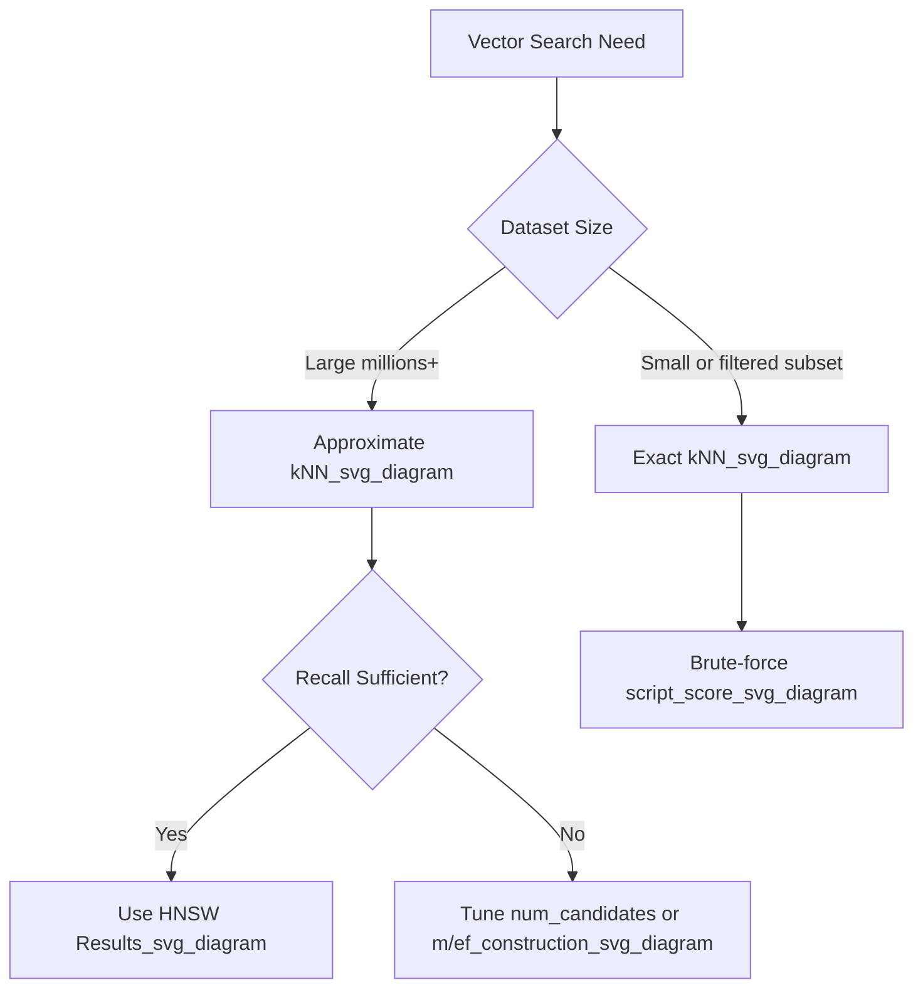

## Approximate kNN vs Exact kNN

### Overview

Elasticsearch offers two fundamentally different strategies for finding the nearest neighbors of a query vector: approximate kNN, which uses the HNSW (Hierarchical Navigable Small World) graph algorithm to quickly find likely-nearest neighbors without guaranteeing exactness, and exact kNN, which performs a brute-force comparison against every candidate document and guarantees mathematically correct results. The choice between the two is a tradeoff between query latency/scalability and result accuracy, and the two approaches are exposed through different API surfaces.

### Approximate kNN

Approximate kNN is invoked through the top-level `knn` search parameter and relies on an HNSW graph built at index time.

```json
GET my-index/_search
{
  "knn": {
    "field": "image_vector",
    "query_vector": [0.12, -0.34, 0.98],
    "k": 10,
    "num_candidates": 100
  }
}
```

**Key Points**

- Requires the `dense_vector` field to be mapped with `index: true` (the default in current versions for most configurations).
- Query time scales roughly logarithmically with the number of indexed vectors rather than linearly, because HNSW traversal skips large portions of the search space.
- Recall (the proportion of true nearest neighbors actually retrieved) is not guaranteed to be 100%; it depends on graph construction parameters and `num_candidates`.
- Well-suited to large-scale datasets (millions to billions of vectors) where linear scans would be too slow.

### Exact kNN

Exact kNN is performed using a `script_score` query combined with a vector similarity function, evaluated against every document matched by the inner query.

```json
GET my-index/_search
{
  "query": {
    "script_score": {
      "query": {
        "match_all": {}
      },
      "script": {
        "source": "cosineSimilarity(params.query_vector, 'image_vector') + 1.0",
        "params": {
          "query_vector": [0.12, -0.34, 0.98]
        }
      }
    }
  }
}
```

**Key Points**

- Does not require `index: true` on the `dense_vector` field, though it works whether or not the field is indexed for HNSW.
- Query time scales linearly with the number of documents evaluated, since every candidate is scored individually.
- Guarantees mathematically correct top-k results with no approximation error.
- Practical primarily for smaller datasets, pre-filtered subsets, or contexts where correctness matters more than latency (e.g., re-ranking a small candidate set).

### Structural Differences

| Aspect | Approximate kNN | Exact kNN |
|---|---|---|
| API | Top-level `knn` parameter | `script_score` query |
| Underlying mechanism | HNSW graph traversal | Brute-force scan |
| Accuracy | Approximate (recall < 100% possible) | Exact |
| Scalability | Sublinear, scales to large datasets | Linear, degrades on large datasets |
| Field requirement | `index: true` on `dense_vector` | Works with `index: true` or `false` |
| Typical use case | Primary retrieval at scale | Small datasets, re-ranking, filtered subsets |
| Combinable with `query` clause | Yes, scores summed | Yes, since it *is* a query |

### When Exact kNN Is Preferable

- **Small indices**: When the candidate set is on the order of thousands rather than millions, brute-force scanning may be fast enough and removes any approximation risk.
- **Post-filtered re-ranking**: A common pattern is using approximate kNN or a lexical query to retrieve a modest candidate set, then applying exact kNN scoring within that smaller set for final precision ranking.
- **Correctness-critical applications**: Domains where missing a true nearest neighbor has significant consequences (e.g., certain compliance or safety-adjacent retrieval tasks) may justify the latency cost of exactness. [Inference] Whether this tradeoff is justified is workload-specific and depends on how much recall loss approximate kNN actually introduces for the given embedding distribution, which is best measured empirically rather than assumed.
- **Highly selective filters**: If a `filter` clause already narrows the candidate set dramatically, the residual set may be small enough that exact scoring is competitive with or faster than graph traversal.

### When Approximate kNN Is Preferable

- **Large-scale production retrieval**: Any dataset where linear scan latency would be unacceptable for user-facing queries.
- **High query throughput**: Systems needing to serve many concurrent vector queries per second benefit from HNSW's sublinear cost per query.
- **Recall requirements are flexible**: Applications like semantic search or recommendation, where returning the *true* top-k is less critical than returning a *good* top-k quickly.

### Recall Measurement

Recall for approximate kNN is typically measured by comparing its results against exact kNN on the same dataset and query set:

$$\text{Recall@k} = \frac{|\text{ApproxResults} \cap \text{ExactResults}|}{k}$$

Running exact kNN as a benchmarking baseline against which approximate kNN's `num_candidates` and HNSW parameters (`m`, `ef_construction`) are tuned is a common evaluation pattern. [Inference] Specific recall targets and acceptable thresholds vary by application and are not prescribed by Elasticsearch itself.

### Hybrid Usage Pattern

A frequent pattern combines both: approximate kNN (or a lexical query) narrows a large corpus down to a manageable candidate set, and exact kNN re-scores that smaller set for higher precision.

```json
GET my-index/_search
{
  "query": {
    "script_score": {
      "query": {
        "knn": {
          "field": "image_vector",
          "query_vector": [0.12, -0.34, 0.98],
          "k": 50,
          "num_candidates": 200
        }
      },
      "script": {
        "source": "cosineSimilarity(params.query_vector, 'image_vector') + 1.0",
        "params": {
          "query_vector": [0.12, -0.34, 0.98]
        }
      }
    }
  }
}
```

[Unverified] Nesting a `knn` clause inside a `script_score` query's inner `query` in this exact form may not be supported in all Elasticsearch versions — this should be validated against the target version's query DSL documentation before use in production; the more commonly documented hybrid pattern is retrieving a candidate set via a first-stage query and re-scoring separately rather than nesting in this manner.

### Diagram: Decision Path



### Limitations and Considerations

- HNSW graph construction parameters (`m`, `ef_construction`) affect both index-time cost and query-time recall/latency tradeoffs, and are set at mapping time — changing them requires reindexing.
- Exact kNN via `script_score` does not benefit from any indexing structure speedup and will not scale to large corpora regardless of hardware, since cost is linear in document count.
- Neither approach automatically chooses the other; the decision must be made explicitly by the application/query author based on dataset size and accuracy requirements.

**Related Topics**

- HNSW parameter tuning (`m`, `ef_construction`) and their effect on graph quality
- kNN search API and `num_candidates` recall tuning
- Vector quantization (`int8`, `int4`, `bbq`) and its effect on approximate kNN accuracy
- Building recall benchmarks using labeled ground-truth nearest-neighbor sets
- Combining exact and approximate kNN in multi-stage retrieval pipelines