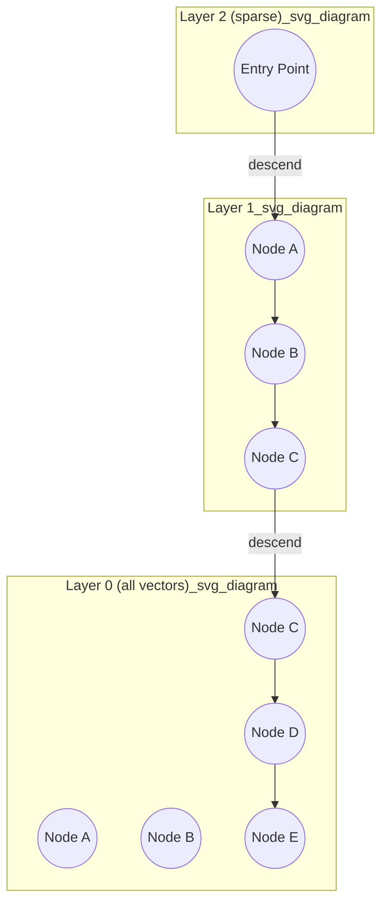

## HNSW Algorithm Basics

### Overview

HNSW (Hierarchical Navigable Small World) is a graph-based algorithm for approximate nearest neighbor search, and it is the underlying data structure Elasticsearch uses to power approximate kNN search on `dense_vector` fields. HNSW builds a multi-layered graph where each vector is a node, and edges connect nodes that are "close" to one another according to the configured similarity metric. Search proceeds by greedily traversing this graph from an entry point down through progressively denser layers until a set of nearest candidates is found.

The algorithm originates from academic work on small-world network structures (a graph property where most nodes can be reached from any other node in a small number of hops) combined with a hierarchical layering scheme inspired by skip lists.

### Core Structure

**Key Points**

- The graph consists of multiple layers, with the top layer containing very few nodes and each lower layer containing progressively more, until the bottom layer contains every indexed vector.
- Each node is randomly assigned a maximum layer at insertion time, with an exponentially decaying probability of being assigned to higher layers — most nodes exist only in the bottom layer.
- Edges within a layer connect a node to its approximate nearest neighbors at that layer, forming a navigable graph rather than an exhaustive one.
- The top layers act as a coarse "highway" for quickly moving across large distances in the vector space, while the bottom layer provides fine-grained local search.

### Search Process

Search begins at a fixed entry point in the topmost layer and proceeds as follows:

1. At the current layer, greedily move to the neighboring node closest to the query vector.
2. Repeat until no neighbor is closer than the current node (a local minimum for that layer).
3. Descend to the next layer down, using the current node as the new entry point.
4. Repeat the greedy search at the new layer.
5. At the bottom layer, perform a beam search (maintaining a candidate list of size roughly proportional to `ef`/`num_candidates`) to collect the final set of nearest neighbors rather than stopping at a single local minimum.

This layered approach lets the algorithm quickly narrow down to the right region of the vector space using the sparse upper layers, then refine within that region using the dense bottom layer, avoiding a full scan of all nodes.

### Diagram: Layered Graph Structure



### Key Construction Parameters

Elasticsearch exposes two HNSW construction parameters via the `dense_vector` mapping's `index_options`:

```json
PUT my-index
{
  "mappings": {
    "properties": {
      "image_vector": {
        "type": "dense_vector",
        "dims": 384,
        "index": true,
        "similarity": "cosine",
        "index_options": {
          "type": "hnsw",
          "m": 16,
          "ef_construction": 100
        }
      }
    }
  }
}
```

- **`m`** — the maximum number of edges (connections) per node per layer. Higher `m` produces a denser, more richly connected graph, improving recall but increasing memory usage and index-build time.
- **`ef_construction`** — the size of the dynamic candidate list used during graph construction when deciding which neighbors to connect to a new node. Higher values produce a higher-quality graph (better recall at search time) at the cost of slower indexing.

**Key Points**

- Both parameters are fixed at index/field creation time; changing them requires reindexing, since they affect how the graph itself was built.
- `m` is analogous to the branching factor of the graph; typical values fall in a moderate range (commonly single digits to low tens) — [Inference] optimal values are dataset- and dimensionality-dependent and should be tuned empirically rather than assumed from a fixed default.
- `ef_construction` only affects index-time graph quality; it is distinct from `num_candidates`, which affects query-time search breadth.

### Query-Time Behavior: num_candidates

At query time, the equivalent breadth parameter is `num_candidates` (referred to as `ef` in the original HNSW literature), supplied per search request rather than fixed at index time:

```json
GET my-index/_search
{
  "knn": {
    "field": "image_vector",
    "query_vector": [0.12, -0.34, 0.98],
    "k": 10,
    "num_candidates": 100
  }
}
```

A larger `num_candidates` widens the beam search at the bottom layer, increasing the chance of finding the true nearest neighbors at the cost of visiting more nodes per query. This parameter can be tuned per query without reindexing, unlike `m` and `ef_construction`.

### Why HNSW Is Approximate

The algorithm does not guarantee finding the true k-nearest neighbors because:

- The greedy descent through upper layers can settle into a region that is close to, but not exactly, the optimal neighborhood, since it never backtracks across layers.
- The randomized layer assignment means graph structure — and therefore search outcomes — has an element of randomness baked in at construction time.
- Beam search at the bottom layer explores only a bounded candidate set (`num_candidates`), not the entire layer, so true nearest neighbors outside that explored region can be missed.

This approximation is what makes HNSW fast: it trades a bounded, tunable amount of recall loss for search times that scale far better than brute-force linear scan as dataset size grows.

### Memory Characteristics

**Key Points**

- HNSW graphs require storing, per vector: the vector itself (or a quantized representation) plus its edge lists across all layers it participates in.
- Memory usage scales roughly with `dims × number_of_vectors` for the raw vectors, plus additional overhead proportional to `m × number_of_vectors` for the graph edges.
- [Inference] Because most nodes exist only in the bottom layer, the graph edge overhead is dominated by the bottom layer's connectivity, though exact memory accounting depends on the specific Lucene/Elasticsearch version's HNSW implementation details.
- Quantization options (`int8_hnsw`, `int4_hnsw`, `bbq_hnsw`) reduce the memory footprint of the stored vectors themselves without changing the graph traversal algorithm.

### Practical Tuning Guidance

- Increasing `m` improves recall most noticeably on higher-dimensional or more clustered data, but has diminishing returns past a certain point while memory cost keeps growing linearly.
- Increasing `ef_construction` improves graph quality broadly but only affects indexing time, not query time — it is a one-time cost paid when the index is built.
- `num_candidates` is the primary "recall dial" available without reindexing, and is typically the first parameter tuned when adjusting the recall/latency tradeoff for an existing index.
- [Unverified] Recommended starting values for `m` and `ef_construction` are sometimes published as general defaults (e.g., in the range of `m=16`, `ef_construction=100`), but these should be treated as starting points for benchmarking rather than universal optima, and should be confirmed against current Elasticsearch documentation for the deployed version.

### Limitations and Considerations

- HNSW graphs are not easily updatable in the sense of cheap incremental edits; document updates/deletes in Elasticsearch trigger segment merges that effectively rebuild affected portions of the graph over time.
- Graph quality can degrade slightly across many small segment merges before a full merge consolidates the structure. [Inference] The practical performance impact of this depends on indexing/merge patterns and is generally not user-visible unless indexing is very high-throughput and continuous.
- HNSW is memory-intensive relative to disk-based ANN structures, since efficient traversal benefits significantly from having the graph resident in memory or fast-access storage.

**Related Topics**

- `dense_vector` field mapping and `index_options` configuration
- Vector quantization (`int8_hnsw`, `int4_hnsw`, `bbq_hnsw`) and memory tradeoffs
- Approximate kNN vs exact kNN
- `num_candidates` recall tuning and benchmarking methodology
- Segment merging and its effect on HNSW graph quality over time
- Filtered kNN and its interaction with graph traversal