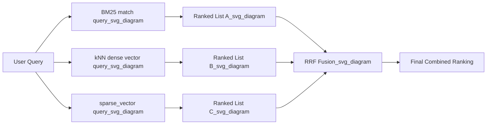

## Hybrid Search: Combining kNN and BM25

### Overview

Hybrid search combines lexical retrieval (BM25-based full-text scoring via `match` and related queries) with vector-based retrieval (kNN over `dense_vector` fields, or sparse retrieval via `sparse_vector`) to produce a single ranked result set that benefits from both approaches. BM25 excels at exact term matching, rare-term precision, and queries with specific keywords or identifiers, while kNN excels at semantic similarity — surfacing relevant results even when query and document vocabulary differ. Combining them addresses weaknesses each method has on its own.

Elasticsearch supports several mechanisms for hybrid search: simple score summation via `bool` queries, weighted linear combination, and Reciprocal Rank Fusion (RRF) via the `rrf` retriever.

### Why Combine BM25 and kNN

**Key Points**

- BM25 scores are based on term frequency, inverse document frequency, and field length normalization — strong for exact keyword matches but blind to semantic paraphrase.
- kNN scores are based on vector distance/similarity — strong for conceptual/semantic relevance but can miss exact-match precision, especially for rare terms, product codes, or proper nouns not well represented in the embedding model's training data.
- Combining both allows a query like "affordable running shoes" to match documents mentioning "budget-friendly sneakers" (semantic) as well as documents containing the literal phrase "affordable running shoes" (lexical), with each contributing independently to relevance.

### Score-Summation Approach (bool query)

The simplest hybrid method places a `match` clause and a `knn` clause together, with Elasticsearch summing their scores:

```json
GET my-index/_search
{
  "query": {
    "match": {
      "description": "affordable running shoes"
    }
  },
  "knn": {
    "field": "description_vector",
    "query_vector": [0.12, -0.34, 0.98],
    "k": 10,
    "num_candidates": 100,
    "boost": 0.6
  },
  "size": 10
}
```

**Key Points**

- `boost` on the `knn` clause (and an implicit or explicit boost on the `query` clause) controls the relative weight each score contributes to the final combined score.
- BM25 scores and vector similarity scores are on fundamentally different numeric scales, so naive summation without careful boost tuning can let one signal dominate regardless of relevance.
- [Inference] There is no single correct boost ratio; it depends on the specific BM25 score distribution and vector similarity metric in use, and is typically tuned via relevance evaluation against a labeled dataset rather than set analytically.

### Reciprocal Rank Fusion (RRF)

RRF avoids the score-scale mismatch problem by combining results based on *rank position* rather than raw score, making it scale-agnostic. Elasticsearch exposes this via the `rrf` retriever:

```json
GET my-index/_search
{
  "retriever": {
    "rrf": {
      "retrievers": [
        {
          "standard": {
            "query": {
              "match": {
                "description": "affordable running shoes"
              }
            }
          }
        },
        {
          "knn": {
            "field": "description_vector",
            "query_vector": [0.12, -0.34, 0.98],
            "k": 10,
            "num_candidates": 100
          }
        }
      ],
      "rank_window_size": 50,
      "rank_constant": 20
    }
  }
}
```

**Key Points**

- Each sub-retriever independently ranks documents; RRF then combines ranks (not raw scores) using the formula:

$$\text{RRFscore}(d) = \sum_{r \in R} \frac{1}{k + \text{rank}_r(d)}$$

where $\text{rank}_r(d)$ is the document's rank position within retriever $r$'s result list, and $k$ is the `rank_constant` (a smoothing constant, commonly defaulting to 60 in general RRF literature, though Elasticsearch's default may differ — [Unverified] confirm current default against the deployed version's documentation).

- `rank_window_size` controls how many top results from each sub-retriever are considered for fusion.
- Because ranks rather than raw scores are combined, RRF sidesteps the need to normalize or manually balance BM25 vs. vector similarity scales, making it the generally recommended default for hybrid search when there's no strong empirical basis for a specific weighting.

### Combining Sparse and Dense Vector Retrieval

Hybrid search is not limited to BM25 + dense kNN; `sparse_vector` queries can also be combined with either or both:

```json
GET my-index/_search
{
  "retriever": {
    "rrf": {
      "retrievers": [
        {
          "standard": {
            "query": {
              "match": {
                "description": "affordable running shoes"
              }
            }
          }
        },
        {
          "knn": {
            "field": "description_vector",
            "query_vector": [0.12, -0.34, 0.98],
            "k": 10,
            "num_candidates": 100
          }
        },
        {
          "standard": {
            "query": {
              "sparse_vector": {
                "field": "description_sparse",
                "inference_id": "my-elser-endpoint",
                "query": "affordable running shoes"
              }
            }
          }
        }
      ],
      "rank_window_size": 50,
      "rank_constant": 20
    }
  }
}
```

This three-way fusion lets exact lexical, dense semantic, and sparse learned-term-expansion signals each contribute independently to the final ranking.

### Diagram: Hybrid Retrieval and Fusion Flow



### Choosing Between Score-Summation and RRF

| Aspect | Score-Summation (`bool` + `knn`) | RRF Retriever |
|---|---|---|
| Basis for combination | Raw score addition | Rank position |
| Scale sensitivity | High — requires manual boost tuning | Low — scale-agnostic by design |
| Tuning complexity | Requires careful boost calibration | Primarily `rank_constant` and `rank_window_size` |
| Number of signals combinable | Practically limited to 2 well-tuned clauses | Cleanly extends to 3+ retrievers |
| Typical recommendation | When boosts have been empirically validated | Default choice absent strong tuning data |

### Evaluation and Tuning

**Key Points**

- Hybrid search quality should be evaluated using relevance judgment sets (queries paired with known-relevant documents) and standard IR metrics such as NDCG or MAP, rather than assumed to be strictly better than either method alone.
- [Inference] Hybrid search does not universally outperform single-method retrieval for every query type — for highly exact-match-dependent queries (e.g., SKU lookups), pure BM25 may outperform a hybrid blend if the vector signal introduces noise; this is workload-dependent and worth validating rather than assuming.
- `rank_window_size` in RRF should be large enough to capture genuinely relevant documents from each sub-retriever before fusion truncates the list, but not so large that irrelevant low-rank documents dilute the fusion signal.

### Limitations and Considerations

- Running multiple retrieval methods per query (BM25 + kNN + sparse) increases per-query computational cost compared to a single method, since each sub-retriever executes independently before fusion.
- RRF's `rank_constant` dampens the influence of exact rank position for lower-ranked documents; very small values make top-ranked documents dominate disproportionately, while very large values flatten the influence of rank differences. [Inference] Appropriate values depend on how much emphasis should be placed on top-of-list agreement between retrievers versus broader consensus, and are typically tuned empirically.
- Not all retriever combinations are supported in all Elasticsearch versions; the `retriever` framework and `rrf` retriever were introduced in specific versions and syntax has evolved. [Unverified] Confirm retriever syntax compatibility against the target Elasticsearch version before deployment.

**Related Topics**

- Reciprocal Rank Fusion parameter tuning (`rank_constant`, `rank_window_size`)
- The `retriever` framework and composable retrieval pipelines
- Semantic reranking with cross-encoder `rerank` retrievers
- Relevance evaluation methodology (NDCG, MAP, labeled judgment sets)
- `sparse_vector` field type and ELSER-based sparse retrieval
- kNN search API and approximate vs exact kNN tradeoffs