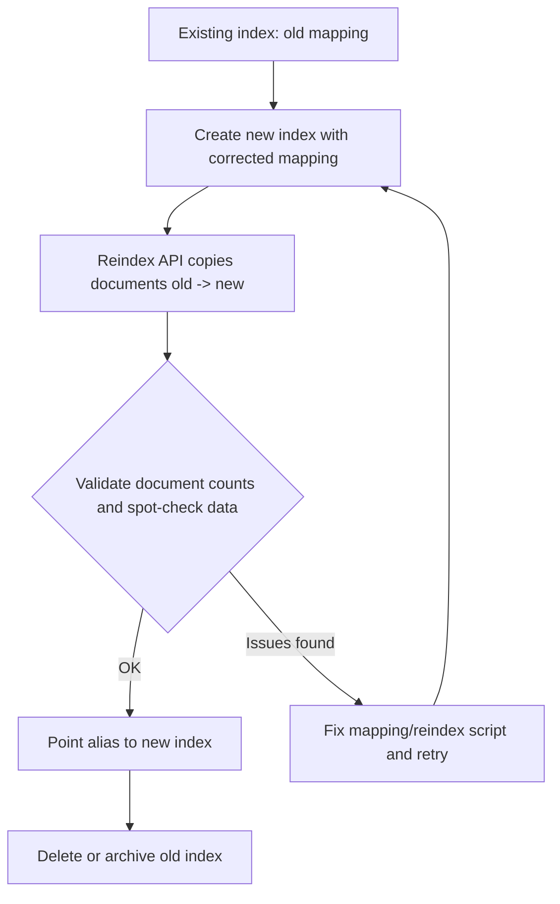

## Viewing and Updating Mappings

### Overview

A mapping defines how documents and their fields are stored and indexed in Elasticsearch — field data types, analyzers, and various field-level settings that control indexing and search behavior. Mappings can be inspected at any time, and can be partially updated after index creation, though Elasticsearch imposes strict limits on what can be changed for existing fields versus what requires adding new fields or reindexing entirely.

### Viewing Mappings

#### Get Mapping for an Index

**Example**

```
GET my-index/_mapping
```

Returns the full mapping definition for `my-index`, including all fields, their types, and any field-level settings.

#### Get Mapping for Multiple Indices

**Example**

```
GET my-index-1,my-index-2/_mapping
```

**Example** — using a wildcard pattern:

```
GET my-index-*/_mapping
```

#### Get Mapping for a Specific Field

The field mapping API allows retrieving the mapping for a single field or a subset of fields, which is useful for large mappings where the full response would be unwieldy.

**Example**

```
GET my-index/_mapping/field/content
```

**Example** — multiple fields via comma-separated list or wildcard:

```
GET my-index/_mapping/field/content,title
GET my-index/_mapping/field/user.*
```

#### Get Mapping for All Indices

**Example**

```
GET _mapping
```

[Inference] This is generally discouraged on clusters with a large number of indices, since the response size grows with the total number of indices and fields, based on how the response aggregates mapping definitions per index.

### Reading a Mapping Response

**Key Points**
- The response is nested under the index name, then `mappings`, then `properties`.
- Each field entry shows `type` and any additional parameters (`analyzer`, `fields` for multi-fields, `format` for dates, etc.).
- Object and nested fields show their sub-fields under a nested `properties` block.

**Example** — typical response shape:

```
{
  "my-index": {
    "mappings": {
      "properties": {
        "title": {
          "type": "text",
          "fields": {
            "keyword": {
              "type": "keyword",
              "ignore_above": 256
            }
          }
        },
        "created_at": {
          "type": "date"
        },
        "views": {
          "type": "integer"
        }
      }
    }
  }
}
```

### Updating Mappings: What Is Allowed

**Key Points**
- **New fields can always be added** to an existing mapping, either explicitly via the update mapping API or implicitly through dynamic mapping when a document with a new field is indexed.
- **Existing field mappings generally cannot be modified** once data has been indexed with that mapping — Lucene segments are immutable, and most field-type changes would invalidate already-indexed data.
- Only a small number of parameters on existing fields can be updated in place, notably `ignore_above`, and multi-fields (`fields`) can be added to an existing field.
- Changing a field's `type`, `analyzer` (for already-analyzed text), or removing a field requires **reindexing** into a new index with the corrected mapping.

### Adding a New Field to an Existing Mapping

**Example**

```
PUT my-index/_mapping
{
  "properties": {
    "email": {
      "type": "keyword"
    }
  }
}
```

This adds the `email` field without affecting any existing fields or previously indexed documents (which will simply have no value for `email` unless later updated).

### Adding a Multi-Field to an Existing Field

Multi-fields allow the same underlying value to be indexed multiple ways (e.g., as both `text` for full-text search and `keyword` for exact matching/aggregations). Adding a multi-field to an existing field is permitted because it does not alter the original field's indexing.

**Example**

```
PUT my-index/_mapping
{
  "properties": {
    "title": {
      "type": "text",
      "fields": {
        "raw": {
          "type": "keyword"
        }
      }
    }
  }
}
```

**Key Points**
- This only affects documents indexed *after* the mapping update — existing documents will not have the new multi-field populated unless reindexed.
- The original field definition (`title` as `text`) must match what's already in the mapping; Elasticsearch will reject a conflicting redefinition of an existing field's core `type`.

### Updating `ignore_above`

`ignore_above` on a `keyword` field controls the maximum string length that will be indexed; longer values are stored but not indexed (so they won't match term queries). This is one of the few core parameters updatable in place on an existing field.

**Example**

```
PUT my-index/_mapping
{
  "properties": {
    "tag": {
      "type": "keyword",
      "ignore_above": 100
    }
  }
}
```

[Unverified] The complete list of in-place-updatable parameters can vary slightly across Elasticsearch versions; consult the update mapping API documentation for the current version in use to confirm which parameters beyond `ignore_above` are mutable for a given field type.

### Attempting an Unsupported Change

**Example** — attempting to change an existing field's type triggers an error:

```
PUT my-index/_mapping
{
  "properties": {
    "views": {
      "type": "text"
    }
  }
}
```

This produces a `mapper_parsing_exception` (or similar conflict error) because `views` already exists as `integer`. Elasticsearch does not allow silently redefining an existing field's type through the update mapping API.

### The Reindex Workflow for Mapping Changes

When a genuine type or analyzer change is required, the standard pattern is: create a new index with the corrected mapping, reindex data into it, then swap references (typically via an alias).



**Example** — creating the new index and reindexing:

```
PUT my-index-v2
{
  "mappings": {
    "properties": {
      "views": {
        "type": "long"
      }
    }
  }
}
```

```
POST _reindex
{
  "source": {
    "index": "my-index"
  },
  "dest": {
    "index": "my-index-v2"
  }
}
```

**Example** — repointing an alias so applications don't need to change index names:

```
POST _aliases
{
  "actions": [
    { "remove": { "index": "my-index", "alias": "my-index-current" } },
    { "add": { "index": "my-index-v2", "alias": "my-index-current" } }
  ]
}
```

### Dynamic Mapping Updates

When dynamic mapping is enabled (the default), indexing a document with a previously unseen field automatically updates the mapping.

**Key Points**
- The inferred type is based on the JSON value's apparent type (string → `text` + `keyword` multi-field by default; numbers → `long` or `float`; booleans → `boolean`; date-like strings matching configured formats → `date`).
- This dynamic update is visible immediately via `GET my-index/_mapping` after the document is indexed.
- Dynamic mapping can be restricted via the `dynamic` setting (`true`, `false`, or `strict`) at the top level or per-object, controlling whether unknown fields are auto-mapped, ignored, or rejected.

**Example** — setting `dynamic: strict` to reject unknown fields:

```
PUT my-index
{
  "mappings": {
    "dynamic": "strict",
    "properties": {
      "title": { "type": "text" }
    }
  }
}
```

With `strict` set, indexing a document containing a field not defined in `properties` results in a `strict_dynamic_mapping_exception` rather than silently adding the field.

### Checking Mapping Before Bulk Operations

**Key Points**
- It's common practice to check `GET my-index/_mapping` before large bulk ingestion jobs to confirm field types match what the ingestion pipeline expects, particularly for numeric vs. keyword ambiguity.
- Mismatched expectations (e.g., assuming a field is `keyword` when dynamic mapping actually inferred `text`) are a frequent source of unexpected aggregation or sorting behavior, since `text` fields are analyzed and not directly aggregatable without `fielddata` enabled or a `keyword` sub-field.

### Comparing Mappings Across Indices

There is no dedicated "diff" API; comparing mappings across indices (e.g., verifying a new index matches a template) is typically done by retrieving both mappings and comparing the JSON manually or with external tooling.

**Example**

```
GET index-a/_mapping
GET index-b/_mapping
```

[Inference] For consistent mapping across many indices sharing a naming pattern, using an index template rather than manually replicating `PUT _mapping` calls per index is the more maintainable approach, since templates apply the mapping automatically at index creation time.

### Summary Table: Mapping Update Capabilities

| Change | Allowed In-Place? | Requires Reindex? |
|---|---|---|
| Add a new field | Yes | No |
| Add a multi-field to existing field | Yes | No |
| Update `ignore_above` on `keyword` | Yes | No |
| Change a field's `type` | No | Yes |
| Change an analyzer on existing `text` field | No | Yes |
| Remove a field | Not directly | Yes |
| Change `dynamic` setting for future docs | Yes | No |

### Common Pitfalls

**Key Points**
- Assuming a mapping update will retroactively apply to already-indexed documents — it only affects documents indexed after the change (except for the narrow set of in-place parameter updates).
- Relying on dynamic mapping in production without reviewing the inferred types, leading to fields mapped as `text` when `keyword` or a numeric type was intended.
- Forgetting that once a `text` field's analyzer has been applied to indexed documents, changing the analyzer setting alone does not re-analyze existing terms in the inverted index — a reindex is required.
- Using `PUT my-index/_mapping` to attempt a field type change and receiving a mapping conflict error, then mistakenly assuming the index itself is corrupted rather than recognizing this as expected, immutable-mapping behavior.

**Related Topics**
- Index Management — Index templates and component templates for consistent mappings across indices
- Index Management — The Reindex API in depth (scripted reindexing, source queries, throttling)
- Index Management — Aliases and zero-downtime reindexing workflows
- Mapping — Dynamic mapping rules and date/numeric detection settings
- Mapping — Multi-fields in depth (`text` + `keyword` patterns, `search_as_you_type`)
- Mapping — `dynamic: runtime` and runtime fields as an alternative to reindexing for new field logic