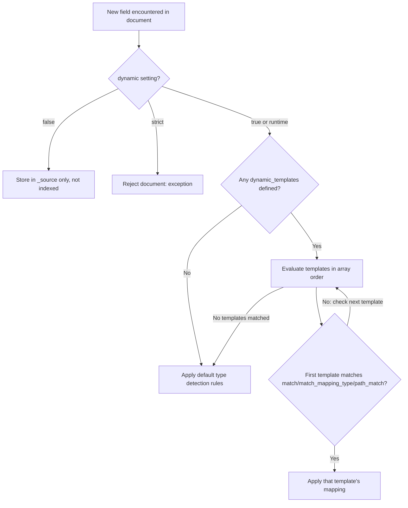

## Dynamic Mapping Rules

### Overview

Dynamic mapping is the mechanism by which Elasticsearch automatically detects and adds new fields to an index's mapping as documents containing previously unseen fields are indexed, without requiring an explicit mapping to be defined in advance. This behavior is governed by a combination of default type-detection rules, date/numeric detection settings, and dynamic templates that allow customizing how new fields are mapped.

### The `dynamic` Setting

The `dynamic` parameter controls whether and how new fields are added, and can be set at the index level or per-object within the mapping.

**Key Points**
- `true` (default) — new fields are automatically added to the mapping.
- `false` — new fields are ignored: the data is stored in `_source` and retrievable, but not indexed, so it cannot be searched or aggregated.
- `strict` — indexing a document with an unmapped field throws a `strict_dynamic_mapping_exception`, rejecting the document entirely.
- `runtime` — new fields are added as runtime fields rather than indexed fields (available in versions supporting runtime mapping mode). [Unverified] Availability and exact behavior of `dynamic: runtime` at the top level should be confirmed against the specific Elasticsearch version in use.

**Example** — setting `dynamic: false` at the index level:

```
PUT my-index
{
  "mappings": {
    "dynamic": false,
    "properties": {
      "title": { "type": "text" }
    }
  }
}
```

**Example** — setting `dynamic` per-object:

```
PUT my-index
{
  "mappings": {
    "properties": {
      "title": { "type": "text" },
      "metadata": {
        "type": "object",
        "dynamic": "strict",
        "properties": {
          "source": { "type": "keyword" }
        }
      }
    }
  }
}
```

In this example, top-level dynamic mapping remains enabled, but any unmapped field nested under `metadata` triggers a strict rejection, while unmapped top-level fields would still be dynamically added.

### Default Type Detection Rules

When a new field is encountered and dynamic mapping is enabled, Elasticsearch infers a field type based on the JSON value type.

| JSON Value | Inferred Elasticsearch Type |
|---|---|
| `null` | No field added (skipped) |
| `true` / `false` | `boolean` |
| Floating-point number | `float` |
| Integer number | `long` |
| String matching a date format | `date` |
| String matching a number pattern (if `numeric_detection` enabled) | `float` or `long` |
| Other string | `text`, with a `keyword` sub-field (`.keyword`) |
| Object (`{...}`) | `object` |
| Array | Type of the first non-null element determines the field type |

**Key Points**
- Arrays are not a distinct mapped type in Elasticsearch; any field can hold multiple values of the same inferred type without explicit array declaration.
- For string fields, the default dynamic mapping creates both a `text` version (analyzed, for full-text search) and a `keyword` multi-field (not analyzed, for exact match/aggregation/sorting), commonly capped with `ignore_above: 256` on the keyword sub-field.

**Example** — resulting dynamic mapping for a string field:

```
{
  "properties": {
    "description": {
      "type": "text",
      "fields": {
        "keyword": {
          "type": "keyword",
          "ignore_above": 256
        }
      }
    }
  }
}
```

### Date Detection

Date detection attempts to identify string values that look like dates and map them as `date` fields rather than `text`.

**Key Points**
- Enabled by default (`date_detection: true`).
- Uses a default set of recognized date formats (matching common patterns such as `strict_date_optional_time` and `yyyy/MM/dd HH:mm:ss` variants); a string must match one of the active formats to be detected as a date.
- The set of formats checked can be customized via `dynamic_date_formats`.
- Once a field has been mapped as `date` from the first document, subsequent documents with non-date-parseable values for that same field will fail to index unless `ignore_malformed` is set.

**Example** — disabling date detection:

```
PUT my-index
{
  "mappings": {
    "date_detection": false,
    "properties": {}
  }
}
```

With date detection disabled, a field value like `"2026-08-24"` would instead be dynamically mapped as `text`/`keyword` rather than `date`.

**Example** — customizing recognized date formats:

```
PUT my-index
{
  "mappings": {
    "dynamic_date_formats": ["MM/dd/yyyy"]
  }
}
```

### Numeric Detection

Numeric detection controls whether numeric-looking strings (e.g., `"42"`, `"3.14"`) are mapped as numeric types rather than `text`/`keyword`. Unlike date detection, this is **disabled by default**.

**Example** — enabling numeric detection:

```
PUT my-index
{
  "mappings": {
    "numeric_detection": true
  }
}
```

With this enabled, a document field like `"quantity": "42"` (a quoted string containing digits) would be mapped as `long` rather than `text`.

**Key Points**
- Without numeric detection enabled, numeric-looking strings remain `text`/`keyword`, which is often the safer default for identifiers or codes that happen to be numeric (e.g., zip codes, SKUs) but should not participate in numeric range queries or aggregations.

### Dynamic Templates

Dynamic templates allow custom rules for how dynamically detected fields should be mapped, overriding the default type-detection behavior based on field name patterns, matched value types, or path patterns.

**Key Points**
- Defined as an ordered array under `dynamic_templates`; the first matching template wins.
- Matching can be based on `match`/`unmatch` (field name glob patterns), `match_mapping_type` (the type Elasticsearch would have inferred), `path_match`/`path_unmatch` (dotted path patterns for nested objects), and `match_pattern` (`simple` glob or `regex`).
- Common use cases: mapping all string fields as `keyword` only (disabling full-text analysis by default), applying a specific analyzer to fields matching a naming convention, or mapping all fields under a given path as a specific type.

**Example** — mapping all string fields as `keyword` instead of `text` + `keyword`:

```
PUT my-index
{
  "mappings": {
    "dynamic_templates": [
      {
        "strings_as_keywords": {
          "match_mapping_type": "string",
          "mapping": {
            "type": "keyword"
          }
        }
      }
    ]
  }
}
```

**Example** — applying a template based on field name suffix:

```
PUT my-index
{
  "mappings": {
    "dynamic_templates": [
      {
        "ids_as_keyword": {
          "match": "*_id",
          "mapping": {
            "type": "keyword"
          }
        }
      },
      {
        "longs_as_integer": {
          "match_mapping_type": "long",
          "mapping": {
            "type": "integer"
          }
        }
      }
    ]
  }
}
```

**Example** — targeting fields by path within nested objects:

```
PUT my-index
{
  "mappings": {
    "dynamic_templates": [
      {
        "geo_fields": {
          "path_match": "location.*",
          "match_mapping_type": "string",
          "mapping": {
            "type": "keyword"
          }
        }
      }
    ]
  }
}
```

### Dynamic Template Matching Order



### Interaction Between Detection Settings and Templates

**Key Points**
- `date_detection` and `numeric_detection` influence what `match_mapping_type` a dynamic template will see for a given value — e.g., if date detection identifies a string as a date, a template with `match_mapping_type: "date"` can then apply to it.
- Templates are evaluated only for fields that would otherwise be dynamically mapped; fields already explicitly defined in `properties` are unaffected by dynamic templates.
- Order matters: templates are matched top-to-bottom, and the first match is applied, so more specific templates should generally be placed before more general catch-all templates.

### Runtime Fields as a Dynamic Mapping Mode

[Unverified] In versions that support it, setting `dynamic: runtime` causes newly detected fields to be added as runtime fields (computed at query time from `_source`) rather than indexed fields, which avoids mapping explosion at the cost of query-time computation overhead; confirm exact support and behavior against the target version's documentation.

### Common Pitfalls

**Key Points**
- Relying on default dynamic mapping in production, leading to **mapping explosion** — an unbounded number of distinct field names (e.g., from arbitrary user-supplied JSON keys) each creating a new mapped field, which can degrade cluster performance and hit the `index.mapping.total_fields.limit`.
- Assuming numeric detection is enabled by default — it is not, unlike date detection, so numeric-looking strings remain `keyword`/`text` unless explicitly configured.
- Defining dynamic templates in the wrong order, where a broad catch-all template (e.g., matching all `string` types) shadows a more specific template intended for particular field names.
- Not setting `dynamic: false` or `strict` on indices ingesting semi-structured or untrusted JSON, resulting in unpredictable mapping growth driven by external data shape rather than a deliberate schema design.
- Forgetting that once a field is dynamically mapped from the first document, its type is locked in for that index (barring the reindex workflow), so the *first* document's shape effectively determines the field's type for all future documents.

**Related Topics**
- Mapping — Viewing and updating mappings (in-place changes vs. reindexing)
- Mapping — Multi-fields in depth (`text` + `keyword` patterns)
- Mapping — Explicit mapping and `properties` definition best practices
- Mapping — `index.mapping.total_fields.limit` and other mapping limit settings
- Mapping — Runtime fields (querying `_source` without indexing)
- Index Management — Index templates and component templates for schema consistency at scale