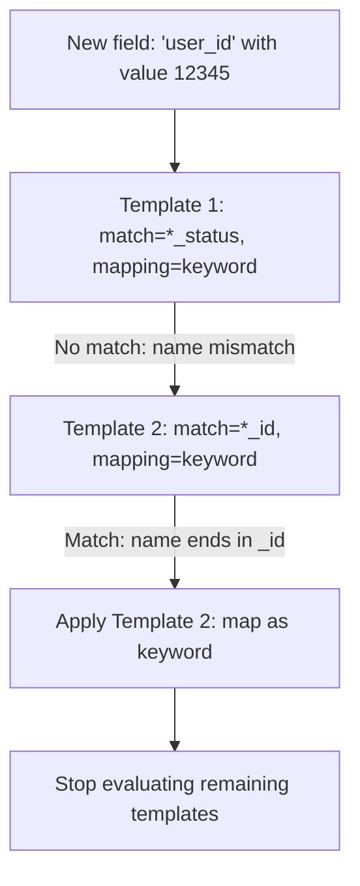

## Dynamic Templates

### Overview

Dynamic templates give explicit control over how Elasticsearch maps fields that are not already defined in the mapping, replacing the default type-detection rules with custom, rule-based mapping decisions. They are defined as an ordered list under `dynamic_templates` in an index's mappings, and each template specifies a matching condition paired with the mapping to apply when that condition is satisfied.

### Basic Structure

**Key Points**
- A dynamic template is a named object with a matching clause and a `mapping` block.
- Templates are stored as an array; array order determines precedence, since the **first matching template wins** and evaluation stops there.
- Each template must have a unique name within the array (the name itself has no functional effect on matching — it exists for readability and to allow template removal by name during merges).

**Example** — minimal template shape:

```
PUT my-index
{
  "mappings": {
    "dynamic_templates": [
      {
        "template_name": {
          "match_mapping_type": "string",
          "mapping": {
            "type": "keyword"
          }
        }
      }
    ]
  }
}
```

### Matching Conditions

Dynamic templates support several matching parameters, which can be combined within a single template for more precise targeting.

#### `match_mapping_type`

Matches based on the type Elasticsearch would have dynamically inferred for the value (before any template is applied), such as `string`, `long`, `double`, `boolean`, `date`, or `object`.

**Example**

```
{
  "longs_as_integers": {
    "match_mapping_type": "long",
    "mapping": {
      "type": "integer"
    }
  }
}
```

#### `match` and `unmatch`

Matches based on the field name itself, using simple glob-style patterns by default. `unmatch` excludes fields that would otherwise match.

**Example**

```
{
  "no_status_as_text": {
    "match": "*_name",
    "unmatch": "*_status_name",
    "match_mapping_type": "string",
    "mapping": {
      "type": "keyword"
    }
  }
}
```

#### `path_match` and `path_unmatch`

Matches based on the full dotted path of the field, which is necessary for targeting fields nested within specific objects rather than matching the same field name anywhere in the document.

**Example**

```
{
  "address_fields": {
    "path_match": "address.*",
    "path_unmatch": "*.internal_notes",
    "mapping": {
      "type": "keyword"
    }
  }
}
```

#### `match_pattern`

Controls whether `match`/`unmatch`/`path_match`/`path_unmatch` use simple glob syntax (`simple`, the default) or full regular expressions (`regex`).

**Example**

```
{
  "regex_id_fields": {
    "match_pattern": "regex",
    "match": "^.*_id$",
    "mapping": {
      "type": "keyword"
    }
  }
}
```

### Combining Multiple Conditions

**Key Points**
- When multiple matching parameters are present in the same template (e.g., both `match` and `match_mapping_type`), all conditions must be satisfied for the template to apply — conditions within a single template are combined with logical AND.
- This allows narrowing a rule to, for example, "only string fields whose name ends in `_code`," rather than matching any field ending in `_code` regardless of inferred type.

**Example**

```
{
  "code_fields_as_keyword": {
    "match": "*_code",
    "match_mapping_type": "string",
    "mapping": {
      "type": "keyword"
    }
  }
}
```

### The `{name}` and `{dynamic_type}` Placeholders

Within the `mapping` block of a template, `{name}` and `{dynamic_type}` act as placeholders that Elasticsearch substitutes with the actual matched field name and inferred type, useful when a template's mapping needs to reference the field being mapped.

**Example** — using `{dynamic_type}` to preserve the original inferred type while adding a custom multi-field:

```
{
  "named_analyzers": {
    "match_mapping_type": "string",
    "mapping": {
      "type": "text",
      "fields": {
        "{name}_raw": {
          "type": "keyword"
        }
      }
    }
  }
}
```

### Common Use Case: Disabling Full-Text Analysis Globally

One of the most frequent applications of dynamic templates is preventing every dynamically detected string field from receiving the default `text` + `keyword` multi-field treatment, instead mapping all strings as `keyword` only — appropriate when full-text search is not needed and mapping/storage overhead should be minimized.

**Example**

```
PUT my-index
{
  "mappings": {
    "dynamic_templates": [
      {
        "strings_as_keywords": {
          "match_mapping_type": "string",
          "mapping": {
            "type": "keyword",
            "ignore_above": 256
          }
        }
      }
    ]
  }
}
```

### Common Use Case: Applying a Specific Analyzer by Naming Convention

**Example**

```
PUT my-index
{
  "mappings": {
    "dynamic_templates": [
      {
        "multilingual_titles": {
          "match": "title_*",
          "match_mapping_type": "string",
          "mapping": {
            "type": "text",
            "analyzer": "standard"
          }
        }
      }
    ]
  }
}
```

This pattern is useful for documents storing per-language field variants (e.g., `title_en`, `title_fr`), where each variant should be mapped as analyzed text but with a consistent analyzer choice determined by naming convention rather than per-field manual definition.

### Common Use Case: Mapping All Numeric Fields at a Specific Precision

**Example**

```
PUT my-index
{
  "mappings": {
    "dynamic_templates": [
      {
        "doubles_as_float": {
          "match_mapping_type": "double",
          "mapping": {
            "type": "float"
          }
        }
      },
      {
        "longs_as_integer": {
          "match_mapping_type": "long",
          "mapping": {
            "type": "integer"
          }
        }
      }
    ]
  }
}
```

**Key Points**
- This narrows storage footprint by mapping to smaller numeric types (`float` instead of `double`, `integer` instead of `long`) when the full precision range of the wider default type is not needed. [Inference] The suitability of narrowing numeric precision depends entirely on the actual value ranges expected in the data; values exceeding the narrower type's range would cause indexing failures or silent precision loss, based on general numeric type behavior.

### Template Order and Precedence



**Key Points**
- Placing broad, general templates (e.g., a catch-all `match_mapping_type: "string"`) before narrow, specific templates causes the broad template to shadow the specific one, since the first match always wins.
- The recommended ordering is most-specific-first, general-fallback-last.

### Combining with Multi-Fields

Dynamic templates can define multi-fields within the generated mapping, mirroring what default dynamic mapping does for strings but with custom sub-field configuration.

**Example**

```
{
  "strings_with_search_variant": {
    "match_mapping_type": "string",
    "mapping": {
      "type": "keyword",
      "fields": {
        "text": {
          "type": "text"
        }
      }
    }
  }
}
```

This inverts the default behavior (text as primary, keyword as sub-field) — here `keyword` is primary and `text` is the multi-field, appropriate when exact-match/aggregation is the more common access pattern and full-text search is secondary.

### Updating Dynamic Templates on an Existing Index

**Key Points**
- Dynamic templates can be added or replaced via the update mapping API, similar to adding new fields.
- Updating `dynamic_templates` only affects fields dynamically mapped **after** the update; fields already dynamically mapped under the old rules retain their existing mapping and are not retroactively changed.

**Example**

```
PUT my-index/_mapping
{
  "dynamic_templates": [
    {
      "strings_as_keywords": {
        "match_mapping_type": "string",
        "mapping": {
          "type": "keyword"
        }
      }
    }
  ]
}
```

### Testing Dynamic Templates Without Indexing

The Simulate API allows testing how a document would be mapped against a given set of dynamic templates without actually indexing data, which is useful for validating template logic before applying it to a live index.

**Example**

```
POST _index_template/_simulate_index/my-index
```

[Unverified] Exact simulate endpoint naming and payload structure (e.g., `_simulate_index` vs. `_simulate`) can differ by version; confirm against current documentation for the specific simulate workflow needed (index templates vs. component templates vs. a raw mapping simulation).

### Common Pitfalls

**Key Points**
- Ordering a general `match_mapping_type: "string"` template before more specific `match`-based templates, silently preventing the specific templates from ever applying.
- Forgetting `match_mapping_type` in a `match`/`path_match`-only template, causing it to unintentionally apply to non-string fields that happen to match the name pattern.
- Using `match` (name-only) when `path_match` (full path) was intended, causing a template meant for a specific nested object to instead apply to any field with that name anywhere in the document.
- Assuming updating `dynamic_templates` retroactively re-maps existing dynamically-mapped fields — it does not; only newly encountered fields are affected.
- Relying on `regex` match patterns without accounting for performance cost on very large documents with many fields, since each candidate field name may be tested against the regex during mapping.

**Related Topics**
- Mapping — Dynamic mapping rules (default type detection, date/numeric detection)
- Mapping — Viewing and updating mappings
- Mapping — Multi-fields in depth (`text` + `keyword` patterns)
- Index Management — Index templates and component templates
- Mapping — `index.mapping.total_fields.limit` and mapping explosion prevention
- Mapping — Simulate API workflows for validating templates before deployment