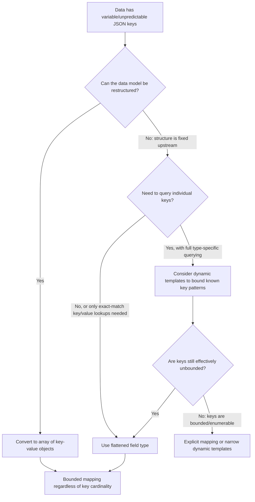

## Mapping Explosion and Field Limit

### Overview

Mapping explosion occurs when an index accumulates an excessive and unbounded number of distinct mapped fields, typically as a result of dynamic mapping being applied to semi-structured or unpredictable JSON where field names themselves carry data (e.g., using a user ID or timestamp as a JSON key rather than a value). Elasticsearch guards against the resulting cluster instability primarily through the `index.mapping.total_fields.limit` setting and related mapping limit controls.

### What Causes Mapping Explosion

**Key Points**
- The most common cause is indexing documents where field **names** vary per document rather than field **values** — for example, `{"metrics": {"user_12345": 42, "user_67890": 17}}` creates a new mapped field for every distinct user ID encountered, rather than a bounded set of fields.
- Each dynamically added field becomes a permanent entry in the index's mapping (until reindexed away); mappings only grow, they are never automatically pruned as data ages out or is deleted.
- Nested objects compound the problem: a deeply nested or highly variable object structure can generate many mapped fields from a small number of source documents.
- High-cardinality dynamic keys are especially common in observability/metrics use cases, feature-flag payloads, and free-form key-value data models that were not designed with Elasticsearch's mapping model in mind.

### Why It Matters

**Key Points**
- Every mapped field consumes cluster heap memory via the cluster state, which is held in memory on every node and replicated on every cluster state update.
- A very large mapping increases the size of the cluster state, which must be serialized and distributed to all nodes on changes, increasing latency for mapping updates and, in severe cases, contributing to cluster instability.
- Large mappings slow down operations that enumerate fields, including index creation, mapping retrieval, and certain query-time field resolution (e.g., wildcard field queries across `*`).
- [Inference] Beyond a few tens of thousands of fields, clusters commonly experience degraded mapping-update performance and increased master node load, based on how cluster state propagation scales with mapping size; the precise threshold at which problems become noticeable depends on cluster size, heap allocation, and update frequency.

### The `index.mapping.total_fields.limit` Setting

This setting caps the total number of fields an index's mapping may contain, acting as a hard backstop against runaway dynamic mapping growth.

**Key Points**
- Default value is commonly 1000 fields per index. [Unverified] Confirm the exact default against the specific Elasticsearch version, as default limits have occasionally been adjusted across major versions.
- Counts all fields, including multi-fields (a `text` field with a `keyword` sub-field counts as more than one toward the limit) and fields within nested objects.
- Once the limit is reached, attempting to index a document that would introduce a new field fails with an `illegal_argument_exception` referencing the field limit.

**Example** — setting a custom field limit at index creation:

```
PUT my-index
{
  "settings": {
    "index.mapping.total_fields.limit": 2000
  },
  "mappings": {
    "properties": {
      "title": { "type": "text" }
    }
  }
}
```

**Example** — updating the limit on an existing index:

```
PUT my-index/_settings
{
  "index.mapping.total_fields.limit": 2000
}
```

**Key Points**
- Raising the limit is a mitigation, not a fix — it delays the point of failure but does not address the underlying unbounded field growth, and higher limits still carry the cluster state overhead described above.

### Related Mapping Limit Settings

Several companion settings guard against other dimensions of mapping complexity that can accompany or independently cause similar issues.

| Setting | Purpose | Typical Default |
|---|---|---|
| `index.mapping.total_fields.limit` | Maximum total number of fields | 1000 |
| `index.mapping.depth.limit` | Maximum nesting depth of objects | 20 |
| `index.mapping.nested_fields.limit` | Maximum number of distinct `nested` mappings | 50 |
| `index.mapping.nested_objects.limit` | Maximum number of nested JSON objects per document | 10000 |
| `index.mapping.field_name_length.limit` | Maximum character length of a field name | Long.MAX_VALUE (effectively unlimited) |

[Unverified] Exact default values for these companion settings should be confirmed against the specific Elasticsearch version, as they are less frequently discussed than `total_fields.limit` and may vary.

**Example** — constraining nesting depth:

```
PUT my-index
{
  "settings": {
    "index.mapping.depth.limit": 10
  }
}
```

### Diagnosing an Approaching or Existing Mapping Explosion

**Key Points**
- `GET my-index/_mapping` on an affected index typically returns a very large response dominated by field names that look like data values (IDs, timestamps, usernames) rather than a small set of semantically named fields.
- The field count can be checked programmatically by retrieving the mapping and counting `properties` keys recursively (there is no single built-in API call that returns just a numeric field count).
- Cluster state size and mapping-related slowness can sometimes be corroborated via cluster stats, though [Inference] pinpointing mapping explosion specifically as the cause of broader cluster slowness typically requires correlating mapping size with cluster state update latency rather than reading a single dedicated metric.

### Prevention: Redesigning the Data Model

The most durable fix is avoiding data-as-field-name patterns in the document structure before they reach Elasticsearch.

**Key Points**
- Convert dynamic keys into values: instead of `{"metrics": {"user_12345": 42}}`, use an array of objects: `{"metrics": [{"user_id": "12345", "value": 42}]}`.
- This pattern maps `user_id` and `value` as two bounded fields regardless of how many distinct users exist, since the variability now lives in field *values*, not field *names*.

**Example** — restructured document avoiding key explosion:

```
{
  "metrics": [
    { "metric_name": "cpu_usage", "value": 42 },
    { "metric_name": "memory_usage", "value": 17 }
  ]
}
```

**Example** — corresponding bounded mapping:

```
PUT my-index
{
  "mappings": {
    "properties": {
      "metrics": {
        "type": "nested",
        "properties": {
          "metric_name": { "type": "keyword" },
          "value": { "type": "float" }
        }
      }
    }
  }
}
```

### Prevention: `flattened` Field Type

For cases where the key-value structure is inherent to the use case and cannot be easily restructured (e.g., ingesting arbitrary user-supplied metadata), the `flattened` field type maps an entire JSON object as a single field, avoiding per-key mapping growth entirely.

**Key Points**
- The whole object is indexed as a single field internally, with keys and values both searchable via `flattened_field.key` syntax, but without creating individual mapped sub-fields per key.
- Trades off some query capability (no per-field type-specific analysis, limited numeric/date-specific querying) for guaranteed bounded mapping size.
- Has its own internal limits (e.g., `index.mapping.depth.limit` still applies, and there's a default cap on the number of distinct key-value pairs within a single `flattened` field, commonly around 1000). [Unverified] Confirm this internal cap value against current documentation, as it is configurable via `ignore_above`-style settings specific to `flattened`.

**Example**

```
PUT my-index
{
  "mappings": {
    "properties": {
      "metadata": {
        "type": "flattened"
      }
    }
  }
}
```

### Prevention: Restricting Dynamic Mapping

Setting `dynamic: false` or `dynamic: strict` on object subtrees prone to unpredictable keys prevents those specific areas from contributing to field growth, while still allowing controlled dynamic mapping elsewhere in the document.

**Example**

```
PUT my-index
{
  "mappings": {
    "properties": {
      "title": { "type": "text" },
      "raw_payload": {
        "type": "object",
        "dynamic": false
      }
    }
  }
}
```

Here, `raw_payload` data is stored in `_source` and retrievable, but arbitrary keys within it never become mapped fields.

### Decision Flow for Handling Variable-Key Data



### Recovering From an Existing Explosion

**Key Points**
- Because mappings only grow and are not automatically pruned, recovering an index that has already exploded requires reindexing into a new index with a corrected mapping and, if applicable, a restructured document model or `flattened` fields.
- Simply raising `index.mapping.total_fields.limit` on the existing index avoids immediate indexing failures but does not shrink the already-bloated mapping or reduce its cluster-state footprint.
- A reindex with an ingest pipeline or `_reindex` script can be used to transform the offending key-as-data structure into a value-based structure during the copy, addressing both the mapping size and the underlying data model in one operation.

### Common Pitfalls

**Key Points**
- Treating a rising `index.mapping.total_fields.limit` as an acceptable long-term fix rather than a temporary buffer while the underlying data model issue is addressed.
- Not noticing mapping explosion until the field limit is hit and indexing starts failing, rather than proactively auditing new field growth for indices ingesting semi-structured external data.
- Applying `flattened` broadly to all object fields as a default precaution, losing useful per-field query capabilities (like numeric range queries or field-specific analyzers) on fields that actually have a small, well-known, bounded key set and would be better served by explicit mapping.
- Overlooking that multi-fields count toward `index.mapping.total_fields.limit`, so a seemingly modest number of logical fields can consume the limit faster than expected once `keyword` sub-fields and other multi-fields are counted.
- Forgetting that `dynamic: false` still stores the field data in `_source` (increasing storage and `_source` retrieval size) even though it's not indexed or searchable — it is not equivalent to dropping the data entirely.

**Related Topics**
- Mapping — Dynamic mapping rules (default type detection, date/numeric detection)
- Mapping — Dynamic templates for bounding and customizing dynamic field creation
- Mapping — The `flattened` field type in depth (querying, limitations, `ignore_above`)
- Mapping — Nested field type and `index.mapping.nested_fields.limit` considerations
- Index Management — Reindex API with ingest pipelines for structural data transformation
- Cluster Administration — Cluster state size, master node load, and heap pressure diagnostics