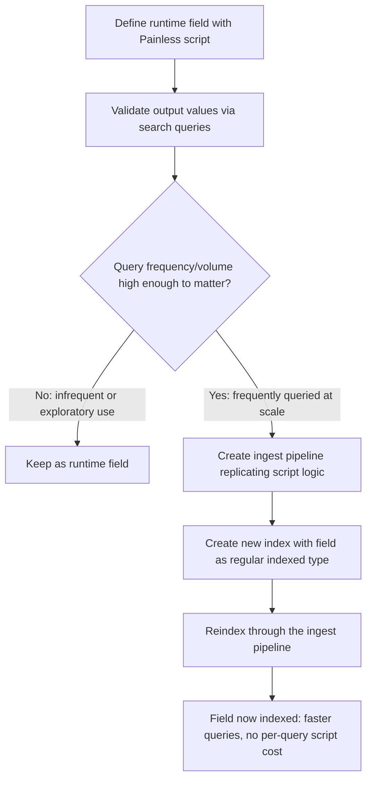

## Runtime Fields

### Overview

Runtime fields are fields evaluated at query time from a script or from existing indexed data, rather than being indexed at document ingestion time. They allow adding new field logic to an index — including deriving values from existing fields, parsing unstructured content, or reshaping data — without reindexing, at the cost of computing the field's value on every query execution that needs it.

### Core Concept

**Key Points**
- Defined either in the mapping under a `runtime` section, or ad hoc within a search request under a `runtime_mappings` block scoped to that single query.
- A runtime field's value is computed from a Painless script that has access to the document's `_source` (and, in some cases, other indexed field values) via `doc['field']` or `params['_source']`.
- Runtime fields are not stored in the inverted index or doc values structures the way regular fields are; they exist only as mapping metadata plus a script, evaluated on demand.
- Can be queried, aggregated, and sorted on much like regular fields, though with different performance characteristics.

### Defining a Runtime Field in the Mapping

**Example**

```
PUT my-index
{
  "mappings": {
    "properties": {
      "timestamp": { "type": "date" },
      "message": { "type": "text" }
    },
    "runtime": {
      "day_of_week": {
        "type": "keyword",
        "script": {
          "source": "emit(doc['timestamp'].value.dayOfWeekEnum.toString())"
        }
      }
    }
  }
}
```

**Key Points**
- `day_of_week` does not exist as an indexed field; it is computed from the already-indexed `timestamp` field whenever a query references `day_of_week`.
- The `emit()` function is how a Painless script returns the computed value(s) for a runtime field — a script can call `emit()` multiple times to produce a multi-valued runtime field.

### Defining Runtime Fields Ad Hoc in a Search Request

Runtime fields don't need to be pre-declared in the mapping; they can be defined for the duration of a single search using `runtime_mappings` in the request body, which is useful for exploratory querying or one-off transformations.

**Example**

```
GET my-index/_search
{
  "runtime_mappings": {
    "message_length": {
      "type": "long",
      "script": {
        "source": "emit(doc['message'].value.length())"
      }
    }
  },
  "query": {
    "range": {
      "message_length": {
        "gte": 100
      }
    }
  }
}
```

**Key Points**
- Ad hoc `runtime_mappings` are scoped entirely to the request in which they're defined; they leave no trace in the persistent index mapping.
- This is a common pattern for testing whether a proposed runtime field's script produces the expected values before committing it to the mapping permanently.

### Querying Without a Script: Field Retrieval From `_source`

A runtime field can also be defined without a script, in which case its value is retrieved directly from `_source` by matching field name — useful primarily for a narrow set of type-casting or reindex-avoidance scenarios.

**Example**

```
PUT my-index
{
  "mappings": {
    "runtime": {
      "views": {
        "type": "long"
      }
    }
  }
}
```

[Unverified] Support and exact behavior for script-less runtime fields (relying purely on `_source` lookup by matching name) should be confirmed against the specific Elasticsearch version, as this capability was introduced after the initial runtime fields feature.

### Common Use Cases

**Key Points**
- **Schema-on-read exploration** — when ingesting logs or unfamiliar data, runtime fields let users query and shape fields before committing to a permanent mapping design, informing what should eventually be promoted to indexed fields.
- **Deriving computed values** — extracting a day-of-week, a substring, a category bucket, or a unit conversion from existing indexed fields without reindexing the whole dataset.
- **Handling schema mismatches across indices in the same alias/data stream** — a runtime field can normalize a field that has different names or types across time-based indices (e.g., different log format versions) without needing every historical index reindexed to a common schema.
- **Reducing mapping explosion risk** — computing a derived value at query time avoids adding another indexed field permanently to the mapping when the value is only occasionally needed.

**Example** — normalizing a renamed field across a data stream with mixed historical mappings:

```
PUT my-index-template/_mapping
{
  "runtime": {
    "client_ip": {
      "type": "ip",
      "script": {
        "source": """
          if (doc.containsKey('client_ip') && !doc['client_ip'].empty) {
            emit(doc['client_ip'].value);
          } else if (doc.containsKey('clientAddress') && !doc['clientAddress'].empty) {
            emit(doc['clientAddress'].value);
          }
        """
      }
    }
  }
}
```

### Performance Characteristics

**Key Points**
- Runtime field scripts execute for every document evaluated during a query at search time, rather than the cost being paid once at index time — this generally makes runtime field queries slower than equivalent queries against pre-indexed fields, particularly at large result-set scale.
- Runtime fields do not benefit from Lucene's indexed data structures (inverted index, BKD trees, doc values) for the field itself; any filtering or sorting on a runtime field requires evaluating the script across candidate documents.
- [Inference] Runtime fields are best suited to fields queried infrequently or over smaller result sets, while fields queried frequently or at high volume are generally better served by being promoted to indexed fields, based on the fundamental difference between query-time script evaluation and pre-computed indexed structures.
- Aggregating on a runtime field is possible but similarly incurs script evaluation cost per document in scope, which can be significant for high-cardinality aggregations over large datasets.

### Runtime Fields vs. Indexed Fields: Trade-off Summary

| Aspect | Indexed Field | Runtime Field |
|---|---|---|
| When computed | At index time | At query time |
| Reindex required to add | Yes | No |
| Query/aggregation speed | Fast (uses indexed structures) | Slower (script evaluated per document) |
| Mapping footprint | Counts toward field limits | Also counts, but avoids reindex cost |
| Suitable for high-frequency queries | Yes | Generally not recommended |
| Suitable for exploratory/ad hoc use | Less convenient (requires reindex) | Well suited |

### Promoting a Runtime Field to an Indexed Field

Once a runtime field's logic has been validated and it is queried frequently enough that script evaluation cost becomes a concern, the standard path is to reindex with the equivalent logic applied as an ingest-time transformation, converting it into a regular indexed field.



**Example** — equivalent logic as an ingest pipeline processor for promotion:

```
PUT _ingest/pipeline/add-day-of-week
{
  "processors": [
    {
      "script": {
        "source": "ctx.day_of_week = ZonedDateTime.parse(ctx.timestamp).dayOfWeek.toString()"
      }
    }
  ]
}
```

### Accessing Script Context: `doc` Values vs. `params['_source']`

**Key Points**
- `doc['field'].value` accesses the field via doc values (column-oriented, fast, but only available for fields that have doc values enabled — not `text` fields by default).
- `params['_source']['field']` accesses the raw `_source` JSON directly, which works for any field including `text` fields, but is generally slower since it involves parsing the stored `_source` document.
- Choice between the two affects both correctness (whether the target field even has doc values) and performance (doc values access is typically faster).

**Example** — accessing a `text` field via `_source` since it lacks doc values:

```
{
  "runtime": {
    "message_word_count": {
      "type": "long",
      "script": {
        "source": "emit(params['_source']['message'].splitOnToken(' ').length)"
      }
    }
  }
}
```

### Limitations

**Key Points**
- Runtime fields defined with scripts cannot be used in all query contexts as efficiently as indexed fields — certain query types or sort operations may have restrictions or significant performance penalties. [Unverified] The precise set of supported query types and any context-specific restrictions for runtime fields should be checked against current documentation, as support has expanded across versions.
- Highly complex scripts increase per-document evaluation cost proportionally, and inefficient script logic (e.g., unnecessary string parsing repeated per document) compounds this at scale.
- Runtime fields still count toward mapping field limits when defined in the persistent mapping (not when defined ad hoc via `runtime_mappings` in a request), so they don't fully exempt an index from mapping explosion concerns if used indiscriminately.

### Common Pitfalls

**Key Points**
- Using runtime fields as a permanent substitute for indexed fields on high-traffic query paths, incurring ongoing script evaluation cost that a one-time reindex would have avoided.
- Attempting to access a `text` field via `doc['field'].value` and encountering an error or unexpected behavior, since `text` fields do not have doc values enabled by default — `params['_source']` access is required instead.
- Writing runtime scripts that assume a field always exists in `_source`, causing failures on documents from earlier index versions where the field was absent — defensive `containsKey`/`empty` checks are generally necessary when normalizing across heterogeneous historical data.
- Not distinguishing between mapping-level `runtime` fields (persistent, count toward field limits) and request-level `runtime_mappings` (ephemeral, scoped to one query) when reasoning about mapping growth or field limit impact.
- Assuming aggregations on runtime fields perform comparably to aggregations on indexed `keyword`/numeric fields at high cardinality or large document counts, when script-per-document evaluation cost can make this substantially slower.

**Related Topics**
- Mapping — Dynamic mapping rules and dynamic templates
- Mapping — Viewing and updating mappings, and the reindex workflow for permanent schema changes
- Scripting — Painless scripting language fundamentals and context-specific script APIs
- Ingest Pipelines — Script processor and other ingest-time transformation processors
- Mapping — Mapping explosion and field limit considerations
- Search — Query performance tuning and profiling script-heavy queries with the Profile API