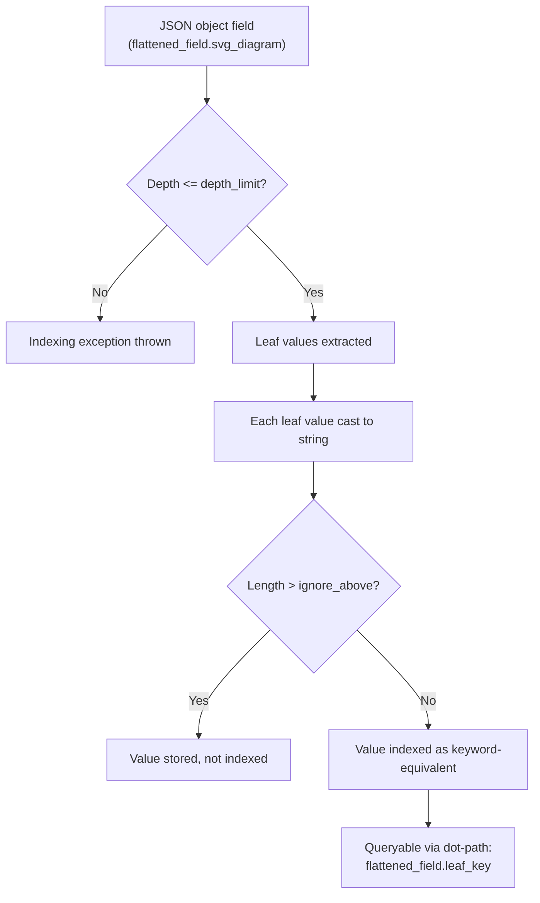

## Flattened Field Type

### Overview

The `flattened` field type maps an entire JSON object as a single field, indexing all of its leaf values as keywords rather than creating separate mapped subfields for each key. This addresses a specific mapping pathology: objects with unpredictable, high-cardinality, or unbounded sets of keys — such as user-supplied metadata, log labels, HTTP headers, or tag dictionaries — which would otherwise cause mapping explosion when Elasticsearch's dynamic mapping tries to create a new field for every distinct key it encounters.

Instead of one mapped field per key, a `flattened` object collapses the whole subtree into a single field internally, while still allowing queries against individual leaf paths using dot notation.

### The Problem It Solves

Elasticsearch dynamically maps new fields the first time it sees a key. For a normal `object` field, if incoming documents contain thousands of distinct keys over time (e.g., `attributes.user_12345`, `attributes.session_98231`, ...), each unique key becomes a separate field in the mapping. This leads to:

- **Mapping explosion** — the cluster state grows unbounded as field count climbs into the thousands or more.
- **Performance degradation** — large mappings increase cluster state size, slow down cluster state propagation, and increase heap pressure on nodes holding that state.
- **Hitting `index.mapping.total_fields.limit`** — by default 1000 fields per index; exceeding it throws mapping exceptions and rejects further indexing.

The `flattened` type sidesteps this because, regardless of how many keys the underlying JSON object has, it always counts as **one field** against the field limit.

### Basic Mapping Definition

```json
PUT /logs-index
{
  "mappings": {
    "properties": {
      "message": { "type": "text" },
      "labels": { "type": "flattened" }
    }
  }
}
```

Any JSON object indexed into `labels` — no matter its internal structure or key names — is stored under this single mapped field.

### Example Document

```json
PUT /logs-index/_doc/1
{
  "message": "Pod restarted",
  "labels": {
    "app": "checkout-service",
    "env": "production",
    "team": "payments",
    "pod-id": "chk-7f9c4",
    "release": "2026.08.1",
    "custom_annotation_xyz": "true"
  }
}
```

Even though `labels` has six keys here, and could have hundreds in another document, it is still one field in the mapping — `labels` — not six or hundreds.

### Querying Flattened Fields

Leaf values remain queryable via dot-path notation against the flattened field name, as though the subfields existed individually.

**Term query on a specific leaf path:**

```json
GET /logs-index/_search
{
  "query": {
    "term": {
      "labels.env": "production"
    }
  }
}
```

**Querying without specifying a path (matches any value under `labels`):**

```json
GET /logs-index/_search
{
  "query": {
    "term": {
      "labels": "checkout-service"
    }
  }
}
```

This unscoped form searches across all values in the flattened object, useful when the caller doesn't know or care which key holds a given value.

**Existence check:**

```json
GET /logs-index/_search
{
  "query": {
    "exists": {
      "field": "labels.team"
    }
  }
}
```

### How Values Are Indexed

All leaf values in a `flattened` object are indexed as **keyword-equivalent strings**:

- Numbers, booleans, and strings are all converted to their string representation for indexing purposes.
- There is no type distinction at the field level — a boolean `true` and the string `"true"` are indexed identically.
- Because of this, `flattened` fields support exact-match and prefix-style operations similar to `keyword`, but **not** analyzed full-text search, and **not** numeric range queries with numeric semantics.

**Key Points**
- No `text` analysis occurs — matching is exact, similar to `keyword`.
- No native numeric or date type handling — comparisons operate on string-sorted values, not numeric magnitude, unless explicitly cast at query time in ways the type does not really support well. [Inference] Range queries against flattened leaf paths compare lexicographically as keyword strings, so numeric range semantics (e.g., `"10" < "9"` lexicographically) can behave unintuitively; this is a consequence of the documented keyword-style indexing rather than an officially separated numeric mode.
- Arrays of objects under a flattened field are supported, but the type flattens nested structure into a flat bag of key-value pairs rather than preserving array-element correlation (the same limitation as plain `object` fields, not `nested`).

### Supported Query Types

The `flattened` type supports a defined subset of query types, matching its keyword-like indexing:

- `term`, `terms`, `terms_set`
- `match`, `multi_match` (behaves like exact/keyword matching, not analyzed text matching)
- `prefix`
- `range` (string/lexicographic comparison)
- `exists`
- `sort` (on leaf paths, lexicographic)
- Aggregations: `terms`, `composite`, and other bucket aggregations on leaf paths

Full-text querying behaviors like `match_phrase` with analysis, fuzzy matching, or stemming are **not** meaningfully supported since no text analysis chain runs over the values.

### Sorting and Aggregating

```json
GET /logs-index/_search
{
  "size": 0,
  "aggs": {
    "envs": {
      "terms": {
        "field": "labels.env"
      }
    }
  }
}
```

Because leaf paths are addressable, `terms` aggregations work per key just as they would on a real keyword subfield, without that subfield ever being separately mapped.

### Configuration Parameters

```json
PUT /logs-index-configured
{
  "mappings": {
    "properties": {
      "labels": {
        "type": "flattened",
        "depth_limit": 20,
        "ignore_above": 1024,
        "index": true,
        "eager_global_ordinals": false,
        "null_value": null,
        "similarity": "bm25"
      }
    }
  }
}
```

- **`depth_limit`** — maximum permitted nesting depth of the JSON object being flattened; default is `20`. Guards against pathological deeply-nested payloads inflating indexing cost.
- **`ignore_above`** — leaf values longer than this character count are not indexed (they are still stored, matching the behavior of `ignore_above` on `keyword` fields); default is unset at the type default but commonly set explicitly to bound outliers.
- **`index`** — whether the field is searchable at all; set `false` to store-only if only retrieval, not querying, is needed.
- **`eager_global_ordinals`** — precomputes global ordinals for faster aggregations/sorting at the cost of refresh-time overhead; same tradeoff as on `keyword` fields.
- **`null_value`** — value substituted for explicit JSON `null` leaves, allowing them to be queried as a specific sentinel rather than being dropped.
- **`similarity`** — scoring similarity module used if the field is used in scored full-text-style queries; defaults to BM25 alignment with the rest of the index.

### Depth Limit Behavior

Given `depth_limit: 20`, an object nested deeper than 20 levels throws a mapping/indexing exception at document indexing time rather than silently truncating. This is a hard guard, not a soft cap.



### Comparison: `flattened` vs `object` vs `nested`

| Aspect | `object` | `nested` | `flattened` |
|---|---|---|---|
| Field count impact | One mapped field per key (unbounded growth) | One mapped field per key, plus hidden nested docs | Always exactly one field |
| Preserves array-element correlation | No | Yes | No |
| Supports text analysis | Per-subfield, configurable | Per-subfield, configurable | No — keyword-equivalent only |
| Good for unpredictable/high-cardinality keys | Poor fit | Poor fit (worse: multiplies doc count) | Purpose-built fit |
| Query cost per leaf | Direct field lookup | Requires `nested` query context | Direct field lookup via dot-path |
| Typical use case | Known, stable schema | Arrays of structured sub-objects needing per-element matching | Arbitrary/dynamic key-value metadata, labels, tags |

### When to Use Flattened

- **Kubernetes/container labels and annotations** — arbitrary user-defined key sets attached to logs or metrics.
- **HTTP headers** — variable header sets per request, especially with custom headers.
- **User-defined metadata/tags** — CMS or e-commerce product attributes where sellers define their own key sets.
- **Security/SIEM event enrichment fields** — variable enrichment output from different data sources.

### When Not to Use Flattened

- The object's keys are **known and stable** — a normal `object` or explicit subfield mapping gives better query flexibility (numeric ranges, full-text analysis, per-field boosting).
- **Numeric range precision matters** — flattened's string-based comparison does not give correct numeric ordering semantics.
- **Full-text search is required** on the values — flattened does not run an analysis chain.
- The object represents **an array of correlated sub-objects** where element-wise matching correctness matters (e.g., "find the order line where product=X AND quantity>5") — use `nested` instead, since flattened has no concept of correlating same-array-element keys together (though this limitation is shared with plain `object` too).

### Updating Mapping Parameters

Some parameters on an existing `flattened` field, such as `depth_limit` and `ignore_above`, can be updated in place via the update mapping API without reindexing, since they affect future indexing behavior rather than the underlying stored data structure:

```json
PUT /logs-index/_mapping
{
  "properties": {
    "labels": {
      "type": "flattened",
      "depth_limit": 10
    }
  }
}
```

[Inference] Whether a specific parameter change requires reindexing versus being applicable purely going forward depends on whether it affects only future document processing or also how existing indexed data is interpreted at query time; `depth_limit` and `ignore_above` are indexing-time guards and are commonly documented as updatable without reindexing, but always validate against the exact Elasticsearch version in use since mapping update restrictions can change across major versions.

### Limitations Summary

**Key Points**
- Cannot retrieve original data types (number vs boolean vs string) from the index — everything is string-equivalent once indexed.
- No sub-field-specific analyzers, normalizers, or per-key type control.
- `highlight` is not meaningfully supported since there's no analyzed text.
- Sorting/aggregating on numeric-looking leaf values uses lexicographic string order, not numeric order.
- Total size of the flattened JSON object counts toward document size limits normally, and `depth_limit` bounds nesting, but there's no per-field limit on the number of distinct keys within one flattened object beyond general document size constraints.

**Related Topics**
- Object field type and dynamic mapping explosion
- Nested field type and nested queries
- `index.mapping.total_fields.limit` and other mapping limit settings
- Runtime fields as an alternative for schema flexibility
- Keyword field type and `ignore_above` behavior
- Dynamic templates for controlling automatic field mapping