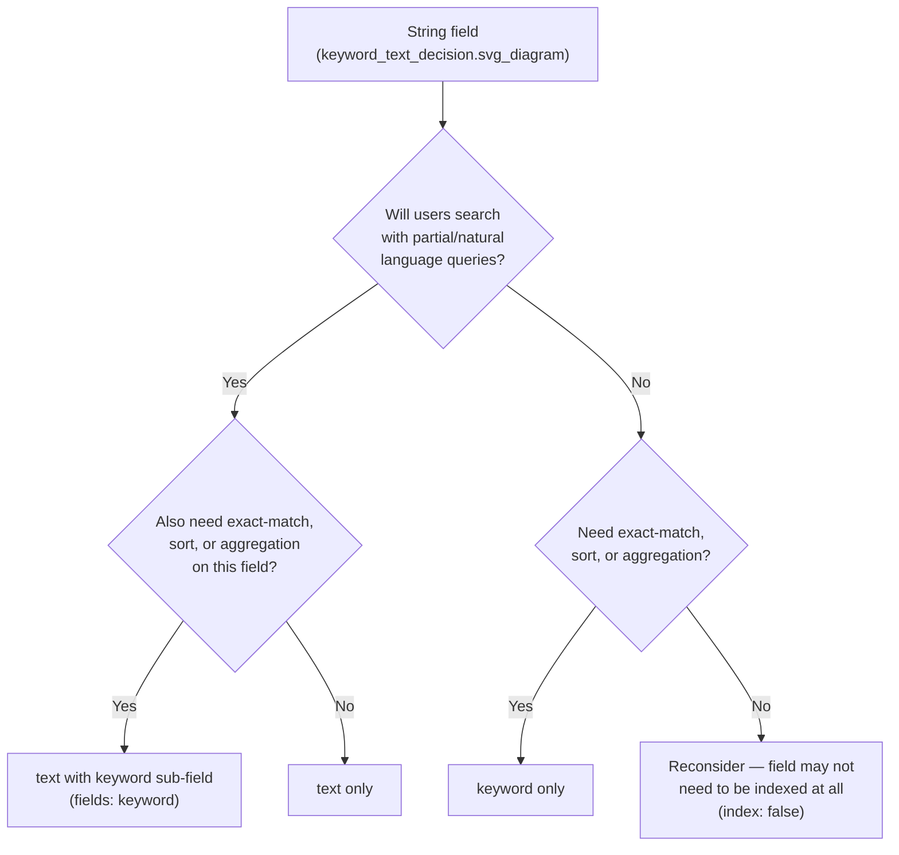

## Keyword vs Text Field Decisions

### Overview

Choosing between `keyword` and `text` is one of the most consequential mapping decisions in Elasticsearch, because it determines how a field's values are processed at index time and, consequently, what kinds of queries can meaningfully run against it later. The two types are not interchangeable defaults — they represent fundamentally different indexing pipelines: `text` runs values through an analyzer to produce searchable tokens, while `keyword` indexes the value verbatim as a single, unanalyzed unit.

### Core Distinction

- **`text`** — the field value is passed through an analyzer (tokenizer + token filters), splitting it into individual terms, lowercasing (typically), removing stop words (if configured), and applying stemming (if configured). Designed for full-text search — matching on words, phrases, and relevance-scored relevance.
- **`keyword`** — the field value is indexed exactly as provided, as a single token. Designed for exact-match filtering, sorting, and aggregations.

```json
PUT /products
{
  "mappings": {
    "properties": {
      "description": { "type": "text" },
      "sku": { "type": "keyword" }
    }
  }
}
```

Indexing `"description": "Wireless Bluetooth Headphones"` produces tokens like `wireless`, `bluetooth`, `headphones` under the standard analyzer. Indexing `"sku": "WBH-2026-BLK"` produces exactly one token: `WBH-2026-BLK`, unchanged.

### Behavioral Comparison

| Aspect | `text` | `keyword` |
|---|---|---|
| Analysis applied | Yes (tokenizer + filters) | No (verbatim, optionally normalized) |
| Case sensitivity | Typically lowercased by default analyzer | Case-sensitive unless a `normalizer` is applied |
| Supports full-text queries (`match`, `match_phrase`) | Yes | No (works but behaves as exact match, not analyzed) |
| Supports exact-match queries (`term`, `terms`) | Not reliably (term must match a token exactly) | Yes, by design |
| Sortable | No (not without a keyword sub-field) | Yes |
| Aggregatable (`terms` agg, etc.) | No (not without `fielddata: true`, generally discouraged) | Yes |
| Supports relevance scoring nuance (stemming, synonyms) | Yes | No |
| Typical `doc_values` | Disabled by default (not needed for scoring-based search) | Enabled by default (needed for sort/agg) |

### The `fields` Multi-Field Pattern

Because many real-world fields need both full-text search and exact-match/sort/aggregation capability, Elasticsearch's default dynamic mapping for string fields creates both automatically:

```json
{
  "mappings": {
    "properties": {
      "title": {
        "type": "text",
        "fields": {
          "keyword": {
            "type": "keyword",
            "ignore_above": 256
          }
        }
      }
    }
  }
}
```

This allows:

```json
GET /products/_search
{
  "query": {
    "match": { "title": "wireless headphones" }
  }
}
```

for full-text search, and:

```json
GET /products/_search
{
  "size": 0,
  "aggs": {
    "titles": {
      "terms": { "field": "title.keyword" }
    }
  }
}
```

for exact aggregation on `title.keyword`, without needing two separately maintained top-level fields.

**Key Points**
- The multi-field pattern is the default behavior of Elasticsearch's dynamic string mapping specifically to cover both use cases without requiring the schema author to choose upfront.
- `ignore_above: 256` on the keyword sub-field is the dynamic-mapping default, preventing indexing of excessively long values as keywords (they remain searchable via `title` text but not via `title.keyword` past that length).

### Decision Criteria

**Use `keyword` when the field is used for:**
- Exact-match filtering (status codes, IDs, SKUs, enum-like values such as `"published"` / `"draft"`)
- Sorting (alphabetical sort on a name field)
- Aggregations / faceting (counting documents per category, per tag, per country code)
- Terms lookups and `terms` queries against known exact values

**Use `text` when the field is used for:**
- Free-text search where users type partial phrases, individual words, or natural language queries
- Relevance-ranked search results (product descriptions, article bodies, review text)
- Search requiring linguistic features: stemming (`running` matches `run`), synonyms, stop-word removal, fuzzy matching

**Use both (`text` with a `keyword` sub-field) when:**
- The field needs full-text search AND exact-match/sort/aggregation — this is the common case for names, titles, tags, and categories that are both searched and faceted on.

### Decision Flow



### Practical Examples by Field Type

- **Email address** — `keyword`. Users look up by exact email, not by searching individual words within it; case may matter or may need normalization via a `normalizer`.
- **Product title** — `text` + `keyword` sub-field. Full-text search for discovery, exact/sort for admin listings and faceting.
- **Status/enum field** (`"active"`, `"pending"`, `"cancelled"`) — `keyword`. Fixed set of exact values, always filtered and aggregated, never full-text searched.
- **Article body** — `text` only. Rarely need to sort or aggregate on entire article content; `keyword` sub-field would be wasteful and often exceeds `ignore_above` anyway.
- **Tags array** — `keyword`. Tags are typically exact-match discrete values used for filtering/faceting, not free-text search targets.
- **User-entered search query log** — `text`, potentially with a `keyword` sub-field if exact repeated-query analysis is needed downstream.

### Case Sensitivity Handling on Keyword Fields

By default, `keyword` fields are case-sensitive: `"Berlin"` and `"berlin"` are different terms. A `normalizer` can be applied to achieve case-insensitive exact matching while retaining keyword semantics (no tokenization):

```json
PUT /cities
{
  "settings": {
    "analysis": {
      "normalizer": {
        "lowercase_normalizer": {
          "type": "custom",
          "filter": ["lowercase"]
        }
      }
    }
  },
  "mappings": {
    "properties": {
      "city": {
        "type": "keyword",
        "normalizer": "lowercase_normalizer"
      }
    }
  }
}
```

This differs from `text`: a `normalizer` produces a single normalized token per field value, whereas an `analyzer` on `text` can produce multiple tokens.

### Performance Considerations

- `keyword` fields have `doc_values` enabled by default, which is what makes sorting and aggregation efficient — this is a columnar on-disk data structure built at index time.
- `text` fields do not have `doc_values` by default because token-level scoring uses a different structure (inverted index + term vectors, optionally). Enabling `fielddata: true` on a `text` field to allow aggregation is possible but generally discouraged — [Inference] it loads uninverted term data into heap memory at query/aggregation time rather than using an on-disk columnar structure, which is documented as a significant memory-pressure risk on large or high-cardinality text fields, though the exact severity depends on cluster heap sizing and field cardinality in a given deployment.
- Setting `index: false` on a `keyword` field that is only ever used for retrieval (returned in `_source`, never queried or filtered) avoids unnecessary indexing cost.
- Setting `doc_values: false` on a `keyword` field known to never be sorted or aggregated saves disk space, at the cost of losing that capability later without reindexing.

### Common Mistakes

**Key Points**
- Mapping a field as `text` and then attempting `term` queries against it — this frequently fails to match as expected because the query looks for an exact token match against tokens that were split/lowercased/stemmed at index time.
- Mapping a high-cardinality free-text field (like full article bodies) as `keyword` — this can create extremely large unique-term overhead and defeats the purpose of relevance-based search entirely.
- Forgetting `ignore_above` on keyword sub-fields for arbitrarily long text, which can bloat the index with expensive-to-store, rarely-useful giant keyword tokens (mitigated by the dynamic default of 256, but a hand-authored explicit mapping does not get this automatically).
- Relying on dynamic mapping's default `text` + `keyword` sub-field for every string field indiscriminately, rather than making a deliberate choice — this often works acceptably but is not optimal for fields never used in one of the two modes, since it indexes and stores both forms unnecessarily.

### Migrating Between Types

Changing a field from `text` to `keyword` (or vice versa) on an existing mapping is not supported as an in-place mapping update — Elasticsearch mapping types are largely immutable once documents have been indexed under them. [Inference] This follows from the general Elasticsearch mapping constraint that most core type changes are rejected by the update-mapping API to avoid inconsistent interpretation of already-indexed data; the standard remedy is creating a new index with the corrected mapping and reindexing via the Reindex API, rather than attempting an in-place type change, though the exact set of updatable-vs-immutable parameters can differ across versions and should be checked against the mapping update documentation for the version in use.

**Related Topics**
- Multi-fields (`fields` parameter) in depth
- Normalizers vs analyzers
- `ignore_above` parameter behavior
- Reindex API for mapping migrations
- Fielddata and its memory implications
- Runtime fields as a schema-flexible alternative