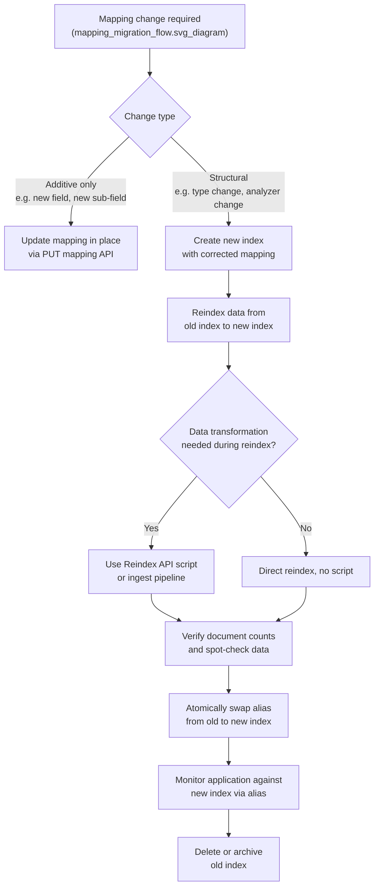

## Mapping Versioning and Migration

### Overview

Elasticsearch mappings are largely immutable once a field has been created and documents indexed under it: most structural changes to an existing field's type, analyzer, or core indexing behavior cannot be applied in place. This immutability exists because changing how a field is analyzed or typed would make previously indexed data inconsistent with newly indexed data under the same field name — old documents were tokenized/typed one way, new ones would be tokenized/typed another way, producing unreliable search and aggregation results. Mapping versioning and migration is the set of practices for evolving a schema safely despite this constraint.

### What Can and Cannot Be Changed In Place

**Can typically be updated on an existing mapping (no reindex required):**
- Adding new fields (new keys not previously mapped)
- Adding new multi-fields (`fields`) to an existing field, so long as the new sub-field doesn't conflict
- `ignore_above` on `keyword` fields
- `depth_limit` on `flattened` fields
- Some meta-level parameters that don't affect how existing indexed data is interpreted (e.g., certain `meta` object contents)

**Generally cannot be changed in place (require reindexing):**
- Changing a field's `type` (e.g., `text` to `keyword`, `integer` to `long` in some cases, `keyword` to `flattened`)
- Changing the `analyzer` used on an existing `text` field
- Changing `index: true` to `index: false` on a field that already has indexed data
- Removing a field from the mapping
- Changing `doc_values` from `false` to `true` after documents are indexed (or vice versa in some versions)

**Key Points**
- The dividing line is generally whether the change affects the *interpretation* of already-indexed bytes on disk versus only affecting *future* indexing behavior going forward.
- Attempting an unsupported in-place change via the update-mapping API typically returns a `mapper_exception` with a "conflicting mapping" or "cannot be changed" message rather than silently applying.

### Why Reindexing Is the Standard Remedy

Because in-place type changes are blocked, the standard Elasticsearch pattern for evolving a schema is:

1. Create a new index with the corrected/updated mapping.
2. Reindex the existing data into the new index, optionally transforming documents in flight.
3. Point the application (via an alias) at the new index.
4. Remove or archive the old index once the new one is verified.

This pattern is why **index aliases** are considered a foundational best practice from day one of index design, even for indices that seem unlikely to ever change — retrofitting alias-based indirection onto an application already hardcoded to a physical index name is significantly more disruptive than starting with an alias.

### Alias-Based Zero-Downtime Migration

```json
PUT /products-v1
{
  "mappings": {
    "properties": {
      "sku": { "type": "keyword" },
      "description": { "type": "text" }
    }
  }
}

POST /_aliases
{
  "actions": [
    { "add": { "index": "products-v1", "alias": "products" } }
  ]
}
```

The application only ever queries and indexes against `products` (the alias), never `products-v1` directly.

When a mapping change is needed (e.g., `description` needs a `keyword` sub-field for faceting, which is additive and works, but suppose `sku` needs to change from `keyword` to a different analyzer entirely):

```json
PUT /products-v2
{
  "mappings": {
    "properties": {
      "sku": { "type": "keyword", "normalizer": "lowercase_normalizer" },
      "description": {
        "type": "text",
        "fields": { "keyword": { "type": "keyword", "ignore_above": 256 } }
      }
    }
  }
}

POST /_reindex
{
  "source": { "index": "products-v1" },
  "dest": { "index": "products-v2" }
}

POST /_aliases
{
  "actions": [
    { "remove": { "index": "products-v1", "alias": "products" } },
    { "add": { "index": "products-v2", "alias": "products" } }
  ]
}
```

The alias swap in the final step is atomic — both actions execute as a single operation, so there is no window where `products` resolves to neither or both indices in an inconsistent way.

### Migration Flow



### Reindexing With Transformation

The Reindex API supports a `script` block to transform documents during migration, useful when the new mapping requires restructured data, not just a different type declaration:

```json
POST /_reindex
{
  "source": { "index": "products-v1" },
  "dest": { "index": "products-v2" },
  "script": {
    "source": "ctx._source.sku = ctx._source.sku.toLowerCase()",
    "lang": "painless"
  }
}
```

This is commonly paired with type changes where the underlying value also needs adjusting (e.g., normalizing case before indexing under a stricter keyword mapping, splitting a single field into two, or renaming fields).

### Reindexing From Remote Clusters

The Reindex API also supports pulling from a remote cluster, useful for cross-cluster migrations or consolidating indices during a version upgrade:

```json
POST /_reindex
{
  "source": {
    "remote": {
      "host": "https://old-cluster.example.com:9200",
      "username": "migration_user",
      "password": "REDACTED"
    },
    "index": "products-v1"
  },
  "dest": { "index": "products-v2" }
}
```

[Unverified] Remote reindex requires the source cluster's host to be allow-listed in the destination cluster's `reindex.remote.whitelist` setting; exact configuration keys and defaults should be checked against the specific Elasticsearch version in use, as remote-cluster security configuration has evolved across versions.

### Handling Reindex at Scale

For very large indices, a single synchronous Reindex API call can be long-running. Common patterns to manage this:

- **`slices`** parameter — parallelizes the reindex operation across multiple slices of the source index, reducing wall-clock time on multi-shard indices.
- **`wait_for_completion: false`** — runs the reindex as an asynchronous task, returning a task ID that can be polled via the Tasks API rather than holding the HTTP connection open.
- **Batching via `max_docs`** — reindexing in bounded chunks, useful for controlled rollout or to limit resource contention with live traffic.

```json
POST /_reindex?wait_for_completion=false&slices=5
{
  "source": { "index": "products-v1" },
  "dest": { "index": "products-v2" }
}
```

### Index Templates and Versioning Forward

For time-series or rolling indices (e.g., `logs-2026.08.24`), mapping evolution is typically handled prospectively via **index templates** rather than migrating historical indices at all:

```json
PUT /_index_template/logs-template
{
  "index_patterns": ["logs-*"],
  "template": {
    "mappings": {
      "properties": {
        "message": { "type": "text" },
        "labels": { "type": "flattened" }
      }
    }
  },
  "version": 2
}
```

Updating the template affects only indices created after the update; existing daily/rolling indices retain their original mapping unless separately reindexed. This is a deliberate and common pattern in log/metrics use cases — old indices age out via ILM (Index Lifecycle Management) rather than being migrated, so the mismatch between old-mapping and new-mapping indices is tolerated and eventually resolves itself through data retention rather than active migration.

**Key Points**
- The `version` field on a template is metadata for the template author's own tracking; it does not by itself version the resulting index mappings or trigger any migration behavior.
- Component templates (composable templates) allow shared mapping fragments to be versioned and updated independently, then composed into index templates, which reduces duplication when the same field definitions are reused across many template patterns.

### Mapping Compatibility Checks Before Reindex

Before committing to a full reindex, dry-run validation strategies reduce risk:

- Create the new index and mapping, then index a small representative sample of documents to confirm no mapping conflicts or unexpected parsing errors occur.
- Use `_validate/query` against the new index with representative queries to confirm expected query types still work as intended under the new mapping.
- Compare `_mapping` output between old and new indices field-by-field to confirm intentional-only differences.

### Rollback Considerations

Because the alias swap is the point of application cutover, rollback is typically as simple as swapping the alias back to the old index, provided the old index has not been deleted and no writes have occurred exclusively against the new index that would be lost on rollback. For migrations involving live write traffic during the cutover window, a **dual-write** or **read-old/write-both** pattern is sometimes used temporarily to avoid data loss in either rollback or roll-forward directions. [Inference] The specific dual-write mechanics (e.g., synchronizing writes to both indices during a transition window) are an application-level pattern built on top of Elasticsearch's alias and reindex primitives rather than a feature Elasticsearch provides natively, so implementation details vary by application architecture.

### Common Pitfalls

**Key Points**
- Hardcoding physical index names in application code instead of using aliases from the start, making future migrations require an application deployment in lockstep with the index migration rather than an independent, lower-risk alias swap.
- Reindexing without first testing the new mapping against a representative document sample, discovering mapping conflicts only after a large-scale reindex has already run.
- Forgetting that `_id` values are preserved by default during reindex (the destination document gets the same `_id` as the source), which is usually desired but can cause unexpected overwrite behavior if reindexing into an index that already contains documents with overlapping IDs from another source.
- Not accounting for ILM-managed indices when planning a mapping change — a template update alone will not retroactively change any index already created and rolled over under the old template.

**Related Topics**
- Reindex API parameters and scripting in depth
- Index Lifecycle Management (ILM) and rollover
- Index templates and component templates
- Aliases as an architectural default
- `_validate/query` API
- Zero-downtime cluster upgrade strategies