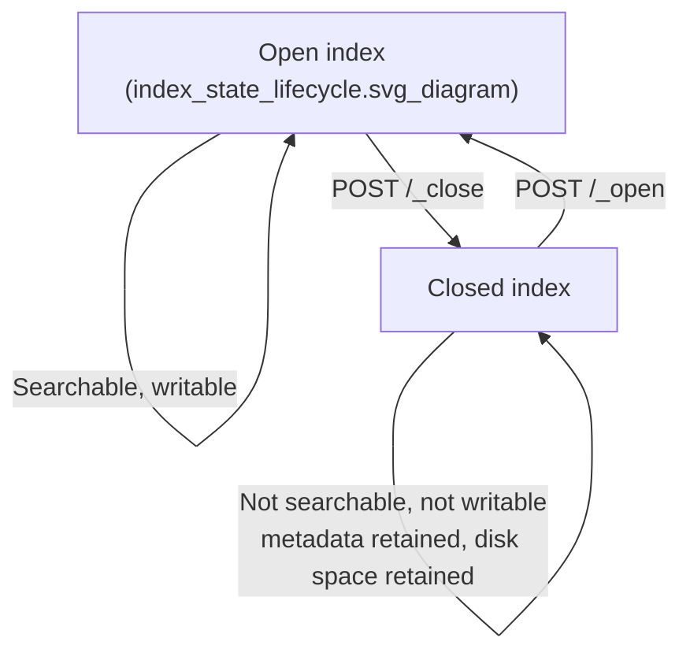

## Open and Close Index

### Overview

Elasticsearch indices can exist in two states: **open**, where the index is fully available for read and write operations, and **closed**, where the index exists in the cluster (its metadata, mapping, and settings are retained) but its data is not loaded for querying or indexing. Closing an index is primarily a resource-management operation — it frees up the memory and file handles otherwise consumed by an active index, while preserving the underlying data on disk for a later reopen.

### Closing an Index

```json
POST /old-logs-2025.01/_close
```

Response:

```json
{
  "acknowledged": true,
  "shards_acknowledged": true,
  "indices": {
    "old-logs-2025.01": {
      "closed": true
    }
  }
}
```

Once closed, the index:
- Cannot be searched or written to — queries and index requests against it return an error.
- Retains its mapping, settings, and aliases in cluster state.
- No longer consumes heap memory or file descriptors associated with open shard resources on data nodes (subject to version-specific internal handling — see below).
- Still consumes disk space, since the underlying Lucene segments are untouched.

### Reopening an Index

```json
POST /old-logs-2025.01/_open
```

Reopening restores full read/write availability. The mapping and settings are exactly as they were at close time, since closing does not modify or migrate any stored data or metadata.



### Why Close an Index

**Key Points**
- **Resource conservation** — for clusters holding large numbers of infrequently accessed indices (e.g., historical log or audit data retained for compliance but rarely queried), closing indices reduces the operational overhead of keeping every shard's resources active.
- **Cost/retention compromise** — closing offers a middle ground between deleting old data entirely and keeping it fully searchable at full resource cost; the data remains recoverable via a simple open operation rather than requiring restoration from a snapshot.
- **Pre-restore or pre-mapping-change safety** — some administrative operations historically required or benefited from an index being closed first (for example, certain settings changes that cannot be applied to an open index), since a closed index guarantees no concurrent read/write activity during the operation.

### Settings Changes Requiring a Closed Index

Certain index-level settings are only modifiable while the index is closed, because they affect the fundamental structure of how the index is analyzed or organized, and applying them to an already-active, already-indexed dataset would create inconsistency:

```json
POST /my-index/_close

PUT /my-index/_settings
{
  "analysis": {
    "analyzer": {
      "custom_analyzer": {
        "type": "custom",
        "tokenizer": "standard",
        "filter": ["lowercase", "asciifolding"]
      }
    }
  }
}

POST /my-index/_open
```

[Inference] The general pattern — that certain analysis-related settings require the index to be closed before modification — is a long-standing, documented Elasticsearch behavior; however, the precise list of which settings require closing versus which can be changed dynamically on an open index has shifted across major versions, so the current version's settings-update documentation should be checked before relying on any specific setting's closed-vs-open requirement.

### Closed Indices and Cluster State

A closed index still appears in cluster state and in most administrative listing APIs:

```json
GET /_cat/indices?v
```

By default, `_cat/indices` and similar listing APIs include closed indices, typically shown with a `status` column value of `close` as opposed to `open`. This means closed indices are not "hidden" from cluster visibility — only from search/index operations.

### Interaction With Index Lifecycle Management

Closing is one of the actions supported within an **ILM** (Index Lifecycle Management) policy, typically as part of a "cold" or "frozen" phase strategy, where indices are progressively closed as they age past their primary query-relevance window, before eventual deletion:

```json
PUT _ilm/policy/logs-lifecycle
{
  "policy": {
    "phases": {
      "cold": {
        "min_age": "30d",
        "actions": {
          "readonly": {}
        }
      },
      "frozen": {
        "min_age": "60d",
        "actions": {
          "searchable_snapshot": {}
        }
      },
      "delete": {
        "min_age": "180d",
        "actions": {
          "delete": {}
        }
      }
    }
  }
}
```

[Inference] Explicit `close` as an ILM phase action has existed in some Elasticsearch versions, though searchable snapshots and the frozen tier have become the more commonly documented pattern for reducing resource usage on aging indices in more recent versions; whether `close` is available as a first-class ILM action, versus being handled manually or superseded by frozen-tier searchable snapshots, depends on the specific version in use and should be verified against that version's ILM actions reference.

### Blocking Cluster-Wide Closing of All Indices

Elasticsearch includes a safety setting to prevent an operator from accidentally closing every index in a cluster (or matching a dangerously broad wildcard) in a single command:

```json
PUT /_cluster/settings
{
  "persistent": {
    "cluster.indices.close.enable": true
  }
}
```

When `cluster.indices.close.enable` is `false` (a supported configuration in some versions/deployments), close requests are rejected entirely, forcing an administrator to explicitly enable closing before it can be used. This is a defensive control against destructive wildcard operations like `POST /*/_close`.

### Closed Index Query Behavior

Attempting to query a closed index returns an error rather than an empty result set, distinguishing "no matching documents" from "index unavailable":

```json
GET /old-logs-2025.01/_search
```

```json
{
  "error": {
    "root_cause": [
      {
        "type": "index_closed_exception",
        "reason": "closed"
      }
    ]
  },
  "status": 400
}
```

Multi-index searches that include a mix of open and closed indices (e.g., via a wildcard pattern) can be configured via the `ignore_unavailable` parameter to skip closed indices rather than failing the entire request:

```json
GET /logs-*/_search?ignore_unavailable=true
{
  "query": { "match_all": {} }
}
```

### Deleting vs Closing

| Aspect | Close | Delete |
|---|---|---|
| Data recoverable afterward | Yes, via `_open` | No (unless restored from a snapshot) |
| Disk space freed | No | Yes |
| Cluster state entry retained | Yes | No |
| Reversal cost | Low (single API call) | High (requires snapshot restore, if a snapshot exists) |
| Typical use case | Infrequently accessed but potentially-needed-again data | Data confirmed no longer needed, or already snapshotted and safe to remove locally |

### Closed Index Replication and Shard Allocation

[Inference] A closed index's shards are generally documented as remaining allocated (present on disk, tracked by the cluster) rather than being unallocated, meaning closing does not itself trigger shard relocation or rebalancing; the primary resource savings come from not having active search/index-ready in-memory structures for that index, though the exact internal resource footprint of a closed shard (e.g., whether any in-memory structures are retained at all) has been refined across Elasticsearch versions and should be confirmed against current version documentation rather than assumed uniformly.

**Related Topics**
- Index Lifecycle Management (ILM) phases and actions
- Frozen tier and searchable snapshots
- `_cat/indices` API and index status monitoring
- Cluster-level safety settings (`cluster.indices.close.enable` and similar)
- Snapshot and restore as an alternative retention strategy
- Read-only index settings (`index.blocks.write`, `index.blocks.read_only`)